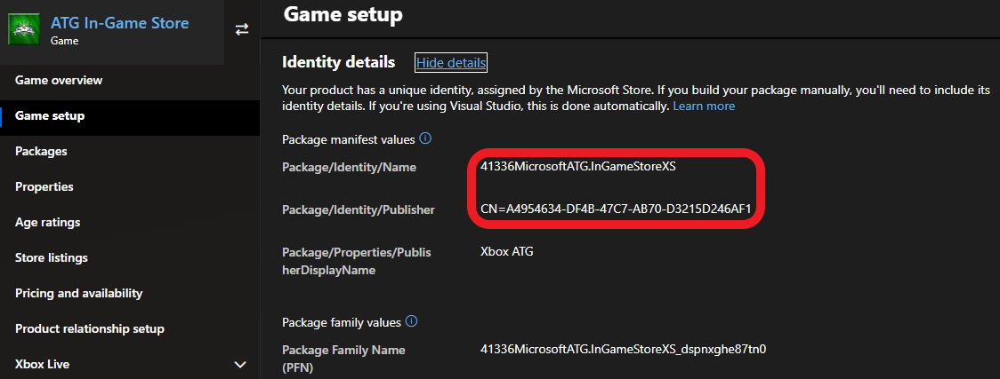
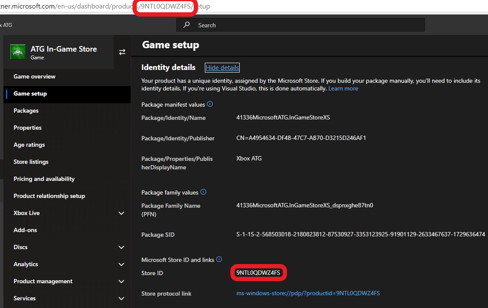
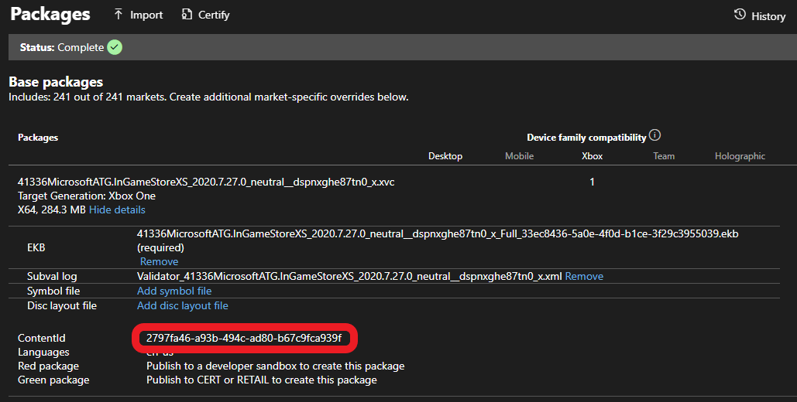

# Enabling XStore development and testing

This article describes how to configure your development builds to be able to test `XStore` API.
Unlike with other game areas that are dependent on online services, particular configuration is needed to make a test build **licensable**. A licensed context is required proper `XStore` functionality.

Games will use the [XStore APIs](../../reference/system/xstore/xstore_members.md) to perform operations on the licenses and entitlements that are associated with your game and its related products (e.g. add-ons).
Many of the `XStore` operations manipulate information about your game that's managed by Microsoft Store services.

> [!NOTE]
> When testing commerce in development sandboxes, make sure that all purchases on a single test account are done in the same sandbox.  Switching a test account to another sandbox and purchasing additional items will result in unexpected query results for the account in both sandboxes.  This is due to the fact that the licenses and information of a purchase are tied to the first sandbox the item was purchased in for a single account.

> [!NOTE]
> When testing commerce in development sandboxes on PC, make sure that the account signed into the Microsoft Store App and the Xbox app are the same.  When in sandboxes, the credentials used for items in the Microsoft Store are tied to the Xbox account specifically.  This is critical to know if you were planning to check the scenarios in your sandbox.  See [Handling mismatched store account scenarios on PC](../pc-specific-considerations/xstore-handling-mismatched-store-accounts.md) for more info.


Before you can test the `XStore` APIs, you must do the following:

**One time:**

1. Configure and publish your game on [Partner Center](https://partner.microsoft.com/dashboard/home)
2. [Retrieve the game's IDs from Partner Center](#retrieve-the-games-ids-from-partner-center)
3. [Apply the game IDs to the appropriate locations depending on development scenario](#apply-the-game-id-values-to-the-appropriate-locations-depending-on-development-scenario)

**For each account:**

* Ensure the [test account](../../live/test-release/test-accounts/live-setup-testaccounts.md) being used is entitled to the game in [sandbox](../../live/test-release/sandboxes/live-setup-sandbox.md)

The most important workflow is debugging in Visual Studio (F5) and this requires all of the above steps to enable.
Locally packaged builds are also important and are enabled in a different way.

## Retrieve the game's IDs from Partner Center

Three IDs are used to identify a build properly so that it can be licensed to execute Store operations:

* [App Identity](#app-identity) - Package family name tying the app to your publisher and Partner Center configuration
* [StoreID](#storeid) - Unique identity for your game within the Microsoft Store
* [ContentID](#contentid) - Unique identity for your each of your game packages.  This is assigned by Partner Center on first upload.

### App Identity

This is in Partner Center under **Game setup > Identity details**.

On PC: This is strictly required to match what is assigned to your game in Partner Center.

While it is not required for console, in practice it should be as it will be checked when a package is created for submission to Partner Center.



`Name` in the `Identity` node needs to match **Package/Identity/Name**; `Publisher` in the `Identity` node needs to match **Package/Identity/Publisher**.

```xml
<Identity Name="41336MicrosoftATG.InGameStoreXS"
          Version="2021.8.11.0"
          Publisher="CN=A4954634-DF4B-47C7-AB70-D3215D246AF1"/>
```

### StoreID

This also can be found in *Game setup > Identity details* (and also in the URL for most pages):



The full protocol link used to directly bring up the Store page for a product is also conveniently located below the Store ID in Identity details.

### ContentID

#### Console:
This can be found in the Packages page, after Showing details:



This can also be found for a package **installed from the Store** running `xbapp list /d` in the Gaming Command Prompt.

```cmd
Registered Applications by Package Full Name:

   41336MicrosoftATG.InGameStoreXS_2020.7.27.0_neutral__dspnxghe87tn0  
        Install  
        Drive: Development  
        Size: 0.28 GB.  
        ContentId: {2797FA46-A93B-494C-AD80-B67C9FCA939F}  
        ProductId: {4C544E39-5130-3044-C057-5A3446536A00}  
        EKBID: {37E80840-6BE0-46F8-8EDB-92F877056087}  
        DisplayName: ATG In-Game Store Sample  
        41336MicrosoftATG.InGameStoreXS_dspnxghe87tn0!Game  
```

#### PC:
This is found in a registry location once the package is installed from the Xbox App or Microsoft Store:
`Computer\HKEY_CURRENT_USER\SOFTWARE\Microsoft\Windows\CurrentVersion\Store\ContentId`

> [!NOTE]
> The Content ID between [sandbox](../../live/test-release/sandboxes/live-setup-sandbox.md) and retail can be different, be aware if a retail version of the game has been installed and you wish to work in [sandbox](../../live/test-release/sandboxes/live-setup-sandbox.md).

## Apply the Game ID values to the appropriate locations depending on development scenario

What IDs need to be applied and how to apply them will depend on the target platform as well as the type of build.

Below is a table that summarizes what is required for each scenario. More details are articulated in subpages listed after the table.
Fields that are annotated by **"Must match/be"** will require attention to configure appropriately.
Fields that are marked as **"Will match/be"** will automatically be assigned the correct values that enable Store scenarios.

||App identity|Store ID|Content ID|EKBID|Test account|
|-|-|-|-|-|-|
|Console **Visual Studio (F5)**|Can be anything|Present|Must be specified using `ContentIdOverride` in microsoftgame.config|Must be specified using `EKBIDOverride` in microsoftgame.config|Must be entitled|
|Console **local package (XVC)**|Can be anything, but must match assigned value when submitting to Partner Center|Present|Content ID must be specified using makepkg|Must be set using `xbapp setekbid`|Must be entitled|
|Console **store package**|Will match value assigned in Partner Center|Present|Will be the proper content ID|Will be the proper EKBID which depends on license type|Must be entitled|
|PC **Visual Studio (F5)**|Must match value assigned in Partner Center|Not required|Not required, but overriding value may be present in registry|Not required|Must be entitled|
|PC **local package (MSIXVC)**|Must match value assigned in Partner Center|Not required|Content ID must be specified using makepkg|Not required|Must be entitled|
|PC **store package**|Will match value assigned in Partner Center|Not required|Will be the proper content ID|Not visible|Must be entitled|

[Testing XStore with loose builds (e.g. Visual Studio F5)](product-testing/xstore-loose-build-iteration.md)

[Testing XStore with packaged builds (e.g. makepkg)](product-testing/xstore-package-build-iteration.md)

## Ensure test account is entitled to game in the sandbox

The easiest way to do this is to go to the game's Store page directly through protocol activation.
The development console or PC must be set to the [sandbox](../../live/test-release/sandboxes/live-setup-sandbox.md) where the game is publish.
See [here](../../live/test-release/sandboxes/live-setup-sandbox.md) and [here](../pc-specific-considerations/xstore-switching-pc-sandbox-for-store.md) for details on how to switch sandboxes properly.
Then sign in with an account that is provisioned for the [sandbox](../../live/test-release/sandboxes/live-setup-sandbox.md).
Once signed in, use the store protocol link to reach the Store page:

On console: use Gaming Command prompt:

`xbapp launch ms-windows-store://pdp/?productid=<storeID>`

On PC: in Run box (⊞Win +R) or in a web browser

`msxbox://game/?productId=<storeID>` (to show game in Xbox App)

or

`ms-windows-store://pdp/?productid=<storeID>` (to show game in Microsoft Store)

See the [previous section](#storeid) for where to find the Store ID.

Once on the Store page, select **Buy** or **Get** to acquire a license for the game for your [test account](../../live/test-release/test-accounts/live-setup-testaccounts.md).
This should start the package download and installation, but if you are simply interested in iterating with local builds, you can cancel.
If you cannot acquire because the product is set with a price, check that you switched to the correct [sandbox](../../live/test-release/sandboxes/live-setup-sandbox.md) and that you have published with a Free price set in **Pricing and availability**.

> **IMPORTANT:** This must be done for each and every account that runs the build and expects in-game commerce features to work.

## Summary

With this topic you should now understand how to set up your build to successfully call `XStore` API.

If you encounter errors, please check that you have set up things correctly and then refer to the [Commerce Troubleshooting](xstore-troubleshooting.md) page.

## See also

[Commerce Overview](../commerce-nav.md)

[Testing XStore with loose builds](product-testing/xstore-loose-build-iteration.md)

[Testing XStore with packaged builds](product-testing/xstore-package-build-iteration.md)

[Switching sandboxes properly for Store operations](../pc-specific-considerations/xstore-switching-pc-sandbox-for-store.md)

[XStore API reference](../../reference/system/xstore/xstore_members.md)
