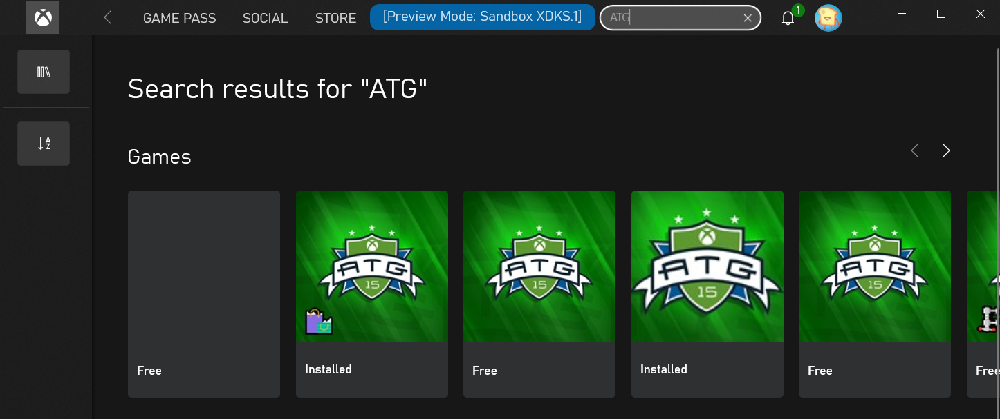

# Switching sandboxes properly for Store operations

Switching sandboxes on PC can be done a variety of ways.
Using [`Xblpcsandbox.exe`](../../live/test-release/tools/live-pc-sandbox-switcher.md) is recommended as it forces sign-out for any accounts signed into any Xbox Live-enabled apps when a sandbox change occurs.

For Xbox Live operations, it suffices to sign-in with an account that is provisioned to the newly switched sandbox, which is similar to signing in with different accounts in retail.
Once signed in, the `XUser` context will understand the current sandbox.

Store operations will require an Xbox Live User signed into an Xbox Live-enabled app to scope browsing and purchasing of products to a sandbox.
Simply signing in with an account in the Microsoft Store app will default the sandbox scope to retail (or previous sandbox if one was set).

> [!IMPORTANT]
> 
Therefore it is important to sign-in to Xbox Live **first** after switching sandboxes:

1. From GDK command prompt: `xblpcsandbox` &lt;sandbox id&gt;
2. Sign in on the Xbox app or the Xbox Console Companion app with account provisioned for sandbox
3. Sign in on the Microsoft Store app with the same account

The Store account can also be a different account from the Xbox Live account.
See [Handling mismatched store account scenarios on PC](xstore-handling-mismatched-store-accounts.md) for more information.

This should be done in all transitions involving sandboxes:
* from retail to sandbox
* from one sandbox to another sandbox
* from sandbox to retail

The most common problem with failing to do this properly is if the Store account is not signed in **after** Xbox Live sign-in, resulting in all Store operations returning improper results. 

> [!NOTE]
> When testing commerce in development sandboxes, make sure that all purchases on a single test account are done in the same sandbox.  Switching a test account to another sandbox and purchasing additional items will result in unexpected query results for the account in both sandboxes.  This is due to the fact that the licenses and information of a purchase are tied to the first sandbox the item was purchased in for a single account.

## Xbox app optimization

The Xbox app has an indicator at the top that informs what sandbox is being used:

This will show up when the Xbox app is signed-in with an account that can be used in the sandbox switched to using xblpcsandbox (or other tool).

Using the Xbox app has the added benefit of having the app automatically attempt to reconcile the Store account, meaning that if you stay within the Xbox App, catalog, purchase operations and ownership should be with respect to the same account and in the sandbox.

## In-game store operations (using `XStore` API)

The `XStoreContext` that the game will obtain will be that of the Store account, whether that is explicitly signed in on the Microsoft Store app or done as part of Xbox app sign-in.
The best indicator of what account `XStore` API will use is the account that is used by the Xbox app for its Store operations.

## See also

[Xbox Live PC Sandbox Switcher](../../live/test-release/tools/live-pc-sandbox-switcher.md)

[Xbox Live Sandboxes overview](../../live/test-release/sandboxes/live-setup-sandbox.md)

[Troubleshooting Sign-in Errors](../../live/test-release/troubleshooting/live-troubleshoot-sandboxes.md)

[Enabling XStore development and testing](../getting-started/xstore-product-testing-setup.md)
