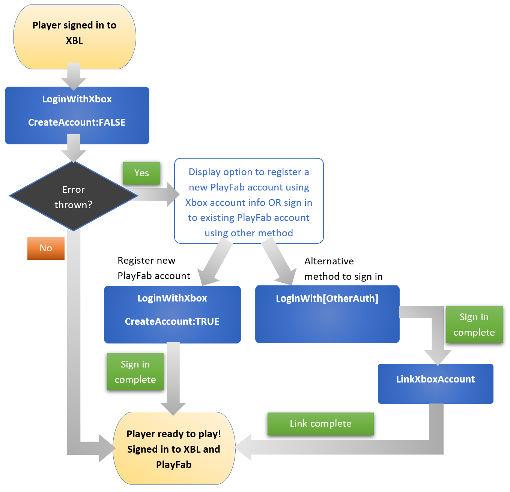

# Implement player sign in

This section describes two approaches to implement player sign in for titles that use **both** Xbox and PlayFab services.

**Important:**
Before starting, make sure you understand [Xbox/PlayFab user accounts and sign in concepts](gdk-playfab-player-sign-in-concepts.md).

There are two ways to sign players in to their PlayFab accounts. PlayFab SDK is the recommended route for all titles using any PlayFab services. 

However, if PlayFab Party is the only PlayFab service your title uses and your title only uses Xbox Live as an authentication provider, then use PlayFab Party's Xbox Live Helper Library.

* [PlayFab SDK](#playfab-sdk)
* [PlayFab Party Xbox Live Helper Library](#playfab-party-sdk)

## PlayFab SDK

Use __LoginWithXbox__ API to sign players in to their PlayFab account. It has a __CreateAccount__ flag that enables you to automatically create a PlayFab account for the player. 

### Set up

* Download and install [GDK](https://aka.ms/gdkdl).
* Select, download, and install the [PlayFab SDK](/gaming/playfab/sdks/playfab-sdk-intro) you need. 

### Recommended flow when Xbox Live is the only authentication provider

This is the recommended flow when your title wants players to use only Xbox Live to sign in to their PlayFab account.

* Sign players in to their Xbox Live accounts using [XUserAddAsync](../reference/system/xuser/functions/xuseraddasync.md). For details, see [XUser](#xuser).
* After Xbox Live account sign in, retrieve the Xbox Services token (also known as Xbox Live token) using [XUserGetTokenAndSignatureUtf16Async](../reference/system/xuser/functions/xusergettokenandsignatureutf16async.md).
* Sign players in to their PlayFab account using their Xbox Live account. This is achieved using [LoginWithXbox](/rest/api/playfab/client/authentication/login-with-xbox) in the PlayFab SDK. In the request body, pass the retrieved Xbox Services token from the earlier step. Set the __CreateAccount__ flag to __TRUE__.

### Recommended flow when using multiple authentication providers

This is the recommended flow when your title provides players the option to sign in to their PlayFab accounts using multiple authentication methods.

* Sign players in to their Xbox Live accounts using [XUserAddAsync](../reference/system/xuser/functions/xuseraddasync.md). For details, see [XUser](#xuser).
* After Xbox Live account sign in, retrieve the Xbox Services token (also known as Xbox Live token) using [XUserGetTokenAndSignatureUtf16Async](../reference/system/xuser/functions/xusergettokenandsignatureutf16async.md).
* Sign players in to their PlayFab account using their Xbox Live account. This is achieved using [LoginWithXbox](/rest/api/playfab/client/authentication/login-with-xbox) in the PlayFab SDK. In the request body, pass the retrieved Xbox Services token from the earlier step. Set the __CreateAccount__ flag to __FALSE__ in this first pass.
    * If no error is thrown, this means that the player has an existing PlayFab account that is associated to the Xbox Live account used during Xbox Live sign in. Player is successfully signed in and the flow is completed.
    * If __AccountNotFound__ error is thrown, this means that the player doesn't have an associated PlayFab account. For these players, offer them the option to register a new account or an alternative method to sign in to their PlayFab account.
        * To register a new account, use [LoginWithXbox](/rest/api/playfab/client/authentication/login-with-xbox) again but set the __CreateAccount__ flag to __TRUE__ this time round.
        * To sign players in to their PlayFab accounts using other authentication providers, use PlayFab LoginWith* methods like [LoginWithFacebook](/rest/api/playfab/client/authentication/login-with-facebook?view=playfab-rest). For more information, see [PlayFab authentication APIs](/en-us/rest/api/playfab/client/authentication).
    * When a player sign in to their PlayFab account **not** using Xbox Live account information, link the accounts by calling [LinkXboxAccount](/rest/api/playfab/client/account-management/link-xbox-account) with the Xbox Services token from the earlier step. Once the accounts are linked, the player will be able to sign in to their PlayFab account using their Xbox Live account directly.

Image below shows the recommended sign in flow when using multiple authentication providers.

## PlayFab Party Xbox Live Helper Library

**NOTE:** This approach is used if PlayFab Party is the only PlayFab service your title uses and your title only uses Xbox Live as an authentication provider. Otherwise, follow the recommended flowsunder [PlayFab SDK approach](#playfab-sdk). The PlayFab SDK approach supports more authentication providers and a wider range of service calls to PlayFab.

The __PlayFab Party Xbox Live Helper Library__ retrieves the Xbox Services token (also known as Xbox Live token) and use it to sign players in to their PlayFab accounts. It also automatically creates a PlayFab account if the player doesn't have one yet.

### Set up

* Download and install [GDK](https://aka.ms/gdkdl).
* Use the [PlayFab Party SDK and PlayFab Party Xbox Live Helper Library](/gaming/playfab/features/multiplayer/networking/party-sdks) included in the [GDK](https://aka.ms/gdkdl).
* For developers using Unreal and Unity game engines, go to [GDK Download Site](https://aka.ms/gdkdl) and select __Add-ins__ to download the Microsoft GDK Unity plugin and PlayFab Party Online Subsystem.

### Flow

The flow below describes how to sign a player into their Xbox Live account and PlayFab account using PlayFab Party's Xbox Live Helper Library.

* Sign players in to their Xbox Live accounts using __XUserAddAsync__. For more details, see [XUser](#xuser).
* Then retrieve their Xbox User ID (XUID) using __XUserGetId__ when chat is first initiated. 
* Create a __PartyXblLocalChatUser__ using [PartyXblManager::CreateLocalChatUser](/gaming/playfab/features/multiplayer/networking/xblreference/classes/partyxblmanager/methods/partyxblmanager_createlocalchatuser) with the XUID retrieved in the previous step.
* Pass this newly created user object to __PartyXblManager::LoginToPlayFab__.
    * For Xbox (XDK and GDK) and PC (GDK) titles, __PartyXblManager::LoginToPlayFab__ kicks off other necessary requests in the background to fetch the Xbox Services tokens (also known as Xbox Live tokens) and use them to sign in to the player's PlayFab account using their Xbox Live credentials. If the player's Xbox Live account doesn't have an associated PlayFab account, the API will automatically create a new PlayFab account and associate it with their Xbox Live account. When PlayFab accounts are created in this manner, no email or username will be associated with it.
    * For non-Microsoft Game Development Kit (GDK) and non-XDK titles like PC (Win32), you'll receive [PartyXblTokenAndSignatureRequestedStateChange](/gaming/playfab/features/multiplayer/networking/xblreference/partyxboxlive_members) instead. This state change signals that you're required to fetch the Xbox Services token on your own. Once the token is fetched by the title, pass it to service using [PartyXblManager::CompleteGetTokenAndSignatureRequest](/gaming/playfab/features/multiplayer/networking/xblreference/classes/partyxblmanager/methods/partyxblmanager_completegettokenandsignaturerequest) which will complete the login request.
* If all goes well, the result is a [PartyXblLoginToPlayFabCompletedStateChange](/gaming/playfab/features/multiplayer/networking/xblreference/partyxboxlive_members) with your signed in PlayFab credentials (Entity ID and PlayFab token).

**Note:** For remote users, use [CreateRemoteChatUser](/gaming/playfab/features/multiplayer/networking/xblreference/classes/partyxblmanager/methods/partyxblmanager_createremotechatuser). There won’t be any authentication or tokens involved in the remote user flow.

## XUser

The [XUser](../reference/system/xuser/xuser_members.md) class, which is part of the system API, handles user identity and sign in for Microsoft Game Development Kit (GDK) titles.

* To sign users in, use [XUserAddAsync](../reference/system/xuser/functions/xuseraddasync.md).
* To retrieve Xbox Services token (also known as Xbox Live token), use [XUserGetTokenAndSignatureUtf16Async](../reference/system/xuser/functions/xusergettokenandsignatureutf16async.md).

To learn more about XUser and sign in best practices, see the following resources.

* [User identity and XUser](../system/overviews/user/player-identity-xuser.md)
* [GDK user models (NDA topic)](../system/overviews/user/gamecore-user-models.md)
* [Sign-in best practices](../system/overviews/user/xuser_howto_best_practice_signing_in.md)
* [XUser API reference overview](../reference/system/xuser/xuser_members.md)

## See also

* [Platform-specific PlayFab authentication](/gaming/playfab/features/authentication/platform-specific-authentication/)
* [Microsoft Store in-app purchase set up (NDA topic)](gdk-playfab-microsoft-store.md)
* [User identity and XUser](../system/overviews/user/player-identity-xuser.md)
