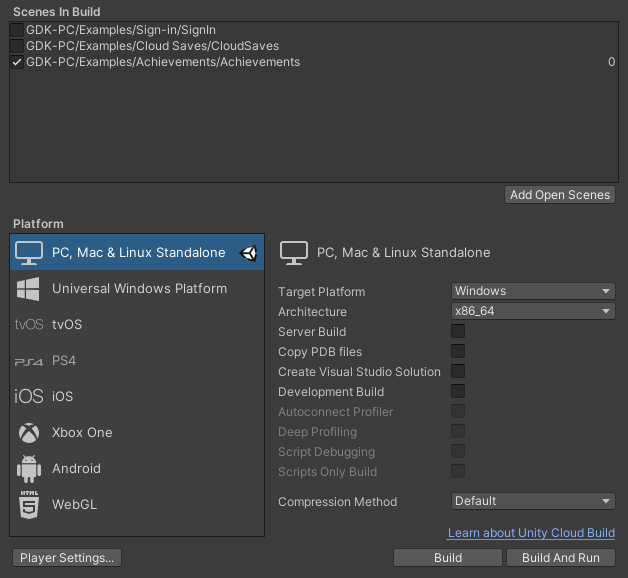
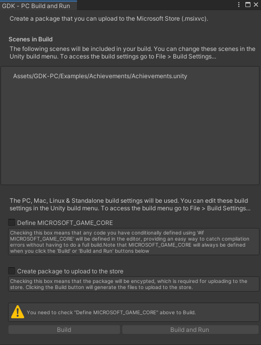

# Building your Unity project as an MSIXVC package

Use this topic to generate, install, and launch an [MSIXVC package](../../../packaging/overviews/packaging-getting-started-for-PC.md) for your Windows PC title.

## Adding Unity scenes to your build

Before building your MSIXVC package, specify the scenes that you want by using the **Build Settings** menu of Unity as described in the following steps.

 1. In Unity, go to **File**, and then select **Build Settings**.
 1. On the **Build Settings** menu, select **Add Open Scenes**.
 1. Select the scenes that you want to include in your build by selecting the check box next to each scene.
 1. After you’ve selected each scene, close the **Add Open Scenes** dialog box.
 1. With the scenes added to **Scenes in Build**, select **Build** or **Build and Run** to build your MSIXVC package as shown in the following screenshot.
  

## Build and Run features

The Build and Run menu includes the following options for generating your packaged title as shown in the following screenshot.

 * Select **Define MICROSOFT_GAME_CORE** to define code in the editor that’s conditionally defined by using `#ifdef MICROSOFT_GAME_CORE`. This catches compilation errors without performing a full build. 
   > [!NOTE]
   > This option is required to build your title. `MICROSOFT_GAME_CORE` is defined when you use **Build** or **Build and Run** in the Build Settings menu. 
 * Select **Create package to upload to the store** to encrypt the MSIXVC package that’s generated. Packages must be encrypted to submit to Microsoft Store.
  

## Build vs. Build and Run

The following differences between the Build option and the Build and Run option will help you determine which one is best for building your title.

 * The Build option generates a Loose-file build and subsequent MSIXVC packages build off of that Loose file for usage. Build won’t install or launch the MSIXVC package.
 * The Build and Run option generates a Loose-file build and subsequent MSIXVC packages. Build and Run installs and launches the packaged installation for your Windows PC title.

> [!NOTE]
> After an initial Build and Run, the packaged installation registers and appears in the **Start** menu. It launches subsequent times after the initial Build and Run for cases where the title is launched without any code or project change that requires re-creating the build.

## Win32 output folder and Loose file build

After selecting the output directory of your build from the available Build option or Build and Run option, Unity generates a Win32 folder that contains the Loose-file contents of your build. This folder is used as the source for generating the MSIXVC package, which can be used for the following actions.

 * Use [Application Management (wdapp.exe) (NDA topic)](../../../tools-console/xbox-tools-and-apis/console_commandlinetools/wdapp.md) to register and launch the Loose-file build by using the [Microsoft Game Development Kit command prompts (NDA topic)](../../../tools-console/xbox-tools-and-apis/commandlinetools/commandprompt.md).
 * Make advanced modifications to the build process.

## MSIXVC output folder and package files

After selecting the output directory of your build from the Build option or Build and Run option, Unity generates an MSIXVC folder that stores the packaged files for your title. The following are key files that are generated in the folder.

 * The layout file *layout_[guid].xml* that indicates what’s included in the package
 * The results *Validator_[PFN].xml* that appear from the [Submission Validator](../../../packaging/subval/submissionvalidator.md) tests
 * The MSIXVC package file *PFN.msixvc*

## See also

[Make package (makepkg.exe)](../../../packaging/deployment/makepkg.md)  
[Get started with Unity for PC development](../gc-get-started-with-unity-pc-toc.md) 