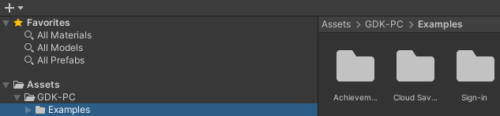
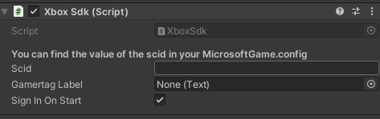
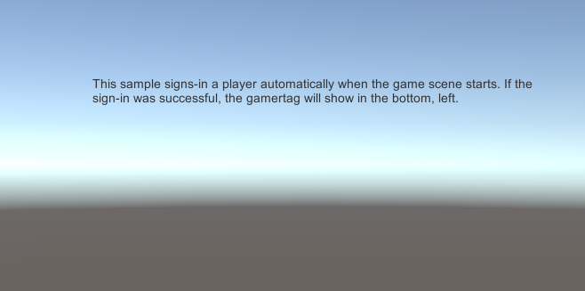

# Using example scenes in your Unity project

Use this topic to create example scenes for achievements, cloud saves, and sign-in by using the GDK Unity package.


## Examples in the GDK Unity package

Examples are built into the package as C# code and sample scenes. They are built to review functionality examples (such as selecting the **Unlock Achievement** button to unlock an achievement) by using the Build and Run menu. To inspect and load the sample scenes, go to the *GDK-PC\Examples* folder as shown in the following screenshot.

 


## Sign-in example scene

The sign-in example script describes how to access Xbox Live. This doesn't include a C# code example, but it uses a prefab. The GdkHelper prefab in the scene automatically signs in to Xbox Live. You can switch this setting in the inspector as shown in the following screenshot. There isn't any need to set the SCID value. That value is obtained after you run the Store Association Wizard.

 


After building and running the sign-in example scene, a screen appears in the app that indicates the sign-in state as shown in the following screenshot.




## Achievements example scene

The achievement example script describes how to unlock an achievement. After building and running the achievement example scene, a screen appears in the app. On this screen, you can unlock an achievement by selecting **Unlock Achievement** as shown in the following screenshot.


The following code sets up the achievement example scene.

```c#
using Microsoft.Xbox;
using System.Collections;
using System.Collections.Generic;
using UnityEngine;
using UnityEngine.UI;

public class UnlockAchievementSampleLogic : MonoBehaviour
{
    public Text output;

    public void UnlockAchievement()
    {
        XboxSdk.Helpers.UnlockAchievement("1");
        output.text = "Unlocking achievement...";
    }
}
```

## Cloud saves example scene

This cloud saves example script describes how to save and load the current state of a game by using Xbox Game Save. After building and running the cloud saves example scene, a screen appears in the app. On this screen, you can save and load the current state of the game as shown in the following screenshot.


The following code sets up the cloud saves example scene.

```c#
using Microsoft.Xbox;
using System;
using System.Collections;
using System.Collections.Generic;
using System.IO;
using System.Runtime.Serialization.Formatters.Binary;
using UnityEngine;
using UnityEngine.UI;

public class GameSaveSampleLogic : MonoBehaviour
{
    public Text output;

    [Serializable]
    private class PlayerSaveData
    {
        public string name;
        public int level;
    }

    private PlayerSaveData playerSaveData;

    private void Start()
    {
        playerSaveData = new PlayerSaveData();
        playerSaveData.name = "Hayden Cook";
        playerSaveData.level = 2;
    }

    // TODO: Have overloads that take files and objects.
    public void Save()
    {
        BinaryFormatter binaryFormatter = new BinaryFormatter();
        FileStream saveFile = File.Create(Application.persistentDataPath + "gamesave.bin");
        binaryFormatter.Serialize(saveFile, playerSaveData);

        using (MemoryStream memoryStream = new MemoryStream())
        {
            binaryFormatter.Serialize(memoryStream, playerSaveData);
            XboxSdk.Helpers.Save(memoryStream.ToArray());
            output.text = "\n Saved game data:" +
                "\n Name: " + playerSaveData.name +
                "\n Level: " + playerSaveData.level;
        }
    }

    public void Load()
    {
        XboxSdk.Helpers.OnGameSaveLoaded += OnGameSaveLoaded;
        XboxSdk.Helpers.LoadSaveData();
    }

    private void OnGameSaveLoaded(object sender, byte[] saveData)
    {
        BinaryFormatter = new BinaryFormatter();
        using (MemoryStream = new MemoryStream(saveData))
        {
            object playerSaveDataObj = binaryFormatter.Deserialize(memoryStream);
            playerSaveData = playerSaveDataObj as PlayerSaveData;
            output.text = "\n Loaded save game:" +
                "\n Name: " + playerSaveData.name +
                "\n Level: " + playerSaveData.level;
        }
    }
}
```


## See also

[Get started with Unity for PC development](../gc-get-started-with-unity-pc-toc.md)