
> [!IMPORTANT]
> Starting February 3rd 2022, all user permissions will be managed in Partner Center, any users that do not exist in the Partner Center user store will lose access to forums, secure documentation, and downloads. To maintain access all users should be migrated to Partner Center. 

See this <a href="https://forums.xboxlive.com/articles/132187/breaking-change-user-access-for-forums-secure-docu.html">forum article</a> for more details.

# Porting your PC Unity game to the Microsoft Game Development Kit  

  

This topic describes how to port your Unity PC game to the Microsoft Game Development Kit (GDK).  

[Overview](#overview)  
[Prerequisites](#prerequisites)  
[Partner Center setup](#partnercentersetup)  
[Game setup](#gamesetup)  
[Unity setup](#unitysetup)  
[Hello World](#helloworld)  
[Adding Xbox services to your game](#addingxboxLivetoyourgame)  
[Adding commerce to your game](#addingcommercetoyourgame)     
[Additional considerations](#additionalConsiderations)  
[Publishing on Partner Center](#publishingonpartnercenter)  
[Conclusion](#conclusion)  

  

## Overview  

The basic components for building a Unity game that appears in Microsoft Store or PC Game Pass are:
* A Windows Standalone, x86_x64 Unity project
* The runtime libraries that are provided in the GDK
* The Unity package that's provided by Microsoft.

This unlocks access to Microsoft Gameplay Services such as Xbox achievements, leaderboards, cloud saves, Azure PlayFab Party chat, cross-platform multiplayer, and more.  

   

  

## Prerequisites  

Before you start the porting process, do the following:  

1. Set up a development PC by using the latest version of Windows 10.  
1. Install Visual Studio 2017 or later. 

   

  

## Partner Center setup  

This section describes how to set up your Partner Center account.  

1. Create a Microsoft account by going to [Partner Center](https://go.microsoft.com/fwlink/p/?LinkID=254486). If you have an Office 365 account, use Outlook.com.  
   > [!NOTE]
   > We recommend that you don't use your personal Microsoft account to register for Partner Center. If you leave your company, you'll need a shared account that others can access. This can be done with a company account.  
1. Start the sign-up process by going to [Register as an app developer](https://developer.microsoft.com/store/register) and clicking **Sign Up**.  
1. Select a **company account**&mdash;not an individual account.  

   > [!NOTE]
   > Use the token that you obtained while onboarding. This is important because it waives the fee and gives your account the permissions that you'll need later. In case you haven't received a code as part of the onboarding process, you can obtain a code through your Microsoft representative.

For more information, see [Partner Center Documentation](/partner-center/).  

Your Microsoft account should now be set up in Partner Center.  

   

  

## Game setup  

This section describes how to set up your game in Partner Center.  

#### To manage sandboxes  

1. Go to [Overview](https://partner.microsoft.com/dashboard/windows/overview) in Partner Center.  

2. Select **Create a new**, and then select **Create a new game** as shown in the following screenshot.  
 
    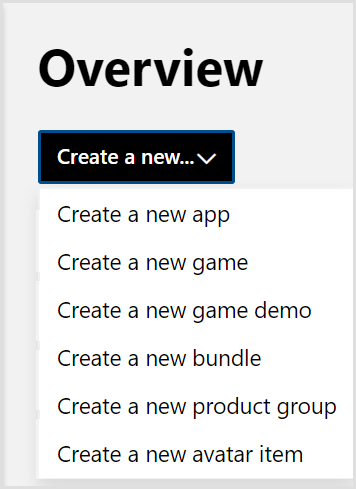  

3. Follow the steps in **Name reservation**. Enter a name for your game, and then select **Reserve product name** as shown in the following screenshot.  

    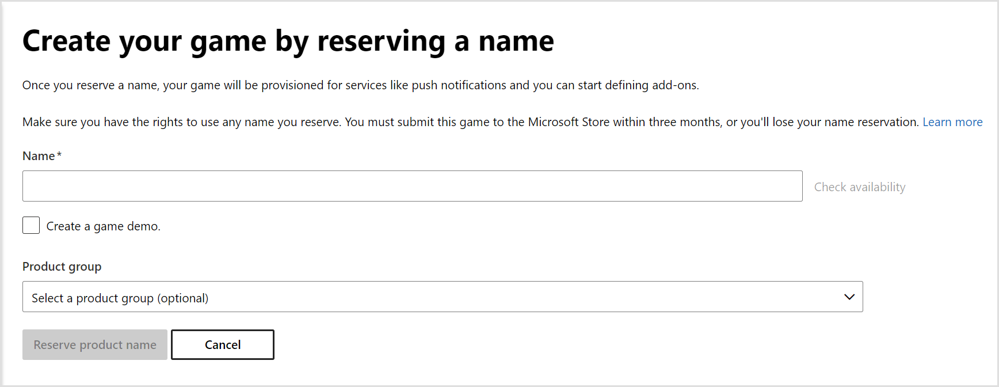  
 

4. If you're publishing on desktop (Windows PC), select **Desktop**. If you're publishing on Xbox, select **Xbox** as shown in the following screenshot. For both **Desktop** and **Xbox**, select the **Retail** check box and the **Sandboxes** check box.  

      
 

5. The option **Use full Xbox services feature set (requires concept approval)** isn't available until you've gone through the approval process, so use **Disable** for now.  
    
    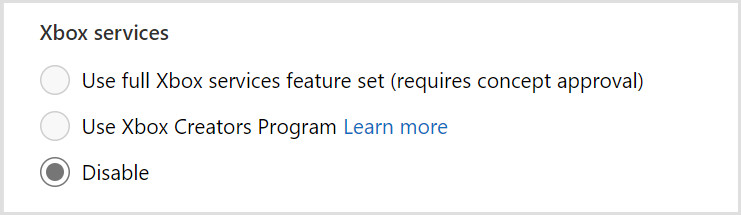  

6. Select **Show details** to expand **Identity details** as shown in the following screenshot. Remember where to find these IDs as you will need them in later steps in this document. 

    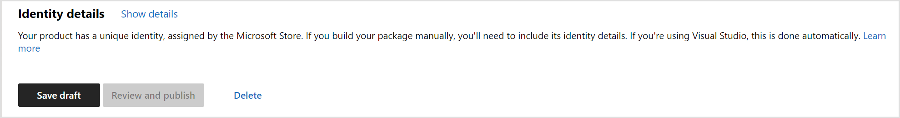  

7. Find your **Store ID** for the next step.  

8. Email your Microsoft representative to get full Xbox services access. You can use the subject line and body for the email as follows.  
  
    Subject: Please enable [*store ID from step 7*] for full Xbox services access  

    Body: Can you enable [*store ID from step 7*] for full Xbox services access?  

    > [!NOTE]
    > Approval can take a day or more.

9. After your game has been enabled for full Xbox services access, select **Use full Xbox services feature set (requires concept approval)** as shown in the following screenshot.  

    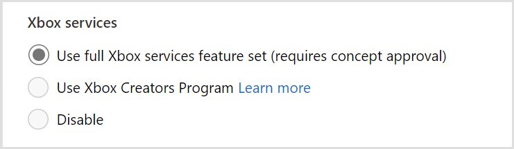 

10. Under **Sandboxes**, ensure that **Enable publishing to sandboxes** is selected.  

11. Under **Primary Xbox services development sandbox**, select a shared sandbox from the drop-down list as shown in the following screenshot. Ensure that the sandbox has "**(shared)**" next to its name. If don't have a sandbox, you can create one by doing the following:  

    1. Select **Manage sandboxes**.  
    1. Select a number from drop-down list. Ensure that you select **Shared**.  
    1. To create the sandbox, click the **New sandbox** button.  

       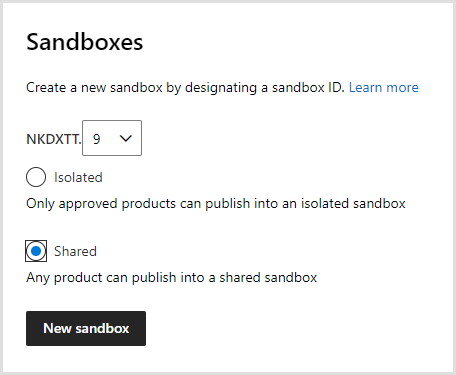  
 

    1. Return to the new game setup page from step 11 in this section.  

12. To complete the settings on this page, select **Review and publish**.  

#### To publish  

1. Expand **Xbox services** on the left pane, and then select **Xbox Settings** as shown in the following screenshot.  

    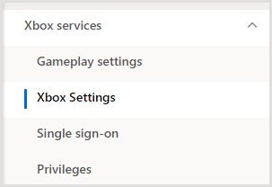   
 

1. If you're shipping on desktop, in **Device families**, select **Windows 10 PC**. If you're shipping on Xbox, select **Xbox One** and **Xbox Series X\|S** as shown in the following screenshot.  

      
 

1. Select **Save**. Note that your changes aren't yet live. This is done in the following steps.  

1. On the left pane, under **Xbox services**, select **Gameplay settings**.  

1. Select **Publish** as shown in the following screenshot.  

    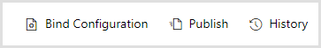  
 

1. In the **Publish gameplay settings** dialog box as shown in the following screenshot, ensure that **From** and **To** are your development sandboxes from step 11 in the previous section. To publish, select **Confirm**.  

    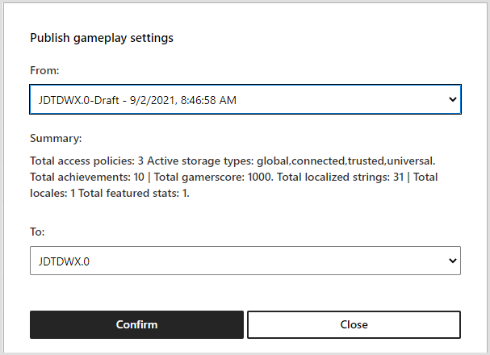  

    NOTE: If you see warnings, they can be ignored when publishing to your developer sandbox, but they may become errors when you publish to RETAIL so you will want to fix them before releasing your game to the store. Errors will block publishing and informational messages won't block in all cases.

1. Wait for the publishing process to be completed, and then wait for 30 minutes. You'll then be ready to begin the next section.  

Your game should now be set up in Partner Center and enabled for Xbox services.  

For more information, see [Setting up an app or game at Partner Center, for Managed Partners](/gaming/xbox-live/get-started/setup-partner-center/live-setup-partner-center-partners).  

   

  

## Unity setup  

This section describes how to set up your environment in Unity.  

1. Ensure that you have access to these helpful resources. If you don't have access, contact your Microsoft representative.  

    * [Secure Xbox downloads](https://www.microsoft.com/en-us/software-download/gdk)  

    * The [GDK Unity](https://forum.unity.com/forums/microsoft-game-core.367/) private forums  

1. Download the GDK.   

    Note: If you only need to publish to PC, you can download the GDK from [GitHub](https://github.com/microsoft/GDK). 

    1. Go to [Secure Xbox downloads](https://www.microsoft.com/en-us/software-download/gdk).  

    1. Select **Game Core**, and then select **Confirm** as shown in the following screenshot.  
    
         
 

    1. Download the latest Tools and Recovery as shown in the following screenshot. Note that you don't need the Recovery if you are shipping only on PC.  

       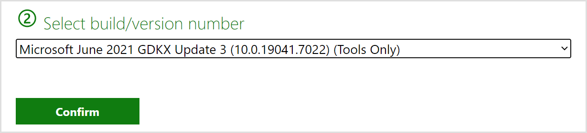  
 

    1. To download each, select **Download Now**.  

1. Install the GDK.  

    1. Browse to where you downloaded the files. Extract each of the packages.  

    1. Browse to the extracted GDK folder, find **setup.exe**, and then double-click it to open **Setup**.  

    1. Complete the steps in the **Setup** pages.  

1. Download the Unity package from [GitHub](https://github.com/microsoft/gdk-unity-package/releases).  

1. Import the Unity package.  

    1. Create a new Unity project. We recommend that you first go through this process with a new project before using it on your actual game.  
    
    1. In the new Unity project, go to the main menu by selecting **Assets** > **Import Package** > **Custom Package**.  

    1. Go to the GDK .unitypackage file you downloaded, and then open it.  

    1. If you see import errors on the console, select **Clear**. If the errors are no longer there, you can ignore them.  

    1. Upon completion, the asset package is listed on the **Project** tab under the **Assets** folder as shown in the following screenshot.  

       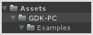  
 

    1. A new menu option, named **GDK**, now appears in the Unity main menu as shown in the following screenshot.  
    
       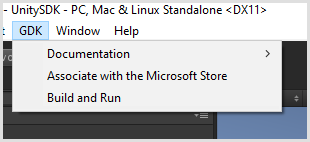  

5. Install the Unity package for Xbox.  

    1. Go to [Unity private forums for Game Core](https://forum.unity.com/forums/microsoft-game-core.367/). Go to a pinned post called [Unity for Game Core Downloads](https://forum.unity.com/threads/unity-for-game-core-downloads.837508/), and then select that link. 

    1. There are links to download packages. The GDK Package is already included in this package, so you don't need to download it. You might not need to download the other packages. To decide if you need to download them, read their descriptions.  

You should now have everything you need to start integrating the GDK into your Unity game.  

   

  

## Hello World  

This section describes how to run the Hello World Unity sample.  

1. Browse to and then open the sample scene under *Assets\GDK-Tools\Examples\Sign-in\SignIn.unity*.  

2. To reveal **Build Settings**, in the Unity main menu, select **File** > **Build Settings**.  

3. To add the sample scene, select **Add Open Scenes**.  

4. Cancel the selection for any other scenes that you might have selected. This ensures that only the sample scene is selected: *GDK-Tools/Examples/Sign-in/SignIn*.  

5. Close the **Build Settings** dialog box.  

6. In the menu, select **GDK** > **Build and Run**.  

7. In the **GDK - PC Build And Run** dialog box, there should only one sample scene listed: *Assets/GDK-Tools/Examples/Sign-in/Basic.unity*.  

8. Select **Build and Run**.  

9. When the sample game launches, it prompts you to sign in to Xbox services.  

10. Note that **Unlock achievement** won't yet work in the achievements sample scene.  

You've built and run your first Unity game. You're ready to integrate the GDK into your own game.  

   

  

## Adding Xbox services to your game  

This section describes how to add Xbox services sign-in, cloud saves, and achievements to your game.  

### Download the Xbox App  
Download the [Xbox App](https://www.microsoft.com/p/xbox/9mv0b5hzvk9z).

### Associate your game with Microsoft Store  

1. To open the **Microsoft Game Configuration Editor**, go to Unity; in the top-level menu, select **GDK** > **Associate with the Microsoft Store** as shown in the following screenshot.  
    
    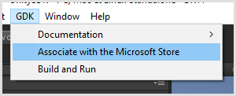  

1. To open the **Store Association Wizard**, select **Associate with the Store** as shown in the following screenshot.  

    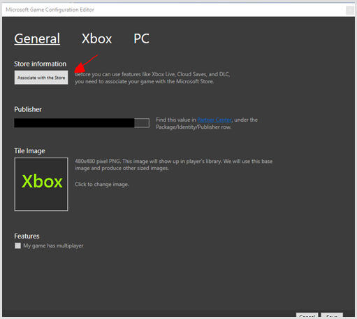  

1. To associate your game with Microsoft Store, follow the steps in the **Store Association Wizard**.  

1. Enter the rest of the required information. 
   * The **Publisher** field is necessary. You can find the value in Partner Center under the Package/Identity/Publisher row.
   * The Tile Image can be left with the default image
   * If your game has multiplayer, select **My Game has multiplayer**.  

### Create a test account

Create a test account in [Partner Center](https://go.microsoft.com/fwlink/p/?LinkID=254486) by following the steps in the [Creating test accounts](../../live/test-release/test-accounts/live-setup-testaccounts.md) topic.  

### Sign-in  

This section describes how to add sign-in to your game.  

#### To implement sign-in

1. In Unity, go to *\Assets\GDK-Tools\Prefabs\GdkHelper.prefab*, and then drag the **GdkHelper** prefab into your scene.  

1. Open the **Sandbox Switcher** by going to **GDK** > **Switch Sandbox**.  

1. Your sandbox is automatically populated in the sandbox drop-down list as shown in the following screenshot.  

      

1. Select the **Switch Sandbox** button.  

1. To verify that you successfully switched your sandbox, select **Launch Apps** to reopen the Microsoft Store app, Xbox app, and Xbox Console Companion.  

1. Sign in to the Xbox App with the username and password from the [Xbox test account](#Create-a-test-account) that you created earlier. Verify that you can sign in.  

1. To test this, go to **GDK** > **Build And Run**.  

1. When your game launches, a sign-in prompt appears.  

1. Sign in with the test account that you created. You have now implemented sign-in.

If you have trouble getting sign-in to work, refer to the [Troubleshooting sign-in and sandboxes](../../live/test-release/troubleshooting/live-troubleshoot-sandboxes.md) article for help.

#### To switch back to RETAIL mode  

1. Go to **GDK** > **Switch Sandbox**.  

1. Select **Retail** from the sandbox drop-down list.  

1. Select the **Switch Sandbox** button. 

1. Select **Launch Apps**. 

1. Open one of the apps. Try to sign in with a non-test account, and then verify that you can sign in. 

#### See Also
[Troubleshooting sign-in and sandboxes](../../live/test-release/troubleshooting/live-troubleshoot-sandboxes.md)   

### Cloud saves  

This section describes how to add cloud saves to your game.  

1. To learn how to integrate cloud saves, review the sample code in *Assets\GDK-Tools\Examples\Cloud Saves\GameSaveSampleLogic.cs*.  

1. Integrate the cloud save APIs into your game.  

1. Open the **Sandbox Switcher** by going to **GDK** > **Switch Sandbox**.  

1. Your sandbox is automatically added to the sandbox drop-down list as shown in the following screenshot.  

      

1. Select the **Switch Sandbox** button and select the sandbox you specified in the **Game setup** of this guide.  

1. To verify that you successfully switched your sandbox, select **Launch Apps** to reopen the Microsoft Store app, Xbox app, and Xbox Console Companion.  

1. Sign in to the Xbox App with the username and password from the [Xbox test account](#Create-a-test-account) that you created earlier. Verify that you can sign in. 

1. To test this, go to **GDK** > **Build And Run**.  

1. When your game launches, sign in with the [test account](#Create-a-test-account) that you created earlier if the sign-in prompt appears.  

1. Verify that your game-save code works as expected.  

1. To switch back to normal mode, go to **GDK** > **Switch Sandbox**.  

    1. Select **Retail** from the sandbox drop-down list.  

    1. Select the **Switch Sandbox** button.  

    1. Select **Launch Apps**.  

    1. Open one of the apps. Try to sign in with a non-test account, and then verify that you can sign in.  

### Achievements  

This section describes how to add achievements to your game.  

#### To publish achievements  

1. Ensure that you have [sign-in](#sign-in) working before implementing achievements.  

1. Go to [Partner Center](https://partner.microsoft.com/dashboard/windows/overview).  

1. On the left pane, select **Xbox Settings** as shown in the following screenshot.  

    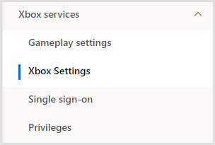  

1. Under **Publish Achievements to Retail?**, select **Yes I will be publishing achievements** as shown in the following screenshot.  

    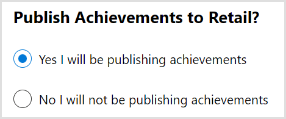  

#### To publish gameplay settings  

1. Select **Gameplay settings** under the **Xbox services** section on the left pane as shown in the following screenshot.  

    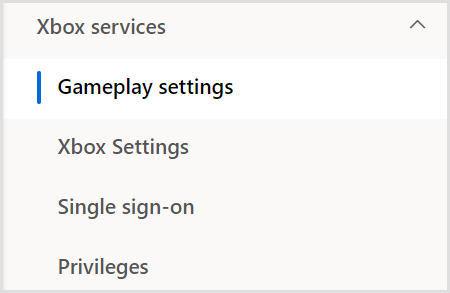  
 
1. To go to the Achievements page, select the **Achievements** link. 

1. Select **New achievement**. Enter the required information.  

1. When the new achievement is created, take note of the achievement's ID in the **ID** field. It's autogenerated and will be a string like "1".  

1. To open the **Publish gameplay settings** dialog box, select **Publish**.  

1. Change the **To:** field to your developer sandbox that you created [earlier](#partnercentersetup). Select **Confirm**.  

1. Wait for the publishing process to be completed.  

#### To sign in and unlock an achievement  

1. To learn how to integrate achievements, review the sample code in *Assets\GDK-Tools\Examples\Achievements\UnlockAchievementSampleLogic.cs* and write the code to unlock achievements in your game.  

1. Open the **Sandbox Switcher** by going to **GDK** > **Switch Sandbox**.  

1. Your sandbox is automatically added to the sandbox drop-down list as shown in the following screenshot.  

      

1. Select the **Switch Sandbox** button and select the sandbox you specified in the **Game setup** of this guide.    

1. To verify that you successfully switched your sandbox, select **Launch Apps** to reopen the Microsoft Store app, Xbox app, and Xbox Console Companion.  

1. Sign in to the Xbox App with the username and password from the [Xbox test account](#Create-a-test-account) that you created earlier. Verify that you can sign in.  

1. To test this, go to **GDK** > **Build And Run**.  

1. When prompted, sign in with your test account.  

1. At this point your project should be conected to Xbox services with a signed in user and you can trigger the code that you wrote in step 1.  

#### To switch back to normal mode

1. Go to **GDK** > **Switch Sandbox**.  

1. Select **Retail** from the sandbox drop-down list.  

1. Select the **Switch Sandbox** button.  

1. Select **Launch Apps**.  

1. Open one of the apps. Try to sign in with a non-test account, and then verify that you can sign in. 

   

  

## Adding commerce to your game    

This section describes how to integrate your in-game store with the GDK.  

### Partner Center configuration   
This section shows you how to create listings for your in-game items in Partner Center.   

1. Go to [Partner Center](https://partner.microsoft.com/dashboard).   

1. Navigate to your game.   

1. In the navigation pane on the left, select **Add-ons**.   

1. Click the **Create a new...** button at the top. Select the [appropriate category](/windows/uwp/publish/set-your-add-on-product-id)  

1. Fill out the required information and create any additional in-game items you need.   

1. Click on the add-on in the table to see its details.   

1. In the left navigation, select the **Durable setup** page (or **Consumable setup** if you created a consumable). 

1. Click the **Show details** button in the **Identity Details** section.   

1. Copy the value of the **Store ID** field. This value will be passed to the ShowPurchaseUIAsync API later in this section.    

1. Fill in the rest of the required fields. Set the price to free for easier testing.   

1. When you are finished, publish to your developer sandbox.   

### Preparing for testing   
This sections shows you how to prepare your environment for testing store APIs. See [Enabling XStore development and testing](../../commerce/getting-started/xstore-product-testing-setup.md) for more details.   
1. In Unity, open the **Sandbox Switcher** by going to **GDK** > **Switch Sandbox**.  

1. Your sandbox is automatically added to the sandbox drop-down list as shown in the following screenshot.  

      

1. Select the **Switch Sandbox** button and select the sandbox you specified in the **Game setup** of this guide.  

1. To verify that you successfully switched your sandbox, select **Launch Apps** to reopen the Microsoft Store app, Xbox app, and Xbox Console Companion.  

1. Sign in to the Xbox App with the username and password from the [Xbox test account](#Create-a-test-account) that you created earlier.   

1. Search for your game in the Xbox App.   

1. Download and install your game. This is an important step because it will give your test account a license to the game. Without a license, you will get an E_IAP_UNEXPECTED error.   

1. For console, you can get the value of the Content ID and EKB ID by running `xbapp list /d` in the Gaming Command Prompt.   

1. For PC, you can get the value of the Content ID by opening a command prompt and type: `reg query HKEY_CURRENT_USER\SOFTWARE\Microsoft\Windows\CurrentVersion\Store\ContentId`

1. Find the Content ID value for your game package.   

1. Go to **\GDK-Tools\ProjectMetadata** and open the MicrosoftGame.config file. Note: You cannot open it in Unity. Instead, you will need to browse to the folder in the file explorer and open it in another program.   

1. Replace the **ContentIdOverride** value with the value obtained above. For console, you will also need to set an EKBIDOverride. But note that the MicrosoftGame.config values for console are set in a different location than PC. For Xbox, they can be found under **Player Settings...** > **Publishing Settings** for the Xbox build platform.    

1. Next, go to **GDK-Tools\Examples\In Game Store** and open the **In Game Store.unity scene**.  

1. You can look at the file **StoreSampleLogic.cs**, to learn how to integrate the GDK purchase APIs with your game.  

    1. You can get the list of purchasable items from the Microsoft store by calling Gdk.Helpers.GetAssociatedProductsAsync.
    1. When the method returns, you will get a list of purchasable items, including whether the player owns the item. Whether the player owns the item is represented by the IsInUserCollection property.
    1. To purchase an item, call the Gdk.Helpers.ShowPurchaseUIAsync method. This will show the purchase UI dialog, prompting the player to purchase the item.
    1. The callback will return with whether the purchase was successful or not. Note: The purchase failing may be expected because the player canceled the purchase dialog.

1. Once you have integrated the code in your game, open the **Sandbox Switcher** by going to **GDK** > **Switch Sandbox**.  

1. Your sandbox is automatically added to the sandbox drop-down list as shown in the following screenshot.  

      

1. Select the **Switch Sandbox** button and select the sandbox you specified in the **Game setup** of this guide.  

1. To verify that you successfully switched your sandbox, select **Launch Apps** to reopen the Microsoft Store app, Xbox app, and Xbox Console Companion.  

1. Sign in to the Xbox App with the username and password from the [Xbox test account](#Create-a-test-account) that you created earlier. Verify that you can sign in. 

1. To test this, go to **GDK** > **Build And Run**.  

1. When your game launches, sign in with the [test account](#Create-a-test-account) that you created earlier if the sign-in prompt appears.  

1. Verify that your in-game store integration code works as expected.  

1. To switch back to normal mode, go to **GDK** > **Switch Sandbox**.  

    1. Select **Retail** from the sandbox drop-down list.  

    1. Select the **Switch Sandbox** button.  

    1. Select **Launch Apps**.  

    1. Open one of the apps. Try to sign in with a non-test account, and then verify that you can sign in.  
 
#### See Also
[Enabling XStore development and testing](../../commerce/getting-started/xstore-product-testing-setup.md)
[Troubleshooting store integration](../../commerce/getting-started/xstore-troubleshooting.md)
[Troubleshooting sign-in and sandboxes](../../live/test-release/troubleshooting/live-troubleshoot-sandboxes.md)   

  

  

## Additional considerations before shipping  

### Checking for mandatory updates  

For PC, you need to write code in your game to check for mandatory updates. Checking for mandatory updates happen automatically, without you having to write code, on the console, but not on the PC. You can learn more about that in the [checking for updates](../../commerce/pc-specific-considerations/xstore-checking-for-updates.md) topic.    

### Certification test cases  

Before you ship it is a good idea to look through the [policies and Xbox requirements](../../policies/GC-policies-nav.md).

### Unity considerations with TCUI dialogs

It is recommended that "Application.runInBackground" is set to true for any game that expects to display a title-callable UI (TCUI) dialog.  See [Window display modes and title-callable UI dialogs](../overviews/window-display-modes-and-tcui.md) for additional information on successfully showing TCUI dialogs.

## Additional considerations before shipping
### Checking for mandatory updates
For PC, you need to write code in your game to check for mandatory updates. Checking for mandatory updates happen automatically, without you having to write code, on the console, but not on the PC. You can learn more about that in the [checking for updates](../../commerce/pc-specific-considerations/xstore-checking-for-updates.md) topic.    
### Certification test cases
Before you ship it is a good idea to look through the [policies and Xbox requirements](../../policies/GC-policies-nav.md).   

  

## Publishing on Partner Center  

This section describes how to package, upload, and publish your game on Partner Center.  

1. In Unity, go to **GDK** > **Build And Run**.  

1. Select the **Create package to upload to the store** check box as shown in the following screenshot.  

    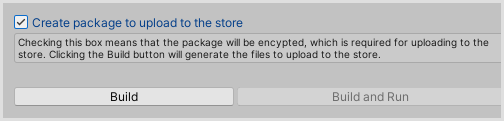  
 

1. Select **Build**.  

1. When prompted, choose a folder for the build package files.  

1. When the build finishes, it opens the folder that contains the files you need to upload to Microsoft Store.  

1. Go to [Partner Center](https://partner.microsoft.com/dashboard)  

1. Select **Packages** on the pane as shown in the following screenshot.  

    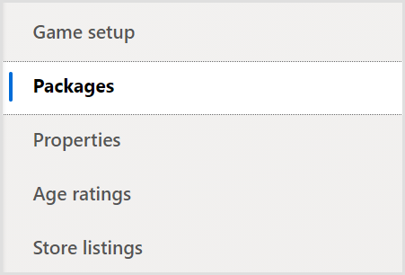  

1. Upload the .msixvc, .ekb, and .xml files from step 5 in this section by dragging the files to the drag area as shown in the following screenshot. If you can't upload an .msixvc file, contact your Microsoft representative for help.  

    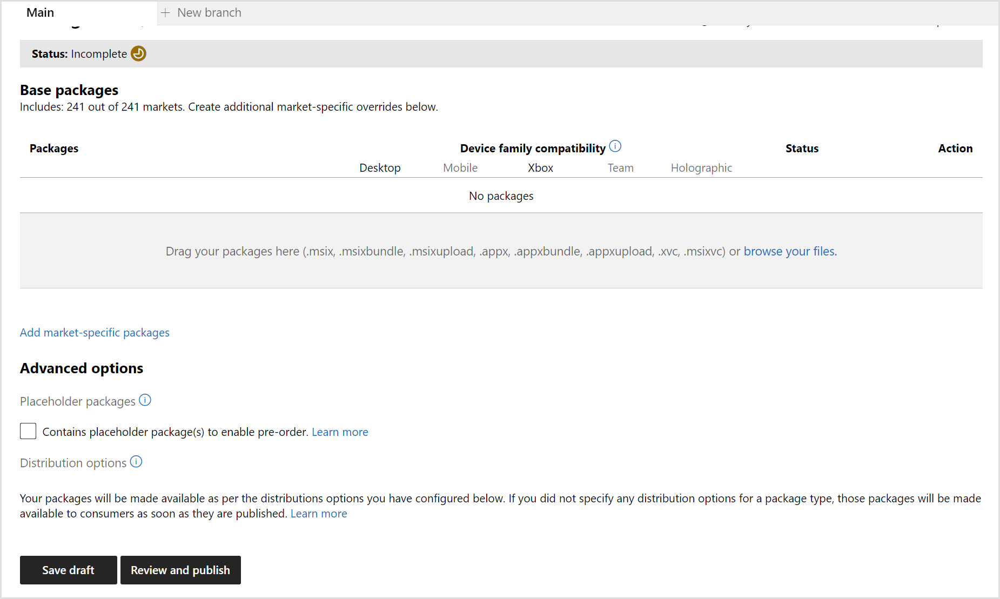  

1. Enter the required information in the **Properties**, **Age ratings**, **Store listings**, and **Pricing and availability** sections as shown in the following screenshot.
  
    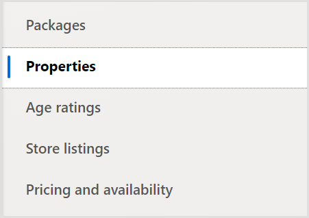  

1. On the **Store listings** page, ensure that you upload a trailer. Trailers aren't listed as mandatory in the UI but are required for games.  

1. To publish, select **Review and publish** as shown in the following screenshot.  

    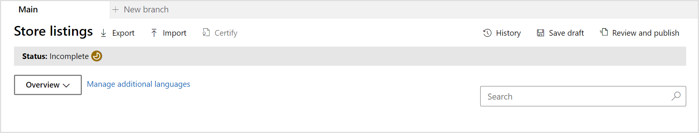  

1. Select **RETAIL**. This submits your game to certification.  

    > [!NOTE]
    > If you see errors about revenue SKUs, they're created as part of the certification process. To publish your packages to retail, you must go through certification.  

1. After your game passes certification, it can be released to retail. You can see when your game has passed certification on the **Game Overview** page, under the **Publishing Status** section.

 

## See Also
[Troubleshooting sign-in and sandboxes](../../live/test-release/troubleshooting/live-troubleshoot-sandboxes.md)   

