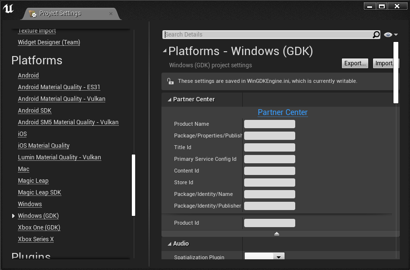

# Unreal development for PC: get started

<a id="summarySection"></a> 
Use this topic to prepare your Unreal game for publishing to the Microsoft Store.  
<a id="checklistSection"></a>
 * [Creating a product in Partner Center](#prereqSection) 
 * [Using Unreal 4.27 or later](#prerequisiteUnreal)
 * [Getting access](#gettingAccess)
 * [Packaging your game for the Microsoft Store](#packaging)
 * [Implementing platform features](#implementingPlatformFeatures)
 * [Testing platform features](#testingPlatformFeatures)
 * [Publishing](#publishing)
 * [Troubleshooting your GDK configuration for Unreal](#troubleshooting)
 * [Appendix](#unrealAppendix)

<a id="prereqSection"></a>

## Creating a product in Partner Center  

Before you can publish an Unreal game to the Microsoft Store, create your Xbox Live–enabled product in Partner Center. For more information about Partner Center, see [Setting up an app or game in Partner Center, for Managed Partners](/gaming/xbox-live/get-started/setup-partner-center/live-setup-partner-center-partners).

<a id="prerequisiteUnreal"></a>

## Using Unreal 4.27 or later  

The easiest way to integrate your Unreal game with the Microsoft Game Development Kit is to upgrade to the latest version of Unreal. GDK support for both Windows PC and Xbox consoles is built into Unreal for versions 4.27 or later.
If you don't want to upgrade to Unreal version 4.27 or later, follow the instructions in the [Earlier versions of Unreal](#olderVersionsOfUnreal) section later in this topic.

> [!NOTE]
> Unreal 4.26 has GDK support built in as well, but is not recommended because it had several issues including lack of Direct3D 11 support and a PSO shader cache issue that lead to stuttering during the first playthrough of a game.  

### Direct3D 11 support in UE versions prior to 4.27

By default Direct3D 11 is not supprted in UE versions prior to 4.27. Direct3D 11 support can be enabled in UE 4.26 by integrating two change lists as described in this tech note: [DX11 support in WinGDK before 4.27](https://udn.unrealengine.com/s/article/Tech-Note-DX11-support-in-WinGDK-before-4-27). 

> [!NOTE]
> If these changes are not integrated, Direct3D 12 will be used in 4.25Plus/4.26 regardless of any settings specifying Direct3D 11.

<a id="gettingAccess"></a>

## Getting access  

**IMPORTANT**: You need to get access to console development **even if you are building for PC**.

To begin Unreal GDK development, request access by using the [Console Development Request form](https://epicgames.secure.force.com/Forms/FormConsoleAccessRequest). If your access request doesn't go through, contact your developer account manager (DAM).

Standard Unreal does not contain support for the GDK. This is why you need to request access to Unreal's GDK support.

## Download the Xbox App  

Download the [Xbox App](https://www.microsoft.com/p/xbox/9mv0b5hzvk9z). The Xbox app can be used to verify your test account is signed in. 

<a id="packaging"></a>

## Configuring your game for the Microsoft Store  

Use the following steps to create a package to upload to the Microsoft Store.
 1. Open the Unreal Editor, select **Edit**, and then select **Project Settings.**
 1. On the left pane, select **Platforms**, and then select **Windows (GDK)** as shown in the following screenshot. <br/><br/><br/><br/>
 1. Complete the form that appears. The following fields are required for PC development.
   * Product Name (the display name for your game)
   * Culture Image Resources
     * Store Logo
     * Application Logo
     * Application Small Logo
     * Application Splash Screen
 
 
The rest of the required fields are in Partner Center. Use the following steps to go to Partner Center and complete your product configuration.
 1. Go to the [Partner Center dashboard](https://partner.microsoft.com/dashboard/windows/overview).
 2. Select your game from the list of products.
 3. Select the **Game setup** tab, and then select **Identity details**.
 4. Select **Show Details** to expand the **Identity details** section.
 5. Use the following values from the table, and then copy the values from Partner Center into the project settings for **Windows (GDK)**. 
 

| Name in Partner Center | Name in the Unreal Editor |
| --- | --- |
| Package/Properties/PublisherDisplayName | Package/Properties/PublisherDisplayName |
| Xbox Title ID | Title Id |
| Package/Identity/Name | Package/Identity/Name |
| Package/Identity/Publisher | Package/Identity/Publisher‎ |
| Xbox services -> Xbox Settings -> Identity | MSAAppId |

<a id="implementingPlatformFeatures"></a>


## Implementing platform features  

GDK platform integration is part of Unreal's Online Subsystem. To tell Unreal to use the GDK online subystem, edit your WinGDKEngine.ini file (in Platforms\WinGDK\Config) to include the following:

```
[OnlineSubsystem]
DefaultPlatformService=GDK
```


<a id="signIn"></a>  

### Sign in  

Sign in is part of the online subsystem for the GDK.  

<a id="achievements"></a>

### Achievements  

To use achievements in you Unreal game you need to make the following changes to your game and your Partner Center project.

#### **Setting Unreal to use the GDK online subsystem with title-managed achievements and event-based stats**  

Achievements are included as part of the online subsystem for the GDK. To tell Unreal to use title-managed achievements and event-based stats, edit your WinGDKEngine.ini file (in Platforms\WinGDK\Config) to include the following:   
   
```
[OnlineSubsystemGDK]   
AchievementMode=2017   
StatsMode=2013   
```

#### **Configuring stats and achievement systems for your game in Partner Center**  

To configure achievements:  

 1. Go to the [Partner Center dashboard](https://partner.microsoft.com/dashboard/windows/overview).
 2. Navigate to your game.
 3. Expand the **Xbox Live** section in the navigation pane.
 4. Click on **Xbox Live Settings**.
 5. Make sure **Stats configuration system** is set to **Event-Based Stats**.
 6. Make sure **Achievements configuration system** is set to **Title-Managed Achievements**.

Note: If you are migrating from the XDK, the OnlineSubsystemLive has been replaced by the OnlineSubsystemGDK. You need to set this as the default OnlineSubsystem in the Windows GDK .ini file.

#### **Mapping achievement names in Unreal**  

Achievement names used in Unreal need to be mapped to the achievement IDs used in Partner Center.  

To map achievement names used in Unreal create a file named Achievements.json in the platforms\GDK\Config\OSS\ directory of your project (note that the path may not exist and you may need to create it yourself). Achievements.json contains a mapping for achievement names to their Partner center IDs.  For example, if your project has 10 achievements named achievement 1 through achievement 10, Achievements.json would look like this:

```
{
    "AchievementEventName" : "NotUsedInAchievement2017",
    "AchievementMap" :
    {
      "achievement 1" : 1,
      "achievement 2" : 2,
      "achievement 3" : 3,
      "achievement 4" : 4,
      "achievement 5" : 5,
      "achievement 6" : 6,
      "achievement 7" : 7,
      "achievement 8" : 8,
      "achievement 9" : 9,
      "achievement 10" : 10
    }
}
```


<a id="cloudSaves"></a>

### Cloud saves  

Cloud saves are part of the Game Save interface in Unreal and don't require additional configuration to enable.

See [Saving and Loading Your Game](https://docs.unrealengine.com/4.27/en-US/InteractiveExperiences/SaveGame/) in the Unreal Engine documentation for information on using the game save interface in Unreal.

Note: If you are having trouble figuring out why cross-saves are not working, it is important to remember that the save location for GDK is different than the generic save game location. If you are having trouble, check where the save games are saved to are and where you are querying them from in case the locations are different.

<a id="storeFeatures"></a>  

### Store APIs  

Store integration like in-app purchases and downloadable content (DLC) are also part of the online subsystem in Unreal.  

<a id="testingPlatformFeatures"></a>  

## Testing platform features  

Platform features don't work in the editor. They only work in a packaged build. This means that you can write code or blueprints for the platform features, but you can't test the build without creating a package.  

To test platform features such as sign in, cloud saves, and achievements, create a test account and switch your sandbox. Learn how to create a package, test accounts, and switch your sandbox in the following sections.  

<a id="creatingAPackage"></a>  

### Creating a package  

Package your game the same way that you would when you're using other Unreal platforms. Use the following steps to create an MSIXVC package to upload to the Microsoft Store.  

 1. Access the packaging dialog box by selecting **File** > **Package Project** > **Windows on GDK**.
 1. Choose a folder for the build output from the **File Explorer** dialog box, and then select **Select Folder**.

If you encounter errors, you can build manually. For more information about manual builds, see [Title packaging, content updates, and streaming-installation testing](../../packaging/title-packaging-streaming-install-testing.md).

<a id="installingAndRunning"></a>  

### Installing and running a package  

For more information about installing and running packages, see [Utilizing Microsoft Game Development Kit tools to install and launch your PC title](../../tools-pc/launching-on-pc.md).  

<a id="creatingTestAccounts"></a>

### Creating a test account  

For more information about creating test accounts, see [Creating test accounts](../../live/test-release/test-accounts/live-setup-testaccounts.md).  

<a id="switchSandbox"></a>

### Switching your sandbox  

After you've created a test account, use the account to access your sandbox by using the following steps.  

 1. To find your sandbox ID, go to [Partner Center](https://partner.microsoft.com/dashboard/windows/overview).
 1. Select **Xbox Live**, and then select **Gameplay Settings**.
   > [!NOTE]
   > Your sandbox ID is on the first tab, and it's named like "ABCDEF.0".
 1. Open the **Start** menu.
 1. Enter **Microsoft GDK Command Prompts**, and then select **Enter** on your keyboard.
 1. Open the first command prompt.
 1. In the command prompt, enter **XblPCSandbox.exe [your sandbox ID]**.
 1. After the command prompt launches several apps, sign in with your test account to the Xbox App. 

If you're able to sign in successfully, you've created a test account and changed to your sandbox to begin testing. If you have trouble signing in, refer to the [Troubleshooting sign-in and sandboxes](../../live/test-release/troubleshooting/live-troubleshoot-sandboxes.md) for help.  

<a id="publishing"></a>  

## Publishing  

After you've finished integrating your game with the GDK, you're ready to publish. To submit your game, go to [Partner Center](https://partner.microsoft.com/dashboard/windows/overview) and follow the instructions in the UI.  

<a id="troubleshooting"></a>

## Troubleshooting your GDK configuration for Unreal

### Verify your game matches the values in Partner Center
If your game is unable to sign in or your calls to Xbox services are failing, verify the values you set in the *Configuring your game for the Microsoft Store* section match the values for your project in Partner Center.  

### Verify the contents of WinGDKEngine.ini and Achievements.json
Verify WinGDKEngine.ini and Achievements.json are set up as described in the *Setting Unreal to use the GDK online subsystem with title-managed achievements and event-based stats* section.  

### Use fiddler to examine network trafic  

If neither of the previous steps resolve the issue, consider installing [Fiddler](../../live/test-release/tools/live-fiddler-inspect-web-calls.md) so that you can see the network traffic from your game to xboxlive.com and the responses from xboxlive.com.  

#### Expected network traffic for sign in  

If your game has successfully signed in a user you should see a packet to userpresence.xboxlive.com that looks similar to this:  
`POST https://userpresence.xboxlive.com/users/xuid(2814616665093727)/devices/current/titles/current HTTP/1.1`  
where xuid(XXXXXX) is the Xbox User ID of your signed in test account.  
If you don't see this packet try the following:  
* Verify the values you set for your project in UE match the values for your project in Partner center.
* Verify your computer is set to the sandbox you specified for your project in Partner center.
  You can check the current sandbox on your computer by opening the GDK command prompt and running XBLPCSandbox.exe
  If the sandbox doesn't match, you can set it in the same GDK command prompt by running XBLPCSandbox.exe [sandbox name], for example:  
  `XBLPCSandbox.exe XDKS.1`
* Make sure your test account is signed in. An easy way to do this is to open the Xbox App and see if your test account is shown.

#### Expected network traffic for querying and setting achievements

If your game has successfully requested information on the status of achievements for your test account, you should see a packet to achievements.xboxlive.com that looks similar to this:  
`GET https://achievements.xboxlive.com/users/xuid(2814616665093727)/achievements?titleId=1794603332&orderBy=title HTTP/1.1`  

If the request was successful, the packet will have a response listing the current status of achievements for the test user for your game.


If your game has successfully updated an achievement for your test account, you should see a packet to achievements.xboxlive.com that looks similar to this:

```
POST https://achievements.xboxlive.com/users/xuid(2814616665093727)/achievements/00000000-0000-0000-0000-00006af77944/update HTTP/1.1
...
{"action":"progressUpdate","serviceConfigId":"00000000-0000-0000-0000-00006af77944","titleId":1794603332,"userId":"2814616665093727","achievements":[{"id":"1","percentComplete":100}]}
```

If you don't see these packets or you don't get the expected response:

* Make sure your test account is signed in. An easy way to do this is to open the Xbox App and see if your test account is shown.
* Make sure WinGDKEngine.ini and Achievements.json exist and have values as specified in the *Setting Unreal to use the GDK online subsystem with title-managed achievements and event-based stats* section.
* Verify your achievements are published to your sandbox in Partner Center.

#### Expected network traffic for Cloud Saves  

Cloud Save calls don't necessarily generate network trafic immediately and instead cause the gamingservices process to send packets to titlestorage.xboxlive.com that look similar to this:

```
PUT https://titlestorage.xboxlive.com/connectedstorage/users/xuid(2814616665093727)/scids/00000000-0000-0000-0000-00006AF77944/lock HTTP/1.1
```

In order to see the network traffic from the gamingservices process in Fiddler, you'll need to redirect winhttp to Fiddler using the following command in a command shell with administrator privileges:  

```
netsh winhttp set proxy localhost:8888
```

To clear the redirect, use the following command:  

```
netsh winhttp reset proxy
```

### Samples

Unreal and GDK samples can be used as references to compare your project to and to see expected network traffic for calls to xboxlive.com.

#### Unreal samples

The Unreal sample *ShooterGame* is set up to use the GDK and Xbox services and can be used as a reference to compare with your project configuration. You can use this sample with the values for the Partner Center project for your game using the process described in the *Configuring your game for the Microsoft Store* section. The *ShooterGame* sample can be found in the UE source repo under `Samples\Games\ShooterGame`.

#### GDK samples

The [Achievements2017_desktop](../../samples/gdk-samples-home.md) GDK sample can be used as a reference in combination with [Fiddler](../../live/test-release/tools/live-fiddler-inspect-web-calls.md) to see network traffic for sign-in and querying and setting achievements. Achievements2017_desktop is already setup to work with its own Partner Center project and can be used with its existing configuration.

The [GameSave_desktop](../../samples/gdk-samples-home.md) GDK sample can be used as a reference in combination with [Fiddler](../../live/test-release/tools/live-fiddler-inspect-web-calls.md) to see network traffic for Cloud Save.  GameSave_desktop is already setup to work with its own Partner Center project and can be used with its existing configuration.

### Additional troubleshooting tips  
For additional troubleshooting tips see [Troubleshooting sign-in and sandboxes](../../live/test-release/troubleshooting/live-troubleshoot-sandboxes.md).

<a id="unrealAppendix"></a>

## Appendix

<a id="olderVersionsOfUnreal"></a>  

### Earlier versions of Unreal  

If you're using a version of Unreal that's earlier than 4.26, you can still target the GDK by following some of the previous instructions. However, you need to integrate platform features and create the package yourself. See [Unreal development for PC: get started (earlier versions)](gc-get-started-with-unreal-legacy-pc.md) for more information.


#### Creating a package  

For more information about packaging your game for the Microsoft Store, see [Title packaging, content updates, and streaming-installation testing](../../packaging/title-packaging-streaming-install-testing.md).  

## See also  
[Unreal development forums](https://forums.unrealengine.com/development-discussion/xbox-one-development)  
[Troubleshooting sign-in and sandboxes](../../live/test-release/troubleshooting/live-troubleshoot-sandboxes.md)  