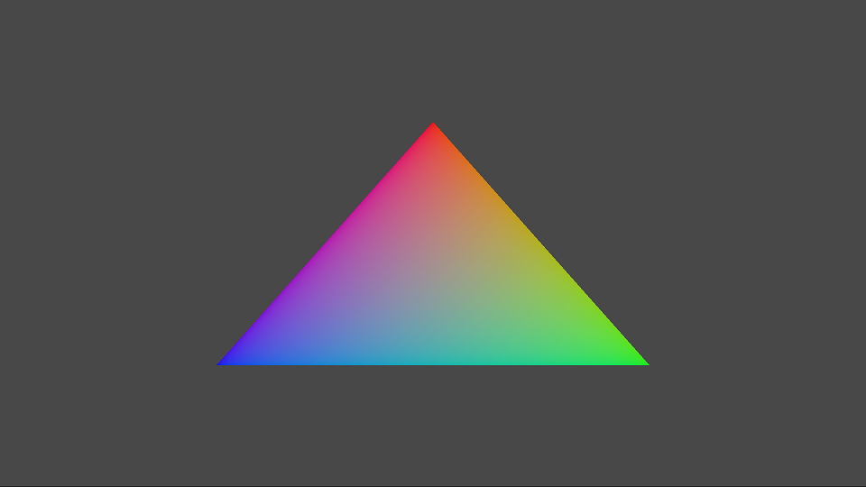

# Running PC samples

You can download samples for the Microsoft Game Development Kit (GDK) from [Samples](https://aka.ms/xgdsamples). They aren't included in the Microsoft Game Development Kit (GDK) installation.

The samples are organized as follows.

* Kits: shared utility code that's used by the samples
* Media: various shared assets that are used by the samples
* GDKSamples:
  * Audio: samples related to XAudio2, WASAPI, and more
  * IntroGraphics: introductory DirectX 12 samples
  * Live: Xbox Live services samples
  * Graphics: DirectX 12.X samples
  * System: samples related to input, IO, memory, and more
  * Tools: various sample tools for working with the Microsoft Game Development Kit (GDK)

> [!NOTE]
> Some of the samples are only for Xbox console.

## Building a sample

For more information, see the *Readme.docx* file for each specific sample.

1.  Install the required development tools:  Visual Studio 2017 or Visual Studio 2019, Windows 10 SDK, and the Microsoft Game Development Kit (GDK).
1. Open Visual Studio.
1. Select **File** > **Open** > **Project/Solution**. Navigate to the sample (such as *GDKSamples\IntroGraphics\SimpleTriangleDesktop*). Select **SimpleTriangleDesktop.sln**.
1. Select **F5** to build, deploy, and debug.

Because the Gaming.Desktop.x64 samples use DirectX 12, they require Windows 10, a video card, and a video driver capable of DirectX 12.

In Debug configuration builds of these samples, if a DirectX 12 device isn't available, the sample instead attempts to use the WARP12 software device. This is noted in the debug output window as "Direct3D Adapter - WARP12". WARP12 is installed (along with the Direct3D 12 debug device) by enabling the optional feature Graphics Tools on your Windows 10 system. For more information, see the [Visual Studio 2015 and Graphics Tools for Windows 10 blog post](https://devblogs.microsoft.com/cppblog/visual-studio-2015-and-graphics-tools-for-windows-10/).

Because WARP12 is available only on developer systems, Release configuration builds won't attempt to use the software device and instead fail if no DirectX 12&ndash;capable hardware is found.

### Visual Studio note

By default, the samples are set to use the Visual Studio 2017 Platform Toolset `v141`. When using Visual Studio 2019, you can either build the samples by using the `v141` setting or retarget the samples to `v142`.

We recommend that when you install Visual Studio 2019, you include the MSVC v141 - VS 2017 C++ x64/x86 build tools optional component (`Microsoft.VisualStudio.Component.VC.v141.x86.x64`).

## Tour of a sample

Most samples use the same basic structure and contain the following files.

* `samplename.cpp` and `samplename.h` (named to match the sample) contain the core sample functionality and is the place for you to start when you're looking at the source code.

* `Main.cpp` contains the entry point, window creation, and main message loop.

* `DeviceResources.cpp` and `DeviceResources.h` contain an abstraction for the Direct3D 12 device and swap chain. For more information, see [DeviceResources](https://github.com/Microsoft/DirectXTK12/wiki/DeviceResources) on GitHub. For a more detailed look at creating the device and swap chain, see the IntroGraphics sample **SimpleDeviceAndSwapChain**.

* `StepTimer.h` contains a simple abstraction for variable and fixed-step game timing. For more information, see [StepTimer](https://github.com/Microsoft/DirectXTK/wiki/StepTimer) on GitHub.

* `pch.h` and `pch.cpp` implement precompiled header files and global `#include` statements for the sample.

* The *Assets* folder contains local media, which includes the startup screen and logos used for packaging. Xbox One samples also include a *MicrosoftGame.config* file.

> [!NOTE]
> The GDK templates use the same structure but with `Game.cpp` and `Game.h` rather than `samplename.cpp` and `samplename.h`. The primary class is called `Game` rather than `Sample`.

### Constructor

The core functionality of a sample is implemented in the `Sample` class. The minimum implementation of a constructor just creates the `DeviceResources` instance, shown as follows.

    Sample::Sample() noexcept(false) :
        m_frame(0)
    {
        m_deviceResources = std::make_unique<DX::DeviceResources>();
    }

The `DeviceResources` constructor has a number of optional default parameters to control the render target's format, depth-stencil format (that can be set to `DXGI_UNKNOWN` if a depth-stencil buffer isn't needed), back-buffer count (2 or 3), and optional feature flags. For more information, see [DeviceResources](https://github.com/Microsoft/DirectXTK12/wiki/DeviceResources) on GitHub.

### Initialize

When the sample first starts, execution is passed to the `Sample::Initialize` method, which is given a handling to a presentation window, and it initializes the Direct3D device, resources, and other assets, shown as follows.

    // Initialize the Direct3D resources that are required to run.
    void Sample::Initialize(HWND window)
    {
        m_deviceResources->SetWindow(window);

        m_deviceResources->CreateDeviceResources();  	
        CreateDeviceDependentResources();

        m_deviceResources->CreateWindowSizeDependentResources();
        CreateWindowSizeDependentResources();
    }

The `Sample::CreateDeviceDependentResources` helper creates resources that require a Direct3D 12 device, but `Sample::CreateWindowSizeDependentResources` creates resources that require a device and depend on the size of the presentation window.

### Update

The `Sample::Update` method handles input and state modifications, as well as time-based animations and simulations. Usually, this method is called once per frame, although `StepTimer` can also use fixed-time updates, which can update 0 or more times per frame, shown as follows.

    void Sample::Update(DX::StepTimer const&)
    {
        auto pad = m_gamePad->GetState(0);
        if (pad.IsConnected())
        {
            if (pad.IsViewPressed())
            {
                ExitSample();
            }
        }
    }

Most samples use the DirectX Tool Kit input abstractions for [GamePad](https://github.com/Microsoft/DirectXTK/wiki/GamePad), [Keyboard](https://github.com/Microsoft/DirectXTK/wiki/Keyboard), and [Mouse](https://github.com/Microsoft/DirectXTK/wiki/Mouse).

Because audio samples usually handle audio rendering invoked directly from `Tick`, they handle it once per frame and won't put it into `Update`.

### Render

The `Sample::Render` method is used to render a single frame of a scene. It ends with a call to the `DeviceResources::Present` method to submit the primary command list and to display the rendered frame, shown as follows.

    void Sample::Render()
    {
        // Don't try to render anything before the first Update.
        if (m_timer.GetFrameCount() == 0)
        {
            return;
        }

        // Prepare the command list to render a new frame.
        m_deviceResources->Prepare();
        Clear();

        auto commandList = m_deviceResources->GetCommandList();

        ...

        // Show the new frame.
        m_deviceResources->Present();
        m_graphicsMemory->Commit(m_deviceResources->GetCommandQueue());
    }

The `DeviceResources::Prepare` method is used to prepare the primary command list. The `Sample::Clear` method is used to set render targets and to set them to a background color, as well as to set the initial rendering viewport and scissor rectangle.

Because most samples use the DirectX Tool Kit, the `GraphicsMemory::Commit` method must be called after the end of each frame to track the lifetime of the dynamic GPU memory usage. For details, see [GraphicsMemory](https://github.com/Microsoft/DirectXTK12/wiki/GraphicsMemory) on GitHub.

### Events

Process lifetime management (PLM) is handled via the `Sample::OnSuspending` and `Sample::OnResuming` methods. For Xbox samples, this usually just calls the required GPU suspend and resume methods and resets `StepTimer`.

Desktop samples have messages related to window size changes via `Sample::OnWindowMoved` and `Sample::OnWindowSizeChanged`. Xbox samples use a fixed presentation size, so they don't have these methods.

The desktop samples also have handling to deal with [device lost](/windows/uwp/gaming/handling-device-lost-scenarios) scenarios via `Sample::OnDeviceLost` and `Sample::OnDeviceRestored`. These are triggered by `Present` encountering `DXGI_ERROR_DEVICE_REMOVED` or `DXGI_ERROR_DEVICE_RESET`. Device lost doesn't occur on Xbox, so this handling isn't needed in those samples.

## Smart-pointer

The samples use the `Microsoft::WRL::ComPtr` smart-pointer to simplify lifetime management of Direct3D and other nano-COM objects. For more information about this smart-pointer, see [ComPtr](https://github.com/Microsoft/DirectXTK/wiki/ComPtr) on GitHub.

## Error handling

Many Direct3D functions and other nano-COM APIs return `HRESULT` error codes. For robustness and easier debugging, always check the result of every function that returns an  `HRESULT`. If it's safe to assume that there's no error condition for a specific function, the function itself returns `void` instead of `HRESULT`.

To detect and handle fast fatal errors that can't be otherwise handled at runtime, the samples use a simple helper function, `ThrowIfFailed`, in the `DX` namespace, shown as follows. For more information about this helper, see [ThrowIfFailed](https://github.com/Microsoft/DirectXTK/wiki/ThrowIfFailed) on GitHub.

    DX::ThrowIfFailed(D3D12SerializeRootSignature(...));

We recommend the use of C++ exception handling `/EHsc` for all x64-native development because it has little or no affect on the generation of code or on performance. Throwing C++ exceptions at runtime isn't a performance scenario, so we don't use them to control the flow. For more information about using the Visual Studio debugger settings related to C++ exceptions, see [Manage exceptions with the debugger in Visual Studio](/visualstudio/debugger/managing-exceptions-with-the-debugger).

## Kits

The primary utility code that's used by the samples is the DirectX Tool Kit for DX12, which is available on [GitHub](https://go.microsoft.com/fwlink/?LinkID=615561). A few samples use DirectXTex, which is also available on [GitHub](https://go.microsoft.com/fwlink/?LinkId=248926). For documentation, see the appropriate project wiki.

The copies of DirectX Tool Kit and DirectXTex that support the Microsoft Game Development Kit (GDK) are *confidential*. They're made available under your Program License Agreement and aren't subject to the MIT license used by the main project. This will change in a future release.

Samples also use source code in the ATG Tool Kit, in the *ATGTK* folder. This source code is a mix of confidential and MIT-licensed code (as noted in the individual headers) and is intended for use only in the samples.

## See also

[Xbox porting guide (NDA topic)](../../getstarted/get-started-with-game-core/get-started-with-gc.md)