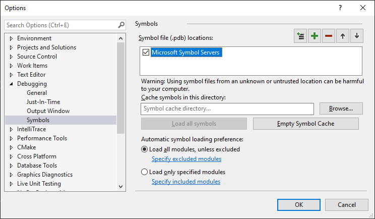

# Development PC hardware and operating system requirements for developing Xbox and Windows titles

Verify that your development PC meets the requirements for hardware and operating system.

## Hardware requirements  

### Hardware requirements for developing Xbox and Windows titles  

We recommend that your development computer be a fast modern computer capable of running Windows 10. The Microsoft Game Development Kit requires 30 GB of free space to install successfully.  

Development for Xbox titles has additional hardware requirements.

### Additional hardware requirements for developing Xbox titles

We recommend that your development computer be fast, modern, and equipped with an NVMe SSD drive. In addition to an NVMe SSD drive, we recommend purchasing a **heatsink for your NVMe SSD drive** to offset performance degradation due to overheating.

The time it takes to launch a game or deploy it to your console is affected by:

* The quality of the network hardware, such as routers, switches, NIC, and cabling.
* The network's latency, traffic, and hops.

For best results, use Category 6a cables, and put your development computer and development console on the same Ethernet switch.

With the Xbox Series X Dev Kit, the Debug NIC now supports 10GbE for [faster deployments (NDA topic)](../../tools-console/usinggsdk/deployment/deployment.md#Deploy-Speed). We recommend that you configure your hardware environment with the following:

* A development computer with a 10GbE Network Interface Adapter, NVMe SSD drive and NVMe heatsink.
* A network switch that is 10GbE-capable.
* Category 6a cables, with your development computer and development console(s) on the same switch that is on the same subnet.
* Network infrastructure that is 10GbE-capable.

Additionally, Microsoft Game Development Kit will support Thunderbolt 3 for improved deployment in an upcoming release. To get ready for this, we would recommend:
* A motherboard on your development computer that has support for Thunderbolt 3.

We recommend using monitors and/or TVs that support 4K/UHD and HDR to be able to take advantage of these platform features properly.

#### 10GbE validated hardware

As reference, we have validated our 10GbE-capable Debug NIC with the following hardware configuration:
* Netgear XS708T 8-port Switch
* AQuantia Aqtion AQN-107 PCIe to 10GBase-T Multi-Gig Pro Ethernet Adapter
* Intel Ethernet Converged Network Adapter X540-T1
* Samsung SSD 970 EVO NVMe M.2 1TB
* Category 6a Ethernet cables

## Software requirements

### Software requirements for developing Xbox titles

The following versions and editions of Windows 10 are required for building Microsoft Game Development Kit (GDK) titles for the Xbox family of consoles:  
  * Windows 10 64-bit (Version 1709 or higher): Home, Professional, and Enterprise  

 **NOTE:** Versions of the Microsoft Game Development Kit (GDK) prior to June 2020 supported Windows 7, 8 and 8.1 in addition to Windows 10.  That support has been removed. Microsoft Game Development Kit (GDK) setup will block if you try to install the Microsoft Game Development Kit (GDK) on an unsupported OS.  

The following Operating System versions and editions are supported for build servers:  

  * Windows Server 2016 (Version 1709 or higher): Standard and Datacenter  

### Software requirements for developing Windows titles

The Gaming Runtime Development Kit that you install on your development computer is supported by the following operating systems only:

- Windows 10 (May 2019 Update or later) client operating system (64-bit)  

Review the following list for additional restrictions and suggestions:
- The Gaming Runtime Development Kit cannot be installed on a 32-bit version of Windows. 
- Update your Windows development computer to the latest graphics drivers available and check for updates often to help ensure that your remote tools run optimally.

If your title is using MicrosoftGame.config to install framework dependencies, these need to be sideloaded onto machines configured to use the developer sandbox.  For more information, see [Framework package dependencies](../../packaging/packaging-framework-packages.md).

> [!NOTE]
> Only install the exact versions that are specified in MicrosoftGame.config. Installing versions you do not specify can mask errors during development or cause unexpected problems after publishing to retail.

### Microsoft Symbol Servers  

Turning on Microsoft Symbol Servers will provide you with Gaming Runtime symbols.  

To turn on Microsoft Symbol Servers in Visual Studio, navigate to `Debug -> Options -> Symbols` and check the `Microsoft Symbol Servers` checkbox.  

  

For more information, see [Microsoft public symbol server](/windows-hardware/drivers/debugger/microsoft-public-symbols).  

## Next steps

After you have verified your development PC meets the hardware and operating system requirements you should proceed to [SDK and tools requirements](sdk-and-tools.md).

## See also

[Getting started with the Microsoft Game Development Kit (GDK) (NDA topic)](../gc-getstarted-toc.md)
