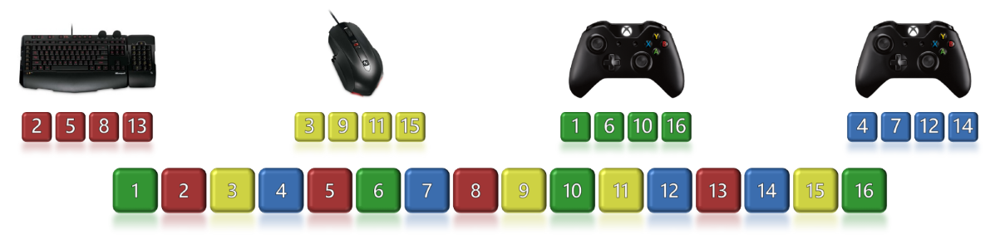
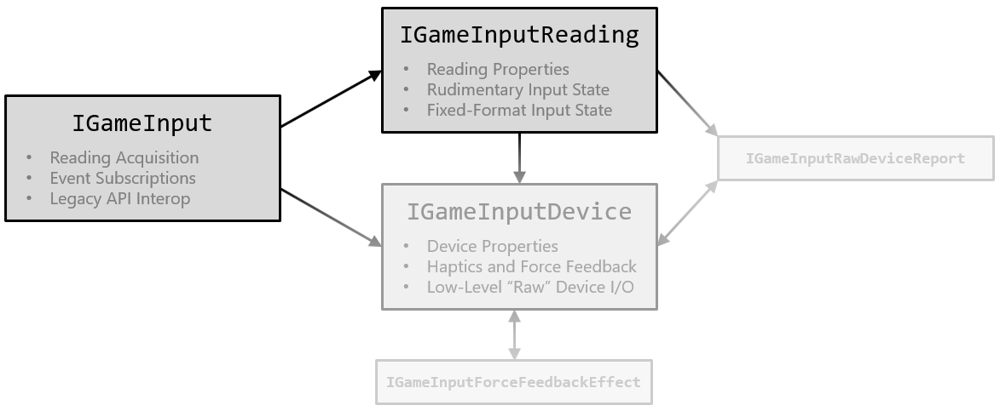

# GameInput fundamentals


<a id="introductionSection"></a>

Most legacy Microsoft input APIs are device-centric, meaning application code must first find the input devices it supports&mdash;typically via some kind of enumeration pattern&mdash;before any input can be read. For most games with relatively simple input needs, this adds a lot of extra code and complexity.

The GameInput API, on the other hand, is an input-centric API. Applications first find the input they're interested in, and then can optionally query for the device that generated the input. This leads to more natural algorithms, which in turn leads to simpler code.


<a id="inputStreamSection"></a>

## Input Stream Architecture

GameInput is built around the concept of an input stream: input from all devices connected to the system is directed into a single contiguous stream of input events, in the order that the input occurred. When multiple devices are generating input simultaneously, this results in a natural interleaving of the input events. Following is an example input stream from multiple input devices.



In this example, four devices are sending inputs simultaneously. The number of each square represents the order the input was sent in, and the color represents which device sent the input. So in this example, the first Xbox controller sends the first input, the keyboard sends the second input, the mouse sends the third input, and the second xbox controller sends the fourth input.

Each element in the input stream is represented by a "reading." Applications begin by getting the most current reading from the input stream. From there, the application can either continue to periodically get the most current reading, or it can walk forward and backward through the input stream, examining adjacent readings. In either case, the application typically compares the differences between readings of interest, and then takes the appropriate action.

For example, a first-person shooter game might only need to know whether a button is pressed at the start of each frame to determine whether the player's weapon should fire. In that case, only the most current reading matters (and any intermediate readings can be ignored). On the other hand, a competitive fighting game might want to examine every input state change that occurred between the last frame and the current one for any of the following reasons.

* Double-tapping a button might map to a different combo/move than a single tap.
* The order that two buttons were pressed in might matter.
* The elapsed time between two button presses might matter.

When retrieving readings from the input stream, applications can apply optional filters, which limit the results to readings from specific input types (such as gamepads or keyboards), and/or from a specific device. For more details, see [GameInput readings](input-readings.md).

Applications can only request historical readings from the input stream that occurred within the last half second. The most current reading from each connected device is always accessible, no matter how old it is.


<a id="interfacesSection"></a>

## Interfaces

The GameInput API is exposed through a collection of related interfaces, similar to the graphics and audio APIs as shown in the following diagram.



There are three primary interfaces that make up the bulk of the GameInput API surface.

* [```IGameInput```](../../reference/input/gameinput/interfaces/igameinput/igameinput.md) is the base interface obtained by calling the [```GameInputCreate```](../../reference/input/gameinput/functions/gameinputcreate.md) factory function. It contains methods for retrieving readings from the input stream, registering callbacks, and accessing other global functionality.

* [```IGameInputReading```](../../reference/input/gameinput/interfaces/igameinputreading/igameinputreading.md) represents a single element in the input stream. It contains methods for retrieving the input state data stored in the reading, and for accessing the device that generated the reading. Readings are also used as points of reference within the input stream, when walking forward and backward through the stream's other readings.

* [```IGameInputDevice```](../../reference/input/gameinput/interfaces/igameinputdevice/igameinputdevice.md) represents a single input device connected to the system. It contains methods for retrieving the device's properties and current state, and methods for controlling haptic and force feedback on the device. It also contains methods for performing low-level raw device I/O.

The remaining interfaces are used in specific contexts, which are discussed in the [Advanced GameInput topics](../advanced/input-advanced-topics.md) section.

> [!NOTE]
> Like the graphics and audio APIs, GameInput isn't a true COM API, even though it exposes interfaces that derive from IUnknown. This style of API is sometimes referred to as "COM lite" or "nano-COM." While IUnknown is used for reference counting and reflection, the COM runtime infrastructure isn't used by GameInput. Specifically, this means the following.
>
>* Applications call neither ```CoInitialize``` nor  ```CoCreateInstance``` to obtain object instances.
>* COM features such as aggregation and caller-provided interface implementations aren't supported.
>* There's no cross-process marshaling support, and no apartment/threading model. All objects are agile.
>* Interface pointers can be compared directly for object identity, without going through IUnknown.
>* Methods aren't required to return ```HRESULT``` codes, which often leads to simpler function signatures.


<a id="appFocusSection"></a>

## Application Focus

The GameInput API *respects* application focus, which means that an application only receives input when it has input focus. When the application isn't in focus, it can still call any GameInput API functions, but all devices report a neutral or "rest" state, as if the user isn't touching them at all.

Similarly, any haptic or force feedback being sent to a device is disabled when an application loses focus. It can still call GameInput APIs to set a new feedback state, but the new state won't be sent to the device. When the application has focus again, the most recent feedback state requested by the application is automatically sent to the device.

As a result, applications don't need to perform any special actions related to input or haptic/force feedback when they gain and lose focus. The GameInput API always does the right thing on their behalf.

> [!NOTE]
> The GameInput API does allow applications to temporarily acquire exclusive access to devices for certain kinds of low-level device I/O, even when they're in the background (for details, see the [```AcquireExclusiveRawDeviceAccess```](../../reference/input/gameinput/interfaces/igameinputdevice/methods/igameinputdevice_acquireexclusiverawdeviceaccess.md) method). However, this only applies to output. Input is never accessible unless the application is in focus.


<a id="seeAlsoSection"></a>

## See also

[GameInput readings](input-readings.md)

[GameInput devices](input-devices.md)


[Advanced GameInput topics](../advanced/input-advanced-topics.md)

[GameInput API reference](../../reference/input/gc-reference-input-toc.md)