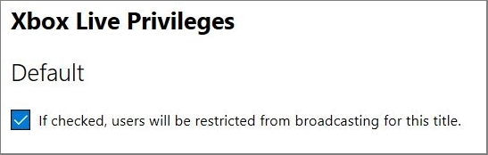
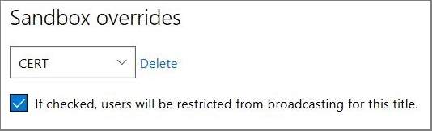

# Configuring broadcast privileges in Partner Center

Use this topic to configure user broadcast privileges for your title in Partner Center.  

The **Privileges configuration** page in Partner Center dictates whether users can stream gameplay from your title to streaming services.  

By default, your game doesn't restrict broadcasting to viewers on any streaming platform; changes to this page are only required if you want to restrict broadcasting.

## Restricting broadcasts for your title 

You can disable broadcasting across all services and sandboxes by selecting the option in the **Default** section as shown in the following screenshot. 

You can also restrict broadcasting by adding a sandbox in the **Sandbox overrides** section as shown in the following screenshot.

Use the following step to restrict broadcasting for a particular sandbox. 
 1. In the **Sandbox overrides** section, select **Add**. 
 1. Select the target sandbox from the drop-down list box. 
 1. Select the check box to restrict broadcasting for that title on the chosen sandbox.
    > [!NOTE]
    > Selecting this check box only restricts streaming on an Xbox console or the Xbox Game Bar on Windows PC. This configuration doesn't prevent the use of capture cards or other external capture or streaming services.

To remove restrictions on broadcasting, clear the selection in the **Sandbox overrides** section.

## Saving your settings  

After you've finished configuring streaming privileges for your title, select **Save**.