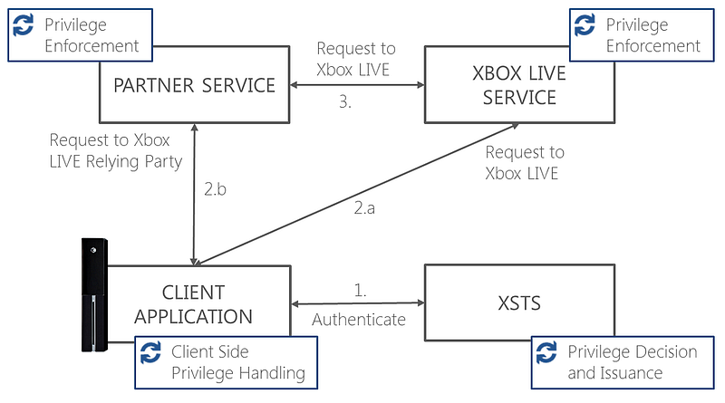

# Xbox Live user privileges overview

Use this topic to retrieve a user's Xbox Live privileges and learn how privileges can affect how a user interacts with your title.  
  
Privileges control which features of Xbox Live that a user can access at a particular time. 
A title must check some privileges before allowing a user to complete an action.  
  
Privileges are used by apps and single sign-on (SSO) services. 
A service and an app can use Xbox Live privileges to control access to service features and personalize user experiences on the client device.  
  
## Privileges are based on multiple factors

The effective privileges of an Xbox Live user are based on the following factors.  

 * The subscription entitlements of that user
 * The type of device that's used to access Xbox Live
 * The app that's currently running
 * The parental controls that are applied to that user's account 
 * The input (such as Xbox Live suspensions) from [online safety and enforcement moderators](https://enforcement.xbox.com/) of Xbox Live

Privilege-based access control is enforced at the time of access to any online service. 
Privileges are used to drive client apps to show the UI to the user. 
This UI explains the user's state and provides actions that the user can take to get the required privileges.  
  
For Xbox Live titles, every authenticated user's account has associated privileges. 
Some of these privileges are for system-controlled features, while others are associated with specific games or extension subscriptions.  
  
These privileges cover several common scenarios, from multiplayer to streaming video. 
Client apps and services use this information to make access control and personalization decisions.  
  
### Privileges are computed during authentication

The effective privileges of a user are computed and issued by Xbox Live when the user signs in and is authorized to Xbox Live. 
A user's privileges are carried in the token that's received at the time of authentication. 
Privileges are issued in a token claim.  
  
## Privilege information in Xbox Live 
  
A user must access Xbox Live for your client app to obtain that user's privilege information as shown in the following screenshot.  



### Flow of a user's privilege information  
  
 1. The Xbox Live client (on behalf of a title or app) requests a token from the Xbox Security Token Service (XSTS). 
 1. XSTS returns a token for the requested relying party. XSTS then computes the privileges for all users in the request 
 and issues them a token claim. Requests from the client app include the following automated actions. 
    * The app calls the Xbox Live service directly and includes the token in the authorization header of the request.
       * The Xbox Live service grants access to the requested feature (such as `XPRIVILEGE_MULTIPLAYER_SESSIONS`) that's based on the privileges in the token.
    * Alternatively, the app calls a relying party service that's configured for SSO. 
       * The service includes the token that's in the authorization header of the request. 
       If the partner SSO service provides an implementation of an Xbox Live feature (for example, downloadable user-created content such as `XPRIVILEGE_USER_CREATED_CONTENT`), the partner service uses the privileges that are in the token to grant access to the requested feature. 
       * To decrypt and de-serialize Xbox Live tokens, the partner service must be configured for SSO.
       * For more information about this configuration, see the white paper [Your Xbox One Title, XSTS Tokens, and Web Services](https://www.microsoft.com/software-download/devcenter).  
    > [!NOTE]
    > The client can use Xbox platform APIs to customize the user experience and 
    drive resolution (such as upselling, parental override) before issuing requests to Xbox Live services.  
 1. Partner services can make requests to the Xbox Live service on behalf of users by using a delegated authorization token.
    * If the request is for a feature that requires a specific privilege (such as `XPRIVILEGE_COMMUNICATIONS`), 
    the partner service must obtain a delegated authorization token for Xbox Live on behalf of the user and include it in the authorization header of the request.
    * The Xbox Live service grants access to the request feature that's based on the user's privileges.  
  
## Privileges in the user identity

Privileges are a [claim](/azure/active-directory/develop/security-tokens#json-web-tokens-and-claims) in the user identity, and that claim contains the collection of the current effective privileges of the user as shown in the following header claim.

```
prv (JSON Web Tokens)
```

If a privilege is in the collection, then the user is currently authorized to access the corresponding feature. 
If the privilege isn't in the collection, then the user isn't currently authorized.  

The effective privileges of a user are dynamic, and they depend on the following scenarios.  

 * Any expired subscription entitlements 
 * Apps that are currently running
 * All accounts signed in on the same client device
 * Status of the client device
 * Parental controls that are applied to that user's account 
 * The input (such as Xbox Live suspensions) from online safety and enforcement moderators

> [!NOTE]
> When a user is authorized for a feature at a particular time, this doesn't guarantee that the user is authorized to access the feature later. 
The privileges that are issued for the user are valid for the lifetime of the token that's issued when the user is authenticated. 
  
## Privileges and privacy settings  

Privileges determine if a user is authorized to access a feature of Xbox Live or a third-party service. 
This is a coarse check. For example, privileges determine whether a user can use any voice chat communications, not just whether two users can chat with each other.  
  
For the social features of Xbox Live, the privacy service is used by apps and services to determine with whom an action can be performed, based on the privacy settings of all users that are involved in the action.  

For example, it determines if the user can use voice chat with a target, based on the settings of the target (such as a Mute list or Avoid list). For more information about integrating with the privacy service, see [Privacy and permissions](../privacy/live-privacy-permissions-nav.md).  
  
## Privileges and content restrictions  

Privileges don't provide information about content rating. 
For more information about Xbox Requirements (XRs), see [XR-017: Title Ratings](https://www.microsoft.com/software-download/devcenter) for Console.  
  
## See also  
  
[Policies and Xbox Requirements](../../../../policies/GC-policies-nav.md)  
[Understanding Security Tokens for Xbox One (Xbox Developer Downloads > Xbox One > All Xbox One XDK CHMs)](https://www.microsoft.com/software-download/devcenter)  
[Your Xbox One Title, XSTS Tokens, and Web Services (Xbox Developer Downloads > Xbox One > All Xbox One XDK CHMs)](https://www.microsoft.com/software-download/devcenter)  
[Web Services Sample (Xbox Developer Downloads > Xbox One > All NDA Samples)](https://www.microsoft.com/software-download/devcenter)