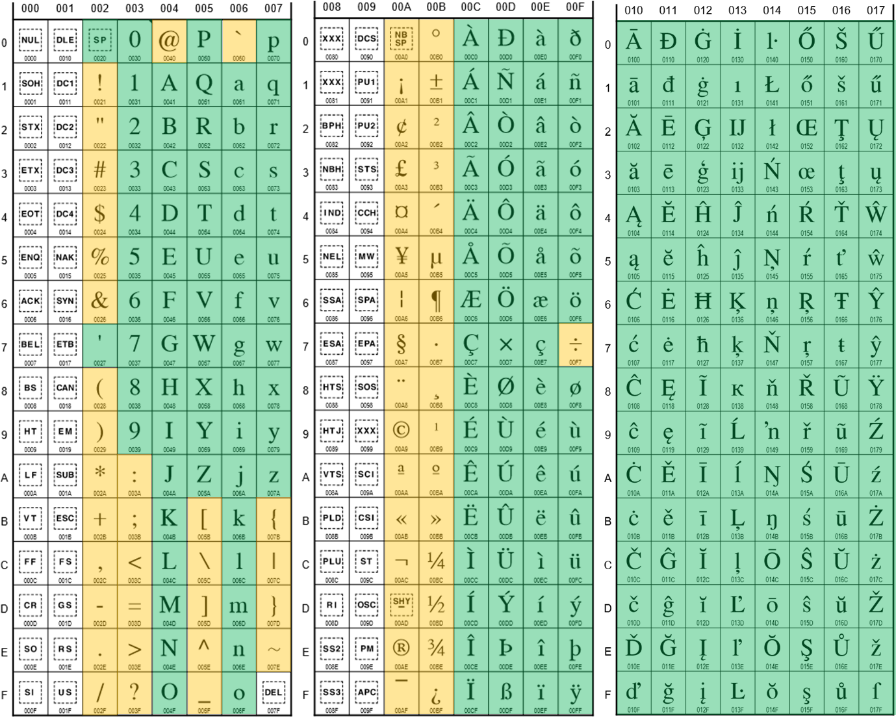

# UTF-8 character ranges for modern gamertags

This topic describes modern gamertags and the UTF-8 character ranges that are supported for them by Xbox Live. Modern gamertags support UTF-8 character encoding. However, the [entire Unicode character set](https://www.unicode.org/charts/) isn't supported. Instead, only specific ranges of UTF-8 characters are supported to include characters for supported language character sets.

## Reserved characters: basic Latin and Latin supplemental symbols

Reserved characters are allowed in modern gamertags, which means that clients and games must render them if they appear. However, players  can't create gamertags with these characters in them. Reserved characters can appear in gamertags if the system inserts them, which it can do under certain circumstances. The following table lists the supported basic Latin and Latin supplemental Unicode symbols.

| UTF-8 range  | Description | Characters |
| --- | --- | --- |
| 0021&ndash;0026 | Basic Latin symbols | "!"&ndash;"&" |
| 0028&ndash;002F | Basic Latin symbols | "("&ndash;"/" |
| 003A&ndash;0040 | Basic Latin symbols | ":"&ndash;"@" |
| 005B&ndash;0060 | Basic Latin symbols | "["&ndash;"`" |
| 007B&ndash;007E | Basic Latin symbols | "{"&ndash;"~" |
| 00A0&ndash;00BF | Latin supplemental symbols | NBSP&ndash;"¿" |

For more information about basic Latin and Latin supplemental symbols, see the [Basic Latin symbols](https://www.unicode.org/charts/PDF/U0000.pdf), and [Latin supplemental symbols](https://www.unicode.org/charts/PDF/U0080.pdf).

### Latin alphanumeric  and  space

The following table lists the supported Latin alphanumeric Unicode symbols.

| UTF-8 range | Description | Characters |
| --- | --- | --- |
| 0020 | Space |  |
| 0027 | Apostrophe | ' |
| 0030&ndash;0039 | Arabic numbers | "0"&ndash;"9" |
| 0041&ndash;005A | Capital letters | "A"&ndash;"Z" |
| 0061&ndash;007A | Lowercase  letters | "a"&ndash;"z" |

For a listing of Latin alphanumeric Unicode tables, see [Latin alphanumeric character codes](https://www.unicode.org/charts/PDF/U0000.pdf).

### Latin-1 Supplemental

The following table lists the supported Latin-1 Supplemental Unicode symbols.

| UTF-8 range | Description | Characters |
| --- | --- | --- |
| 00C0&ndash;00F6 | Latin Supplemental | "À"&ndash;"ö" |
| 00F8&ndash;00FF | Latin Supplemental | "ø"&ndash;"ÿ" |

For a listing of Latin-1 Supplemental Unicode tables, see [Latin-1 Supplemental character codes](https://www.unicode.org/charts/PDF/U0080.pdf).

### Latin Extended-A

The following table lists the supported Latin Extended-A Unicode symbols.

| UTF-8 range | Description | Characters |
| --- | --- | --- |
| 0100&ndash;017F | Latin Extended-A | "Ā"&ndash;"ſ" |

For a listing of Latin Extended-A Unicode tables, see [Latin Extended-A character codes](https://www.unicode.org/charts/PDF/U0100.pdf).

### Korean

The following table lists the supported Korean Unicode symbols.

| UTF-8 range | Description |
| --- | --- |
| 1100&ndash;1112 | Hangul Jamo (consonants) |
| 1161&ndash;1175 | Hangul Jamo (vowels) |
| 11A8&ndash;11C2 | Hangul Jamo (consonants with consonant clusters) |
| AC00&ndash;D7A3 | Hangul syllables |

For a listing of Hangul Jamo Unicode tables, see [Hangul Jamo character codes](https://www.unicode.org/charts/PDF/U1100.pdf). For a listing of Hangul syllables Unicode tables, see [Hangul Syllables](https://www.unicode.org/charts/PDF/UAC00.pdf).

### Japanese

The following table lists the supported Japanese Unicode symbols.

| UTF-8 range | Description |
| --- | --- |
| 3041&ndash;3096 | Hiragana |
| 30A1&ndash;30FA | Katakana |

For a listing of Hiragana Unicode tables, see [Hiragana character codes](https://www.unicode.org/charts/PDF/U3040.pdf). For a listing of Katakana Unicode tables, see [Katakana character codes](https://www.unicode.org/charts/PDF/U30A0.pdf).

### Chinese

The following table lists the supported Chinese Unicode symbols.

| UTF-8 range | Description |
| --- | --- |
| 4E00&ndash;9FFF | CJK Unified Ideographs |

For a listing of CJK Unified Ideograph Unicode tables, see [CJK Unified Ideograph character codes](https://www.unicode.org/charts/PDF/U4E00.pdf).

### Russian

The following table lists the supported Cyrillic Unicode symbols.

| UTF-8 range | Description |
| --- | --- |
| 0400&ndash;045F | Core Cyrillic alphabet |

For a listing of Cyrillic Unicode tables, see [Cyrillic character codes](https://www.unicode.org/charts/PDF/U0400.pdf).

### Bengali

The following table lists the supported Bengali Unicode symbols.

| UTF-8 range | Description |
| --- | --- |
| 0985&ndash;09B9 | Bengali |

For a listing of Bengali Unicode tables, see [Bengali character codes](https://www.unicode.org/charts/PDF/U0980.pdf).

### Thai

The following table lists the supported Thai Unicode symbols.

| UTF-8 range | Description |
| --- | --- |
| 0E01&ndash;0E3A | Thai |
| 0E40&ndash;0E4E | Thai |

For a listing of Thai Unicode tables, see [Thai character codes](https://www.unicode.org/charts/PDF/U0E00.pdf).

The following table lists the Thai characters and the Thai diacritics.

| UTF-8 range | Description |
| --- | --- |
| 0E01&ndash;0E30 | Thai characters |
| 0E32&ndash;0E33 | Thai characters |
| 0E40&ndash;0E46 | Thai characters |
| 0E31 | Thai diacritic |
| 0E34&ndash;0E3A | Thai diacritics |
| 0E47&ndash;0E4E | Thai diacritics |

### Greek

The following table lists the supported Greek Unicode symbols.

| UTF-8 range | Description |
| --- | --- |
| 0390&ndash;03CE | Greek |

For a listing of Greek Unicode tables, see [Greek character codes](https://www.unicode.org/charts/PDF/U0370.pdf).

### Hindi

The following table lists the supported Hindi Unicode symbols.

| UTF-8 range | Description |
| --- | --- |
| 0900&ndash;094F | Devanagari |
| 0966&ndash;096F | Devanagari numbers |
| 0671&ndash;06D3 | Urdu (Arabic) |
| 06F0&ndash;06F9 | Urdu numbers |

For a listing of Devanagari Unicode tables, see [Devanagari character codes](https://www.unicode.org/charts/PDF/U0900.pdf). For a listing of Urdu (Arabic) Unicode tables, see [Urdu character codes](https://www.unicode.org/charts/PDF/U0600.pdf).

The following table lists the Devanagari characters and diacritics.

| UTF-8 range | Description |
| --- | --- |
| 0904&ndash;0939 | Devanagari characters |
| 0900&ndash;0903 | Devanagari diacritics |
| 093A&ndash;094F | Devanagari diacritics |

### Arabic

The following table lists the supported Arabic Unicode symbols.

| UTF-8 range | Description |
| --- | --- |
| 0620&ndash;064A | Core Arabic alphabet |
| 0660&ndash;0669 | Arabic numbers |

For a listing of Arabic Unicode tables, see [Arabic character codes](https://www.unicode.org/charts/PDF/U0600.pdf).

### Hebrew

The following table lists the supported Hebrew Unicode symbols.

| UTF-8 range | Description |
| --- | --- |
| 05D0&ndash;05EA | Hebrew alphabet |

For a listing of Hebrew Unicode tables, see [Hebrew character codes](https://www.unicode.org/charts/PDF/U0590.pdf).

## Visual guide to Latin allowed vs. reserved characters

The following table shows which Unicode characters players can use in modern gamertags (permitted), which ones players can't use (restricted), and which ones players and the system can't use (not permitted).

| Background color | Meaning |
|---------|---------|
| Green | Permitted. Players can use this character in a gamertag. |
| Yellow | Restricted. Players can't use this character in a gamertag. |
| White | Not permitted: Players and the system can't use this character in a gamertag. |

## Appendix: Windows  international fonts

To see a list of the fonts available for Windows apps that are localized into languages other than U.S. English, see [International fonts](/windows/uwp/design/globalizing/loc-international-fonts).