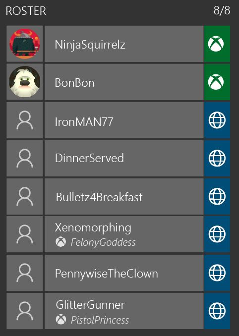
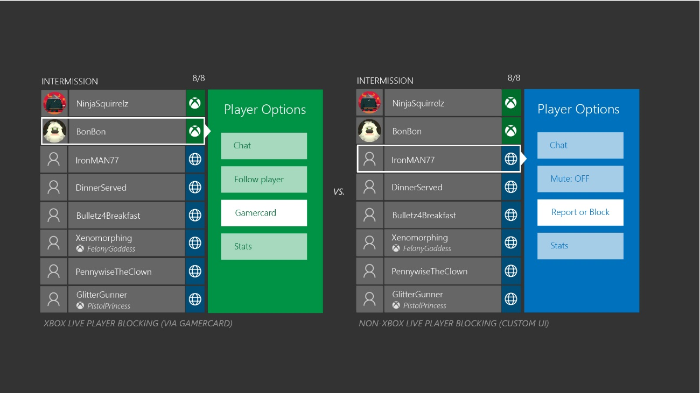
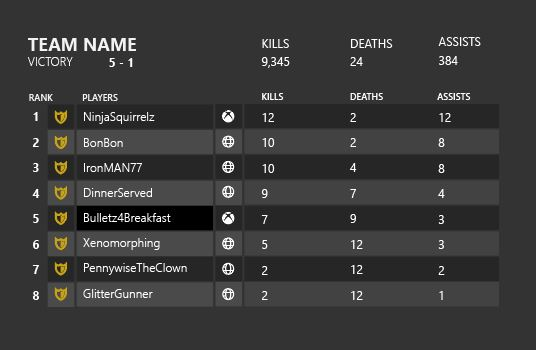

# Cross-network multiplayer implementation example: multiplayer game

This topic describes an example scenario that demonstrates cross-network functionality and flow in a traditional multiplayer online battle arena (MOBA) game. It presents one possible design and implementation path. This topic is in support of Console XR-007: Cross-Network Play, Data Usage, and Companion App Interactions. For more information about this XR, see [(Xbox Developer Downloads > Partner, Publishing, and Release Management Information > XGD Partner Documentation)](https://www.microsoft.com/software-download/devcenter).

In this example scenario, the title supports the following multiplayer functionality.

| Functionality | Description |
|------------------|-----------------|
| Custom matchmaking | The title implements a custom matchmaking service. This service first (optionally) matches players into teams, and then matches teams and players together. |
| Dedicated servers | All gameplay for the title is executed on dedicated servers. All traffic (including chat traffic) is also routed through these servers. |
| Custom leaderboards | Title services implement custom leaderboards that include deep information about player progress. |
| Multiple game modes and settings | The title supports multiple game modes such as co-op versus team-based. Players can configure the map, game size, rules, and other settings for these modes. |
| In-game currency | The title provides an in-game store with purchasable (premium) in-game currency. Players can use the currency to purchase power-ups for the team. Players can also purchase cosmetic items for their character. |
| DLC | Purchasable downloadable content (DLC) includes new maps and additional characters. |

## Title services

One of the custom title services in this example scenario is an authentication service. This authentication service is used for account linking of an Xbox Live (or other multiplayer network) account to a title-specific player account. When a player first connects to the authentication service, account linking is performed silently, and a new cross-network player identity is created.

For Xbox Live, the player's XUID is used as a unique player identifier that's linked to the title-specific account. XUID access must be approved prior to use and must be discussed with a developer account manager (DAM).The title-specific account has a globally unique identifier (GUID) that allows all title services to handle players, regardless of network origin and stored player metadata. In this example scenario, the multiplayer network and basic gameplay player stats are stored in this account.

> [!NOTE]
> Title services use multiplayer network information in the title-specific account to ensure that multiplayer functionality can be restricted only to Xbox Live players.

## Title flow

For a typical multiplayer game, a compliant flow for cross-network functionality starts when the player enters the multiplayer mode. In this example scenario, the title takes the following steps.

1. Validate privileges.

    Before starting a multiplayer session, a title validates the multiplayer privilege (254 and 189). If the privilege is denied, a title doesn't enter multiplayer mode. The title should also check the communications privilege (252) and end or disable voice and text chat accordingly.

2. Validate cross-network privilege.

    For this example scenario, the title integrates cross-network gameplay into the default matchmaking experience. When a player enters the matchmaking experience, the title validates the cross-network play privilege (185). If the privilege is denied, only matchmaking within Xbox Live is possible. The first time a player is placed into cross-network gameplay, the title presents a notification that cross-network gameplay is active.

3. Team matchmaking.

    The title matchmaking service forms a team from a cross-network players based on matchmaking rules.

4. Create and join team or lobby Multiplayer Session Directory (MPSD) session.

    The title matchmaking service creates a Multiplayer Session Directory (MPSD) lobby session through service-to-service calls to Xbox Live. All Xbox Live players join this lobby session. The service uses custom properties to additionally provide hints about the players in the session who aren't using Xbox Live. These hints can then be used by client logic for setting session state in the next step.

5. Set the team or lobby MPSD session.

    Xbox Live clients set the lobby session as the Activity Session. Session joinability and closed status must be set accordingly to cross-network player status. Xbox Live players remain in this session as long as they remain in the cross-network team. If the session is full (or if it becomes full later in the flow), the service or a lobby arbiter must set the session to closed. An Activity Session that has no more player slots must never be joinable.

6. Team lobby.

    In the team lobby, both Xbox Live players and players from other multiplayer platforms are present. Voice chat is enabled between Xbox Live players through a custom title service. Voice chat between all players (Xbox Live/Xbox Live and Xbox Live/not using Xbox Live) is enabled only after validating all the required privacy and permission checks. For friend relationships that don't use Xbox Live, the title uses network friend relationship data of friends who don't use Xbox Live. In the team lobby, Xbox Live players and players who don't use Xbox Live are uniquely identified by the title account identity. All player identifiers also show gamertags and equivalent player names for other multiplayer networks.

    The following screenshot shows an example of the UI of a player roster in the lobby.

    

    In the lobby UI, the team leader selects match properties (such as level or custom rules) for the next step to find a game session with another team, and then starts the match.

7. Game session matchmaking.

    The existing cross-network teams are submitted to matchmaking with additional match properties that are set by the team leader. These properties are used to identify the best match result in a new set of two teams for a match. At this point, the match service also identifies the dedicated server for both teams.

8. Create and join game MPSD session.

    The result of the anonymous game session matchmaking is an MPSD game session that's created by the match service (or a dedicated service) through service-to-service calls to Xbox Live. All Xbox Live players join this game session, and the service uses custom properties to additionally provide hints about the players in the session who aren't using Xbox Live. These hints can then be used by client logic for setting session state.

9. Connect to dedicated server.

    In the final step, all clients connect securely to the dedicated server and initiate cross-network gameplay. All traffic between multiplayer networks must be routed through the dedicated server. No peer-to-peer connections are permitted.

10. Completing gameplay.

    After the gameplay match is completed, teams can choose to perform the actions shown in the following table.

    | Action | Description |
    |----------|----------------|
    | Replay the match | Players remain connected to the server and remain in the MPSD game session. Players start a new gameplay match. |
    | Search for new opponents. | Players disconnect from the server and leave the MPSD game session. Players remain in the lobby session and return to the lobby screen for a next round of matchmaking. |

## Session management

To adhere to all Xbox Requirements, the title creates two MPSD sessions for Xbox Live players as shown in the following table.

| Session | Description |
|-----------|-----------------|
| Lobby session | This session is created by the matchmaking service through service-to-service calls to Xbox Live. Upon creation, the session contains reservations for all Xbox Live players in a team. It's the session that players can send invites for or join-in-progress. Invites and join-in-progress must use Xbox Live systems and can't be across networks. Therefore, all Xbox Live players set this session as their Activity Session. |
| Game session | This session is created by the matchmaking service through service-to-service calls to Xbox Live. It contains reservations for all Xbox Live players in a game session (across teams), and it's used to track the multiplayer activity of Xbox Live players.

Players who don't use Xbox Live aren't directly represented in the MPSD sessions as session members. The title tracks only their presence in a custom session property as shown in the following code example.

```
{{"name":"kumarplayer"},{"name":"spencerplayer"},{"name":"eliseplayer"}}
```

You can use this list and the Xbox Live session members to determine if the session is full. If it's full, the invite and join-in-progress functionality for Xbox Live must be disabled for correct behavior. A player (or the server) sets the `closed` property on the session to disable this functionality.

> [!NOTE]
> The MPSD session that's used to track players in gameplay must enable the `gameplay` capability to adhere to Xbox Requirements.

## Player communication blocking and reporting

Player blocking in the title is supported on the title level.

### Xbox Live player blocking

The title uses [XblPrivacyBatchCheckPermissionAsync](../../../../reference/live/xsapi-c/privacy_c/functions/xblprivacybatchcheckpermissionasync.md) to check privileges for multiplayer. The title also uses it for chatting with another Xbox Live player and also for the player classes of players who don't use Xbox Live/ friends who don't use Xbox Live. The title also provides access to the profile of another player through [XGameUiShowPlayerProfileCardAsync](../../../../reference/system/xgameui/functions/xgameuishowplayerprofilecardasync.md). Players can block other players in the player profile UI.

### Blocking of players who don't use Xbox Live

The title uses an in-title block list to support blocking of communication with players who don't use Xbox Live. This list is maintained on a title service and is checked for multiplayer permissions. Cross-network chat isn't available by default. A player who doesn't use Xbox Live can be blocked in the title through a custom title UI as shown in the following screenshot.



### Xbox Live player reporting

The title also allows reporting of players. For Xbox Live, players report other players through the player profile UI. Xbox Live enforcement handles player reports.

### Reporting of players who don't use Xbox Live

For players who don't use Xbox Live, the title provides a custom reporting UI flow. The title handles player reports accordingly for the title and is based on guidelines by other multiplayer networks.

## Microsoft Store

Purchases of in-game currency on Xbox Live and other multiplayer networks are tracked on a title service. The title provides a shared virtual currency wallet and in-game item inventory between all title versions. The restrictions in the following table apply to title versions that aren't Xbox Live.

| Restriction | Description |
|---------------|-----------------|
| Player skins | Players can purchase player skins only through in-game currency. In-game currency is managed in a unified in-game wallet that's available across all networks. All player skins are identical across all title versions. |
| Consumables | Players can purchase consumables only through in-game currency. Like currency, consumable items are managed in a unified in-game inventory. |
| Downloadable content | On Xbox Live platforms, downloadable content (new maps and character types) is managed through Microsoft Store. Entitlements from other stores aren't shared. All players need to have a valid entitlement in their respective store to play in the same map together. For a player who doesn't have the matching entitlement, a character type that wasn't purchased is visible but isn't playable. |

## Achievements

The title has multiple achievements that are based on multiplayer actions, including multiplayer games played. Achievement progress for this (and similar) achievements include cross-network multiplayer game sessions. The title doesn't have any achievements that are limited to cross-network gameplay. Achievement progress for Xbox One family (or later) title achievements is possible through gameplay on other title versions.

## Player progress

Player progress is shared between all title versions. The custom title account holds parts of the player progress.

## Game DVR and broadcasting

The title provides support for Game DVR and screenshots, as well as broadcasting in cross-network multiplayer matches.

## Leaderboards

The leaderboard for the title is implemented through a title service that provides extensive leaderboard functionality beyond Xbox Live leaderboards. The service creates multiple underlying leaderboards and updates them in parallel: one leaderboard for each multiplayer network and one merged leaderboard that combines results from all multiplayer networks. When cross-network multiplayer is enabled, the merged leaderboard is displayed as shown in the following screenshot.



> [!NOTE]
> All players are represented in the same way as in the multiplayer lobby.

The leaderboard for just Xbox Live displays when a player has disabled the cross-network gameplay functionality.

A title-specific account is used to internally identify all players on the leaderboard service. The external identifiers for Xbox Live players depend on the querying title instance.

* On Xbox Live title instances, the XUID is returned, and then the client performs a lookup to determine the gamertag string of the player.

* In title instances that aren't Xbox Live, the gamertag or `DisplayName` string of the player is returned. The service retrieves this string from a service-to-service call to Xbox Live and caches it for a maximum of four hours.