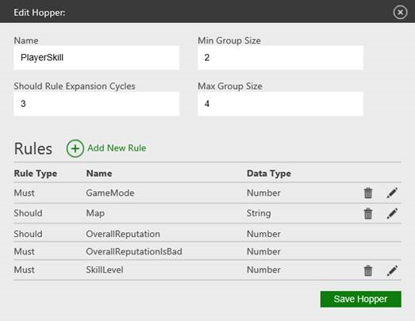

# Configuring matchmaking in Partner Center

This topic describes how to configure Partner Center to select compatible players.

[Configuration of SmartMatch matchmaking runtime operations](#SmartMatch-config)  
[Defining team rules during SmartMatch configuration](#SmartMatch-defining)  

## Configuration of SmartMatch matchmaking runtime operations

All SmartMatch matchmaking configuration occurs through [Partner Center](https://partner.microsoft.com/dashboard).  

### Matchmaking session template configuration

Matchmaking has two types of related sessions.  

* The *match ticket session*, which is the input to the matchmaking service
* The *match target session*, which is the output

When configuring session templates, you should create a template for each session type.

For a ticket session, you might use a dedicated template.
Alternatively, you can reuse a template for a lobby session or other session that's not intended to be used for gameplay.


> [!IMPORTANT]
> The ticket session must not have Quality of Service (QoS) checks enabled, and must not be marked with the "gameplay" capability. 

For a target session, you must use a template that's intended for matchmade gameplay.
It should have settings that enable QoS checks between peers prior to the start of gameplay, and must be marked with the "gameplay" capability.

With the configuration UI for Partner Center, you can map each session to one or more hoppers, each containing rules that determine how sessions are matched together in that hopper.
For more information, see Basic hopper configuration for matchmaking, as follows.

### Basic hopper configuration for matchmaking

This section defines the fields that are used to configure basic hopper fields.
After this configuration, you must configure the hopper rules, as described in the Configuration of hopper rules section later in this topic. The following screenshot shows the hopper editor. It's described in the following sections.

#### Name

The name of the hopper that's used when submitting a session to matchmaking.
This name must match the value passed as a parameter to the [XblMatchmakingCreateMatchTicketAsync](../../../../../reference/live/xsapi-c/matchmaking_c/functions/xblmatchmakingcreatematchticketasync.md) method during creation of the match ticket.

#### Min/Max Group Size

The minimum and maximum sizes for the player group that's to be created from sessions in the hopper.
The matchmaking service attempts to create a matched group that's as large as possible, up to the maximum group size.
However, it does create a matched group if it can assemble enough players to meet the minimum group size.

#### Should Rule Expansion Cycles

For a SHOULD rule, if no successful match is found, the matchmaking service attempts to increase the search space and relax the provided matchmaking rules over time.
This process is performed over multiple cycles, as specified by using the Should Rule Expansion Cycles field.

Upon the last expansion cycle, the SHOULD rules are dropped so that they no longer prevent tickets from matching.
However, they're still used to determine the best match if multiple tickets are available.
Only number and QoS types are expanded before they're dropped.

For more information, see the Configuration of hopper rules section later in this topic.

Increasing the value of the Should Rule Expansion Cycles setting provides more cycles for SHOULD rule expansion. However, this increase also increases matchmaking duration.
The default value is 3, which is generally sufficient for most configurations.

> [!IMPORTANT]
> Expansion cycles occur at fixed time intervals of five seconds. Upon the last expansion cycle, all SHOULD rules are no longer taken into account for the remainder of the matchmaking attempt.  

#### Ranked hopper

Ordinarily, SmartMatch prevents blocked players from being matched.
If Ranked Hopper is selected, this logic is bypassed to prevent players from using this system to avoid players of greater skill.

### Configuration of hopper rules

This section defines the fields that are used to configure rules for a hopper.

#### Common rule fields

The fields defined in this section are common to all hopper rules.

* **Rule Name:** The friendly name that's displayed for the rule for configuration purposes.

* **Rule Type:** The rule type. Options are MUST and SHOULD.
  * MUST rules have to be satisfied for successful matchmaking.
  * SHOULD rules can be relaxed or removed to find a successful match.

    For more details about this process, see the Should rule expansion cycles section earlier in this topic.

* **Data Type:** The data type of the attribute of the matchmaking rule.
Possible values are as follows.
  * **Number:** Specify a simple 32-bit numerical value.  
  * **String:** Specify a Unicode string of up to 128 characters.
  * **Collection:** Specify an array of strings. Use this value to identify downloadable content (DLC), squad membership, or role preference for players.
  * **Quality of Service:** Specify a custom data type for including latency QoS data in matchmaking. Only one such rule should be used per matchmaking hopper.
    > [!NOTE]
    > If this limit is problematic for your title, please contact your developer account manager (DAM).  
  * **Total Value:** Specify a custom data type that sums up submitted matchmaking values. You can use this value to ensure that the resulting sum is within a specific range or is an exact value.
  * **Team:** Specify a custom data type for the teams of players who are included in matchmaking requests. You can use this value to avoid splitting players within a single match ticket among multiple teams.

#### Data type&ndash;specific rule fields

This section defines the fields that are used to define rules that apply to some data types but not to others. The UI should be able to clarify which data types apply to particular rules.  

* **Allow Wildcards:** A value that indicates if the attribute can be omitted in the match ticket.
If it's omitted, the ticket becomes compatible with any other ticket, regardless of the value for this attribute.

* **Attribute Source:** The source of the data type value. Possible sources are as follows.
  * **Title provided:** The data value is submitted in the match ticket.  
  * **User stat instance:** The data value is automatically retrieved from the `UserStatistics` service.

* **Attribute Name:** The name of the attribute value source.
It's either the property name in the match ticket or the name of a user statistic.

* **Default Value:** The default value for the data type, if no value is specified or available for the matchmaking request.
The default value isn't applied when the Allow Wildcards field is selected and no value is specified.

* **Weight:** The importance of the rule.
The weight can be used to indicate which rules are prioritized during matchmaking and rule expansion.
The weight value must be a positive number and defaults to 1.

* **Flatten Method:** Number data types only.
A value that indicates how multiple values are combined to satisfy a match.
It applies to multiple values for different players in a single match ticket and across multiple tickets. The possible values are as follows.
  * **Min/Max:** Use the minimum or maximum value of multiple values from different match tickets.
  * **Average:** Use the average value of multiple values from different match tickets.

* **Max Diff:** Number data types only.
The maximum acceptable numerical difference between two compared values to satisfy a rule. For a SHOULD rule, this value is the starting point for rule expansion.

* **Set Operation:** Collection data types only.
The operation to perform on matching the group of set values. The possible options are as follows.  

  * **Intersection:** Match two collections based on the amount of intersection between them. This setting results in similar or identical collection values.

  * **Difference:** Match two collections based on the amount of difference between them.

  * **Role Preference:** Match collections based on the preferences for the role of a player in role-based game modes.

* **Target Intersection:** Part of Set Operation configuration.
The minimal intersection or maximum difference for two collections before they're matched.

* **Network Topology:** Quality of Service data type only.
The network topology that's used for QoS.
Possible values are Peer to Peer, Peer to Host, and Client/Server.

* **Maximum Latency/Scaling Maximum:** Quality of Service data type only.
The maximum latency for successful matchmaking within the specified network topology.

  This value is treated as a scaling value (as opposed to a required latency) when using a Client/Server Quality of Service SHOULD rule. 

  > [!NOTE]
  > In addition, default reputation rules are also applied to a hopper. These rules can't be removed and are used to ensure correct handling of reputation during matchmaking.  

* **Allow Waiting for Roles:** Collection Role Preferences data type only.
Specifies if the match service holds the matchmaking ticket to fill all of the available roles.

#### Expansion delta

The value that indicates how much to relax the submitted rule for each expansion generation.
The expansion delta is applied in addition to the Max Diff value.
For details, see Example 1 (rule expansion) later in this topic.

You can also use the expansion delta to expand multiple number values at different speeds.
This isn't possible through the expansion cycle configuration setting because it applies to all rules.
Instead, the approach is to use decimal expansion values; for example, 0.4.

An expansion only occurs when a new integer is reached, which allows for different expansion speeds, even for the same number of expansion cycles.

#### QoS expansion (peer-to-peer, peer-to-host)

For QoS type expansion for peer games, the expansion delta can't be configured.
Instead, you should use one of the following expansion strategies.

1. MaxLatency less than 256  

   Expansion is performed at MaxLatency &#215; Expansion Cycle.
  
   For example, if the initial value is 200, 200 is used in the first cycle and 400 in the second cycle.

1. MaxLatency greater than or equal to 256

   Expansion linearly scales from 50 to MaxLatency &ndash; 256.  
  
   For example, if the initial value is 556, the value scales linearly from 50 to 300 over the number of cycles.
That is, if six cycles were chosen, the values would be 50, 100, 150, 200, 250, and 300.
If five cycles were chosen, the values would be 50, 112.5, 175, 237.5, and 300.

#### QoS expansion (client/server)

When using dedicated servers, the expansion is based on relative preference.
Only most-preferred servers are considered in early expansion cycles.
Over time, other, less-preferred servers are used.

To ensure appropriate expansion, we require a value similar to MaxLatency, called *Scaling Maximum*. It should still be set to the largest acceptable ping time. However, this value gives a relative scale for the different server ping times that are provided by a player, as opposed to providing an absolute requirement for ping times.

You can exclude servers with unacceptable ping times by removing them from the list in the request.

 [Return to the top of this topic.](#top)

#### Example 1 (rule expansion)

Player level is used for matchmaking, and players are matched loosely, based on the closeness of their levels.
Players with the least amount of difference between their levels are preferred.

-   Player Level Rule
-   Rule Type: SHOULD
-   Data Type: Number
-   Max Diff: 1
-   Expansion Delta: 2
-   Flatten Method: Average

By default, the required difference between player levels is 1 or less.
- If a match is found within this difference, players are matched.  
- If no initial match is found, the player level value is expanded by 2 for each iteration (by default, there are three iterations).

This scenario results in a matchmaking behavior for a player at level 20 as shown in the following table.

| Step                    | Level value for potential match candidates | Effective level distance for successful match |
|-----|
| Initial submitted value | 19-21                                      | 1                                             |
| Expansion cycle 1       | 17-23                                      | 3                                             |
| Expansion cycle 2       | 15-25                                      | 5                                             |
| Expansion cycle 3       | 13-27                                      | 7                                             |

As the expansion cycles continue, the effective level distance for a successful match increases without altering the Max Diff value.
Only the player level value is relaxed.

#### Example 2 (collection rule)

The game releases three types of DLC that are available for players.
This matchmaking rule is applied to "DLC only" gameplay matchmaking, and a player should own at least one DLC to be matchmade with other players.

-   Player DLC Rule
-   Rule Type: MUST
-   Data Type: Collection
-   Set Operation: Intersection
-   Target Intersection: 1

Players evaluate their DLCs and submit the values that are shown in the following table in their match tickets.

> [!NOTE]
> In the following table, the collection value indicates the ownership of the DLC. If the DLC is available for the player, the value is set to 1. If not, it's set to 0. |

| Player   | Collection value | Matched with players | Notes           |
|----------|------------------|----------------------|----------------|
| Player 1 | { "1", "1", "1"} | 3                    | Owns all DLCs  |
| Player 2 | { "0", "0", "0"} | None                 | Owns no DLC    |
| Player 3 | { "1", "0", "0"} | 1                    | Owns first DLC |

If the target intersection in this example is set to 2, players 1 and 3 won't be matched because the intersection between them is only 1.

#### Example 3 (avoid previous players)

The title prefers avoiding a game with the player most recently played.
* Rule Type: MUST
* Data Type: Collection
* Set Operation: Difference
* Target Intersection: 0

 [Return to the top of this topic.](#top)

## Defining team rules during SmartMatch configuration  

### Configuring Team Rules

To set up the Team Rule, begin by creating one in Partner Center.
Fill out the team sizes that your game expects to create from the tickets matched in this hopper.

For instance, if your game expects four versus four, you should create two entries, expecting a maximum size of four each, and a different name.

There's also a minimum team size. Use it if a game can be played with fewer players on a team.
Otherwise, the minimum and maximum should be the same value.

### Using Team Rules

After the Team Rule is configured, tickets within the hopper are prevented from matching if there's no way to fit their groups into teams without causing a split.
The rule writes the resulting team allocation to the target session, under *members/constants/custom/matchmakingresult/initialTeam*.
> [!NOTE]
> This is simply a suggested allocation. The title might find that by rearranging the players, it might create a better game while still preventing tickets from splitting into different teams.

If a ticket is created for a game that's in progress, the Team Rule will require additional information.
Suppose, for instance, that eight players are in a four versus four game when two players drop or are disconnected.
The title would like to fill in those empty spots, but it can't reshuffle the teams while the game is being played.

Attempts to fill games in progress are represented by tickets with the `PreserveSession` field set to `always`.
In such cases, because teams have already been allocated to players, the title must specify the current team allocation, so that Match knows how many spaces are open on each team.

To supply the names of the teams each player is on, each player writes their team name into the game session, under *members/me/properties/system/groups*.
This field is a `JArray`.

After the previously mentioned properties are written to the game session, one player creates a ticket for the session in an attempt to find more players.
When the ticket is fulfilled, Match will again write the suggested team of any players who join into *members/constants/custom/matchmakingresult/initialTeam*.

#### Preferring even teams

Additionally, matches are made with the largest teams first.
This means that in a hypothetical four versus four hopper, tickets of four players will be matched together first, until no tickets of four remain.
Tickets of three then continue, pulling singletons as needed, and so forth.

In this manner, tickets of similar size will generally play against each other, if they are present and not prevented by other rules.

> [!NOTE]
> This gives the Team Rule fairly strong precedence over other rules.
For example, suppose you have a limited population, consisting of one ticket of size 4 with high skill (A), one ticket of size 4 with low skill (B), and four tickets of size 1 with high skill (C-F).
The Team Rule will cause Match to prefer A and B matching, as opposed to A, C, D, E, and F.

#### SHOULD variant

The MUST rule prevents ticket splitting in all generations and provides the prefer-even-teams sorting.
The SHOULD rule is identical until the last generation&mdash;when there, tickets can be split, although the prefer-even-teams sorting is still active.

 [Return to the top of this topic.](#top)

## See also

[Multiplayer session templates](../../mpsd/concepts/live-session-templates.md)  

[Multiplayer Session Directory overview](../../mpsd/live-mpsd-overview.md)  