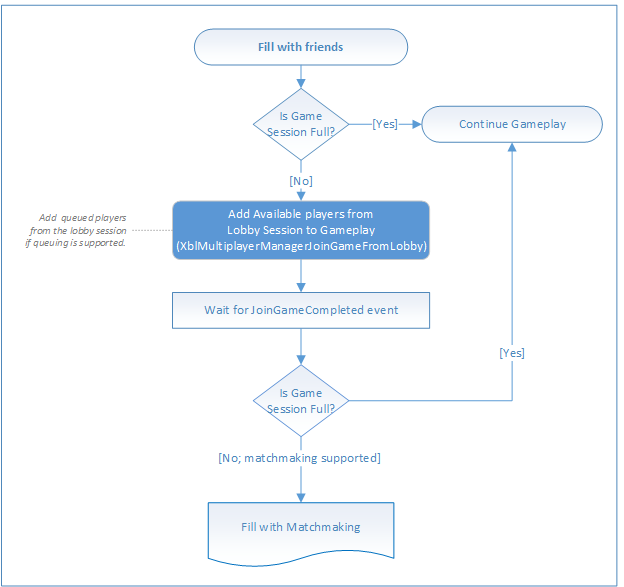
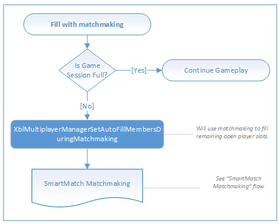

# Filling open slots in a multiplayer game (flowchart)

The following flowcharts show filling open slots in a multiplayer game with friends or by using matchmaking.

## Fill open slots with friends

## Fill open slots by using matchmaking

