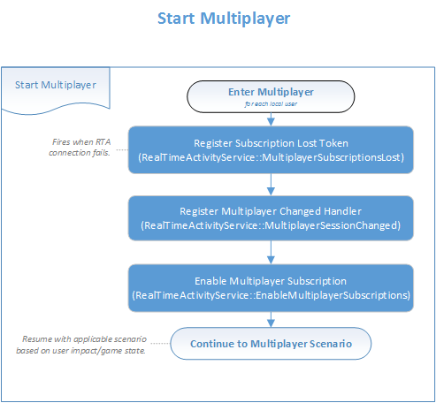
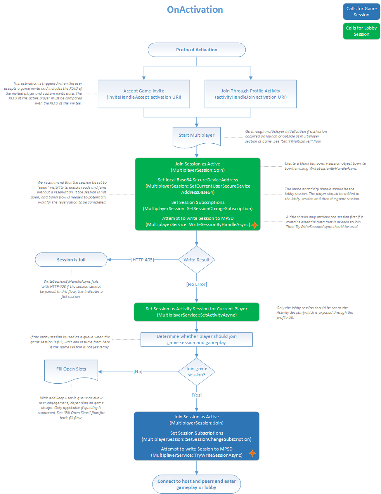
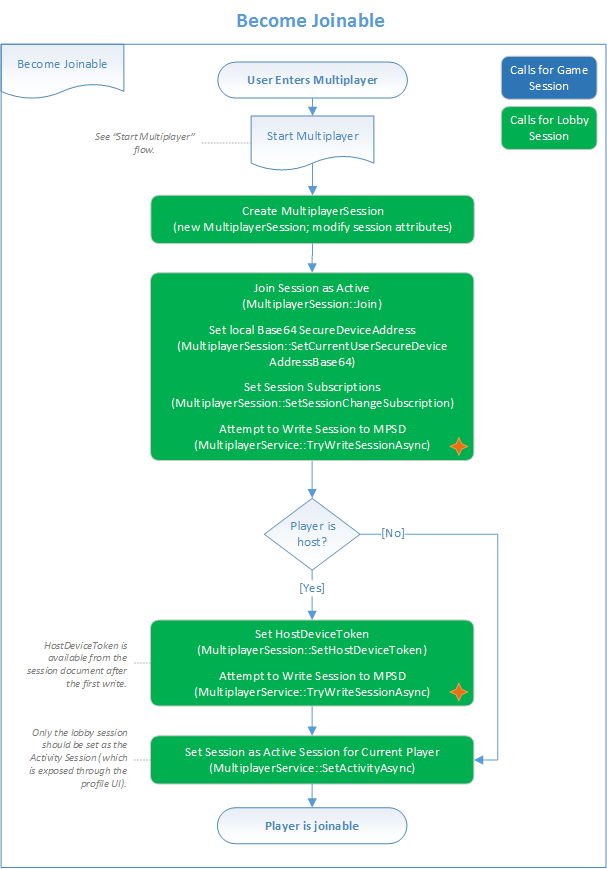
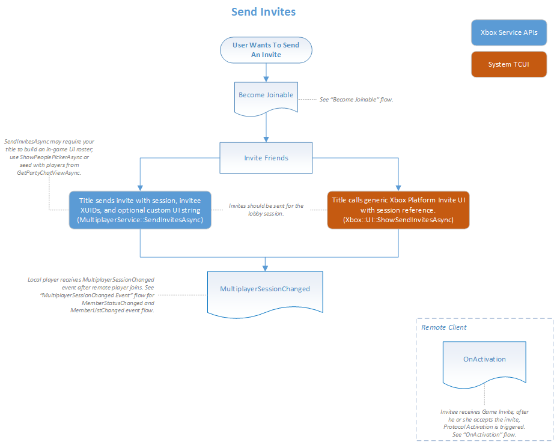
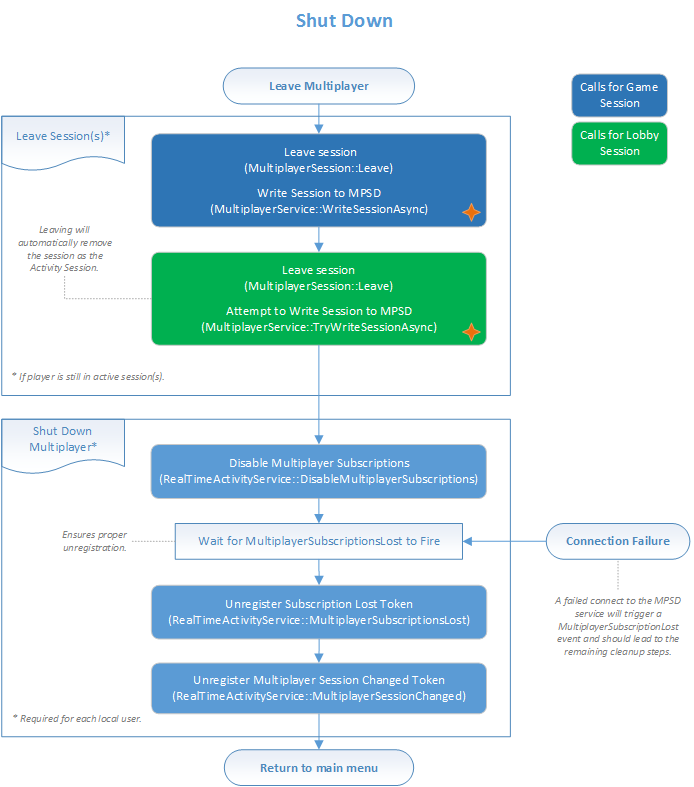
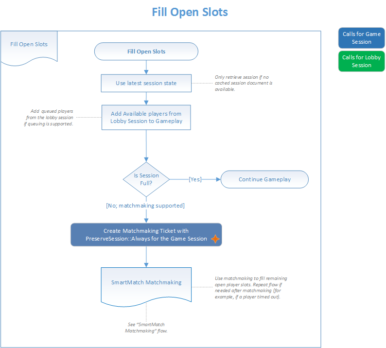

<a id="top"></a>

# Multiplayer tasks

This topic describes how to implement specific tasks that are related to using 2015 Multiplayer.


This topic covers the following:

* [Subscribe for Multiplayer Session Directory (MPSD) session change notifications](#sfmscn)
* [Create an MPSD session](#cams)
* [Set an arbiter for an MPSD session](#set-an-arbiter-for-an-mpsd-session)
* [Manage title activation](#mta)
* [Make the user joinable](#mtuj)
* [Send game invites](#sgi)
* [Join a game session from a lobby session](#jagsfals)
* [Join an MPSD session from a title activation](#jamsfata)
* [Set the user's current activity](#stuca)
* [Update an MPSD session](#update-an-mpsd-session)
* [Leave an MPSD session](#lams)
* [Fill open session slots during matchmaking](#fossdm)
* [Create a match ticket](#camt)
* [Get match ticket status](#gmts)


<a id="sfmscn"></a>

## Subscribe for Multiplayer Session Directory (MPSD) session change notifications

> [!NOTE]
> Subscribing for changes to a session requires the associated player to be active in the session. The `connectionRequiredForActiveMembers` field must also be set to `true` in the `/constants/system/capabilities` object for the session. This field is usually set in the session template. For more information, see [Multiplayer session templates](../concepts/live-session-templates.md) and [Multiplayer Session Directory overview](../live-mpsd-overview.md).

To receive MPSD session change notifications, the title can use the following procedure.

1.  Use the same `XblContextHandle` object for all calls by the same user. Subscriptions are tied to the lifetime of this object. If there are multiple local users, use a separate `XblContextHandle` object for each user.

2.  Implement event handlers for [XblMultiplayerAddSessionChangedHandler](../../../../../reference/live/xsapi-c/multiplayer_c/functions/xblmultiplayeraddsessionchangedhandler.md) and [XblMultiplayerSessionSubscriptionLostHandler](../../../../../reference/live/xsapi-c/multiplayer_c/functions/xblmultiplayersessionsubscriptionlosthandler.md).

3.  If subscribing to changes for more than one user, add code to your `XblMultiplayerAddSessionChangedHandler` event handler to avoid unnecessary work. Use the [XblMultiplayerSessionChangeEventArgs](../../../../../reference/live/xsapi-c/multiplayer_c/structs/xblmultiplayersessionchangeeventargs.md)`::Branch` property and the [XblMultiplayerSessionChangeEventArgs](../../../../../reference/live/xsapi-c/multiplayer_c/structs/xblmultiplayersessionchangeeventargs.md)`::ChangeNumber` property. Using these properties allows you to track the last change seen and ignore older changes.

4.  Call [XblMultiplayerSetSubscriptionsEnabled](../../../../../reference/live/xsapi-c/multiplayer_c/functions/xblmultiplayersetsubscriptionsenabled.md) to allow subscriptions.

5.  Create a local session object, and then join that session as active.

6.  Make calls for each user to `XblMultiplayerAddSessionChangedHandler`, passing the session change type for which to be notified.

7.  Write the session to MPSD as described in the [Update an MPSD session](#update-an-mpsd-session) section in this topic.


The following flow chart shows how to start multiplayer by subscribing to the events that are described in the previous procedure.




### Parsing duplicate session change notifications

When there are multiple users subscribed to notifications for the same session, every change to that session triggers a shoulder tap for each user.
All but one of these shoulder taps are duplicates.

Although we still recommend that a title subscribe every user in a session to notifications, a title should ignore any changes that it has already been notified of. You can do this by using the `Branch` and `ChangeNumber` properties.

To detect multiple shoulder taps, a title should do the following:

-   Store the latest `ChangeNumber` property value for each `Branch` property value evaluated.

-   If a shoulder tap has a higher `ChangeNumber` property value than the latest stored value for that `Branch` property value, process the shoulder tap, and then update the latest `ChangeNumber` property value.

-   If a shoulder tap doesn't have a higher `ChangeNumber` property value for that `Branch` property value, skip processing the shoulder tap. That session change has already been handled.

> [!NOTE]
> `ChangeNumber` property values need to be tracked by the `Branch` property values, not by session. The `Branch` property value can change, resetting the `ChangeNumber` property value, within the lifetime of a session.

 [Return to the top of this topic.](#top)

<a id="cams"></a>

## Create an MPSD session

> [!NOTE]
> By default, an MPSD session is created when the first member joins it. If your title logic expects the title to exist or not exist at join time, it can pass an appropriate write mode value to the write method during the session update.

The title must do the following to create a new session.

1.  Create a new `XblContextHandle` object. Your title creates this object once, stores it, and reuses it as required throughout the source code. It's necessary to use exactly the same context, especially when working with session subscriptions.

2.  Create a new `XblMultiplayerSessionHandle` with [XblMultiplayerSessionCreateHandle](../../../../../reference/live/xsapi-c/multiplayer_c/functions/xblmultiplayersessioncreatehandle.md) to prepare all the session data that MPSD needs to create a new session.

3.  Make required changes before writing the session to MPSD. For example, when joining a member to the session with a call to [XblMultiplayerSessionJoin](../../../../../reference/live/xsapi-c/multiplayer_c/functions/xblmultiplayersessionjoin.md), the client adds hidden local request data that tells MPSD to join upon the call to update the session.

4.  When you're finished making local changes, write them to MPSD as described in the [Update an MPSD session](#update-an-mpsd-session) section in this topic.

5.  Receive the new `XblMultiplayerSessionHandle` object from MPSD, with many fields filled in.

6.  Use the new session object going forward. Discard the old copy, which contains a hidden request to create a new session.


### Example

**Flat C API**

```cpp
auto asyncBlock = std::make_unique<XAsyncBlock>();
asyncBlock->queue = queue;
asyncBlock->context = nullptr;
asyncBlock->callback = [](XAsyncBlock* asyncBlock)
{
    std::unique_ptr<XAsyncBlock> asyncBlockPtr{ asyncBlock }; // Take over ownership of the XAsyncBlock*.

    XblMultiplayerSessionHandle sessionHandle;
    HRESULT hr = XblMultiplayerWriteSessionResult(asyncBlock, &sessionHandle);
    if (SUCCEEDED(hr))
    {
        // Process multiplayer session handle.
    }
    else
    {
        // Handle failure.
    }
};

XblMultiplayerSessionReference ref;
pal::strcpy(ref.Scid, sizeof(ref.Scid), SCID);
pal::strcpy(ref.SessionTemplateName, sizeof(ref.SessionTemplateName), SESSION_TEMPLATE_NAME);
pal::strcpy(ref.SessionName, sizeof(ref.SessionName), SESSION_NAME);

XblMultiplayerSessionInitArgs args = {};

XblMultiplayerSessionHandle sessionHandle = XblMultiplayerSessionCreateHandle(XUID, &ref, &args);

auto hr = XblMultiplayerSessionJoin(
    sessionHandle,
    memberCustomConstantsJson.c_str(),
    initializeRequested,
    joinWithActiveStatus);
    
 hr = XblMultiplayerWriteSessionAsync(xblContextHandle, sessionHandle, XblMultiplayerSessionWriteMode::CreateNew, asyncBlock.get());
if (SUCCEEDED(hr))
{
    // The call succeeded, so release the std::unique_ptr ownership of XAsyncBlock* because the callback will take over ownership.
    // If the call fails, std::unique_ptr will keep ownership and delete XAsyncBlock*.
    asyncBlock.release();
}
```

For more information, see the following:

* [XAsyncBlock](../../../../../reference/system/xasync/structs/xasyncblock.md)
* [XblMultiplayerSessionCreateHandle](../../../../../reference/live/xsapi-c/multiplayer_c/functions/xblmultiplayersessioncreatehandle.md)

* [XblMultiplayerSessionInitArgs](../../../../../reference/live/xsapi-c/multiplayer_c/structs/xblmultiplayersessioninitargs.md)
* [XblMultiplayerSessionReference](../../../../../reference/live/xsapi-c/multiplayer_c/structs/xblmultiplayersessionreference.md)
* [XblMultiplayerSessionWriteMode](../../../../../reference/live/xsapi-c/multiplayer_c/enums/xblmultiplayersessionwritemode.md)
* [XblMultiplayerWriteSessionAsync](../../../../../reference/live/xsapi-c/multiplayer_c/functions/xblmultiplayerwritesessionasync.md)
* [XblMultiplayerWriteSessionResult](../../../../../reference/live/xsapi-c/multiplayer_c/functions/xblmultiplayerwritesessionresult.md)


 [Return to the top of this topic.](#top)

<a id="set-an-arbiter-for-an-mpsd-session"></a>

## Set an arbiter for an MPSD session

The title uses the following procedure to set an arbiter for a session that has already been created.

> [!NOTE]
> Device tokens for the members (potential hosts) aren't available until the members have joined the session and included their secure device addresses.

1.  Retrieve the device tokens for host candidates from MPSD by calling [XblMultiplayerSessionMembers](../../../../../reference/live/xsapi-c/multiplayer_c/functions/xblmultiplayersessionmembers.md).

    > [!NOTE]
    > If the session was created by SmartMatch matchmaking, your clients can use the host candidates that are available from MPSD by calling [XblMultiplayerSessionHostCandidates](../../../../../reference/live/xsapi-c/multiplayer_c/functions/xblmultiplayersessionhostcandidates.md).

2.  Select the required host from the list of host candidates.

3.  Call [XblMultiplayerSessionSetHostDeviceToken](../../../../../reference/live/xsapi-c/multiplayer_c/functions/xblmultiplayersessionsethostdevicetoken.md) to set the device token in the local cache of MPSD. If the call to set the host device token succeeds, the local device token replaces the host's token.

4.  If an HTTP/412 status code is received when trying to set the host device token, query the session data. See if the host device token is for the local console. If it isn't for the local console, another console has been designated as the arbiter.

    > [!NOTE]
    > Your client should handle the HTTP/412 status code separately from other HTTP codes because HTTP/412 doesn't indicate a standard failure. For more information about this status code, see [Multiplayer session status codes](live-mpsd-status-codes.md).

5.  Update the session in MPSD as described in the [Update an MPSD session](#update-an-mpsd-session) section in this topic.

    > [!NOTE]
    > If you have no better algorithm, the client can implement a greedy algorithm in which each host candidate attempts to set itself as the host if no one else has done it yet. For more information, see the [Session arbiter](../concepts/live-mpsd-details.md#session-arbiter) section in the Multiplayer Session advanced topics topic.

 [Return to the top of this topic.](#top)

<a id="mta"></a>

## Manage title activation

Xbox One (or later) fires the `CoreApplicationView.Activated` event during protocol activation.
In the context of the multiplayer API, this event is fired when a user accepts an invite or joins another user.
These actions trigger an activation that the title must react to by bringing the joining user into gameplay with the target user.

> [!NOTE]
> Your title should expect new activation arguments at any time and should never be coded against length.

The title must perform the following main steps to handle title activation.

1.  Set up an event handler for the `CoreApplicationView.Activated` event. This handler triggers every time protocol activation occurs, even if the title is already running.

2.  At title activation, begin a session and subscribe for session change notifications. For more information, see [Subscribe for MPSD session change notifications](#sfmscn) in this topic.

3.  Join the user to the session as active. For more information, see [Join an MPSD session from a title activation](#jamsfata) in this topic.

4.  Set the lobby session as the activity session that's exposed through the profile UI. For more information, see [Set the user's current activity](#stuca) in this topic.

5.  Join the user to the game session as active. The user can now connect to peers and enter gameplay or the lobby.

The following flow chart shows how to handle title activation.



 [Return to the top of this topic.](#top)

<a id="mtuj"></a>

## Make the user joinable

To make the user joinable, the title must do the following:

1.  Create a session object, and then modify the attributes as required.

2.  Join the user to the session as active. For more information, see [Join an MPSD session from a title activation](#jamsfata) in this topic.

3.  Determine if the user has been designated as the session arbiter.

4.  If the user isn't the arbiter, go to step 7.

5.  If the user is the arbiter, call [XblMultiplayerSessionSetHostDeviceToken](../../../../../reference/live/xsapi-c/multiplayer_c/functions/xblmultiplayersessionsethostdevicetoken.md).

6.  Attempt to write the session by using a call to [XblMultiplayerWriteSessionAsync](../../../../../reference/live/xsapi-c/multiplayer_c/functions/xblmultiplayerwritesessionasync.md).

7.  Set the session as the active session. For more information, see [Set the user's current activity](#stuca) in this topic.

The following flow chart shows the steps for allowing a user to be joined by other players during a game.



 [Return to the top of this topic.](#top)

<a id="sgi"></a>

## Send game invites

The title can enable a player to send game invites in the following ways.

-   Send the invites for the lobby session.
-   Send the invites by using the generic Xbox platform invite UI with the game session reference.

To send game invites for a player, the title must do the following:

1.  Make the inviting game player-joinable. For more information, see [Make the user joinable](#mtuj) in this topic.

2.  Determine if the invites are to be sent via the lobby session or by using the invite UI.

3.  If the lobby session is being used, send the invites by using a call to [XblMultiplayerSendInvitesAsync](../../../../../reference/live/xsapi-c/multiplayer_c/functions/xblmultiplayersendinvitesasync.md). This method might require building an in-game UI roster by calling [XGameUiShowPlayerPickerAsync](../../../../../reference/system/xgameui/functions/xgameuishowplayerpickerasync.md).

4.  If the invite UI is being used, call [XGameUiShowSendGameInviteAsync](../../../../../reference/system/xgameui/functions/xgameuishowsendgameinviteasync.md) to show the invite UI.

5.  Handle the [XblMultiplayerAddSessionChangedHandler](../../../../../reference/live/xsapi-c/multiplayer_c/functions/xblmultiplayeraddsessionchangedhandler.md) for the local player after the remote player joins.

6.  For the remote player, implement a title activation code. For more information, see [Manage title activation](#mta) in this topic.

The following flow chart shows how to send invites.



 [Return to the top of this topic.](#top)

<a id="jagsfals"></a>

## Join a game session from a lobby session

Gameplay sessions on Windows 10 devices must have the `userAuthorizationStyle` capability set to `true` if they aren't large sessions. As a result, the `joinRestriction` property can't be `none`, which means that the session can't be publicly joinable directly.

A common scenario is to create a lobby session to gather players, and then move those players into a gameplay session or a matchmaking session. But if the gameplay session isn't publicly joinable, the game clients can't join the gameplay session unless they meet the `joinRestriction` setting. In most cases, it's too restrictive for this scenario.

The solution is use a transfer handle to link the lobby session and the game session. The title can do this by doing the following:

1. When you create the game session, use the [XblMultiplayerSetTransferHandleAsync](../../../../../reference/live/xsapi-c/multiplayer_c/functions/xblmultiplayersettransferhandleasync.md) API to create a transfer handle that links the lobby session and the game session.

2. Store the transfer handle GUID in the lobby session instead of the game session's session reference.

3. When the title wants to move members from the lobby session to the game session, each client uses the transfer handle from the lobby session to join the game session by using the [XblMultiplayerWriteSessionByHandleAsync](../../../../../reference/live/xsapi-c/multiplayer_c/functions/xblmultiplayerwritesessionbyhandleasync.md) API.

4. MPSD looks up the lobby session to verify that the members who are attempting to join the game session by using the transfer handle are also in the lobby session.

5. If the members are in the lobby session, they can access the game session.

 [Return to the top of this topic.](#top)

<a id="jamsfata"></a>

## Join an MPSD session from a title activation

When a user chooses to join a friend's activity or accept an invite by using the Xbox shell UI, the title is activated with parameters that indicate which session the user would like to join. The title must handle this activation and add the user to the corresponding session.

Here are the steps that the title should follow.

1. Implement an event handler for the `CoreApplicationView.Activated` event. It notifies of activations for the title.

2. When the handler fires, examine the `IActivatedEventArgs.Kind` property. If it's set to `Protocol`, cast the event arguments to the `ProtocolActivatedEventArgs` class.

3. Examine the `ProtocolActivatedEventArgs` object. If the URI indicated in the `ProtocolActivatedEventArgs.Uri` property matches either `inviteHandleAccept` (corresponding to an accepted invite) or `activityHandleJoin` (corresponding to a join via the shell UI), parse the query string of the URI. It's formatted as a normal URI query string with key/value pairs, extracting the following fields.
    -   For an accepted invite:
        1.  `handle`
        2.  `invitedXuid`
        3.  `senderXuid`
    -   For a join:
        1.  `handle`
        2.  `joinerXuid`
        3.  `joineeXuid`

4. Start the title's multiplayer code, which should include calling [XblMultiplayerSetSubscriptionsEnabled](../../../../../reference/live/xsapi-c/multiplayer_c/functions/xblmultiplayersetsubscriptionsenabled.md).

5. Create a local `XblMultiplayerSessionHandle` object by calling [XblMultiplayerSessionCreateHandle](../../../../../reference/live/xsapi-c/multiplayer_c/functions/xblmultiplayersessioncreatehandle.md).

6. Call [XblMultiplayerSessionJoin](../../../../../reference/live/xsapi-c/multiplayer_c/functions/xblmultiplayersessionjoin.md) to join the session. Use the following parameter settings so that the join is set as active.
    -   `memberCustomConstantsJson` = `null`
    -   `initializeRequested` = `false`
    -   `joinWithActiveStatus` = `true`

7. Call [XblMultiplayerSessionSetSessionChangeSubscription](../../../../../reference/live/xsapi-c/multiplayer_c/functions/xblmultiplayersessionsetsessionchangesubscription.md) to be shoulder-tapped when the session changes after joining.

8. Call [XblMultiplayerWriteSessionByHandleAsync](../../../../../reference/live/xsapi-c/multiplayer_c/functions/xblmultiplayerwritesessionbyhandleasync.md) by using the handle acquired as described in step 3. The user is now a member of the session and can use data in the session to connect to the game.

 [Return to the top of this topic.](#top)

<a id="stuca"></a>

## Set the user's current activity

The user's current activity is displayed in Xbox dashboard user experiences for the title. Activity for a user can be set through a session or through title activation. In the latter case, the user enters a session through matchmaking or by starting a game.

> [!NOTE]
> Activity set through a session can be deleted by calling [XblMultiplayerClearActivityAsync](../../../../../reference/live/xsapi-c/multiplayer_c/functions/xblmultiplayerclearactivityasync.md).

To set a session as the user's current activity, the title calls [XblMultiplayerSetActivityAsync](../../../../../reference/live/xsapi-c/multiplayer_c/functions/xblmultiplayersetactivityasync.md). It passes the session reference for the session.

To set the user's current activity through title activation, see [Join an MPSD session from a title activation](#jamsfata) in this topic.

 [Return to the top of this topic.](#top)

<a id="update-an-mpsd-session"></a>

## Update an MPSD session

> [!NOTE]
> When your title updates an existing session by using the multiplayer API, remember that it's working with a local copy until it makes a call to write the session.

To update an existing session, the title must do the following:

1. Make changes to the current session as required, for example, by calling [XblMultiplayerSessionLeave](../../../../../reference/live/xsapi-c/multiplayer_c/functions/xblmultiplayersessionleave.md).

2. When all changes are made, write the local changes to MPSD by using any of these methods.
    -   [XblMultiplayerWriteSessionAsync](../../../../../reference/live/xsapi-c/multiplayer_c/functions/xblmultiplayerwritesessionasync.md)
    -   [XblMultiplayerWriteSessionByHandleAsync](../../../../../reference/live/xsapi-c/multiplayer_c/functions/xblmultiplayerwritesessionbyhandleasync.md)

    Set the write mode to [XblMultiplayerSessionWriteMode](../../../../../reference/live/xsapi-c/multiplayer_c/enums/xblmultiplayersessionwritemode.md)`::SynchronizedUpdate` if you're writing to a shared portion that other titles can also modify. For more information, see the [Synchronization of session updates](../live-mpsd-overview.md#synchronization-of-session-updates) section in the Multiplayer Session Directory overview topic.

    The write method writes the join to the server and gets the latest session from which to discover other session members and the secure device addresses (SDAs) of their consoles. For more information about establishing a network connection among these consoles, see Introduction to Winsock on Xbox One.

3. Discard the old local session object. Use the newly retrieved session object so that future actions are based on the latest known session state.

 [Return to the top of this topic.](#top)

<a id="lams"></a>

## Leave an MPSD session

To allow a user to leave a session, the title must do the following:

1. Call [XblMultiplayerSessionLeave](../../../../../reference/live/xsapi-c/multiplayer_c/functions/xblmultiplayersessionleave.md) for the game session.

2. Update the game session in MPSD as described in the [Update an MPSD session](#update-an-mpsd-session) section in this topic.

3. If necessary, call the `XblMultiplayerSessionLeave` method for the lobby session, and then update that session.

4. If necessary for the lobby session, shut down the multiplayer API by unregistering by calling [XblMultiplayerRemoveSubscriptionLostHandler](../../../../../reference/live/xsapi-c/multiplayer_c/functions/xblmultiplayerremovesubscriptionlosthandler.md) and [XblMultiplayerRemoveSessionChangedHandler](../../../../../reference/live/xsapi-c/multiplayer_c/functions/xblmultiplayerremovesessionchangedhandler.md).

The following flow chart shows how to leave the session and shut down multiplayer.



 [Return to the top of this topic.](#top)

<a id="fossdm"></a>

## Fill open session slots during matchmaking

To fill open slots in a ticket session during matchmaking, the title must follow steps similar to the following:

1. Access the latest session state for the ticket session that was created during matchmaking.

2. Add available players for gameplay from the lobby session.

3. Determine if the ticket session is full.

4. If the session is full, continue gameplay.

5. If the session isn't yet full, create the match ticket as described in [Create a match ticket](#camt) in this topic. Be sure to create the ticket with the `preserveSession` parameter set to `Always`.

6. Continue with matchmaking. For more information, see [Matchmaking overview](../../matchmaking/live-matchmaking-overview.md).

The following flow chart shows how to fill open session slots during matchmaking.



 [Return to the top of this topic.](#top)

<a id="camt"></a>

## Create a match ticket

To create a match ticket, the matchmaking scout must do the following:

1. Call [XblMatchmakingCreateMatchTicketAsync](../../../../../reference/live/xsapi-c/matchmaking_c/functions/xblmatchmakingcreatematchticketasync.md), passing in a reference to the ticket session. The method reads the ticket session from MPSD and starts matchmaking for the users in the session. Internally, the method calls `POST (/serviceconfigs/{scid}/hoppers/{hoppername})`.

2. Set the `preserveSession` parameter to `Never` if the matchmaking service is to match the members of the session into a new session or another existing session. Set the `preserveSession` parameter to `Always` to allow the title to reuse an existing game session as a ticket session to continue gameplay. The matchmaking service can then ensure that the submitted session is preserved and any matched players are added to that session.

3. Use [XblCreateMatchTicketResponse](../../../../../reference/live/xsapi-c/matchmaking_c/structs/xblcreatematchticketresponse.md)`::EstimatedWaitTime` that's returned in the `CreateMatchTicketResponse` object to set user expectations of matchmaking time.

4. Use [XblCreateMatchTicketResponse](../../../../../reference/live/xsapi-c/matchmaking_c/structs/xblcreatematchticketresponse.md)`::MatchTicketId` that's returned in the response object to cancel matchmaking for the session, if needed, by deleting the ticket. Ticket deletion uses [XblMatchmakingDeleteMatchTicketAsync](../../../../../reference/live/xsapi-c/matchmaking_c/functions/xblmatchmakingdeletematchticketasync.md).

 [Return to the top of this topic.](#top)

<a id="gmts"></a>

## Get match ticket status

Your title should do the following to retrieve match ticket status.

1. Obtain the `XblMultiplayerSessionHandle` object for the ticket session.

2. Call [XblMultiplayerSessionMatchmakingServer](../../../../../reference/live/xsapi-c/multiplayer_c/functions/xblmultiplayersessionmatchmakingserver.md) to access the [XblMultiplayerMatchmakingServer](../../../../../reference/live/xsapi-c/multiplayer_c/structs/xblmultiplayermatchmakingserver.md) object that was used in matchmaking.

3. Check the `XblMultiplayerMatchmakingServer` object to determine the status of the matchmaking process, the typical wait time for the session, and the target session reference, if a match has been found.
