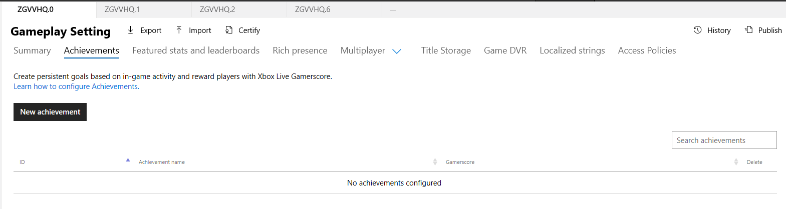
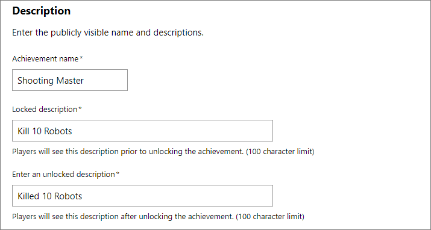
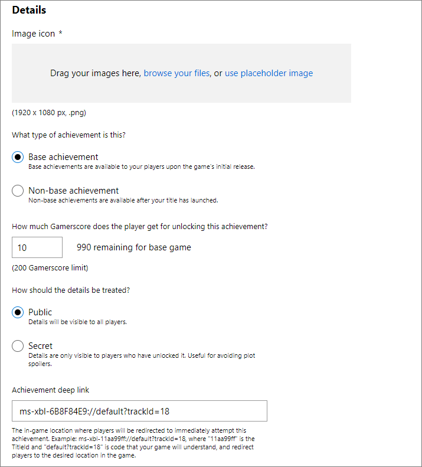
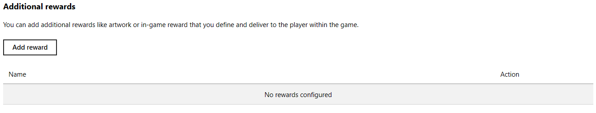
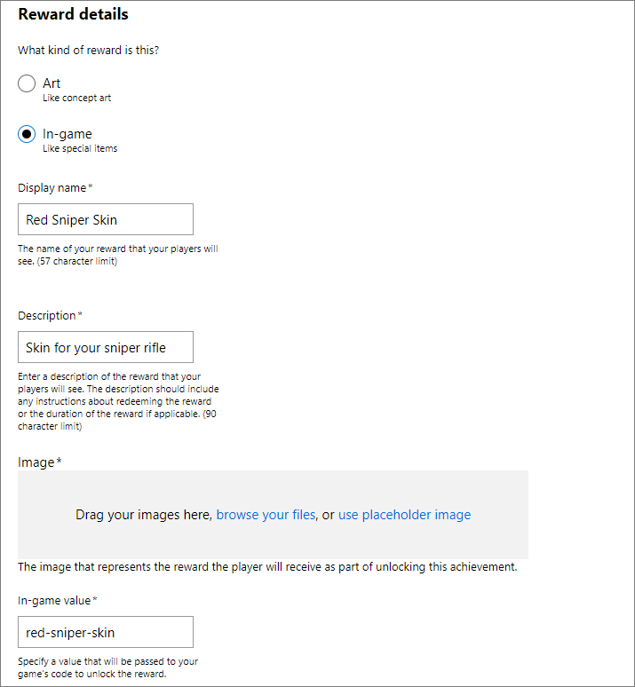

# Configuring title-managed Achievements in Partner Center

You can use [Partner Center](https://partner.microsoft.com/dashboard) to configure the title-managed Achievements that are associated with your game.

Add a new achievement by doing the following:

1. Navigate to the Achievements section for your title, located under **Services** > **Xbox Live** > **Achievements**.

2. Click the **New Achievement** button and fill out the form.  Once completed, click **Save**.

## Description

The description section is where you can enter the basics of your achievement, such as the name and locked/unlocked descriptions.
You can add localization support to achievements by accessing the **Localized strings** service configuration section in [Partner Center](https://partner.microsoft.com/dashboard).

The **Achievement Name** field is the public facing name of the achievement.

The **Locked Description** field is the description that players will see when they have not unlocked the achievement.
It has a 100 character limit.

The **Unlocked Description** field is the description that players will see once they have unlocked the achievement.
It has a 100 character limit.

## Details

The Details section is used to associate important information such as the image, the type of achievement, the Gamerscore reward (if any) and whether the achievement should be hidden until unlocked.

The **Image Icon** field is the image that will be displayed alongside the achievement.
It must be a 1920 x 1080 png.

**Base Achievements** are available to your players when the initial game has been released.
**Non-Base Achievements** are available after the initial game has released (such as with new DLC content).

The **Gamerscore** field is the amount of Gamerscore points that your achievement will award when unlocked.
Each achievement can reward between 0-200 points.

**Public** achievements are visible to all players, regardless of whether they have unlocked the achievement or not.
**Secret** achievements are hidden until they have been unlocked.

**Achievement deep link** is a way for you to get a parameter back from the achievement that allows you to link to a spot in your game on where the achievement can be earned.
The deep link is returned in the GET API response.
The URL specified must contain `ms-xbl-{titleID}://` prefix.

> **TIP:** 
> Achievement Deep links require the hexadecimal TitleId of your game. You can find the TitleId of your game on the **Xbox Live Setup** screen in [Partner Center](https://developer.microsoft.com/dashboard); see [Setting up a game at Partner Center, for Managed Partners](../../../../../get-started/live-setup-partner-center-partners.md).

## Additional Rewards

In some cases, you might want to offer an in-game reward or artwork when a player unlocks an achievement.
You can define the rewards (if any) that are associated with an achievement in the **Additional Rewards** section.
An achievement can contain two additional rewards - one of each reward type.

See also [Achievement Rewards](../concepts/live-achievement-rewards.md).

To create a new reward, click the **Add Reward** button in the **Additional Rewards** section and fill out the form.

### Reward Details

Fill out the Reward Details to associate a new reward. Once completed, click **Add**.

There are two types of achievement rewards that can be created:

1. The **Art** type can be used if you want to reward the player with things such as high-resolution concept art, early design drawings, specially created art assets or other digital art. Art assets are displayed within the Xbox Dashboard and can be also be displayed in companion experiences by querying the Achievements service.

2. The **In-Game** type can be used if you want to reward the player with custom in-game rewards without updating your title. Some potential scenarios are extra in-game currency/points or access to special characters, weapons or maps.

The **Display Name** field is the name of the reward that players will see.
It has a 57 character limit.

The **Description** field is the description of the reward that players will see and must include any redemption instructions.
It has a 90 character limit.

The **Image** or **Art** field is the image associated with the reward.
If the type is set to art, this will be the artwork that they will be rewarded.
Otherwise, it will represent the in-game reward that they will receive.
The image must be a 1920 x 1080 png.

The **In-game value** field is only visible if you select the reward type of **In-game**.
It is used to specify the value that is passed to your game's code which can be used to unlock the in-game reward.