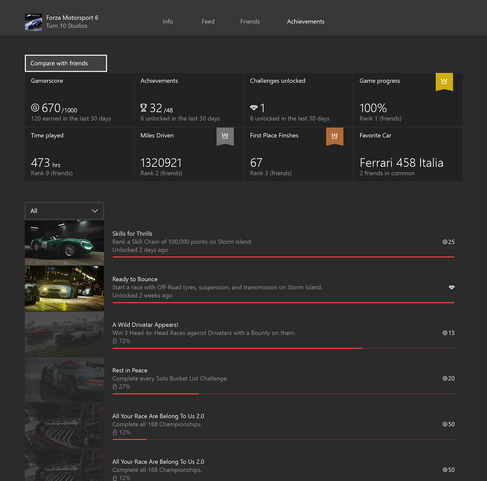
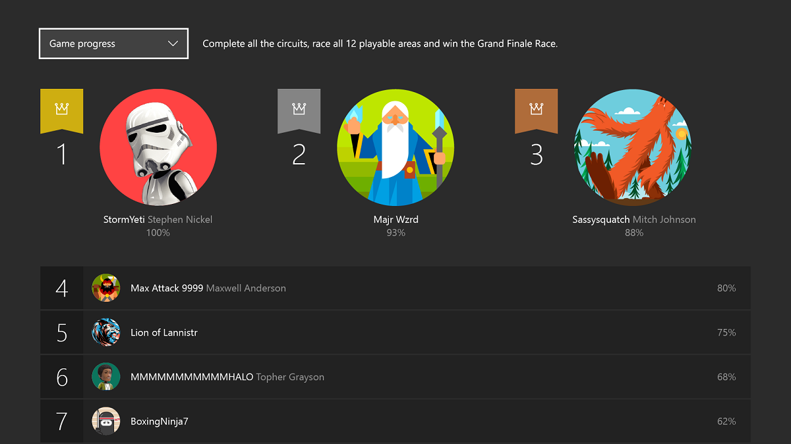

# Designing Xbox Live Experiences

This article walks you through a sample process of thinking about and adding Player Data to your game, including user statistics, achievements, and leaderboards.

## Example

Let's configure a fictional game that shows you how Player Data in Xbox Live can help you light up amazing Xbox Live experiences in the Xbox dashboard, the Xbox app on Windows 10, and in your game.
For this scenario, we'll work with an imaginary racing game called _Races 2020_.

To get the most value out of these experiences, we will follow these recommended planning phases:
1. Design your XBL experiences.
2. Design the stats needed to power your scenarios.
3. Configure Featured Stats, Achievements, or Leaderboards as needed.

## Design your Xbox Live experiences

We want _Race 2020_ to get the most out of Xbox Live, to keep users engaged both inside and outside of the game.

The first questions to ask are:

1. What do we want our GameHub's Achievements tab experience to be like? (Featured Statistics & Social Leaderboards)

2. What goals and motivations do we want to provide for players? (Achievements)

3. What scores or stats do we want players to use to rank themselves against other players in game? (Leaderboards)

## GameHubs - Featured Statistics and social Leaderboards

GameHubs are landing experiences where users can learn everything about a game.
As a developer and/or publisher, a GameHub is the perfect place for you to _showcase_ how great and rich your game is to Xbox users who have not bought the game yet.

GameHubs are also designed to show progress and engaging metrics to gamers who already own the title.
Under the **Achievements** tab, users can find Game Progress & Achievements, Hero Stats, and social Leaderboards.

This section's goal is to capture the most engaging metrics for the game and expose them to provide a unique picture of the player's experience with the game and rank the player against the player's friends in a social leaderboard.
For example, the Forza 6 **Achievement** tab could look something like this:

Some of the statistics such as Miles Driven and First Place Finishes have gold, silver, or bronze decorations that illustrate where the player ranks against the player's friends.
Interacting with any of these statistics will show a complete leaderboard, like the following:

For _Races 2020_, the following is a good set of statistics that represent a player's experience with the title as well as good ranking metrics:
 * Fastest lap
 * Most 1st place wins
 * Miles driven

## Achievements

Achievements are a system-wide mechanism for directing and rewarding users' in-game actions in a consistent manner across all games.
Designing this correctly helps guide users to experience the game at its fullest and extends the lifetime of the game.

For _Races 2020_, here is a subset of the achievements we want to configure:
* Finish 1 lap in under 60 seconds.
* Finish 10 races in 1st place.
* Complete at least 1 race on each of the tracks.
* Own 5 cars.
* Drive for 10,000 miles.

## Leaderboards

Leaderboards provide a way for gamers to rate themselves against other gamers for specific actions they can achieve in the game.
Besides the social leaderboards in the GameHubs, you can configure Global Leaderboards to be used in-game.

These are some of the Leaderboards to rank all of our users on:
* Fastest lap time
* Metadata: track where this happened
* Metadata: car used
* Metadata: weather conditions
* Most 1st place wins
* Most cars collected

## Next Steps

After you design Stats, Leaderboards and Achievements, you can implement them in your title, starting with configuration in Partner Center.

The next few sections describe the end-to-end process: see [Stats & Leaderboards](stats-leaderboards/live-stats-leaderboards-nav.md).