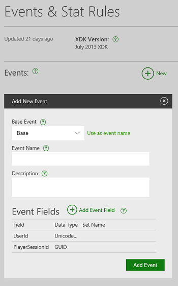
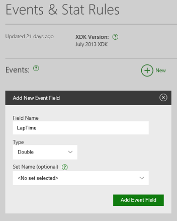
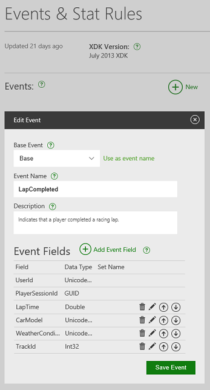
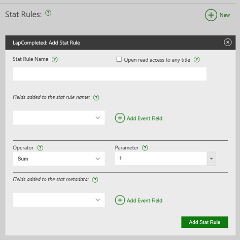
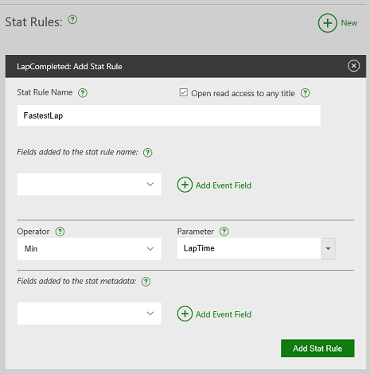
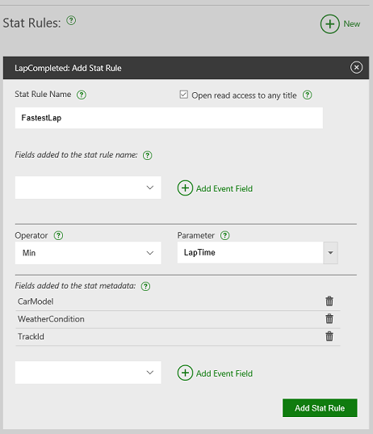
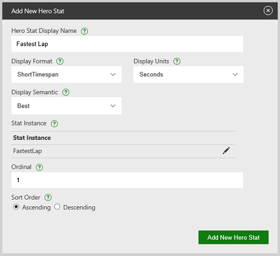
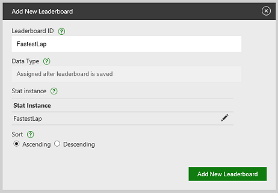
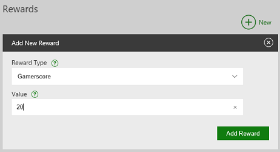
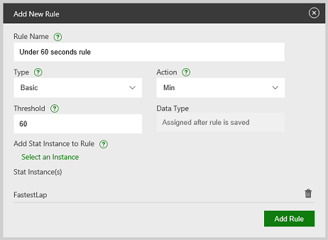

# First glance for event-based Stats

For titles that are configured on Partner Center by using event-based Stats, this topic shows you how to configure an event and a stat on Partner Center, and then add code to your title to send events and update stats.


## Sign in to Partner Center

The following examples use Partner Center to configure the Xbox Live experience for a game.

After your company has an agreement to create products for Xbox Live, configure your content in Partner Center. If your company isn't yet set up with Partner Center access and you're developing a game, contact your Microsoft account manager. If you're developing an app, contact Xbox App Partner Requests (xboxapps@microsoft.com). If you're working with the ID@Xbox program, contact ID Setup (idsetup@microsoft.com).

The ID@Xbox program enables qualified game developers of all sizes to unleash their creativity by self-publishing digital games on Xbox One (or later). This gives studios the tools and support that they need to help maximize their success. To learn more, go to [https://www.xbox.com/Developers](https://www.xbox.com/Developers).

After you have access to Partner Center, you'll need Microsoft to create a product group for your game. Your Microsoft account manager can assist with this process.

After Microsoft has created a product group for your game, use Partner Center to configure Xbox Live for your game. The Xbox Live configuration for your game is also referred to as its _service configuration_.

Use the following steps to go to the location in Partner Center where you can add the events, stats, achievements, and leaderboards for your game.

1. Sign in to your account on [Partner Center](https://developer.microsoft.com/dashboard/windows/overview).

2. Select the product group that contains or will contain your game.

3. On the **Product Group** page, either select your game or select **Add New Product** to create a new entry.

4. If you're creating a new product, enter a name for your product.

5. For resource access, select **Exclusive Resource Access (ERA)**.

6. Choose whether you need to produce physical media for the game or if it will only be a digital download.

7. Select **Create Product**.

8. At the bottom of the left pane, expand the sandbox that your product was created in.

   Service configurations are defined at the sandbox level. If you export your product to another sandbox, you also need to export your service configuration.

9. On the sandbox submenu, select **Service Configuration**. Use this page to configure Xbox Live service for your app in the current sandbox.

## Identify and define the events for your scenarios

In Partner Center, before we can define the rules that implement the player experiences we want to achieve, we need to identify and define the events that will drive those experiences.

In the event-based model, achievements and leaderboards are based on player stats. As a result, we can look at the stats that we'll define to see what events our title will need to send.

To power the experiences that we'll define in this example, we'll use an event that we send at the end of each lap in a race.

Let's call this event `LapCompleted`. We'll use this event to drive our customized experiences. To power those experiences, we'll also define the following fields as part of our `LapCompleted` event.

* **LapTime**: A field that indicates the time in minutes to complete a lap.

* **CarModel**: A string field that indicates the model of the car that's used to complete the lap.

* **WeatherCondition**: A string field that identifies the weather condition of the track when the lap was completed.

* **TrackId**: The ID of the track that the lap was completed on.

We'll now define this event in Partner Center.

1. In Partner Center, on the left pane, select **Test Sandbox** > **Service Configuration** > **Events & Stat Rules**.

2. Select **New** to create a new event. The **Add New Event** dialog appears, shown as follows.

   

3. Select **Base** in **Base Event**.

4. Enter *LapCompleted* in **Event Name**.

5. Optionally, enter a description for the event in **Description**.

6. Select **Add Event Field**.

7. Enter *LapTime* in **Field Name**, and then specify the **Type** as **Double**, shown as follows.

   

8. Select **Add Event Field**.

9. Repeat the process to add the following event fields.

   * *CarModel*: **UnicodeString**

   * *WeatherCondition*: **UnicodeString**

   * *TrackId*: **Int32**

   Your event should look something like the following screenshot.

   

10. Select **Save Event** to save the event in your sandbox.

## Design stat rules

Now that we've defined the player experiences, we can start creating the stat rules that implement those experiences. Because we're using `LapTime` for all three scenarios (featured stats, achievements, and leaderboards), we'll configure it first.

This stat will show up as a featured stat (also known as a hero stat) and will also be used for a global leaderboard with additional metadata.

The game fires in-game events when certain actions happen in the game and are considered to be the raw data for creating stats. At least one stat should be created or updated by every event.
(For more information about generating multiple stats in a single event, see [Event-based Stats overview](../live-stats-eb-overview.md).)

1. On the **Events & Stat Rules** page, select the **LapCompleted** event from the list of events.

2. Select **New** (to the right of **Stat Rules**) to create a new stat rule. It will be based on the selected event. The **Add Stat Rule** dialog appears, shown as follows.

   

3. Enter *FastestLap* in **Stat Rule Name**.

4. Because we want other apps and titles, like the Windows 10 Xbox Live app, to access stats that are created by this rule, select the **Open read access to any title** checkbox.

   Stat rules have logic that defines how the event creates or updates the stat. Because we want to track the fastest lap, we only want to update the stat value if the new lap time is lower than the existing fastest lap time.

5. To do this, select **Min** in **Operator** and **LapTime** in **Parameter**, shown as follows.

   

  Finally, we need to ensure that the event contains all the extra data (known as *stat context* or *metadata*) that we need for this specific stat: the player's car, track, and weather conditions.

6. To add the field to the metadata, select **CarModel** and then select **Add Event Field**.

7. Repeat this for the **WeatherCondition** and **TrackId** fields, shown as follows.

   

8. Select **Add Stat Rule** to create the stat rule.


## Configure featured stats, leaderboards, and achievements

### Featured stats

Now that the stat rule is complete, we want the stat to appear on the GameHub Achievement tab in GameHub. As a result, we must configure a featured stat (known as a hero stat in Partner Center).

1. In Partner Center, on the left pane, select **Test Sandbox** > **Service Configuration** > **Hero Stats**.

2. Select **New** to add a new featured/hero stat.

3. Enter *Fastest Lap* in **Hero Stat Display Name**.

4. Select **ShortTimespan** in **Display Format**. Select **Seconds** in **Display Units**.

5. Select **Best** in **Display Semantic**. This indicates to companion apps that the value represents a best score for the stat.

6. Select **Select an Instance**, and then select **FastestLap** in **Stat Instance**. This indicates that the featured stat is based on the `FastestLap` stat value.

7. Enter *1* in **Ordinal**. This indicates that this featured stat should be displayed first when listing the featured stats.

8. Select **Ascending** in **Sort Order**. This indicates that lower values are better than higher values, shown as follows.

   

9. Select **Add New Hero Stat** to create the featured/hero stat.

### Global leaderboard

Using the same lap time stat, we can configure a leaderboard so that every player can see how their lap time is ranked against all other players across the world.

1. In Partner Center, on the left pane, select **Test Sandbox** > **Service Configuration** > **Leaderboards**.

2. Select **New** to create a new global leaderboard.

3. Enter *FastestLap* in **Leaderboard ID**.

4. Select **Select an Instance**, select the **FastestLap** stat rule that we created earlier, and then select **Add Stat Instance**.

5. Select **Ascending** in **Sort**, shown as follows. This selection indicates that lower times are better.

   

6. Select **Add New Leaderboard** to create a new global leaderboard.

As player stats get updated, the leaderboard is also updated to reflect any change in the rankings.

If there are existing player stats when you create the leaderboard, it can take several hours to update the new leaderboard with these stats.

### Event-based Achievements

We recommend that you use title-managed Achievements. However, for titles that are still using event-based Achievements, you can use events to power the unlocking of achievements on the service, as follows.

**To use events to unlock event-based Achievements**

1. In Partner Center, on the left pane, select **Test Sandbox** > **Service Configuration** > **Achievements & Challenges**.

2. Select **New** to add a new achievement.

3. Enter *Under 60 seconds* in **Achievement Name**.

4. Enter *Completed a lap in under 60 seconds* in **Description**. This description is displayed to players when the achievement is unlocked.

5. Enter *Complete a lap in under 60 seconds* in **Not Achieved Description**. This description is displayed to players when the achievement is still locked.

6. Upload a 1920 &#215; 1080 pixel .png file to serve as the **Achievement Icon**, shown as follows.

   

7. Select **Add Achievement** to create the achievement.

8. Ensure that the **Under 60 seconds** achievement is selected in the list of achievements. Select **New** to the right of **Rewards** to give the player a reward for unlocking the achievement.

9. Give the player 20 gamerscore points for unlocking this achievement. In **Reward Type**, select **Gamerscore**.

10. Enter *20* in **Value**, shown as follows.

    

11. Select **Add Reward**.

12. Ensure that the **Under 60 seconds** achievement is still selected in the list of achievements. Select **New** to the right of **Rules** to define the conditions that unlock the achievement.

13. Enter *Under 60 seconds rule* in **Rule Name**. This value isn't seen by the player, so you can call it whatever you want.

14. Select **Min** in **Action**. This indicates that the achievement is unlocked when the selected stat instance is less than or equal to the threshold value.

15. Enter *60* in **Threshold**.

16. Select **Select an Instance**, select the **FastestLap** stat rule, and then select **Add Stat Instance**.

17. Select **Add Rule** to create the rule for the achievement, shown as follows.  

    

### Add code to send the event from your game

Now that we've defined the `LapCompleted` event that Xbox Live will use to update our player scenarios, we need to add code to the game to send the event when a player completes a racing lap in the game.

To write an event, call the [XblEventsWriteInGameEvent](../../../../../../reference/live/xsapi-c/events_c/functions/xbleventswriteingameevent.md) function with the event name of `LapCompleted`.

**Flat C API**

```cpp
    HRESULT hr = XblEventsWriteInGameEvent(
        xboxLiveContext,
        "LapCompleted",
        R"({"DifficultyLevelId":100, "GameplayModeId":"Adventure"})",
        R"({"LocationX":1,"LocationY":1})"
    );
```

## See also

[Events overview](../events/live-game-events.md)
