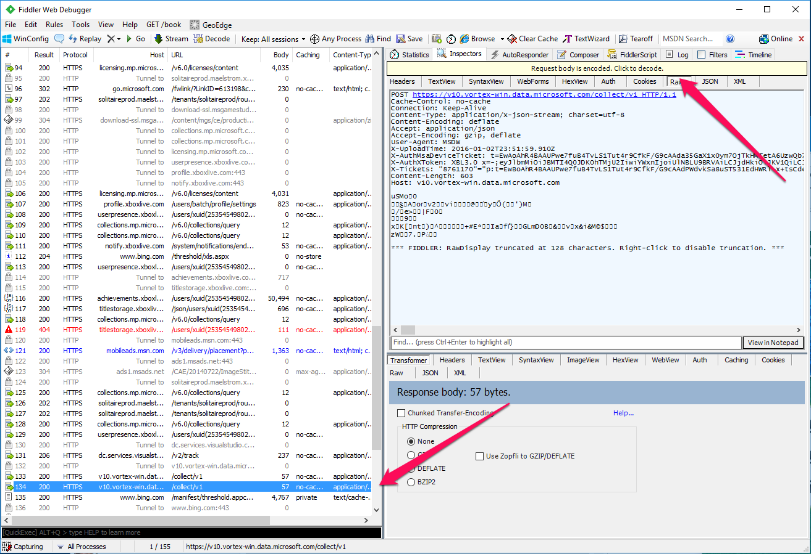
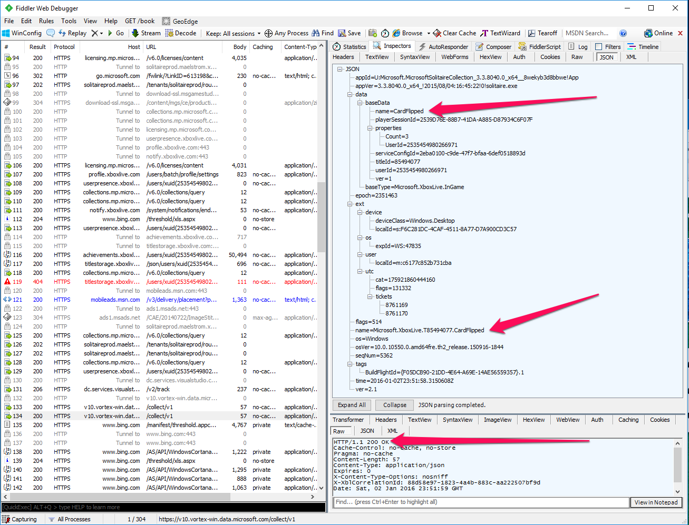

# Events overview


**Note:** This article only applies if you are using event-based User Stats, not title-managed User Stats.

**Note** Application Insights has been deprecated. Please use [fiddler](/windows/uwp/xbox-live/using-xbox-live/troubleshooting/how-to-set-up-fiddler-for-debugging) to monitor events.


## Writing game events to the Xbox Live User Statistics service

The most exciting moments in games are when something significant happens—defeating an opponent, being defeated, moving to a location, shooting a weapon, picking a flower. By using Xbox Live, titles can share information about the important events in a player's game. Details can be sent to the Xbox Live service, which records statistics about users. These statistics can be retrieved for use in user stats, leaderboards, and matchmaking.

Once the event, and any data that is sent as part of the event, reaches the service, Xbox Live processes rules that you defined in the service configuration for your title to create or update user statistics, leaderboards, etc.

### Configuration on Partner Center

First, define your events on Partner Center in the Player Stats | Stat rules page. Once you have an event and stat defined in Partner Center, you can perform the following steps to send an event.

### Writing an event

For a Microsoft Game Development Kit (GDK) title, the API to send an event is different than that for an Xbox One Software Development Kit title, and use of the manifest file is not needed. 

The [XblEventsWriteInGameEvent](../../../../../../reference/live/xsapi-c/events_c/functions/xbleventswriteingameevent.md) function is declared as:

```cpp
STDAPI XblEventsWriteInGameEvent(
    _In_ XblContextHandle xboxLiveContext,
    _In_z_ const char* eventName,
    _In_opt_z_ const char* dimensionsJson,
    _In_opt_z_ const char* measurementsJson
) XBL_NOEXCEPT;
```

`xboxLiveContext` is the Xbox Live context handle.

`eventName` is the Event name as defined on Partner Center.

`dimensions` is a property bag corresponding to event properties that take on a finite set of values. For example: level, weapon, or character.

`measurements` is a property bag corresponding to event properties that have an indeterminate set of values. For example: miles driven, enemies killed, or minutes played.

Dimensions and Measurements are discussed more below.

#### Measurements and Dimensions

When calling [XblEventsWriteInGameEvent](../../../../../../reference/live/xsapi-c/events_c/functions/xbleventswriteingameevent.md) for the purposes of events on Xbox Live, there is no difference if you pass an event property as a dimension or measurement. These differences are only relevant if you are analyzing the events on Application Insights for your telemetry - this has no impact on the gameplay experience. There is more information at [Application Insights API for custom events and metrics](https://azure.microsoft.com/documentation/articles/app-insights-api-custom-events-metrics/).

Dimensions can be used to filter or pivot on your events. Eg: Show users to completed Level 6, or show all "Enemies Killed" events where the weapon used was "Minigun".

Measurements could be displayed graphically or make sense to use on a leaderboard. Eg: Track time, consecutive rounds won, etc.

But for the purposes of use with Xbox Live, whether you pass an event property as a measurement or dimension makes no difference, this will be processed identically for the purposes of unlocking achievements and other Xbox Live related functionality.

### Debugging Xbox Live Events

If events from your title are not successfully reaching Xbox Live, then hero stats and leaderboards will not update. If you suspect that events are not successfully being received by Xbox Live, try the following steps:

* Verify your sandbox is correct.

* Set up Fiddler on the device. In Fiddler, you should see events as follows:



Look for calls to `v10.vortex-win.data.microsoft.com`. You will need to decode the request body as shown, then if you look at the JSON you will see something such as the following:



You can verify the event name is what you expect. Your title ID will be prepended to the name. You should also verify you are getting a 200 return code.  
  
## See also
  
[Event-based vs. title-managed Stats](../../live-stats-eb-vs-tm.md#update-frequency).  
  