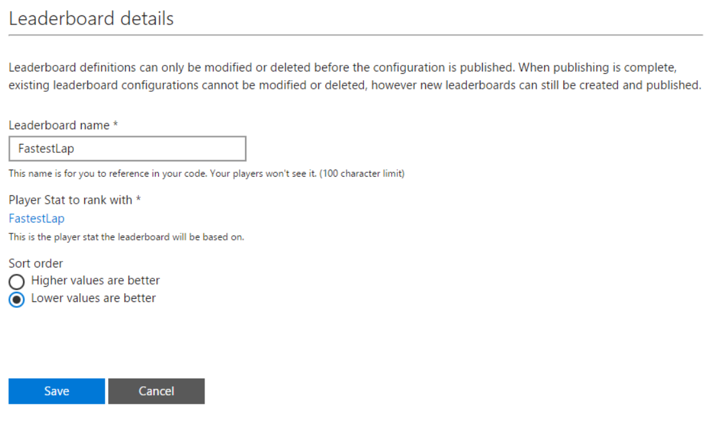
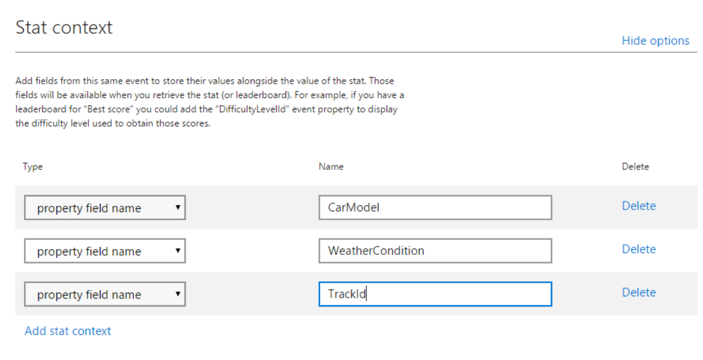

# Event-based Leaderboards overview

This topic describes how leaderboards compare players by showing selected stats for a game.

Leaderboards are a fun way to engage players and drive competition among them. Xbox Live provides functionality that's suited for your hardcore players (*global* ranking against the whole Xbox Live population) and for your casual players (*social* ranking against a player's friends).

Two types of leaderboards are available to you: global and social.
They have very similar concepts but have fundamental differences in terms of configuration and intent.

## Global vs. social leaderboards

### Global leaderboards

* A global leaderboard ranks the whole Xbox Live user base and must be configured.

* A global leaderboard is a predefined view that you configure in the service at ingestion time (either before or at any time after the title is released).

### Social leaderboards

* A social leaderboard is generated dynamically and ranks the player's friends.

* A social leaderboard only includes players who are in the player's social graph.

* A social leaderboard doesn't need to be predefined at ingestion time because the service generates the leaderboard dynamically at runtime, based on existing user stats.

## Understanding leaderboards

Leaderboards have two main components.

* A value to be ranked against (in Xbox Live, this is always a player stat).

* Sort order (higher or lower values are better).

### Stats as ranking values

Leaderboards are derived from player stats. It's crucial to have the right stat rules defined for what you need. As you're designing your game, keep in mind which leaderboards you'd like your players to be ranked against.

## Global leaderboards

Global leaderboards keep track of the best scores that have been recorded by players across the Xbox Live community. The main differentiation for global leaderboards is that they're predefined at ingestion time by specifying a leaderboard identification name, ranked stat, and sort order (ascending or descending).  

Titles can define an unlimited number of global leaderboards and add more leaderboards at any time via service configuration. The maximum number of records per global leaderboard is currently limited to 10,000 entries. This means that for players whose "best" score isn't ranked in the top 10,000, their score doesn't appear in the leaderboard.

It's possible to read a "page" of up to 100 leaderboard entries (player XUID, gamertag, global rank, and score) at a time and specify the starting rank of the page, or retrieve leaderboard entries that are centered around a specified gamertag. The results are always scoped to all-time; day, week, and month views aren't yet supported.

Global leaderboards can be accessed via Xbox Services API (XSAPI) or our REST API by using `GET (/scids/{scid}/leaderboards/{leaderboardname})`.

Here's a screenshot of how a sample leaderboard could be configured for a racing game.

## Social leaderboards

Social leaderboards are great incentives for casual players to compare and rank themselves against their friends. Even if they're not in the highest ranks of the community, they can still be motivated to beat players who they know. Social leaderboards are dynamically created based on any existing user stat. As a result, they don't need to be predefined at ingestion time and contain only the players in one specific player's social graph.

The main advantage to social leaderboards is that they're not predefined. You can create a social leaderboard for any stat for your game. The caller can specify two things when requesting a social leaderboard: the stat instance and the sort order (default is descending by rating). The results are always scoped to all-time; day, week, month views aren't supported.

As with global leaderboards, a caller can read a "page" of up to 100 leaderboard entries (player XUID, gamertag, global rank, and score) at a time and specify the starting rank of the page.

Social leaderboards are accessed via XSAPI or our REST API by using `GET (/users/xuid({xuid})/scids/{scid}/stats/{statname)/people/{all|favorite})`.

## Global leaderboards with a social view

Because social leaderboards are created dynamically, it takes longer to retrieve a social leaderboard than it does to retrieve a global leaderboard. For scenarios where your title frequently retrieves a social leaderboard based on a common set of criteria, you can create a global leaderboard and retrieve only the entries in the leaderboard that pertain to the player's social graph.

This results in a faster retrieval time than social leaderboards, because the leaderboard already exists on the Xbox Live servers. It also results in a smaller payload, because the results are scoped to the user's social graph. This type of leaderboard is a global leaderboard. Therefore, it must be defined in the title's service configuration.

Global leaderboards with a social view are accessed by using the normal global leaderboard request, `GET (/scids/{scid}/leaderboards/{leaderboardname})`, and appending the following query to the URL: `&viewTarget=people&view=people`.

To support multicolumn leaderboard views, stats metadata can be used. A title can define metadata fields for a leaderboard stat, which can be returned when querying leaderboard ranks. A title shouldn't use the batch User Stats URI to achieve the same behavior because privacy settings might prevent stats access.

## Multicolumn leaderboards

There will be cases where you need more columns in a leaderboard to give the stat more information. For example, for a leaderboard for most enemies defeated, you might want to add the weapon that the player used, the map where it happened, the most type of enemies defeated, and the Kill/Death ratio.

Xbox Live leaderboards have built-in multicolumn support. You can easily get these types of rankings. The only prerequisite is that the stat used for the leaderboard has stat context defined. It's what will be used as additional metadata. For example, for a FastestLap stat, you might want to configure these additional properties as stat context. Here's a screenshot of what they might look like.

Now that the stat will be getting persisted with context, if you retrieve the multicolumn leaderboard, it would look something like the following table.

| Operator | Value (FastestLap) | CarModel | WeatherCondition | TrackId |
| --- | --- | --- | --- | --- |
| SUM | Constant or field | Model A | Rainy | 9 |
| MIN | Field | Model A | Sunny | 9 |
| MAX | Field | Model B | Sunny | 2 |
| REPLACE | Constant or field | Model C | Cloudy | 1 |

Multicolumn leaderboards are currently supported in global leaderboards and global leaderboards with a social view. However, if you want to create a multicolumn _social_ leaderboard, you can use the batch user stats call to get all the stats with their context and then manually create the leaderboard.

Multicolumn leaderboards are only accessed via our REST API by using the normal global leaderboard request, `GET (/scids/{scid}/leaderboards/{leaderboardname})`, and appending the following query to the URL: `&include=valuemetadata`.

## Where leaderboards with featured stats appear

Leaderboards compare players by showing selected stats for a game.

Leaderboards are a great way to encourage competition between your players. Leaderboards keep players engaged in trying to beat their previous best score and their friends' scores.

* Leaderboards for featured stats are always displayed in a title's official club.

* Leaderboards for featured stats are sometimes displayed in other Xbox Live experiences, such as a player's achievement view in their profile.

* You can also use your configured featured stats to create leaderboards inside your title.

## Choosing good leaderboards

A leaderboard corresponds to a stat that you've defined.
You should choose leaderboards that correspond to an accomplishment that a player can work toward improving.

For example, Best Lap Time in a racing game is a good leaderboard, because players want to work toward improving their best lap time.
Other examples are Kill/Death ratio for shooters or Max Combo Size in a fighting game.

## When to display leaderboards

You can display leaderboards at any time in your title.
You should choose a time when a leaderboard doesn't interfere with the gameplay or the flow of your title.
For example, between rounds and after matches are good times to display leaderboards.

## Programming guide

There are several Leaderboard APIs that you can use to get the current state of a leaderboard.
All the APIs are asynchronous and don't block.

Make a request to get leaderboard data and continue your usual game processing.
When the leaderboard results are returned from the service, you can display the results at the appropriate time.

Request the leaderboard data from the service slightly ahead of when you want to display it. This prevents players from being blocked while waiting for the leaderboard to display.

  
## See also
  
[Event-based vs. title-managed Stats](../live-stats-eb-vs-tm.md#update-frequency).  
  