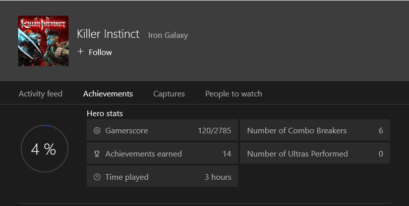

# Featured Stats overview

Featured Stats (previously known as Hero Stats) are publisher-defined metrics that highlight a user's most relevant progress.

A user can compare their progress against other players by comparing their featured stats. This helps drive the user's investment in the game experience.

Customized featured stats enable publishers to surface dynamic content from a title at a glance, even when it's not running. The content is shown consistently across Xbox Live, including the Xbox console, SmartGlass companion screens, and other platform experiences.

Featured Stats bring benefits including:

* Providing users with a consistent and accessible experience to track their own activity and progress in a game or app, and compare it with friends.
* Providing publishers with an opportunity to showcase compelling and engaging aspects of their title to bring users back into the game or app.
* Evolving the gamer profile experience in the shell, so the platform can track, celebrate, and reward everything each user does across all entertainment experiences in Xbox Live.

> [!IMPORTANT]
> Each title can select up to twenty of their most representative user stats to be showcased as featured stats. All featured stats must be marked as Open Access so that other titles can read them.

### Example Scenarios ###

* Display featured stats in the context of a "Game Details" scene to provide players real-time progress visualizations.
* Compare featured stats for one or many titles between the player and the friends they frequently interact with.
* Calculate aggregations of relevant featured stats across friends or the entire Xbox Live user base.
* Glance at featured stats when looking at any user's profile within the context of a title, such as the Party app in multiplayer games.
* Featured stats are "discoverable" by any app. This means that third party apps can build custom experiences like add-ins, websites, apps, or toolkits using the information provided by featured stats.

### Fundamentals ###

Think of featured stats as an opportunity for each Xbox Live title to prominently display interesting data about the user's activity directly into the system UX.
Titles implementing Featured Stats can designate up to 20 key user stats as featured stats. Pick a few of the most compelling stats that the title already produces to drive users to re-engage and give them a reason to re-launch your title.

**Figure 1.  Example of displayed featured stats.**

#### Configuration ####

When configuring the list of featured stats, specify details for each of these properties:

| Detail             | Description                                                                                                                                                   |
|:-------------------|:--------------------------------------------------------------------------------------------------------------------------------------------------------------|
| Stat instance name | A specific user stat instance defined by the title.                                                                                                           |
| Display name       | The user-friendly name that will be used as the label in the UX. This string must be localized via service configuration.                                     |
| Ordinal            | The priority rank relative to other featured stats in this list. so the platform UX can display them appropriately if space is limited.                                  |
| Sort order         | This property specifies whether a higher or lower value is "better" when comparing the stat between users (one vs. one, or in a social leaderboards context). |

Optionally, you can configure how featured stats are displayed by setting these display properties:

| Detail           | Description                                                                                                                                                                                                                                                                                                    |
|:-----------------|:---------------------------------------------------------------------------------------------------------------------------------------------------------------------------------------------------------------------------------------------------------------------------------------------------------------|
| Display format   | Provide formatting hints for clients to display numeric (INT or DOUBLE data type) featured stats in a user-friendly format. You can specify one of these display formats for each featured stat: Integer, Decimal, Percentage, Short Timespan, or Long Timespan.                                          |
| Display unit     | If the display format is a timespan, you can specify the unit of time that is tracked by a stat. You can set the display units to milliseconds, seconds, minutes, hours, or days.                               |
| Display semantic | This property assists non-game clients (including the shell, SmartGlass, and companion apps) to determine what kind of aggregations and calculations should be applied to the value of a featured stat. You can set display semantics for each featured stat to Cumulative, Tier, or Best. |

> [!IMPORTANT]
>  Not all user stats can take advantage of these optional display properties.  

### Best Practices ###

You can make the most out of the premium screen real estate reserved by the platform for featured stats. Consider the following notes to help you determine which featured stats to configure:

* Be strategic about which featured stat is marked as ordinal "1". Some platform experiences, like the games detail page from the Microsoft Store, only display the highest ranked featured stat in the form of a social leaderboard that includes the user's friends and their relative scores and rankings.

* Select metrics that are most likely to cause the user to launch your title. Examples include player rank, in-game currency balance, name of next goal or campaign milestone, and cumulative numeric scores or XP.

* Pick metrics that highlight social or interactive aspects of the game, such as stats specific to multiplayer mode, sharing or rating user-generated content, or other cooperative or competitive activities.

* Select stats that define your title's game play and serve as conversation starters among your user community. For example, number of chickens kicked, number of collectibles found, user level or XP, preferred character or weapon.

* The value of the stat isn't automatically localized to other languages, or mapped to a set of labels.

* Note that the value of a featured stat can be any valid integer, float, or string data type. If you need a particular format for events-based stats, configure the client to define and log events that include the actual value of the stat in one field, and the formatted string equivalent in another event field. Use the string event field as an UPDATE.
