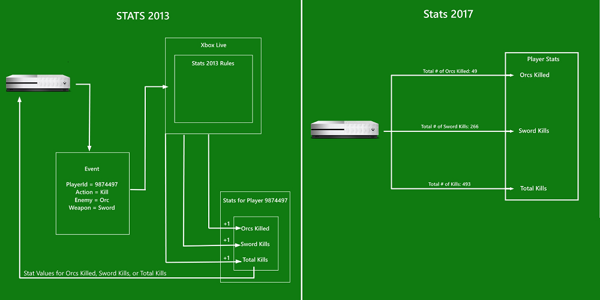

# Event-based vs. title-managed Stats
  

  
As described in [Player Data Overview](../live-playerdata-overview.md), stats are key pieces of information used to track a player's performance, such as *Head Shots* or *Fastest Lap Time*. Stats are used to generate leaderboards in scenarios that allow players to compare their effort and skills with their friends and every other player in a title's community.  
  
The Xbox Live service owns and maintains the stats; stats are updated based on your game sending user-action events to the Xbox Live service.  
  
*Configured stats* show up in a title's leaderboard, where a player will see how they rank against their friends who have also played the title.
For more information about GameHub leaderboards, see [Designing Xbox Live Experiences](../live-designing-experiences.md).  
  
There are two available implementations of User Stats for Xbox Live:  
  
* Event-based Stats (formerly named _Stats 2013_)
* Title-managed Stats (formerly named _Stats 2017_)
  


> [!NOTE]
> It is recommended to use Event-Based Stats when configuring new titles.  
  
Event-based Stats and title-managed Stats operate on fundamentally different principles, as follows.  
  
## Event-based Stats
  
When using event-based Stats, the game sends events to the Xbox Live Service containing certain information about an action a user performed.  
  
The information in these events is used to update stats accordingly. In event-based Stats, the service keeps track of and updates all of your stats values, so that the service is the source of truth for statistic values for a player or group of players.  
  
## Title-managed Stats
  
When using title-managed Stats, you send up the actual stat value itself for the server to use.  
  
In title-managed Stats, the server does little to no validation on the value sent to it, and so it is up to your title to keep track of the correct stat values; your title is the source of truth for statistic values. When using title-managed Stats, we recommend that you track and store your stats in the cloud with the [Xbox Live Cloud Storage](../../cloud-storage/live-cloud-storage-nav.md).  
  
Title-managed Stats is like a reporting service: you send the correct stat for your game to the server, your stat then sits on the server and waits to be displayed on request or updated.  
  
## History
  
With the launch of Xbox One, Xbox Live introduced event-based Stats. This offered a multitude of benefits – a single event from a game can update data for multiple Xbox Live features, such as leaderboards and achievements; Xbox Live configuration lives on the server instead of in the client; and much more.  
  
In the years following the Xbox One launch, developers requested a more streamlined stats service that would allow them to bypass the complexity that comes with an event-based system, as well as allow them to use any stats tracking methods they were already practicing.  
  
Based on Developer feedback, a new simplified version of stats was created that would put control of stats logic back into the hands of the developer.
That system is title-managed Stats, a service that simply takes the value passed to it by the title, giving developers control of the logic of how a stat value is determined.  
  
## How Stats are handled in event-based Stats and title-managed Stats
  
Let's take a look at configuring and updating stats for event-based Stats versus title-managed Stats. Let us say we're going to make stats from some generic RPG and want to keep track of monsters killed.  
  
### Event-based Stats
  
With event-based Stats, your title would send an *event* that contains information about an action performed by a player.  
  
In this event, the action will be slaying an orc while the player had a sword equipped. Some of the information contained in this event might be that a slay action was taken, the thing slayed was an orc, the combat type was melee, and the weapon used was a sword.  
  
Event-based Stats will run this information through a number of rules configured by you, the developer, at [Partner Center](https://partner.microsoft.com/dashboard), and update stats, also configured by you, based on the event.  
  
In event-based Stats, the service will keep track of what the value for your slaying statistics should be. The "slay orc with sword" event could update multiple statistics such as, number of kills, number of orcs slain, and number of sword kills.  
  
### Title-managed Stats
  
In title-managed Stats, you will send up the actual values for your statistics.  
  
For the "slay orc with sword" example, your title will keep track of the number of overall kills, sword kills, and orcs slain individually, and send the service the updated number for each statistic. The service has minimal validation checks to make sure that you're sending a number that makes sense, so it is absolutely up to your title to send up the correct statistic.  
  
Although you may use the title-managed Stats service to recall the values of stats at the beginning of a game session, you should not use the title-managed Stats service to confirm the value of a stat while the session is ongoing.  
  
The following diagram shows how the two flavors of Stats operate:  
  
* Event-based Stats (formerly called Stats 2013) on the left  
* Title-managed Stats (formerly called Stats 2017) on the right  
  

  
  
## Other differences between the two approaches
  
For Managed Partners, there are a few more differences you should be aware of when deciding between event-based Stats and title-managed Stats for your title.  
  
Event-based Stats allows for more leaderboard views. Event-based Stats allows you to more easily drill down on the meta data of your statistics. In our "orc slay" example, the overall statistic was keeping track of the number of kills. Event-based Stats allows you to drill down on your statistics to what was killed and with what weapon as well as any other kill defining information you may configure.  
  
Event-based Stats has a native "minutes played" stat. Event-based Stats allows you access to a player's play time in game without configuring the statistic. In title-managed Stats, any playtime statistics would have to be tracked by your title.  
  
### Update frequency
  
For event-based Stats, events are locally written to the device, even if the device is offline and not connected to the internet. Once the device is online and connected, a service running on the device batches and uploads events to the Xbox Live data platform. Typically, updating event-based Stats takes from 5 to 20 seconds if the device is online and connected, from the time when the event is locally written to the device to the time when the updated information for the event is reflected on Xbox Live.  
  
For title-managed Stats, the actual values for your stats are updated, then periodically flushed from the system directly to the Xbox Live data platform if the device is online and connected to the internet. Updated stats are automatically flushed from the system in 5 minute intervals. You can manually flush stats from the system to Xbox Live, but manual flushing is throttled to a minimum interval of 30 seconds between flushes. Typically, updating title-managed Stats takes from 2 to 10 seconds if the device is online and connected, from the time when the updated values are flushed from the system to the time when the updated values are reflected on Xbox Live.  
  
Event-based Stats can support other Xbox Live Services. With event-based Stats, you can use stats to unlock achievements and make matchmaking decisions. Title-managed Stats can only used to produce Featured Stats and leaderboards.  
  
## Using Title-Managed Achievements with Event-Based Stats
  
It is very common, and recommended, for titles to use title-managed Achievements side-by-side with event-based Stats, and there are no compatiblity issues with this combination.  
  
## Further reading
  
For a more in-depth explanation of event-based Stats, see [Event-based Stats overview](event-based/live-stats-eb-overview.md).  
  
For a more in-depth explanation of title-managed Stats, see [Title-managed Stats overview](title-managed/live-stats-tm-overview.md).  
  