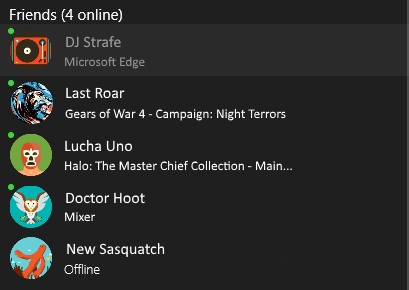
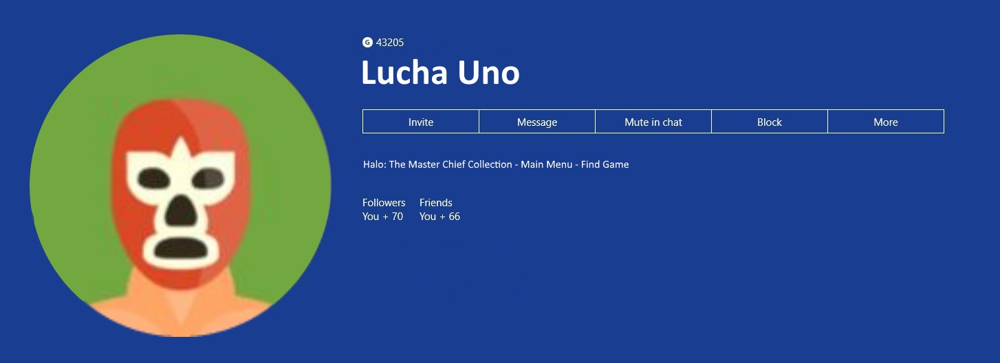
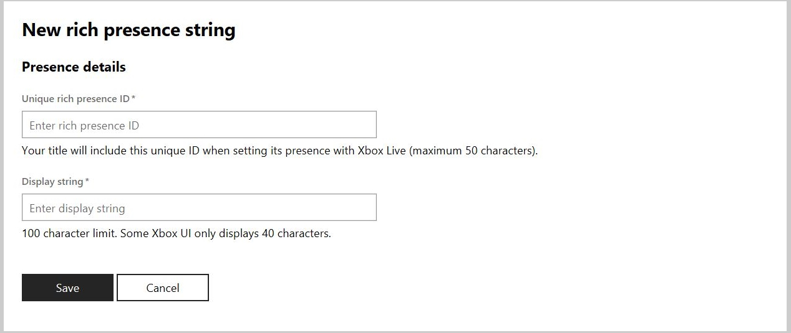
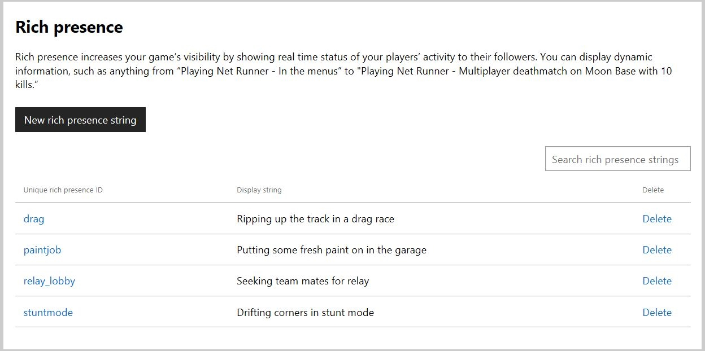

# Configuring Rich Presence strings in Partner Center

A Rich Presence string displays a user's in-game activity after the name of the game that the user is playing, separated by a hyphen.
A Rich Presence string is displayed under a player's Gamertag in the **Friends & clubs** list as well as in the player's Xbox Live user profile.

> [!IMPORTANT]
> Rich Presence strings are not available to Xbox Live Creators Program titles and therefore are not configurable for those titles. The content in this article is for Managed Partners.

Configured Rich Presence strings are appended to the name of the game being played.

If you create a game called BubblePop and configure the Rich Presence string "Popping bubbles with friends", your configured string would produce "BubblePop - Popping bubbles with friends" as a status.
Below, you can see how a Rich Presence string will appear in context.

In the following screenshot, Xbox Live users **Last Roar** and **Lucha Uno** are playing games using Rich Presence strings.

In the following screenshot you can see **Lucha Uno's** full Rich Presence string in his profile.

## Requirements

Before configuring Rich Presence strings you and your title must meet the following criteria:

- You must have a Windows development account.
- Your development account must be registered as a Managed Partner account, rather than a Creators Program account.
- Your title must be registered in Partner Center and be Xbox Live enabled.

Before you can use Rich Presence strings you must configure them in Partner Center.

## Rich Presence Configuration Page

Rich Presence strings are configured as a part of the Xbox Live Service for your title in [Partner Center](https://partner.microsoft.com/dashboard).

Navigate to the Rich Presence configuration page with the following instructions:

1. Go to [Partner Center](https://partner.microsoft.com/dashboard) on developer.microsoft.com.

2. Sign in with your registered Windows developer account if sign-in is requested.

3. Choose your Xbox Live enabled title or App from the **Overview** page. Do not select a Creators Program title as it will not be enabled for Rich Presence string configuration.

4. Click on the **Services** drop down and select Xbox Live.

5. Scroll down to the **Rich Presence** link, and click it.

The Rich Presence page displays a brief description of the service, a button to create a new Rich Presence string and a searchable list of your previously configured strings.
From this page you can configure new strings as well as edit and review your configured strings.

> [!NOTE]
> Strings like "Playing Net Runner - Multiplayer deathmatch on Moon Base with 10 kills.” is not available with title-managed Player Data. Event-based Player Data *Variables* are unavailable with title-managed Player Data. The variable in this case is the number of kills "10". The equivalent string after the title-managed Player Data update would be "Playing Net Runner - Multiplayer deathmatch on Moon Base." “Playing Net Runner - In the menus” is still a valid Rich Presence string.

## Create a new Rich Presence string

To create a Rich Presence string, click the button labeled **New Rich Presence string**.
You will be presented with UI to fill in the **Presence Details** which include the **Unique Rich Presence ID** as well as the **Display string** for your new Rich Presence string.

**Unique Rich Presence ID** - The Unique Rich Presence ID is a string used to identify your Rich Presence string.
This string will be used to set the status of players for your game and is associated with the particular string you would like to display.
Your ID can be a maximum of 50 characters.

**Display string** - The Display string is the string that you will want to display appended to the status of some gamer playing your game.
This is where you will fill in the Rich Presence string you want displayed to generate interest in your game.
Your display can be a maximum of 100 characters but there will be instances where only the first 40 characters will be shown.

In order to create your new Rich Presence string, fill in both fields and press the **Save** button.
Once you click save you will be taken back to the Rich Presence Configuration Page where you will see your new Rich Presence string added to the list of configured strings.

## Review, edit, and delete strings

Here you can see a Rich Presence configuration page with a few configured strings.

To review previously created strings, simply browse the list on the Rich Presence configuration page.
There you can see both the Unique Rich Presence ID, and Display string together.
This will be useful when you need to use the Unique Rich Presence Id in your title's code to specify a Rich Presence string.

To edit a Rich Presence string simply click on the **Unique Rich Presence ID** link for the string you want to edit.
You will be taken to the same UI used to create a new Rich Presence string with the current string settings filled in for editing.
After making edits click the **Save** button to update the configured string with your changes.

To delete a configured Rich Presence string click the **delete** link on the Rich Presence Configuration page in the same row as the Rich Presence string you would like to delete.
You will be asked to confirm the deletion.

## See also

[Rich Presence overview](../live-presence-overview.md)