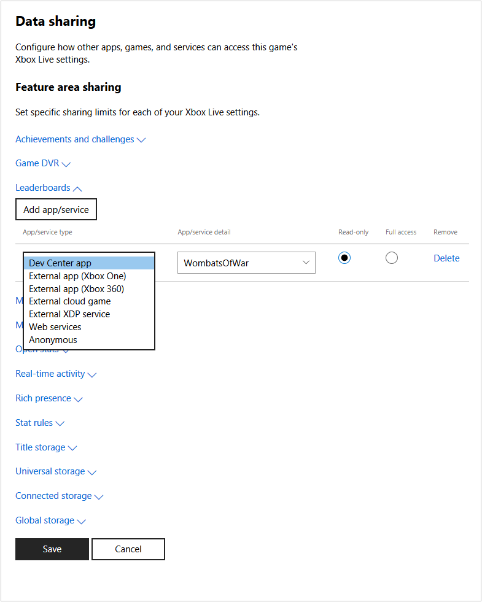

# Configuring data sharing in Partner Center

You can use [Partner Center](https://developer.microsoft.com/dashboard/windows/overview) to allow other services, games, and apps to access your title's Xbox Live settings and data.
For example, you may want a web service to display leaderboards on your website, or you may have a companion app that can access the game's title storage to view or modify saved game data.

> [!NOTE]
> This topic does not apply to titles in the Xbox Live Creators Program.

By default, only the title itself can access the settings and data stored on the Xbox Live service.
You can change this by configuring data sharing on Partner Center.

## To add configuration:

1. Go to [Partner Center](https://developer.microsoft.com/dashboard/windows/overview) and then select your title.

2. In the middle of the window, expand **Xbox Live**, then click **Gameplay settings**. The "Gameplay Setting" page appears.

3. Click the **Access Policies** link. The "Feature area sharing" page appears within the "Gameplay Setting" page.

   

4. Click the setting you want to grant access to, such as **Game DVR** or **Leaderboards**, and then click the **Add app/service** button.
   A new row is added to the bottom of the list of apps/services configured to access that setting.

   In Game DVR, by default, a row exists for "Anonymous".
   The Anonymous app/service type allows Xbox Live to share game clips within Xbox experiences; for example, this type causes Game DVR clips to appear in the game hubs for titles.
   New titles are configured as Anonymous by default, for Game DVR.
   Do not delete the Anonymous type from the Game DVR section.

5. Select the type of app or service in the drop-down box (such as **Dev Center app** or **Anonymous**), and fill-in the detail box to indicate the app, title ID, or service ID of the app or service that will access the data.

6. Select whether the app or service can only read the data, or if it has full access to the data.

7. Repeat for each setting, and for each app or service that needs access to those settings. To remove an entry, click **Delete**.

8. When you are finished, click the **Save** button.