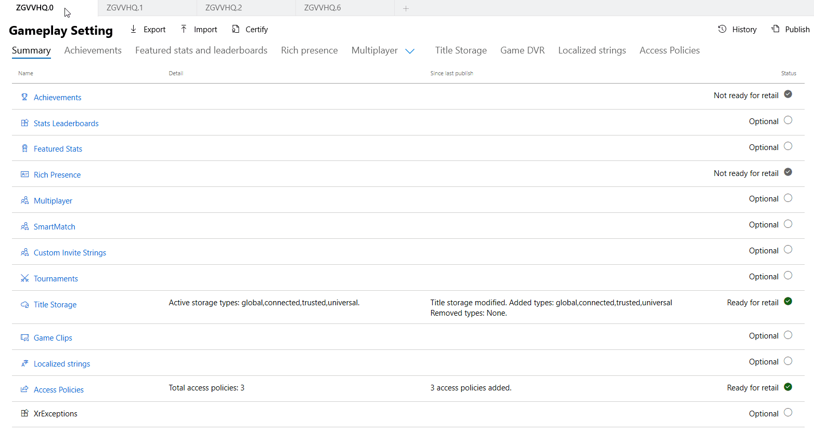
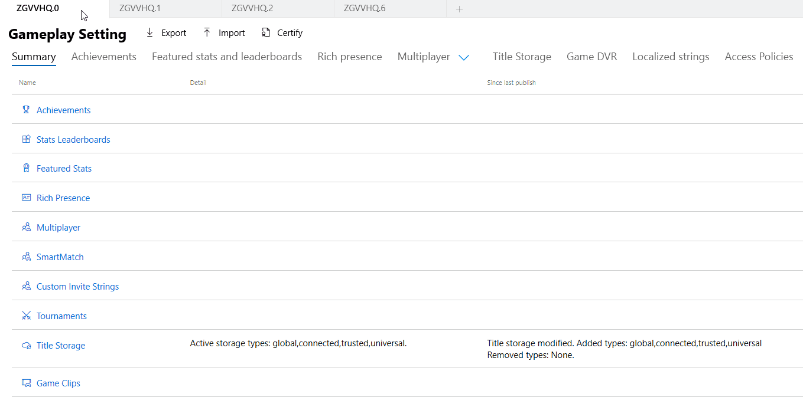
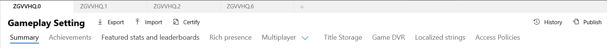
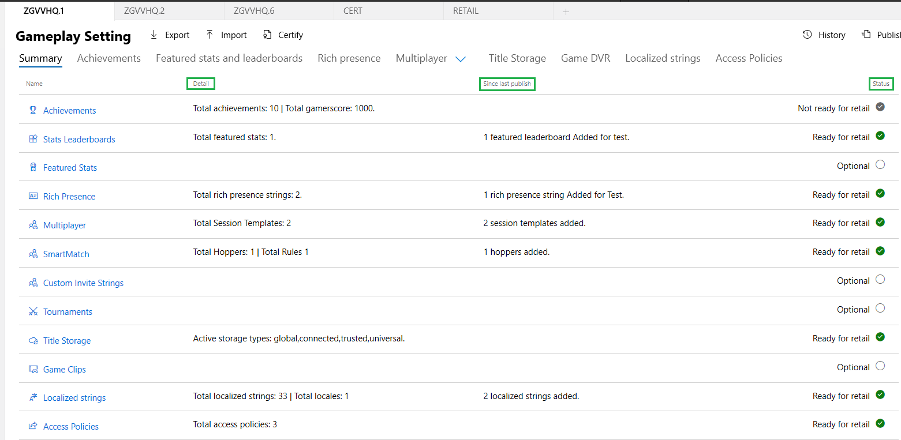
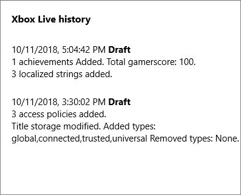

# Summary page for Xbox Live configuration

To configure Xbox Live for your title, you can use [Partner Center](https://developer.microsoft.com/dashboard).
With Partner Center, you can manage the service configuration for each of your title's sandboxes.

To configure the Xbox Live aspects of your title, navigate to the Xbox Live section for your title, located under **Services** > **Xbox Live**.
This page shows a snapshot of your current configuration on the selected sandbox, including details of what has been configured and published to the sandbox.

## Sandbox selector

Sandboxes are now a top-level navigation item you can switch between or expand by selection.
The UI displays the title's sandboxes at the top as tabs.
The information shown in each tab is in the context of the associated sandbox.

You can add additional sandboxes by selecting the "+" which will present you with a dialog where you specify which sandbox you would like to copy the config from and which sandbox you would like to copy the config to.

See [Xbox Live Sandboxes overview](../sandboxes/live-setup-sandbox.md).

## Command bar

As mentioned above the page displayed is always within the context of a sandbox, therefore the command bar exposed just below it shows all the actions you can perform in your given sandbox.

Available commands:
* **Export** - Which provides you a zip file that contains all configured documents within the sandbox.
* **Import** - Allows you to provide a zip file containing valid XBL documents that once uploaded will be available in the sandbox.
* **Certify** - Publishes your current configuration to the certification sandbox.  *You can also use the publish button and change the destination to CERT to accomplish this.*
* **History** - Opens a tab that displays information on who created what and when. You can open this tab on any page and it will filter to the objects created on that page.
* **Publish** - Allows you to choose your source sandbox and destination. Once selected a validation will run letting you know if you can publish the configuration. If allowed, selecting publish will set your configuration for the sandbox so that you may test this configuration while using the appropriate sandbox.  
  

## Summary table

The UI now provides a meaningful roll up of all your different configurations, allowing for an at a glance view of what has been configured, what is optional, and what is still required before publishing to retail.

* **Detail** – Describes what has been configured for a particular feature within the current sandbox (this includes the objects that you have created but not yet published)
* **Since Last Publish** – This will let you know what new configurations you have created that have not been published to your sandbox for testing
* **Status** – Informs you whether this feature is ready to be published to retail. Anything labeled "Not ready for retail" must be addressed, rows marked "Optional" are at the discretion of the developer.

*Previously, once you selected the "Test button", validation would run, and only then would you know if you had an issue you needed to correct; this streamlines that process, and creates a better UX*  
  

## History pane

The history pane displays what objects were created in the sandbox and indicates by whom and when.
When on the summary page, the history pane will show all objects created and publish actions made on the sandbox.
However, when you open this pane on a specific page like achievements you will see only achievement history allowing you to easily filter your history search.

## Best practices

* Publish your changes to your sandbox after you have made a few edits to ensure they are live on your [test accounts](../test-accounts/live-setup-testaccounts.md) and devices.
* Use the new tab view, summary table, and history pane to help you quickly identify what is published where.
* In extreme cases where you need to do XML comparisons between sandboxes you can use the export feature of both sandboxes to get both documents and then open them up with a tool like Beyond Compare.
* Export can be used to get a local version of files that can be committed to your own source control. That way, if you every lose any configuration you don't actually lose it. You can take your local configuration out of your source control and import it back into the sandbox.