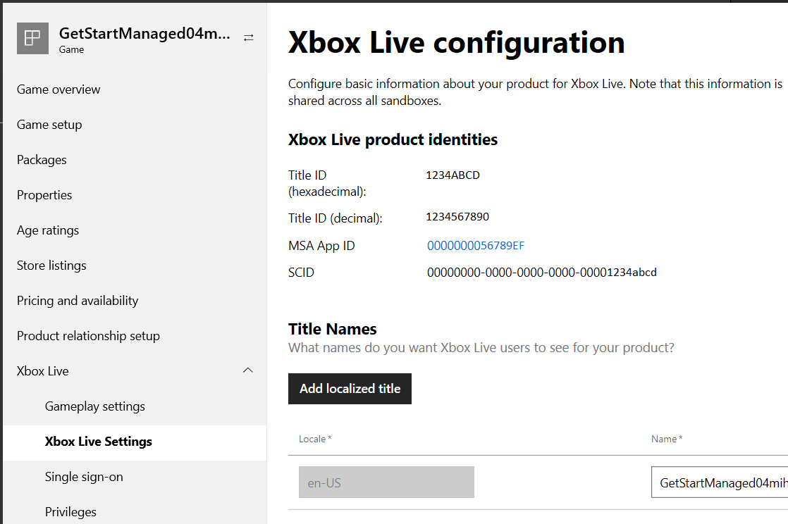

# Xbox Live service configuration IDs, for Managed Partners

## What is Service Configuration?

Xbox Live features to configure include [Achievements](../../features/player-data/achievements/live-achievements-nav.md), [Stats & Leaderboards](../../features/player-data/stats-leaderboards/live-stats-leaderboards-nav.md) and [Smartmatch Matchmaking](../../features/multiplayer/matchmaking/live-matchmaking-nav.md).

For example, Leaderboards allow players to see a value representing an accomplishment, in comparison to other players.
Such values include high scores in an arcade game, lap times in a racing game, and headshots in a first-person shooter.
But unlike an arcade machine, which only shows the top scores from the players who have played on that physical machine, with Xbox Live it is possible to display high scores from around the world.

For this to happen, you need to perform some one-time configuration so that Xbox Live knows about your leaderboard.
For example, whether the values should be sorted in ascending or descending value, and what piece of data it should be sorting.

<a href="https://partner.microsoft.com/dashboard" target="_blank">Partner Center &#11008;</a> is used to configure Xbox Live Services.

You can find information about specific Partner Center service configuration pages:
* [Portal configuration overview](live-portal-config-overview.md)

If you already have a title configured, you can scroll down to [Get your IDs](#get_ids) to learn how to get the various identifiers required to set up your title.

### PC/Mobile UWP game only

Partner Center is used for configuring and managing UWP games, including games that run on Windows 10 PCs and/or Windows 10 mobile devices.

#### Using Partner Center to configure UWP titles

You use Partner Center to configure UWP titles for all kinds of requirements, including:

* You have existing users, groups, and permissions set up on Partner Center.
* You are using tools on Partner Center such as the Tournaments Tool or Multiplayer Session Directory session history viewer.
* You are developing a title that will have cross-platform play between an Xbox One (or later) Xbox One Software Development Kit-based game and UWP PC/mobile version of the same game.

See below for how to use Partner Center to configure a UWP title.

### Separate versions of Xbox One and PC/Mobile games that are not cross-play

You may decide to keep your Xbox One (or later) version of a game separate from the PC/Mobile version of the same game.
In this case, you create two separate products, and follow the guidance for Xbox One Software Development Kit only and PC/Mobile UWP game only, respectively.

You cannot use the same service configuration for both versions in this case, and you must manually create the service configuration for each separate version of your game, in Partner Center.

## Get your IDs

To enable Xbox Live services, you will need to obtain several IDs to configure your development kit and your title.
These can be obtained by doing Xbox Live service configuration.

If you do not currently have a title at Partner Center, see the above section [Xbox Live Service Configuration portals](#xbox_live_portals) for guidance.

### Critical IDs

There are three IDs which are critical for development of titles and applications for Xbox One (or later): the sandbox ID, the Title ID, and the SCID.

It is necessary to have a sandbox ID to use a development kit.
However, the Title ID and SCID are not required for initial development, but are required for any use of Xbox Live services.
We therefore recommend that you obtain all three IDs at once.

#### Sandbox IDs

The sandbox provides content isolation for your development kit during development, ensuring that you have a clean environment for developing and testing your title.
The Sandbox ID identifies your sandbox.
A console may only access one sandbox at any one time, though one sandbox may be accessed by multiple consoles.

Sandbox IDs are case-sensitive.

When configuring your title in Partner Center, you get your Sandbox ID on the "Xbox Live" root configuration page as shown below:

#### Service Configuration ID (SCID)

As a part of development, you will create events, achievements, and a host of other online features.
These are all part of your service configuration, and require the SCID for access.

SCIDs are case-sensitive.

**To retrieve your SCID:**

1. Go to [Partner Center](https://partner.microsoft.com/dashboard).

2. Search for and select your product.

3. In the menu in the middle with black-on-white text, click **Xbox Live** --> **Xbox Live Settings**. The "Xbox Live configuration" page appears. In the section "Xbox Live product identities", the following are listed:
    * Title ID (hexadecimal)
    * Title ID (decimal)
    * MSA App ID
    * SCID

Your SCID is displayed as shown below:

#### Title ID

The Title ID uniquely identifies your title to Xbox Live services.
It is used throughout the services to enable your users to access your title's Live content, their user statistics, achievements, and so forth, and to enable Live multiplayer functionality.

Title IDs can be case-sensitive, depending on how and where they are used.

Your Title ID is found in Partner Center in the same table as the SCID in the *Xbox Live Setup* page.

