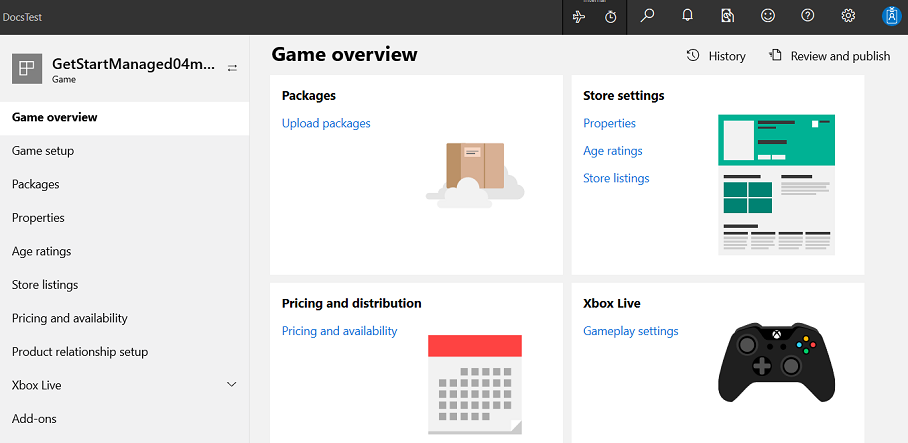
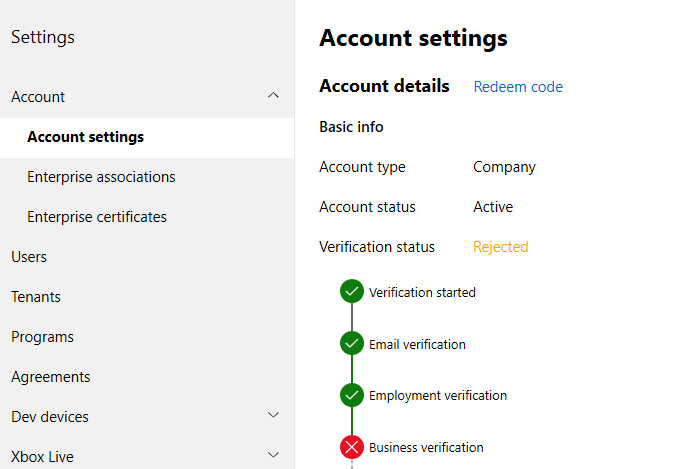

# Creating test accounts in Partner Center

>**Note** Creating test accounts requires that you have specific permissions to do so. Who has those permissions and who can grant them varies from studio to studio. If you don't have permissions to create test accounts, reach out to the person who gave you permissions to Partner Center and they may be able to give you permission to create test accounts or create them on your behalf.

To create [test accounts](live-test-accounts.md) for Xbox Live services, do the following.

1. In [Partner Center](https://partner.microsoft.com/dashboard/), click **Windows &amp; Xbox**, then **Products** on the left, and then click the product you created. The "Game overview" page appears:

   

2. Click the **Settings** gear in the upper right, then click **Account settings**. The "Account settings" page appears:

   

3. In the **Account settings** area in the middle, click **Xbox Live**: **Xbox test accounts**.

   The "Xbox Test Accounts" page will appear.  

4. Click the **Create a new account(s)** button. The "New test account batch" page will appear.

5. In the **Batch size** text box, enter a number, such as 5.

6. In the **Email template** combo box to the left of the hyphen, is shown the sandbox prefix.
   You can keep the value shown.

7. In the email text box to the right of the hyphen, enter the name of your game, without spaces.

8. In the **Keywords** text box, you can put your name.

9. Under **Sandbox access**, select the sandboxes you want the account to have access to.

10. Click the **Next** button.  The Xbox profile page will appear.

11. Fill in the **First name** and **Last name** text boxes.
   You can keep the default values "Test" and "Account".

12. In the **Password** text box, enter a password.

13. In the **Secret question** drop-down list, select a question.

14. In the **Secret answer** text box, enter an answer for the selected question.

15. In the **Recovery email** text box, enter an alternate email address.

16. Click the **Submit** button.

    The "Xbox Test Accounts" page appears, showing your new batch account name.

17. Once the status for your batch account name shows a checkmark, click the batch account name.  The **Edit: batch properties** page will appear.

18. Click the **View batch accounts** button. The accounts that were created will be listed with their email, Gamertag, and XUID.  
    You can use these account email addresses created in the batch later to sign in with an app, that can access the sandbox.

## See also

* [Xbox Live Test Account tool (XblTestAccountGui.exe)](../tools/live-xbox-live-account-tool.md)  
* [Xbox Live test accounts](live-test-accounts.md)  
* [Exporting Xbox Live test accounts](live-exporting-test-accounts.md)  