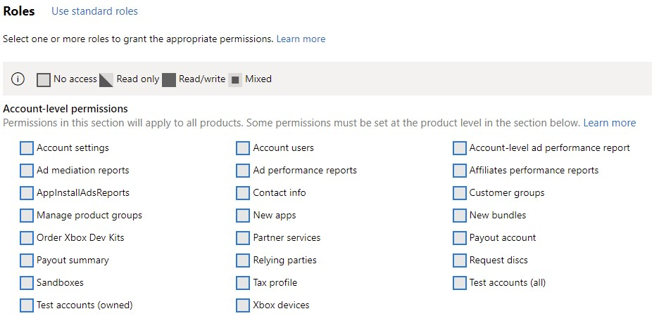

# Xbox Live test accounts

When testing functionality in your title during development, it can be helpful to create additional Xbox Live accounts.
For example, you might want a fresh account with no achievements. Or you might want to make several accounts and make them friends of each other for testing social scenarios.

To address these scenarios, you are able to create one or more test accounts.  

Test accounts are also able to sign into your *Development Sandbox*, whereas a regular MSA cannot due to security restrictions. For more information, see [Sandboxes](../sandboxes/live-sandboxes-nav.md).

## Creating Test Accounts

If you are in the Managed Partners Program, you may create test accounts exclusively for use in your development sandboxes. You can also create multiple test accounts at once. For the steps to create one or more test account, see [Creating test account](live-setup-testaccounts.md).

## Add granular permissions

If you are a managed partner and would like to allow more members of your team to create test accounts, use granular permission. This permission limits their view to only the accounts they created. After the privilege is set for select users (or groups), Account admins will still be able to see all Test Accounts created in the studio.

To add this permission in Partner Center:

1. Click on the gear icon at the top right. Then go to **Account settings**.
2. Select **User Management** on the left navigation pane.
3. Select or search for the user (or group) you'd like to modify
4. On the **customize permission** tab, select **Test account (owned)** and click **Save** at the bottom of the page.

## Exporting Test Accounts

If you are in the Managed Partners Program, then you may also export test accounts for viewing. For steps to export test accounts, see [Exporting Xbox Live test accounts](live-exporting-test-accounts.md).

### See also  

[Creating test accounts](live-setup-testaccounts.md)
