# Creating discs

Use this topic to submit a disc request, submit a test disc order, approve test discs, and create a Bill of Materials (BOM). You can only proceed with the instructions outlined in this topic if you have the proper permissions. For more information, contact your Microsoft account manager. 

## In this topic 
 * [Overview of discs](#ood)
 * [Overview of disc requests](#oodr)
 * [Prerequisites for submitting disc requests](#pfsdr)
 * [Scenarios of disc requests](#sodr)
 * [Order discs for a bundle product](#odfabp)
 * [FAQ](#faq)

## Overview of discs

Disc-based games represent an essential medium for distributing your title. In Partner Center, you can complete the following actions.
 * Create and configure a new disc request.
 * Select an Authorized Replicator (AR) for final retail disc replication.
 * Submit a test disc order for disc validation prior to final product replication by the AR.
 * Approve or reject test discs.
 * View and track the status of disc requests.

### Process of ordering discs

Ordering discs is a four-step process, as shown in the following screenshot. 

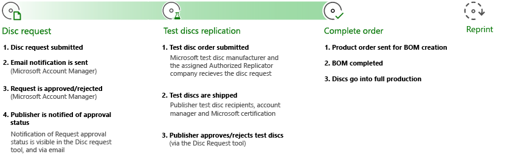

The following steps are included in the process shown. 
 * Disc request: 
   1. Your disc request is submitted.
   1. Your Microsoft account manager sends an email notification.
   1. The request is approved or rejected by the Microsoft account manager.
   1. The publisher is notified of the approval status by email and by using the Disc request tool.
 * Test discs replication: 
   1. The test disc order is submitted to the Microsoft test disc manufacturer and AR company.
   1. Test discs are shipped to the publisher, account manager, and Microsoft. 
   1. The publisher approves or rejects test discs via the Disc request tool.
 * Complete order:
   1. Product order is sent for BOM creation. 
   1. BOM is completed.
   1. Discs go into full production. 
 * Reprints
   * For more information about reprints, see [Reorders from the Submit the disc request](#step-sto) section in this topic.

### Process of BOM creation

The BOM is used as the basis for the created disc that’s going to production. This is created with your Microsoft account manager, and it’s submitted to the AR at the end of the disc request process. The contents of the disc are tested and signed-off by Microsoft certification and the publisher before the BOM is created.

## Overview of disc requests

If your game ships with physical disc media, verify that your game runs properly from all your binaries and media that are installed on the discs. You can do this before you mass-produce the discs.

When your binaries and media are ready, order the discs by selecting the **Disc** menu item on the **Request management** page in Partner Center. After your request is submitted, your Microsoft account manager reviews the request. If the request is approved, they submit the request to the Test Disc Printing sites to begin printing.

> [!NOTE]
> You can request the creation of discs only for products whose packages and listings are submitted for certification.

### The Smart Delivery method

Smart Delivery is available by using a disc and digital release, or by using full disc support. For more information about Smart Delivery titles for cross-generation gaming, see [Cross-generation gaming overview (NDA topic)](../cross-gen/cross-gen-overview.md).

#### Disc and digital release

With a disc and digital release, we recommend creating discs that contain one of the two packages that are needed for different console generations to save space on the disc. After the console connects to a network, it uses the license to acquire the package of the appropriate generation for installation.

#### Full disc support

With full disc support, you can add both .xvc files to the disc, which makes the disc available for offline use. The user doesn’t have to download the content unless there are content updates available.
To provide this experience to customers, select an Xbox Series X and an Xbox One package. The option to add both generations becomes available after you’ve uploaded at least one package of each generation for that product. For more information, see the [Configure disc content for a single product](#step-cdc) section in this topic.

### Sibling products

The sibling relationship feature connects two products. The digital product receives this configuration, and then the configuration is printed on the disc without further publisher input.

If any set of products that are published to a disc have a sibling relationship, we send that information with the metadata of the disc so that the console only installs one of the two products, even while it’s offline. You can see any sibling metadata that appears on a disc from the disc summary page of a specific request in Partner Center.

### Supported and unsupported scenarios

The following are supported scenarios for creating discs.
 * Multi-disc sets of up to nine 50 GB discs
 * Discs of 25 GB or 50 GB 
   > [!NOTE]
   > The size is determined automatically at creation time, and it’s based on the size of the content.
 * A multi-product bundle that’s created on a single disc or disc set and include games and durables.
* Reprints, to send a previously created and tested disc file to an AR.

The following are unsupported scenarios for creating discs.
 * Bundles that include subproducts from multiple publishers
 * Manual bundling of age ratings for disc packages
 * Disc sets that require more than nine 50 GB discs
 * Individual discs that are larger than 50 GB
 * Universal Windows Platform (UWP) product discs

## Prerequisites for submitting disc requests

Before submitting a disc request, prepare a product (or a bundle of products) for digital release. The packages and listings of the product must be submitted for certification, passed certification, or published to retail.

After your product is in the correct certification state, the packages and listings of the product are visible within the disc authorizing page.

Two additional requirements when creating content for a disc, that aren't requirements for digital release, are manual age ratings and promotional art. For more information about the physical age-rating process, see [XR-017: Title Ratings]( https://developer.microsoft.com/games/xbox/partner/xr017). Promotional art is the image that's used on the disc, and it’s required for disc creation. The image on the disc matches the promotional art asset from the listing that’s selected during the disc authoring process.

You can add the manual age ratings and promotional art later in the process, even after you've shipped digitally.

### Disc authoring access

To create discs, you must be a managed partner. 
> [!NOTE]
> Not all partners can create discs. If you don’t see the **Disc** page under the left  panel of a product page, contact your Microsoft account manager.
If you have manager-level access, but don’t see the **Disc** page, contact your Microsoft account manager to ensure that your account is enabled for disc authoring.
Account admin role types provide access to users through account management. The permission name is selected per product by selecting **Custom Permissions** > **Discs** > **Disc request**.

For more information about user account management, see [Set roles or custom permissions for account users](/windows/uwp/publish/set-custom-permissions-for-account-users).

## Scenarios of disc requests
Open the **Disc requests** page to submit your disc product as shown in the following screenshot. 
 
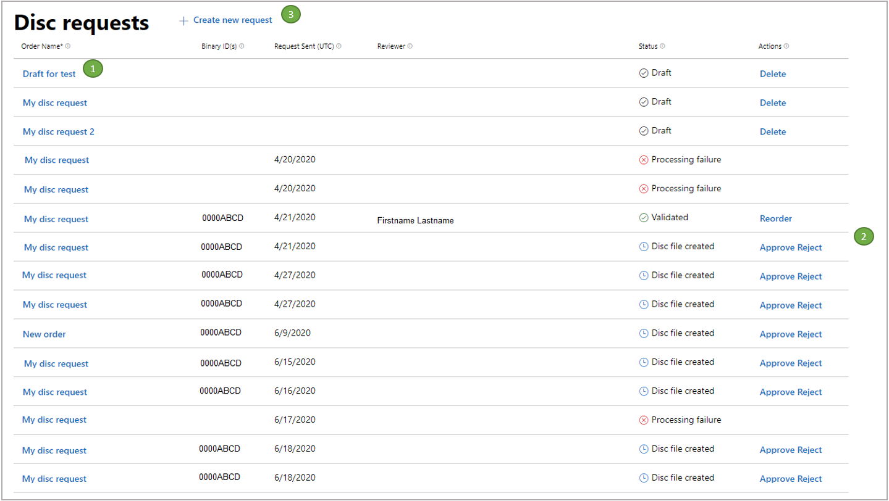

The following are the different sections of the **Disc requests** page.
 1. The **Order Name** column displays all disc requests that were submitted for your products. You can view the details of a disc request by selecting the order name.
 1. The **Actions** column displays all optional and required actions that are related to the order.
 1. Select **Create a new request**, and then the product determines whether a single-product request flow or a bundle request flow is required.

### Create a new disc request

When you create a new disc request, you’re prompted to name the request and configure the disc contents as shown in the following screenshot.

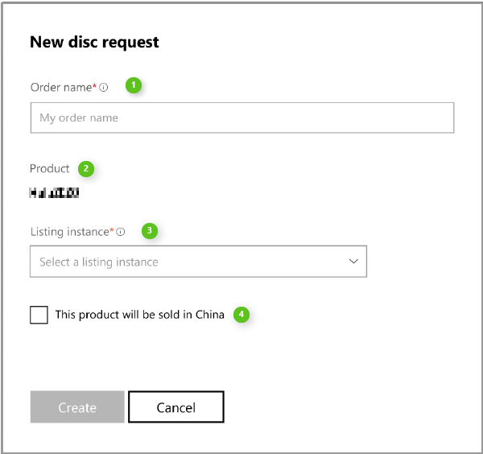

The following fields are found in the **New disc request** dialog box.

 1. Enter the title of your request in the **Order name** field. Use a friendly name so that tracking the request is easier. 
 1. The **Product ID** is fetched automatically, based on the way the product is set up in Partner Center.
 1. Select one of the available store listing instances from the **Listing instance** drop-down list box.
   * Listings are displayed after they’re submitted to Microsoft certification or used in retail.
   * You can select the  store listing if your product has a featured promotional art asset.
 1. Select the check box if your product is intended for sale in China.

#### Configure disc content for a single product

The configuration of the product determines if the disc request flow initiates a single-product order. Use the **Configure disc content** page to edit the product information as shown in the following screenshot.

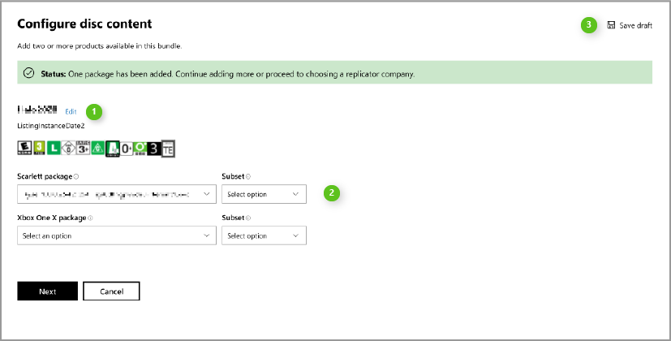

Adding at least one package is required for completing your order. Edit your product information by using the following steps. 

>: **NOTE:** Disc files that are greater than 50 GB automatically are made into multiple disc binaries. If you’re concerned that the size is close to the single disc limit, contact your Microsoft account manager. They will verify the number of disc binaries that are produced before passing the disc to the "test printing" stage. 
>You may also use a `maxDiscs` variable in your disc layout file to guarantee a failure error appears when the size is too large.

 1. Select **Edit** to configure your order name or product listing instance, if necessary.
 1. Select the correct Xbox Series X&#124;S package by using the **Scarlett package** drop-down list box. 
    * The **Subset** drop-down list box is available when a selected package was uploaded with a disc layout file that contains subsets. Use the **Subset** drop-down list box to select any subsets, if available. 
     > [!NOTE]
     > If the file is correctly formatted, it's parsed into the subsets that are defined. Select one or none to determine which content is used on the disc from the .xvc file.
 1. Dual-package options appear when a product is configured to support multiple platforms. Select the correct Xbox One package by using the **Xbox One&nbsp;X package** drop-down list box. 
     > [!NOTE]
     > If packages are only uploaded for Xbox One family of consoles or Xbox Series X&#124;S consoles, a single drop-down list box appears on the **Configure disc content** page. 
     >You can select dual packages so that the user receives the native Smart Delivery experience. For more information about Smart Delivery titles for cross-generation gaming, see [Cross-generation gaming overview (NDA topic)](../cross-gen/cross-gen-overview.md).
 1. After you’ve completed configuring your disc content, select **Next**.

The option to select **Save draft** is currently unavailable. To save a draft, complete a viable draft and select **Save** on the summary page. 

#### Select disc AR

After the disc contents is defined, choose one or more ARs for retail disc manufacturing. This is usually based on the region in which the final product is distributed.

The files that are required to make the disc are sent to the AR. However, the AR won’t print discs until the following is complete.
 * You have approved your test discs.
 * Microsoft has approved your test discs.
 * A valid BOM is submitted.
 * An order is placed with the AR.

Microsoft sends the disc files to the intended AR. However, the partner sends orders to the AR, as well as handles the associated financial arrangements. These processes include the following steps on behalf of the AR and partner.
 1.  A new disc request is created that includes the AR selection.
 1. The disc files are sent to the AR for final replication. These files are also sent to Microsoft test disc manufacturing sites for test disc production.
 1. Test discs are manufactured, shipped, and approved by the partner and Microsoft.
 1. The BOM progresses to an release to manufacturing (RTM) state.
 1. Microsoft notifies the AR that the BOM is in an RTM state.
 1. If the AR has an order and purchase order (PO) that’s sent by the partner, the AR can begin final product replication.

> [!NOTE]
> The AR selection process is separate from the test disc manufacturing as shown in the following screenshot. Microsoft automatically handles the test disc manufacturing process.

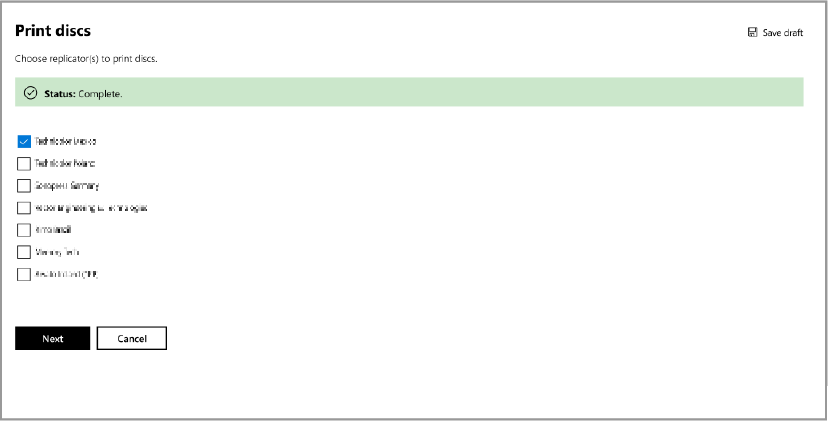

#### Ship your test discs

When test discs are printed, one primary recipient receives 100 discs, and up to two secondary recipients can receive 25 discs each. The primary recipient is required so that you can complete the order.

Test discs are sent to the recipients that are listed in the **Ship test discs** page as shown in the following screenshot. This is a preliminary step so that the requestor and the Microsoft certification team can evaluate the product prior to submitting the BOM.

Microsoft orders test discs when the submission has passed the initial build verification tests (BVT). Test discs are shipped to the specified locations on the **Ship test discs** page in Partner Center.

It’s important that you choose the correct location for test discs to be shipped to complete your internal media verification checks. The partner has the ultimate responsibility of approving and validating that test discs work as expected. Depending on location and test disc production, distribution generally takes three to five business days.

Use the following steps to complete the **Ship test discs** page in Partner Center.
 1. To add a primary recipient, select **Primary (100 discs)** .
 1. Enter the recipient’s full name, shipping address, email address and phone number in the available fields. 
 1. If you want to add secondary recipients, select **Add Another Recipient.** Then select **Secondary (25 discs)** and enter the secondary recipient’s information in the available fields.
 1. After completing the form, select **Next**.

> [!NOTE]
> To remove any recipients from the form, select **Remove** in the top-right corner of the page.

The requestor can approve or reject discs. Approval is required to proceed with the order. The requestor is prompted to approve or reject the order from the **Disc requests** page and **My Disc Request** page as shown in the following screenshot.

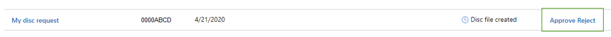

#### Submit the disc request

Submitting the disc request is the final step, and it’s the last opportunity you have to review or edit the order as shown in the following screenshot. Submitting the disc request is required to complete the order.

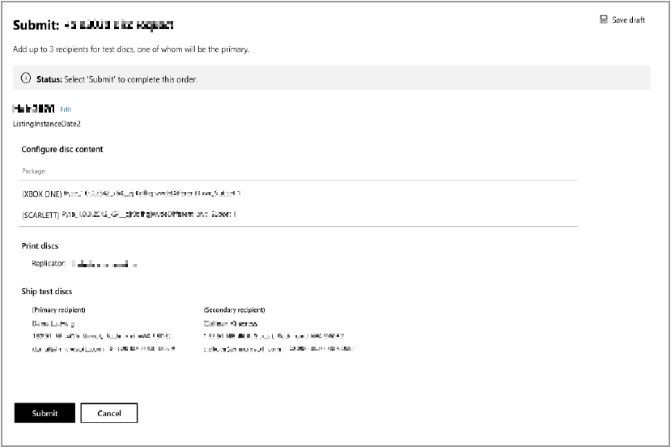

### Order summary

After submitting an order, an email is sent to your Microsoft account manager for review.
You can view the order details by selecting the order name on the **Disc requests** page. The **My Disc Request** page includes the **Disc request status** as shown in the following screenshot. You can see what steps are pending or completed, and any errors that are blocking the order process.

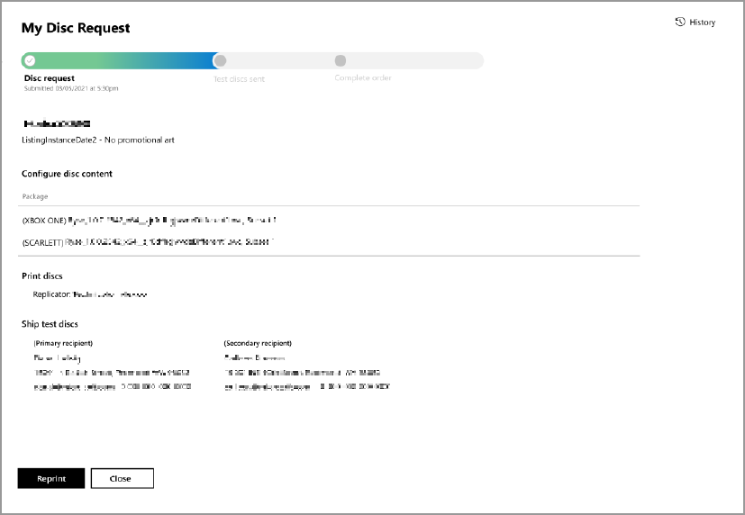

### Reorders

A disc request can be reordered. This is a good option if you want to sell more copies of an already released title, by sending the previously tested and created disc file to an AR.

You don’t have to make changes to the disc file. The original file is sent to the AR that’s selected by the publisher at the time of reordering.
As a publisher, arrange replication with the AR as you would when creating a new disc request.
Because this disc was already approved and replicated, certification or test discs aren’t created.

## Order discs for a bundle product

Ordering a bundle product is like ordering a single product. List the subproducts and their associated listing instances when configuring the disc content. After starting a bundle product request, a dialog box appears as shown in the following screenshot.

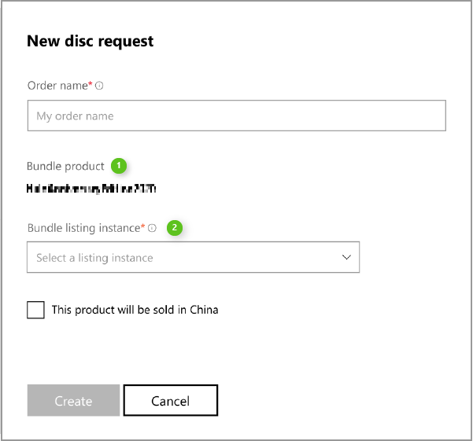

Edit your bundle product order by using the following steps.
 1. Enter in a unique name in the **Order Name** field.
 1. Select a listing instance from the **Bundle listing instance** in the drop-down list box.
 1. After completing the form, select **Create**.

### Configure disc content for a bundle product

You can use the **Configure disc content** page to configure your bundle product. Select **Add products from the bundle** to include all necessary products for the disc as shown in the following screenshot.

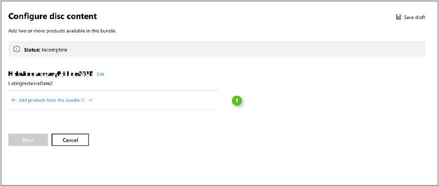

When you individually add products to the bundle, the publisher can flexibly select which items to include on the physical disc. The publisher associates each product in the bundle to the listing instance and package as shown in the following screenshot. This is in addition to the parent product and listing instance. Product orders must include promotional art and physical age ratings. 
> [!NOTE]
> This policy is subject to change with the new feature of manual age ratings for bundle products. For more information about the physical age rating process, see [XR-017: Title Ratings]( https://developer.microsoft.com/games/xbox/partner/xr017).

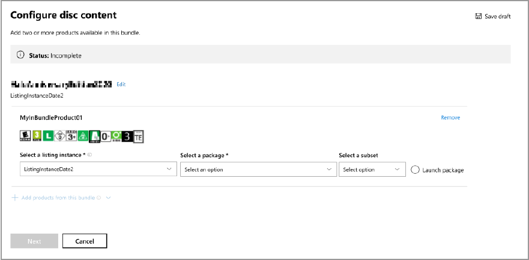

The following steps are the same as they are for a single product. 
 * [Select disc Authorized Replicators](#step-sar)
 * [Ship test discs](#step-std)
 * [Submit the disc request](#step-sto)

### Publisher approval

After receiving and validating your test discs, select **Approve** or **Reject** from the **Discs requests** page as shown in the following screenshot.

Your selection permanently changes the state of the disc order, and the state change is recorded on the **Disc requests** page.

If you reject the order, the order remains in the system with a permanent status of "Rejected". Create a new request to start the process over.

## FAQ

### Why can't I change an order when reordering?

Reorders bypass the testing and certification phase. Reorders don’t require authorization. The existing disc file that's already been approved is sent to a selected AR.
Selecting the AR is the only selection that’s required from Partner Center. Changing the content and the configuration of a disc requires the same certification protocol that’s done for a new disc request.

### Why can't I see my listings or packages?

Listings and packages are only visible in Partner Center if the title is in retail, or if certification is submitted.
If the listings and packages aren’t visible, and you’ve submitted them to certification, use the **My Disc Request** page to determine if they were rejected during the certification step.

### How much time does the test disc process take after submitting my order?

The Service-Level Agreement (SLA) for certifying a disc submission is six business days. When BVT completes, the test discs are ordered.
Test discs usually take three to five business days to arrive at your recipients’ addresses.

### How much time should I allow for final product replication?

Final product replication can take up to four weeks. However, this can vary due to seasonality.
Submit your disc request at least six weeks prior to the retail release date for your title. For replication information, contact your AR. 

## See also

 * [Creating test discs (NDA topic)](creating-test-compilation-discs.md)
 * [Creating cross-generation test discs (NDA topic)](creating-cross-gen-test-discs.md)  
 * [Multi-disc functionality](packaging-multi-disc.md)