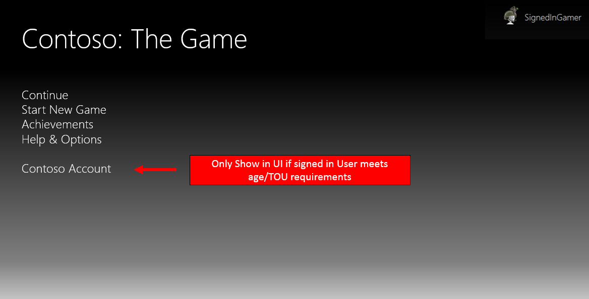
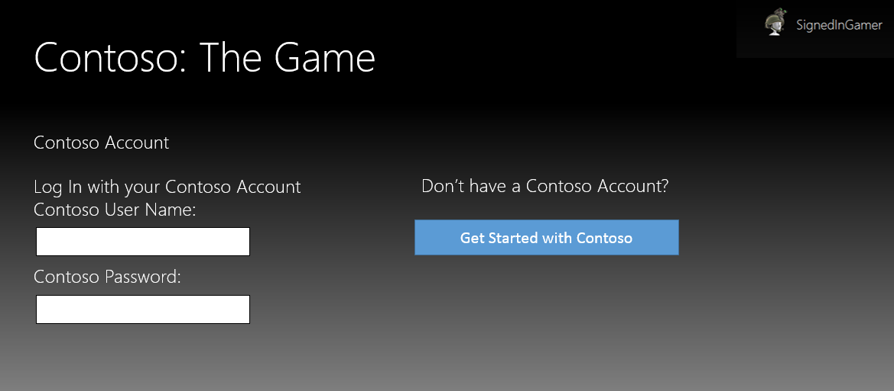
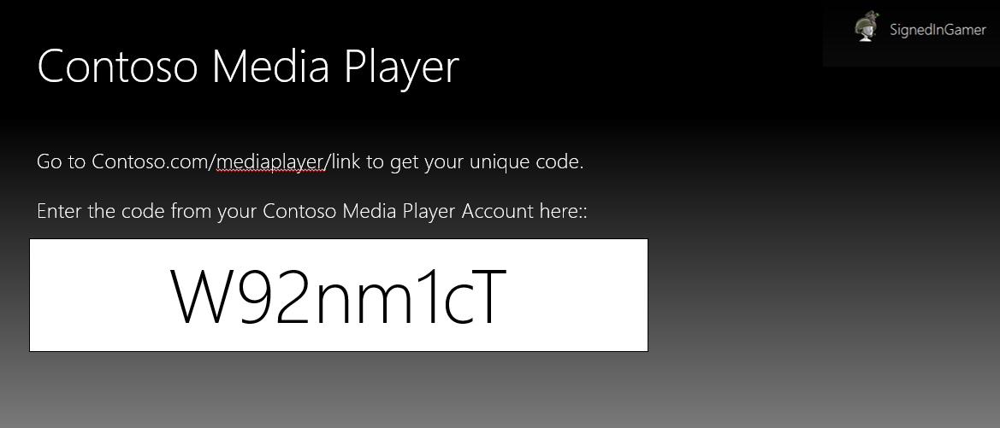
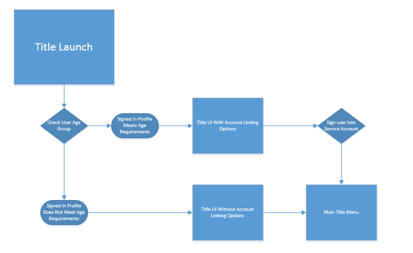
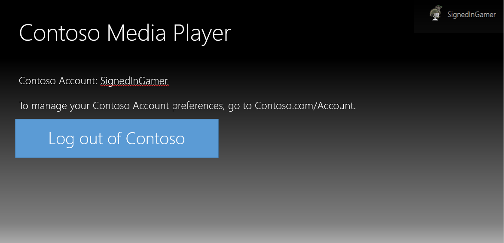

Version 1.1, 9/1/2020

# XR-013: Linking Microsoft Accounts with Publisher Accounts \* 

On Xbox consoles, titles that use partner-hosted services or accounts that require credentials must link that account with the user’s Microsoft account.  

Outside of Xbox consoles, titles can choose to allow account linking to support their game experience.  

If account linking is enabled within the title, the following rules apply: 
* Users must be notified of the account linking and given the choice to opt-out.
* If any account linking or access to partner hosted services is enabled, it must be made available to all users/account types. 
* Linked accounts must be authenticated prior to linking. 
* Users must be provided all applicable terms of use, privacy and other policies within the title (or a notice with a link to such information) both during the linking process and for as long as the accounts are linked.
* Users must have the ability to de-link accounts. 

## More Information

Remarks: For more information about account linking, including definitions, best practices, and frequently asked questions, see the [Account Linking Best Practices][(https://developer.microsoft.com/games/xbox/partner/development-education-whitepapers).

**Account authentication**: Titles performing account linking or account creation on the console must follow secure authentication procedures. Authentication can happen within the title or a partner website, or it can happen independently using a token to link authenticated accounts.

**Accommodate all users**: Titles must accommodate account linking for all users if a linked account is required for gameplay. Publishers are responsible for ensuring the link to their service is handled in a manner that is compliant with the Children’s Online Privacy Protection Act (COPPA) for titles shipping in the US.

**Unlinking**: Users must have the ability to unlink publisher or service accounts from their Microsoft account. Linked Account Management is permitted in title, on the web, or in a third-party experience.

**Single sign-on**: Titles must implement single sign-on with any device after an account link has been made for a user.

**Intent**: Ensure that users have a consistent and safe experience when linking their Microsoft account to a publisher or service account.

## Implementation Guidance and Best Practices

## Account Linking Best Practices

Xbox users have come to expect much more than just games from their
entertainment systems. But even with content providers offering dozens
of services across a diverse range of categories, no single provider can
effectively serve every user's needs. Account linking---that is,
allowing Xbox console users to use their Microsoft account as a log-in for
all of their interactive services---is an ideal solution to this
problem. This white paper provides an overview of how account linking
works on Xbox consoles, and it explains the best practices and Xbox
Requirement (XR) for including this feature in your title.

### Account linking fundamentals

The term *account linking* refers to establishing a relationship between
a user's Microsoft account (what used to be known as an *Xbox Live
account*) and his or her account on another service. With account
linking, data is shared between the two accounts. Although the value and
purpose of the linked account will vary greatly from title to title,
account linking typically enables account holders to use Xbox consoles to
access services offered by the linked account. This feature eliminates
the need for users to remember different logins, a convenience that can
greatly enhance the user experience and add significant value to your
title.

#### Potential risks associated with account linking

The convenience offered by account linking comes with a price. Although
the value of having linked accounts is unquestionable high, not taking
proper precautions when creating and linking accounts can lead to abuse,
fraud, privacy violations, and other potentially harmful risks to
user safety.

### Fraud

Perhaps the biggest risk associated with account linking is the
potential for fraud. It can lead directly to financial loss for users,
your title, or your community, especially in the case of links to
accounts with paid subscriptions or services. Fraud typically involves
an attacker finding a way to link a victim's account to one that the
attacker owns. After the accounts are linked, the attacker can gain
access to the services or information available in the victim's account,
such as his or her credit card number or other personally identifiable
information (PII).

The following is an example of how careless account-linking
implementation could lead to fraud.

-   *Allowing users to link their movie-rental service account to their Microsoft account by simply entering their Gamertag on the movie-rental service website.* Enabling the website to link accounts by requesting a user's Gamertag without requiring any account authentication would make it possible for attackers to link to *any* Gamertag. This could result in attackers' gaining access to valid users' paid service or exposing PII that could be used later for other attacks.

The best way to mitigate the potential for fraud is to require that both accounts be authenticated before completing the account linking. For more information about best practices pertaining to authentication, see the [Account linking do's and don'ts](#authentication) section later in this document.

### Violation of privacy

Potential violation of users' privacy is also a major risk factor
associated with account linking. Title publishers that manage users' PII poorly, or that collect and share data from a linked account without user consent, can be subject to significant fines from the Federal Trade Commission (FTC). In addition to FTC penalties, privacy-violation blunders can result in major public relations disasters for publishers---which can also result in financial loss.

Examples of account-linking practices that pose privacy risks include:

-   Collecting and sharing PII from a linked account without user consent.
-   Gathering data from a user's account to create PII (such as time or location data).
-   Sharing a user's protected data (such as height, weight, age, or gender) without proper consent.

If your title collects or displays PII, you should talk to your account
manager about setting up a review with a Microsoft Privacy Manager.

### Safety risks

Poor implementation of account linking can also create risks to user
safety. For example, the Children's Online Privacy Protection Act
(COPPA) requires web sites and online services to obtain parental
consent before attempting to gather any data from a user who is under
age 13 in the United States. If the way a title links accounts is in
violation of COPPA---that is, results in improper collection of data
from a user under age 13---and the data is not kept secure, the child's
personal safety could be at risk.

User safety can also be put at risk when data or content within the
linked account is used inappropriately or is used to cause abuse.

If your title collects or displays PII, you should talk to your account
manager about setting up a review with a Microsoft Online Safety
Manager.

### Requirements for account linking

To help promote a consistent and positive user experience, mitigate the
potential risks associated with account linking, and ensure that account
linking is both easy and safe to implement, Microsoft has established
some requirements and policies around this increasingly popular feature.
All Xbox console titles that will enable account linking must meet the Xbox
Requirement (XR) entitled *Linking Microsoft Accounts with Publisher
Accounts.* This requirement includes four main points: account
authentication, account age, unlinking, and single sign-on.

#### Account-link authentication

Titles must authenticate both the Microsoft account and the publisher
account being linked before establishing an account link between the
services, and they must follow secure authentication procedures. The
intent of this requirement is to ensure that user account information is
protected from unauthorized exposure during account creation and
linking. Practicing good authentication methods is one of the best ways
to mitigate the risk of fraud in your account-linking flow. Ensuring
that a user authenticates both accounts before the link is completed
will make it much more difficult for attackers to access user accounts.
Making sure that authentication is well-executed is key to keeping Xbox
Live and your title safe from fraud.

#### Accommodate account linking for all users if a linked account is required for gameplay

Titles must accommodate account linking for all users if a linked
account is required for gameplay. Publishers are responsible for
ensuring that the link to their service is handled in a manner that is
COPPA-compliant for titles shipping in the United States.

A scenario in which this requirement would apply could be a title that
is created for all audiences, carries an ESRB rating of E, and requires
a linked account to play. In order to play the title, users would need
to create an account on the title service and link that account to their
Microsoft account. Where your title might run into a problem is when a
child wants to play the game but is blocked by the account-linking age
requirement. Because the child expects the title to accommodate him or
her because of the E rating, the child might feel cheated after having
paid for the title but being unable to access it. This scenario might
also encourage users to play the title using a different account or even
to falsify their age. The intent of this requirement is to ensure that
all users who fall within a title's rating are able to play the title
they purchased.

Titles can check a user's age group by calling the **UserAgeGroup**
property. The **UserAgeGroup** property does not require an exception to XR-014, *Personal Information*.

Member | Value | Description
|-|-|-|
Adult | 3 | User is an adult.
Child | 1 | User is a child.
Teen | 2 | User is a teen.
Unknown | 0 | User age is unknown.

#### Validate the user's age prior to creating accounts (US only)

Before offering account creation features to a Microsoft account user in
the United States, titles must validate that the user's age prior to
creating an account. The intent of this requirement is to encourage
publishers to handle the creation of accounts on their service in a
manner that is COPPA-compliant for titles shipping in the United States.

Titles can check a user's age group by calling the **UserAgeGroup**
property. The **UserAgeGroup** property does not require an exception to
XR-014, *Personal Information*.

 | Member | Value | Description
 |--------|-------|------------
 | Adult | 3 | User is an adult.
 | Child | 1 | User is a child.
 | Teen | 2 | User is a teen.
 | Unknown | 0 | User age is unknown.

#### Unlinking

Users must have the ability to unlink publisher or service accounts from
their Microsoft account. Title can choose to handle the unlinking
process within the title, within a web experience, or within a hub app.
There is not an explicit requirement to facilitate unlinking within the
title, only that players do have a method to unlink their account should
they want to. The intent of this requirement is to ensure that users can
change and manage the accounts they have linked to their Microsoft
account.

As more data is being saved in the cloud, users trust services to make
the right decisions with how their data is treated. Users are more
likely to share data with an account when they know they have control
over the data that is being captured. Should something happen to a
service where user trust is broken, or a user becomes uncertain of the
safety of their data, users must be able to easily break the connection
between the linked accounts.

#### Single sign-on experience

Titles must implement single sign-on after an account link has been
made. The intent of this requirement is to give users a consistent and
seamless experience on Xbox consoles without requiring them to remember
multiple logins and passwords.

Xbox users expect experiences to "just work." When users link their
Microsoft account with another service, they expect that link to persist
beyond the initial session and setup. Single sign-on means that the
title automatically signs the user in to his or her linked account when
using the title. In order to keep sensitive or private information from
being stored locally on the console, titles should use the Xbox Secure
Token Service (XSTS) to facilitate a single sign-on experience. For more
information about XSTS 

 talk to your account manager.

### Do's and Don'ts

#### Authentication

**Do**

-   Link accounts by using the user's Partner XUID (PXUID) instead of his or her Gamertag, because although users might change their Gamertags, their PXUID will remain the same.

-   Validate ownership of the Gamertag to link accounts (a relationship is created between the user's PXUID and the publisher's internal ID number).

    -   **Example 1:** A user signs in to his or her Microsoft
        account on the console and launches the title for the first
        time. The title verifies that the user meets the age
        requirements and provides an option for the user to link to an
        existing publisher account or create a new publisher account. To
        link to an existing publisher account, the user enters his or
        her username and password for the publisher account; this links
        the signed-in user's PXUID to the publisher account. If the user
        does not have an existing publisher account, he or she is
        prompted by the title to create a new account by choosing a
        username and password. After the user has entered a username and
        password, his or her PXUID is linked to the publisher account.

    -   **Example 2:** A user logs in to the publisher or
        service site using the publisher's account-authentication
        mechanism, with account ABC. Following the site's prompt, "Sign
        in with your Microsoft account associated with your Gamertag,"
        the user logs in to the website with his or her Microsoft
        account ID. The publisher takes the user's access token to 
        retrieve an X-token for the publisher's Relying Party and 
        extracts the PXUID from the X-token to identify the user.  The 
        publisher or service then creates the relationship 
        between the publisher account or service and the PXUID
        associated with the user.

    -   **Example 3:** A user logs in to the publisher site
        using the publisher's account-authentication mechanism, with
        account ABC. The website displays a unique code, such as 123, to
        the user and instructs the user to log in to his or her console
        and enter the code. The user logs in to the console with his or
        her Gamertag and enters the code 123. The code is then
        transmitted back to the publisher site, creating the
        relationship between the publisher account or service and the
        PXUID associated with the user.

-   Give users the option to read the publisher or service's TOU and
    Privacy Statement while the account linking is taking place and the
    account-linking screens are displayed.

**Don't**

-   Use a user's Xbox User ID (XUID) for account linking. It is
    considered PII and should not be stored for account-linking
    purposes. The Pairwise ID should be used instead.
-   Allow the user to log in to the publisher account site using an
    authentication mechanism that is based on the user's Gamertag. In
    other words, don't enable account linking in which the user enters
    his or her Gamertag on the publisher or service website and the
    publisher activates the relationship between the publisher or
    service account and the XUID associated with the user's Gamertag.
    With this kind of mechanism, it would be possible for a user to log
    in using someone else's Gamertag and thus link his or her own
    publisher account with someone else's Microsoft account.

    **Note** The user's XUID might be needed for making service-to-service calls between a publisher's server and Xbox Live services. For these scenarios the XUID can be temporarily stored while it is needed. Contact your developer account manager if you are using service-to-service calls.

#### Account linking for child and teen accounts

**Do**

-   For child accounts:

    -   Require parental consent before creating an account for a child
        under 13 (under 14 in Korea and Spain).

    -   Provide explicit notice about the content ratings for the title,
        website, or service, as well as complete information about the
        capability of the title or site to integrate with social media.

    *Parental consent*, which includes explicit acceptance of the publisher's TOU and Privacy Statement, must be provided on the publisher's website, not on Xbox Live. 
    
    This practice ensures that titles don't provide a child with alternate means of viewing content or communicating with others if his or her parents have not authorized it or want the child to only communicate with and/or see content from known friends.

    **Note** Publishers are responsible for complying with all laws and regulations applicable to child accounts in all countries and regions in which their products and services are sold and made available.

-   For teen accounts:

    -   Provide teens (ages 13--18, except 14--20 in Korea and 14--18 in
        Spain) who create a linked account with complete information
        about the title or site's capabilities for integrating with
        social media.

    -   Ask teens to notify their parents about having created the
        account creation. This includes the ability to accept the TOU
        and Privacy Statement for the teen. We recommend that the teen
        be required to accept the TOU and Privacy Statement on the
        publisher's website and not through the title.

#### User age

**Do**

-   Enforce all applicable legal and regulatory requirements regarding
    child online privacy and safety for all regions and services in
    which the title or service is available.

    -   **Example** Children's Online Privacy Protection Act
        (COPPA) in the United States (<http://www.ftc.gov/privacy/coppafaqs.shtm>).

-   Block younger users from creating accounts on websites or services
    that are clearly aimed toward mature or adult audiences. Although
    this is not an explicit requirement, we strongly encourage it as a
    best practice.

    -   **Example:** Using the **UserAgeGroup** property, a
        publisher prevents a user with a Microsoft account age of 13
        from creating a website account for a popular M-rated title.

-   Separate by title rating any content that is accessible through
    publisher-managed accounts. Although this is not an explicit
    requirement, it can create a safer and more positive customer
    experience for younger users.

    -   **Example:** A parent might be amenable to linking
        to a community site for an E‑rated title but not an M-rated
        title because of the nature of the content as well as the
        general age and maturity of each community.

-   Use the lower of the two user ages if the age on the user's
    Microsoft account is different from the age on his or her publisher
    account.

    -   **Example:** If the user's age on the publisher
        account is 15 and the user's age on his or her Microsoft account
        is 13, the title or service treats the user as being 13.

-   If the publisher's site gathers a user's age when setting up an
    account, and the user's age is under 13, the site should:

    -   Inform the user that he or she does not meet the site's age
        requirements and therefore is not permitted to create an account
        at that time.

    -   Drop a session cookie so that the user cannot refresh the page
        and provide a different age.

    -   Destroy any personally identifiable information (PII) already
        gathered for the user.

#### Unlinking

**Do**

-   Give users the ability to break the association between their PXUID and the account ID on the publisher site.

-   \(1) Inform users about how their PII or Gamertag can be associated with the social service, (2) provide users with options regarding how their information will be used on the site, and (3) require explicit user action and notification to associate and/or display the user's Gamertag with his or her account on the site.

    -   **Example:** If a link is made to a title's site, the site can display the user's Gamertag but should not show the user's real name or other identifiers to others. Users can create a profile and choose to link their Gamertag with their personal information, but this option should be explicitly presented.

-   Give users the ability to disassociate their PXUID and their
    publisher ID from the console as well as the publisher's web portal.

-   Provide users with full control of their account linking either
    through the title, website, or dedicated hub app. This should
    include settings for parental consent (if applicable), account
    linking and unlinking, single sign-on, and review of the applicable TOU and policies.

#### Single sign-on

**Do**

-   Ask users for their log-in information when they launch the
    application for the first time on the console. An example of this
    exploit could be if application A, an instant messaging application,
    asks a user for their publisher A account login. If application B, a
    file storage application, provides automatic sign-in and used the
    same publisher A login from application A, then an attacker could
    use the cached credentials from application B to download and access
    the file storage in application B without needing the publisher
    A login.

**Don't**

-   Store any PII on the console.

### Examples of great account linking

The following examples provide a high-level look at some of the
account-linking best practices discussed earlier.

#### Authentication

The following three examples are illustrative of the authentication
best practices discussed previously.

>**Example 1:** A user signs in to his or her
Microsoft account on the console and launches the title for the first time. The title verifies that the user meets the age requirements and provides an option for the user to link to an existing publisher account or create a new publisher account.
>
>
>
>To link to an existing publisher account, the user enters his or her username and password for the publisher account; this links the
signed-in user's PXUID to the publisher account.
>
> 
>
> If the user does not have an existing publisher account, he or she is prompted by the title to create a new account by choosing a username and password. After the user has entered a username and password, his or her PXUID is linked to the new publisher account.

> **Example 2:** A user logs in to the publisher or service site using the publisher account-authentication mechanism, with account ABC.
>
> 
>
> Following the site's prompt, "Sign in with your Microsoft account
associated with your Gamertag," the user logs in to the website with
his or her Microsoft account ID.
>
> 
>
> The publisher takes the user's access token to retrieve an X-token for the publisher's Relying Party and extracts the PXUID from the X-token to identify the user.  The publisher or service then creates the relationship between the publisher account or service and the PXUID associated with the user.
> 
> For more information on how to enable Microsoft account sign-in, see
the MSDN topic, *[Single sign-on for apps and websites](http://msdn.microsoft.com/en-us/library/dn631824.aspx).*

> **Example 3:** A user logs in to the publisher site using
the publisher's account-authentication mechanism, with account ABC.
>
> 
>
> The website displays a unique code, such as 123, to the user and
instructs the user to log in to his or her console and enter the code. The user logs in to the console with his or her Gamertag and enters the code 123. The code is then transmitted back to the publisher site, creating the relationship between the publisher account or service and the PXUID associated with the user's Gamertag.
>
> 

#### User age and publisher TOU

The following flowchart depicts a good example of age/TOU validation:

#### Unlinking

Create a simple UI to allow users to unlink their Xbox profile from a linked service. We do not recommend either hiding unlinking options deep in the UI or requiring users to call technical support to unlink accounts.

### References

-   [Xbox Requirement XR-013](#xr013), *Linking Microsoft Accounts with Publisher Accounts*
-   Your Xbox One Title, XSTS Tokens, and Web Services [(Xbox Developer Downloads->Xbox One->All Xbox One XDK CHMs)](https://www.microsoft.com/en-us/software-download/devcenter).
-   [Appropriate age **UserAgeGroup** property](#Windows.Xbox.System.UserAgeGroup)
-   [Single sign-on for apps and websites](http://msdn.microsoft.com/en-us/library/dn631824.aspx), Microsoft Developer Network (MSDN).
-   [Children\'s Online Privacy Protection Act (COPPA)](http://www.business.ftc.gov/privacy-and-security/childrens-privacy)

## Additional Resources

## Certification Test Cases

**013-01 Linking Microsoft Accounts with Publisher Accounts**
  
>
>**Test Steps**  
>1. Verify that the title supports or requires non-Xbox accounts or login for services or functionality.
>2. Using a newly created Xbox profile, use the publisher provided service account or login to enter non-Xbox account credentials during initial setup.
>3. Verify the title allows the user to view the terms of use in the app, or informs the user how to view the terms of use, prior to completing the account linking process.
>4. Verify that the user is not prompted to reenter his or her non-Xbox account credentials in any location.
>5. Sign out and sign back in while the title is running.
>6. Repeat Step [4].
>7. Terminate and reactivate the title using the same profile.
>8. Repeat Step [4].
>9. Terminate the title.
>10. Verify that the title does not store non-Xbox account credentials locally by deleting any saved files that may have been created by the title.
>11. Reactivate the title and repeat Step [4].
>12. On a different console, launch the title using the same profile and repeat Step [4].
>13. Verify the title provides a method to view the terms of use while the accounts are linked.
>14. Verify the user is able to unlink their Xbox profile from the non-Xbox account.  
>
>**Expected Result**  
>The user should only have to provide his or her credentials once and allows the user to view the terms of use, or informs the user how to view the terms of use, prior to completing the account linking process.  Users are provided with a mechanism to unlink their Xbox profile from their non-Xbox account.  
>
>**Pass Examples**  
> 1. The title never asks the user to reenter his or her non-Xbox account or login credentials at any point after he or she has initially entered them and the title provides a notification of the terms of use both during the linking process and for as long as the accounts are linked.  
>
>**Fail Examples**  
> 1. The title requires the user to enter his or her non-Xbox account or login credentials every time the title is launched.
>2. The title requires the user to enter his or her non-Xbox account or login credentials when running the title from another console.
>3. The title does not provide a method for viewing the terms of use during the account linking process.
>4. The title does not provide a method for viewing the terms of use after the accounts are linked.
>5. The title does not provide a method for unlinking their Xbox profile from their non-Xbox account.