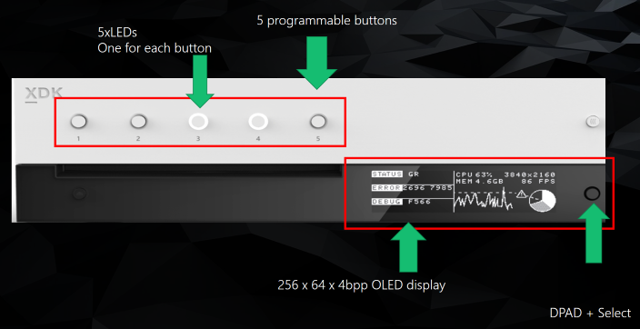

# XFrontPanelSetLightStates  

Sets the states of the front panel lights.  

<a id="syntaxSection"></a>

## Syntax  

```cpp
HRESULT XFrontPanelSetLightStates(  
         XFrontPanelLight lights  
)  
```  

<a id="parametersSection"></a>

### Parameters  

*lights* &nbsp;&nbsp;\_In\_  
Type: [XFrontPanelLight](../enums/xfrontpanellight.md)  

Value that specifies the new states of the front panel lights.  

<a id="retvalSection"></a>

### Return value  

Type: HRESULT  

Returns `S_OK` if successful; otherwise, returns an error code.  

<a id="remarksSection"></a>

## Remarks  

The front panel of the Xbox One X dev kit includes five lights that correspond to the five programmable buttons.  

  

For the *lights* parameter, combine values from the [XFrontPanelLight](../enums/xfrontpanellight.md) enumeration by using the bitwise OR operator.  

To get the current states of the front panel lights, use [XFrontPanelGetLightStates](xfrontpanelgetlightstates.md).  

For more information, see [Xbox One X: Using the front panel display (NDA topic)](../../../../tools-console/usinggsdk/scorpio-frontpanel.md).  

<a id="requirementsSection"></a>

## Requirements  

**Header:** xfrontpaneldisplay.h  

**Library:** xfrontpaneldisplay.lib  

**Supported platforms:** Xbox One family consoles and Xbox Series consoles  

<a id="seealsoSection"></a>

## See also  

[XFrontPanelDisplay](../xfrontpaneldisplay_members.md)  
  