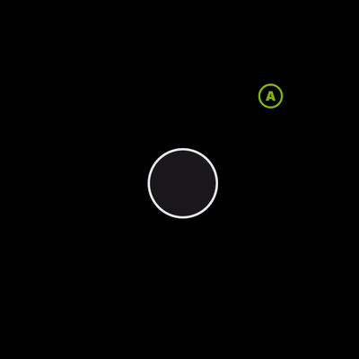
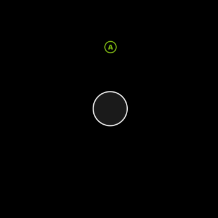
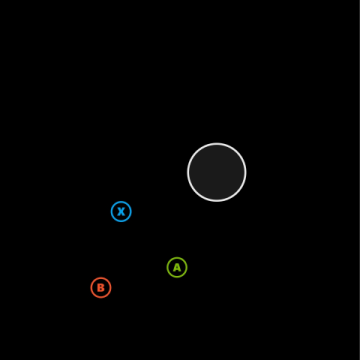
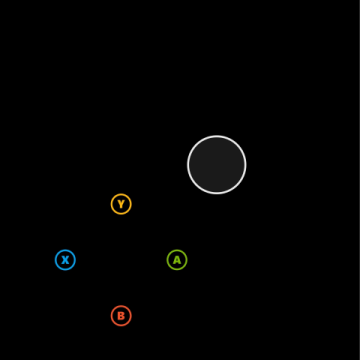

# Control Cluster

An array of up to four controls that can be used to occupy two slots in the outer portion of the wheel.

## Remarks

The control cluster can be used to give more fine tuned control over where the touch controls will be displayed on the `outer` portion of the [`wheel`](game-streaming-touch-wheel.md).

Common uses include:

- Have one control take up two `outer` slots of a [`wheel`](game-streaming-touch-wheel.md). This is commonly used when you want to have a larger hit area for a button on the `outer` section.
- Expand the layout options in the `outer` slots by creating groupings of three or four controls in a triangle or square configuration.

> [!WARNING]
> It is possible to use control clusters to create groupings of controls that may extend beyond the expected boundaries of the `wheel`. When using multiple controls, validate that the behavior is as desired on smaller screened devices.

---

**Patterns for control cluster in the `outer wheel` area**

> Images show the full rendering of the wheel with a joystick in the inner slot and the `outer` layout as specified.

#### Pattern 1. One control spanning two outer slots



In this example, notice the hit target area for the button.

```JSON
{
    "outer": [
        [
            {
                "type": "button",
                "action": "gamepadA"
            },
            null
        ]
    ]
}
```

#### Pattern 2. One control aligned to 12'oclock on the wheel



```JSON
{
   "outer": [
        null,
        null,
        null,
        null,
        null,
        null,
        null,
        [
            null,
            {
                "type": "button",
                "action": "gamepadA"
            },
            null
        ]
    ]
}
```

#### Pattern 3: Three controls in a cluster

Using three controls in a cluster is a good way to add additional controls once all the outer slots are utilized. It works best in the fifth slot on the right hand.



```JSON
{
    "outer": [
        null,
        null,
        null,
        null,
        [
            {
                "type": "button",
                "action": "gamepadA"
            },
            {
                "type": "button",
                "action": "gamepadB"
            },
            {
                "type": "button",
                "action": "gamepadX"
            }
        ]
    ]
}
```

#### Pattern 4. Four controls in a cluster

If you need an additional control in the three cluster, use four controls in the slot. It works best in the fifth slot on the right hand.



```JSON
{
    "outer": [
        [
            null,
            null,
            null,
            null,
            ,
            {
                "type": "button",
                "action": "gamepadA"
            },
            {
                "type": "button",
                "action": "gamepadB"
            },
            {
                "type": "button",
                "action": "gamepadX"
            },
            {
                "type": "button",
                "action": "gamepadY"
            }
        ]
    ]
}
```
