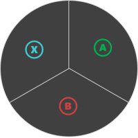

# Inner Wheel

An array of up to four controls that split the inner portion of a wheel.

## Remarks

> [!TIP]
> Do not use a more than one control in the `inner` section of the wheel if the primary task of that area is player movement. Utilize the entire `inner` section for your preferred movement control (e.g., [joystick](../controls/game-streaming-touch-joystick.md) or [directional pad](../controls/game-streaming-touch-directionalpad.md).)

Use a `control cluster` to put multiple touch controls in a single defined area.

In the `inner` area, especially if the `wheel` has `expand` set to true, the controls may have a hit area larger than their visual display.

**Patterns for control cluster in the `inner wheel` area**

> Images show the hit regions for controls in a cluster on `right` inner wheel, not the actual control rendering. The controls will be rendered in the center spot of the hit region.

#### Pattern 1. One control


```JSON
{
   "inner" : {
       "type": "button",
       "action": "gamepadA"
   }
}
```

#### Pattern 2. Two controls


_NOTE:_ This orientation is for controls in the `right` wheel. It will be re-oriented for the `left`.

```JSON
"right" : {
   "inner": [
        {
            "type": "button",
            "action": "gamepadA"
        },
        {
            "type": "button",
            "action": "gamepadB"
        }
    ]
    }
}

```

#### Pattern 3: Three controls



```JSON
{
   "inner": [
        {
            "type": "button",
            "action": "gamepadA"
        },
        {
            "type": "button",
            "action": "gamepadB"
        },
        {
            "type": "button",
            "action": "gamepadX"
        }
    ]
}
```

#### Pattern 4. Four controls


```JSON
{
   "inner": [
        {
            "type": "button",
            "action": "gamepadA"
        },
        {
            "type": "button",
            "action": "gamepadB"
        },
        {
            "type": "button",
            "action": "gamepadX"
        },
        {
            "type": "button",
            "action": "gamepadY"
        }
    ]
}
```

## See Also

[Touch Adaptation Kit Reference](../../../../system/overviews/game-streaming/game-streaming-touch-touch-adaptation-kit-overview.md)  
[Wheel](game-streaming-touch-wheel.md)
