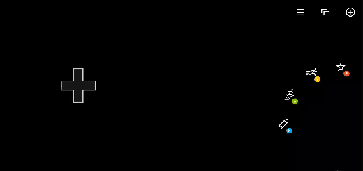

# Layer (Experimental)

A child touch layout that can be overlayed on top of the base touch layout.

> [!WARNING]
> Layers are currently available for use in experimental form and may change behavior based on early adopter feedback.

## Properties

The named layer object contains the following properties:

`center` - _object_, _optional_. [Wheel](game-streaming-touch-wheel.md) of controls that is displayed in the center of the screen.

`left` - _object_, _optional_. [Wheel](game-streaming-touch-wheel.md) of controls that is by default displayed under the player's left hand/thumb.

`lower` - _object_, _optional_. An object that lets you place controls in any of the three `leftCenter`, `center` or `rightCenter` slots in the lower row of controls.

`right` - _object_, _optional_. [Wheel](game-streaming-touch-wheel.md) of controls that is by default displayed under the player's right hand/thumb.

`upper` - _object_, _optional_. An object that lets you place an array of controls in `right` slots in the upper row of controls.

## Remarks

When a `layer` is utilized, in each of the slots where a `control` would be utilized in a normal layout (in the `center`, `left`, `lower`m `right`, `upper` locations), you can include a control to replace what was being displayed previously or utilize a [`blank`](../controls/game-streaming-touch-blank.md) control to hide what was previously being displayed in that slot.

To have a `layer` be displayed, you must have a [`button`](../controls/game-streaming-touch-button.md) control with a [layer action](game-streaming-touch-layer-action.md) that will cause the layout to be displayed.

## Sample

This sample starts with a simple platformer layout, with a button in the top right to toggle showing a layer with advanced abilities.



```JSON
{
    "$schema": "https://raw.githubusercontent.com/microsoft/xbox-game-streaming-tools/master/touch-adaptation-kit/schemas/layout/v3.1/layout.json",
    "content": {
        "left": {
            "inner": [
                {
                    "type": "directionalPad",
                    "scale": 1.5
                }
            ]
        },
        "right": {
            "inner": [
                {
                    "type": "button",
                    "action": "gamepadY",
                    "styles": {
                        "default": {
                            "faceImage": {
                                "type": "icon",
                                "value": "dash"
                            }
                        }
                    }
                },
                {
                    "type": "button",
                    "action": "gamepadA",
                    "styles": {
                        "default": {
                            "faceImage": {
                                "type": "icon",
                                "value": "jump"
                            }
                        }
                    }
                }
            ],
            "outer": [
                null,
                {
                    "type": "button",
                    "action": "gamepadB",
                    "styles": {
                        "default": {
                            "faceImage": {
                                "type": "icon",
                                "value": "specialAbility"
                            }
                        }
                    }
                },
                null,
                null,
                {
                    "type": "button",
                    "action": "gamepadX",
                    "styles": {
                        "default": {
                            "faceImage": {
                                "type": "icon",
                                "value": "fire"
                            }
                        }
                    }
                }
            ]
        },
        "upper": {
            "right": [
                {
                    "type": "button",
                    "action": {
                        "type": "layer",
                        "target": "selectAbility"
                    },
                    "styles": {
                        "default": {
                            "faceImage": {
                                "type": "icon",
                                "value": "add"
                            }
                        }
                    },
                    "toggle" : true
                },
                {
                    "type": "button",
                    "action": "view"
                },
                {
                    "type": "button",
                    "action": "menu"
                }
            ]
        },
        "layers": {
            "selectAbility": {
                "right": {
                    "outer": [
                        null,
                        null,
                        null,
                        null,
                        null,
                        null,
                        {
                            "type": "button",
                            "action": "rightBumper",
                            "styles": {
                                "default": {
                                    "faceImage": {
                                        "type": "icon",
                                        "value": "ability2"
                                    }
                                }
                            }
                        },
                        {
                            "type": "button",
                            "action": "leftBumper",
                            "styles": {
                                "default": {
                                    "faceImage": {
                                        "type": "icon",
                                        "value": "ability"
                                    }
                                }
                            }
                        }
                    ]
                }
            }
        }
    }
}

```

## See Also

[Touch Adaptation Kit Reference](../../../../system/overviews/game-streaming/game-streaming-touch-touch-adaptation-kit-overview.md)  
[Blank control](../controls/game-streaming-touch-blank.md)  
[Layer action](game-streaming-touch-layer-action.md)  
[Layout](game-streaming-touch-layout.md)
