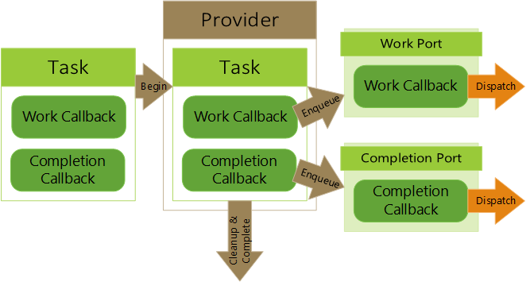

# XAsyncProvider library overview

This topic describes the purpose of the [XAsyncProvider](../../../reference/system/xasyncprovider/xasyncprovider_members.md) library. It's the most advanced of the
three asynchronous libraries and deals with how tasks are run. For example,
`XAsyncProvider` manages the actual behavior of taking an [XAsyncBlock](../../../reference/system/xasync/structs/xasyncblock.md)
and enqueuing the callbacks onto any task queues, handles cancelability,
and sets up result buffers.

In general, the `XAsyncProvider` library is optional and not needed for most cases because
a provider is usually already provided. However, the library can be used when
more advanced behavior is needed such as [creating APIs in the Microsoft Game Development Kit (GDK)
style](async-library-xasyncprovider-example-setup-invocation-methods.md) and 
[allowing async tasks to be cancelable](async-library-xasyncprovider-example-setup-cancelability.md).

#### Async provider callback library

Most of the behavior of this library is centered around the
implementation of an async provider callback passed to the
[XAsyncBegin](../../../reference/system/xasyncprovider/functions/xasyncbegin.md) function. This callback represents the entire
flow of an async call from start to finish and handles the different
state changes along the way. The following screenshot shows a simplified illustration of a provider handling a task.

  

## See also

[Set up custom provider (example)](async-library-xasyncprovider-example-setup-custom-provider.md)  

[Set up invocation methods (example)](async-library-xasyncprovider-example-setup-invocation-methods.md)  

[Set up return data (example)](async-library-xasyncprovider-example-setup-return-data.md)  

[Set up cancelability (example)](async-library-xasyncprovider-example-setup-cancelability.md)  

[XAsyncProvider](../../../reference/system/xasyncprovider/xasyncprovider_members.md)  