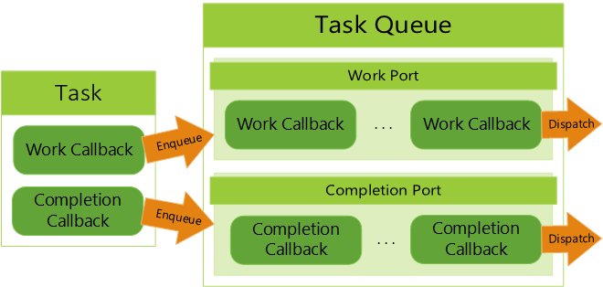

# Asynchronous Programming Model

The Microsoft Game Development Kit (GDK) implements a new pattern for asynchronous APIs that
addresses the feedback we've received from game developers with regard
to the async pattern implemented as part of the Xbox One ERA programming model.
Our goal is that this new pattern is much easier to integrate into
typical game architectures and gives game developers the high degree of
control that they've asked for. This topic describes that design
pattern, and offers a proposal for a library that can be used to
implement asynchronous patterns.

<a id="gdk_asynchronous_model"></a>

## Conceptual Model

Asynchronous programming in the Microsoft Game Development Kit (GDK) is split into 2 main components:
Tasks and Task Queues. While there is more functionality in the
libraries, the whole conceptual model utilizes these 2 main components.

A task is a single set of async work that can be started, have its
status checked, potentially canceled, completed, and return its
completion information. For the Microsoft Game Development Kit (GDK) model, tasks are comprised of two
bodies: the work callback and the completion callback. This allows for
more control such as full parallel processing or parallel work combined
with single-threaded completion.

A task queue is a container that enqueues both work and completion
callbacks for later execution. There are two internal queues in a task
queue, called ports, that handle the work and completion callbacks
separately. These are called the work port and completion port.

**Figure 1.  Diagram of a Task and Task Queue**  


Each port of the task queue is configured differently [at creation
time](../../reference/system/xtaskqueue/functions/xtaskqueuecreate.md) to create different callback execution behavior. For
example, the work port could be configured to be asynchronous and the
completion port could be configured to run serially on a main thread. A
manual setting can be set to enable complete control over the execution
behavior. Port configuration modes are [explained below](#controlling_work_dispatching).

When an async task is started, the callbacks aren't enqueued onto the
task queue immediately. An [async provider](async-libraries/async-library-xasyncprovider.md)
handles state changes to ensure that the work is enqueued and dispatched
before the completion callback is enqueued and dispatched.

The task queue doesn't handle threading directly itself. Instead, it
relies on an outside call to [dispatch](../../reference/system/xtaskqueue/functions/xtaskqueuedispatch.md) its ports. The
external calls determine the threading and concurrency behavior. The
task queue itself is completely thread-safe.

**Figure 2.  Port Being Dispatched onto Multiple Threads**  


That's essentially it! The callbacks of a task are enqueued onto a task
queue's work and completion ports and that task queue has those
callbacks dispatched in some manner. The API contains a whole suite of
functionality to manage task queues, check status of callbacks, track
work data, create custom task handling, and more.

Microsoft Game Development Kit (GDK) asynchronous API calls always implement the work callback internally
and completion callbacks are always optional. For usage beyond Microsoft Game Development Kit (GDK) async
calls, you must supply the work callback.

## Requirements

Game developers have listed the following requirements for API calls.

1.  Prefer synchronous calls over asynchronous calls
1.  Provide async with polling
1.  Provide async with callbacks
1.  Provide control over what thread the async work executes on
1.  Provide control over what thread completion callbacks are executed
    on

## Types of APIs

The Microsoft Game Development Kit (GDK) strives to be very straightforward in its API
design. Game developers are experts at fine-tuning their code to
maximize the use of the hardware. We give them control whenever
possible. API implementations break down into the following types.

-   **Time Sensitive Safe:** A time sensitive safe API is one that can
    be called on a time sensitive thread. Note that while this usually
    means the API is trivial or very fast, the key concept is that the
    API's performance characteristics are *consistent*. They
    are always synchronous and never need to have an asynchronous
    version. These APIs should be documented as time-sensitive&ndash;safe.

-   **Not Time Sensitive Safe:** These APIs aren't safe to call from
    the render thread. Their performance characteristics may vary
    widely. Most APIs fall into this category.

-   **Asynchronous:** These APIs are asynchronous in nature, such as a
    web service call. They use the asynchronous pattern described in
    this topic. Asynchronous APIs aren't as common in the Microsoft Game Development Kit (GDK) as they are in the Xbox One ERA programming model&mdash;an asynchronous
    API is generally long-running and cancelable. Except for a few
    specific use cases, asynchronous APIs will have a
    not-time-critical&ndash;safe synchronous version. Calling an asynchronous
    API should always be time-critical&ndash;safe.

-   **Notifications:** Notifications are periodic in nature and have no
    defined ending. They are related to asynchronous APIs, but because of
    their periodic nature, they should look and act differently to
    developers. Registering for a notification should always be
    time-critical&ndash;safe.

## Async API pattern

The Microsoft Game Development Kit (GDK) introduces a general purpose async API pattern that Microsoft Game Development Kit (GDK) components can use to provide consistent async support. At the
core is a structure similar to OVERLAPPED called [XAsyncBlock](../../reference/system/xasync/structs/xasyncblock.md):

```c++
typedef void CALLBACK XAsyncCompletionRoutine(struct XAsyncBlock* asyncBlock);

struct XAsyncBlock
{
    XTaskQueueHandle queue;
    void* context;
    XAsyncCompletionRoutine* callback;
    unsigned char internal[sizeof(void*) * 4];
};
```

An [XAsyncBlock](../../reference/system/xasync/structs/xasyncblock.md) is a caller-provided structure. The caller fills in
optional fields in this structure as shown in the following table. 

  Field      |Description
  -----      |-----------
  **queue**      |A task queue handle that can control which threads execute the async call. If this parameter is null, the process task queue is used. If the process task queue has been set to null, the call fails with E\_NO\_TASK\_QUEUE.
  **context**    |An optional context pointer that is passed to the callback function.
  **callback**   |An optional callback function that is called when the operation is completed.

The **Internal** fields are used by the system and shouldn't be modified.
The user-settable fields in this structure shouldn't be modified
during an async operation. An [XAsyncBlock](../../reference/system/xasync/structs/xasyncblock.md) must remain in memory for the
lifetime of the async operation. If the [XAsyncBlock](../../reference/system/xasync/structs/xasyncblock.md) is dynamically allocated,
the completion callback is the earliest time that it can be deleted.

In addition to [XAsyncBlock](../../reference/system/xasync/structs/xasyncblock.md), there are a small number of helper APIs, shown as follows.

```c++
STDAPI XAsyncGetStatus(XAsyncBlock* asyncBlock, bool wait);

STDAPI XAsyncGetResultSize(XAsyncBlock* asyncBlock, size_t* bufferSize);

STDAPI_(void) XAsyncCancel(XAsyncBlock* asyncBlock);

typedef HRESULT CALLBACK XAsyncWork(XAsyncBlock* asyncBlock);

STDAPI XAsyncRun(XAsyncBlock* asyncBlock, XAsyncWork* work);
```

[XAsyncGetStatus](../../reference/system/xasync/functions/xasyncgetstatus.md) returns the status of an asynchronous call. When the
call begins, this status is E\_PENDING. It changes to S\_OK or a
specific error when complete. If the call is canceled, this returns
E\_ABORT.

[XAsyncGetResultSize](../../reference/system/xasync/functions/xasyncgetresultsize.md) returns the required buffer size to get the
results for the call. The actual API to fetch the results is tailored to
each asynchronous call.

[XAsyncCancel](../../reference/system/xasync/functions/xasynccancel.md) can be used to cancel a call. Cancellation is up to the operation being canceled and may occur synchronously, asynchronously, or not at all. If an operation is canceled, 
[XAsyncGetResult](../../reference/system/xasyncprovider/functions/xasyncgetresult.md), [XAsyncGetResultSize](../../reference/system/xasync/functions/xasyncgetresultsize.md), or [XAsyncGetStatus](../../reference/system/xasync/functions/xasyncgetstatus.md) to return E\_ABORT. A canceled
call signals the [XAsyncBlock](../../reference/system/xasync/structs/xasyncblock.md)'s [XAsyncCompletionRoutine](../../reference/system/xasync/functions/xasynccompletionroutine.md) parameter and invokes its
callback.

[XAsyncRun](../../reference/system/xasync/functions/xasyncrun.md) is a helper method that can asynchronously run any code.

### Async API Usage

First, let's look at a synchronous API in the following code example.

```c++
HRESULT XGameSaveGetRemainingQuota(XGameSaveProviderHandle provider,
int64_t* remainingQuota);
```

This API calls a web service to determine how much save-game storage is
still remaining. To add asynchronous support, we declare a pair of new
APIs.

```c++
HRESULT XGameSaveGetRemainingQuotaAsync(XGameSaveProviderHandle
provider, XAsyncBlock* async);

HRESULT XGameSaveGetRemainingQuotaResult(XAsyncBlock* async,
int64_t* remainingQuota);
```

[XGameSaveGetRemainingQuotaAsync](../../reference/system/xgamesave/functions/xgamesavegetremainingquotaasync.md) returns S\_OK if the async call has been
kicked off (because this API is only async, there's no value in returning
E\_PENDING). [XGameSaveGetRemainingQuotaResult](../../reference/system/xgamesave/functions/xgamesavegetremainingquotaresult.md) returns E\_PENDING
until the call is complete.

Let's look at this in practice as follows.

```c++
// providerHandle is a previously obtained XGameSaveProviderHandle.

XAsyncBlock* b = new XAsyncBlock;
ZeroMemory(b, sizeof(XAsyncBlock));
b->context = this;
b->queue = queue;
b->callback = [](XAsyncBlock* async)
{
    int64_t remainingQuota;
    if(SUCCEEDED(XGameSaveGetRemainingQuotaResult(async, &remainingQuota)))
    {
        printf("Remaining quota: %irn", remainingQuota);
    }
    delete async;
};
XGameSaveGetRemainingQuotaAsync(providerHandle, b);
```

[XAsyncBlocks](../../reference/system/xasync/structs/xasyncblock.md) all require a task queue (described as follows), which controls
where and how the async call is executed. A process-wide task queue
is used if none is provided.

Note that the [XAsyncBlock](../../reference/system/xasync/structs/xasyncblock.md) needs to stay in memory for the life of the
async call. In this example, it was dynamically allocated and deleted in
the completion callback. It could also be stored as a global or member
variable. Undefined behavior results if the same [XAsyncBlock](../../reference/system/xasync/structs/xasyncblock.md) is used for
more than one async call at a time.

[XGameSaveGetRemainingQuotaResult](../../reference/system/xgamesave/functions/xgamesavegetremainingquotaresult.md) completes the cycle of an async call.
It releases internal data in the async block, so the block can now be
used for a new call. Subsequent calls to
[XGameSaveGetRemainingQuotaResult](../../reference/system/xgamesave/functions/xgamesavegetremainingquotaresult.md) fail.
[XGameSaveGetRemainingQuotaAsync](../../reference/system/xgamesave/functions/xgamesavegetremainingquotaasync.md) and [XGameSaveGetRemainingQuotaResult](../../reference/system/xgamesave/functions/xgamesavegetremainingquotaresult.md) are
also paired inside the async block&mdash;an error occurs if you
mismatch one async call with another result API.

If an async call has no data payload, meaning only the HRESULT status is
important, define a **Result** method that takes only the async block shown as follows.

```c++
HRESULT QueryUpdateStatusAsyncResult(_Inout_ XAsyncBlock* block);
```

<a id="controlling_work_dispatching"></a>
### Controlling work dispatching

What thread did the async work in the previous calls? What thread invoked
the completion callback? That's decided by the task queue assigned to
the [XAsyncBlock](../../reference/system/xasync/structs/xasyncblock.md).

Task queues have two "ports": a *work port* and a *completion port*. Each
port has a dispatch mode that determines how callbacks queued to a port
are processed. There are several dispatch modes.

-   **Thread pool:** Callbacks queued to a thread pool queue are
    executed on the system thread pool. The thread pool invokes the
    calls in parallel, taking a call to execute from the queue in turn
    as thread pool threads become available.

-   **Serialized thread pool:** Callbacks are queued and run on the
    thread pool but run one at a time.

-   **Manual:** Callbacks queued to a manual queue aren't automatically
    dispatched. It's up to the developer to dispatch them on any thread
    they want.

-   **Immediate:** The immediate dispatch mode doesn't queue at all. It
    immediately executes the call on the thread that submitted the
    callback.

There's a default process task queue that's configured, so both the work ports
and the completion ports are dispatched through the system thread pool. This
process task queue is used if no queue parameter is passed in the
[XAsyncBlock](../../reference/system/xasync/structs/xasyncblock.md). A game can also disable the process task queue, requiring a
queue to be passed into the [XAsyncBlock](../../reference/system/xasync/structs/xasyncblock.md).

Our expectation is that many developers will choose the manual dispatch mode to
exercise complete control over when and where async work and completion
callbacks execute.

For details about task queues, see [Async task queue design](async-task-queue-design.md).

## Notifications

A notification might not have an ending, and it might be called many times.
Notifications should support a subset of the requirements of an async
call.

1.  Async with polling
1.  Async with callbacks
1.  Control over which thread callbacks happen on

Notifications use a task queue to allow the developer to control
the callback thread, but otherwise don't use async blocks&mdash;they're
designed to look more like standard events with **Register** and **Unregister**
methods.

-   A **Register** method that takes any call-specific parameters, a task
    queue, an optional void context, and a strongly typed callback
    pointer. The last parameter is an *out* parameter that
    returns a token.

-   An **Unregister** method that takes any call-specific context and the
    token.

-   Polling is supported by adding a separate method that's not related to the
    notification callback.

Let's look at the following example that could fetch Windows messages.

```c++
struct XTaskQueueRegistrationToken;

typedef void MessageAvailableCallback(void* context, const MSG* msg);

HRESULT RegisterMessageAvailable(
    XTaskQueueHandle queue,
    void* context,
    MessageAvailableCallback* callback,
    XTaskQueueRegistrationToken * token);

bool UnregisterMessageAvailable(XTaskQueueRegistrationToken token, bool
wait);

// Usage.
XTaskQueueRegistrationToken token;
RegisterMessageAvailable(queue, nullptr, [](void*, const MSG* msg)
{
    printf("Message: %drn", msg->message);
}, &token);
```

Note that in this example **UnregisterMessageAvailable** takes a final
"wait" parameter and returns a bool. This allows callers to decide how
to handle unregistration while a call is being invoked.

<a id="heading-7"></a>

## Async Library

To make it easier to create consistent APIs that support the async
pattern, we provide a library that can be used to implement the "async
plumbing" of an API. The API for the library looks like the following.

```c++
enum class XAsyncOp : uint32_t
{
    Begin,
    DoWork,
    GetResult,
    Cancel,
    Cleanup
};

struct XAsyncProviderData
{
    XAsyncBlock* async;  
    size_t bufferSize;  
    void* buffer;  
    void* context;
};

typedef HRESULT CALLBACK XAsyncProvider(
_In_ XAsyncOp op,
_Inout_ XAsyncProviderData* data);

STDAPI XAsyncBegin (
_Inout_ XAsyncBlock* asyncBlock,
_In_opt_ void* context,
_In_opt_ void* identity,
_In_opt_ const char* identityName,
_In_ XAsyncProvider* provider);

STDAPI XAsyncSchedule(
_Inout_ XAsyncBlock* asyncBlock,
_In_ uint32_t delayInMs);

STDAPI_(void) XAsyncComplete(
_Inout_ XAsyncBlock* asyncBlock,
_In_ HRESULT result,
_In_ size_t requiredBufferSize);

STDAPI XAsyncGetResult(
_Inout_ XAsyncBlock* asyncBlock,
_In_opt_ void* identity,
_In_ size_t bufferSize,
_Out_writes_bytes_opt_(bufferSize) void* buffer,
_Out_opt_ size_t* bufferUsed);
```

This API uses a single callback, combined with an operation value that
indicates why the API is being called. There's also a single data
structure that's filled in as the call progresses. To use this API, 
do the following.

1.  Call [XAsyncBegin](../../reference/system/xasyncprovider/functions/xasyncbegin.md) with the async block passed by the caller, and
    provide a callback that provides the implementation.

1.  Perform the async work for the call. If you need to run the work on
    a worker thread, call [XAsyncSchedule](../../reference/system/xasyncprovider/functions/xasyncschedule.md). If you can perform the work by 
    using OS async primitives and set up those primitives fast enough to
    remain time-critical&ndash;safe, that's preferred.

1.  If you need to invoke other async work from a worker thread
    callback, you can return E\_PENDING from the worker. You can also
    call [XAsyncSchedule](../../reference/system/xasyncprovider/functions/xasyncschedule.md) from inside a worker to reschedule additional
    work.

1.  When all the work is complete, call [XAsyncComplete](../../reference/system/xasyncprovider/functions/xasynccomplete.md).

1.  Provide a strongly typed wrapper around [XAsyncGetResult](../../reference/system/xasyncprovider/functions/xasyncgetresult.md) to return
    the results.

1.  If your async call has no data payload, you should provide a strongly
    typed wrapper around [XAsyncGetStatus](../../reference/system/xasync/functions/xasyncgetstatus.md) and pass zero as the required
    buffer size to [XAsyncComplete](../../reference/system/xasyncprovider/functions/xasynccomplete.md).

The async provider callback is invoked with the following
operations.


-   **Begin** An async provider is invoked with this opcode during [XAsyncBegin](../../reference/system/xasyncprovider/functions/xasyncbegin.md). If the provider implements this op code, they should start their asynchronous task by calling [XAsyncSchedule](../../reference/system/xasyncprovider/functions/xasyncschedule.md) or through exterior means. This callback is called synchronously in the [XAsyncBegin](../../reference/system/xasyncprovider/functions/xasyncbegin.md) call chain, so it should never block. 

-   **DoWork** Called in cases where [XAsyncSchedule](../../reference/system/xasyncprovider/functions/xasyncschedule.md) was called to
    schedule async work by using the task queue. The provider function does
    any work it needs to. When complete, it calls [XAsyncComplete](../../reference/system/xasyncprovider/functions/xasynccomplete.md) with the
    result code and data payload size, which can be zero if there's no
    data payload from the call. If more asynchronous work needs to be
    done, the provider can schedule that work and should return
    E\_PENDING.

-   **GetResult** Called to fetch the result of the call. Because the
    data size is passed into [XAsyncComplete](../../reference/system/xasyncprovider/functions/xasynccomplete.md) during call completion, no
    argument checking is needed here&mdash;all buffers and buffer sizes
    have been verified by the library.

-   **Cancel** Called when the user cancels an async call. If the call can be canceled, cancel it and call [XAsyncComplete](../../reference/system/xasyncprovider/functions/xasynccomplete.md) with E_ABORT as the result code.

-   **Cleanup** Called when the call has completely finished, and the
    provider can delete any dynamic memory.

An async provider only needs to implement the operations it needs. For
example, noncancelable async IO that has no clean up only needs to
implement **GetResult**.

Following is an example of a **FactorialAsync** method that implements factorial
asynchronously.

```c++
UINT64 Factorial(UINT64 value)
{
    UINT64 result = 1;

    while (value != 0)
    {       
        result *= value;
        value--;
    }

    return result;
}

HRESULT FactorialAsync(UINT64 value, XAsyncBlock* async)
{
    struct CallData
    {
        UINT64 value;
        UINT64 result;
    };

    CallData* data = new CallData();
    data->value = value;
    data->result = 1;

    HRESULT hr = XAsyncBegin (async, data, FactorialAsync, __FUNCTION__, []
        (XAsyncOp op, XAsyncProviderData* data)
    {
        CallData* d = (CallData*)data->context;

        switch (op)
        {
        case XAsyncOp::Begin:
            return XAsyncSchedule(data->async, 0);

        case XAsyncOp::Cleanup:
            delete d;
            break;

        case XAsyncOp::GetResult:
            CopyMemory(data->buffer, &d->result, sizeof(UINT64));
            break;
 
        case XAsyncOp::DoWork:
            data->result = Factorial(data.Value);
            XAsyncComplete(data->async, S_OK, sizeof(UINT64));
            break;
        }

        return S_OK;
    });

    return hr;
}

HRESULT FactorialAsyncResult(XAsyncBlock* async, UINT64* result)
{
    return XAsyncGetResult(async, FactorialAsync, sizeof(UINT64), result);
}
```

## See also

[Asynchronous Programming Design Goals and Improvements](async-whitepaper.md)  
[Async task queue design](async-task-queue-design.md)  