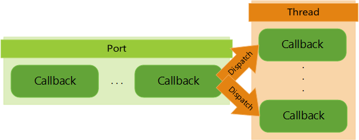
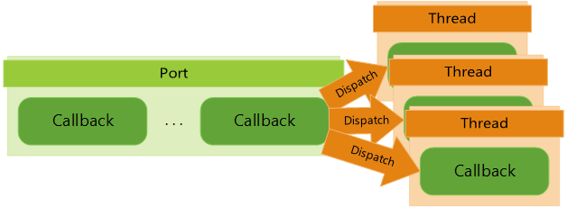
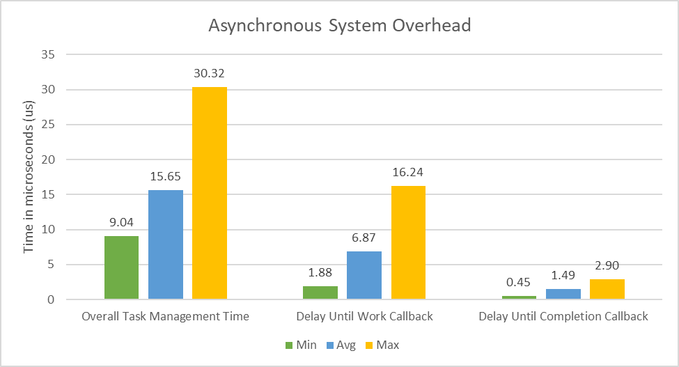

# Asynchronous programming design goals and improvements

This topic covers the design goals that were made when creating the new asynchronous programming model for the Microsoft Game Development Kit (GDK). This topic also covers the improvements that were made from the Xbox One Software Development Kit model, in response to developer feedback.

## In this topic
  
 * [Introduction](#introduction)  
 * [Design goals](#design_goals)  
   * [Consistent and cross-platform](#consistent_cross_platform)  
   * [Complete developer control](#complete_developer_control)   
   * [Any threading situation](#any_threading_situation)  
 * [Improvements from Xbox One Software Development Kit](#improvements_from_xdk)  
   * [No more C++/CLI](#no_more_ccli_winrt)  
   * [Complete control of threading behavior](#complete_control_of_threading_behavior)  
   * [Error codes instead of exceptions](#error_codes_instead_of_exceptions)  
   * [No garbage collection](#no_garbage_collection)  
   * [Guaranteed high performance](#guaranteed_high_performance)  
      * [Time-sensitive threads](#time_sensitive_threads)  
   * [Generic usage beyond Microsoft Game Development Kit (GDK) API calls](#generic_usage_beyond_gdk_api_calls)  

## Introduction

The Microsoft Game Development Kit (GDK) introduced a new asynchronous
programming model that’s designed to provide you with highly
customizable and controllable execution behavior, while having low
processing and memory overhead. All async API calls in the Microsoft Game Development Kit (GDK) use
this model to provide consistency. However, the asynchronous libraries
can be used directly in your own task and async systems to manage
the queuing and dispatching of tasks.

Learning from the previous Xbox One Software Development Kit async model and
developer feedback, the new solution in the Microsoft Game Development Kit (GDK) gives
you complete control of how and where asynchronous tasks are run.
You can use any threading designs, whether it's synchronous executions on
a single thread or parallel executions on title threads with highly
specific priorities and affinity masks. The Xbox One Software Development Kit only used the
system thread pool.

The Microsoft Game Development Kit (GDK) paradigm shift improves what was the Xbox One Software Development Kit solution by using Win32-style flat-C or simple C++ APIs. With this, you can directly
manage memory allocation and deallocation timing. Performance can be
more easily inspected, and most API calls (and all asynchronous library
API calls that are used for task execution) come with a [high-performance
guarantee](#guaranteed_high_performance).

## Design goals

The asynchronous libraries are designed with some key goals to ensure
that titles can get the most performance with minimal overhead from the
API or the system. The following list contains some high-level goals.  
 * Asynchronous code is consistent and easy to understand and identify.  
 * You’re free to completely manage the callback execution behavior.  
 * You can use threads however you want.  
 * Performance and memory usage is consistent and easy to manage.  
 * System overhead for running tasks is low and usable on main threads.  
 * Asynchronous libraries shouldn’t be reserved for only Microsoft Game Development Kit (GDK) API usage.  
  
Some of these goals are covered in the following sub-sections and others
are covered in the [Improvements from Xbox One Software Development Kit](#improvements_from_xdk)
section of this topic.

### Consistent and cross-platform

Consistency provides some of the following expectations about how the async APIs are written
and act.  
 * Methods and data are prefixed with `X`, followed by a library name.  
 * [Normal errors are reported via HRESULT error codes](error-handling.md).  
 * All async calls across the Microsoft Game Development Kit (GDK) use an [XAsyncBlock](../../reference/system/xasync/structs/xasyncblock.md).  
 * Async Microsoft Game Development Kit (GDK) starting methods are postfixed with `Async`.  
 * Async Microsoft Game Development Kit (GDK) result methods are postfixed with `Result`.  
  
Being cross-platform means that the same asynchronous API calls can be
used on any platform that the Microsoft Game Development Kit (GDK) targets. These platforms currently
include [Windows PC (NDA topic)](../../intro/overviews/introduction.md#shipping-a-game-on-Windows-PCs), [Xbox One family consoles, and Xbox Series consoles (NDA topic)](../../intro/overviews/introduction.md#Shipping-a-game-on-Xbox-consoles).

Whether you’re using the async libraries for Microsoft Game Development Kit (GDK) API calls, or you’re using your own
functionality, the process is always the same for [setting up an
XAsyncBlock](async-libraries/async-library-xasync-example-setup-async-task.md) and [starting the
async method](async-libraries/async-library-xasync-example-run-simple-task.md). Whenever an asynchronous
method is provided by a library, those methods use the asynchronous
libraries for implementation. The following table shows some libraries
that have exposed asynchronous methods.

| Library | Async Usage | Example Methods |
| --- | --- | ---- |
| [XUser](../../reference/system/xuser/xuser_members.md) | Managing Xbox Live Users | [XUserAddAsync](../../reference/system/xuser/functions/xuseraddasync.md), [XUserAddResult](../../reference/system/xuser/functions/xuseraddresult.md), [XUserGetGamerPictureAsync](../../reference/system/xuser/functions/xusergetgamerpictureasync.md), [XUserGetGamerPictureResult](../../reference/system/xuser/functions/xusergetgamerpictureresult.md) |
| [XGameSave](../../reference/system/xgamesave/xgamesave_members.md) | Reading, Writing, and Managing Game Saves | [XGameSaveInitializeProviderAsync](../../reference/system/xgamesave/functions/xgamesaveinitializeproviderasync.md), [XGameSaveInitializeProviderResult](../../reference/system/xgamesave/functions/xgamesaveinitializeproviderresult.md), [XGameSaveSubmitUpdateAsync](../../reference/system/xgamesave/functions/xgamesavesubmitupdateasync.md), [XGameSaveSubmitUpdateResult](../../reference/system/xgamesave/functions/xgamesavesubmitupdateresult.md) |
| [XPackage](../../reference/system/xpackage/xpackage_members.md) | Observing and Managing Game Installs | [XPackageInstallChunksAsync](../../reference/system/xpackage/functions/xpackageinstallchunksasync.md), [XPackageInstallChunksResult](../../reference/system/xpackage/functions/xpackageinstallchunksresult.md) |
| [XGameUI](../../reference/system/xgameui/xgameui_members.md) | Using System Dialogs and Other Shell UI | [XGameUiShowMessageDialogAsync](../../reference/system/xgameui/functions/xgameuishowmessagedialogasync.md), [XGameUiShowMessageDialogResult](../../reference/system/xgameui/functions/xgameuishowmessagedialogresult.md), [XGameUiShowSendGameInviteAsync](../../reference/system/xgameui/functions/xgameuishowsendgameinviteasync.md), [XGameUiShowSendGameInviteResult](../../reference/system/xgameui/functions/xgameuishowsendgameinviteresult.md) |

### Complete developer control

An important part of the new asynchronous libraries is that you
have complete control to enable the best possible
usage for the title. This means that many parts of the model are
customizable including the following.  
 * Callbacks in task queues can be dispatched automatically or manually.  
 * Completion callbacks are optional, and polling can be used.  
 * Default process task queues can be [changed or removed](../../reference/system/xtaskqueue/functions/xtaskqueuesetcurrentprocesstaskqueue.md).  
 * [Custom async providers](async-libraries/async-library-xasyncprovider-example-setup-custom-provider.md) can be implemented to change the [task management flow](async-libraries/async-library-xasyncprovider.md).  
  
When a task queue is being [created](../../reference/system/xtaskqueue/functions/xtaskqueuecreate.md), you can [customize](../../reference/system/xtaskqueue/enums/xtaskqueuedispatchmode.md) how the callbacks for the two ports are dispatched as shown in the following table.

| Port Mode | Behavior |
| --- | --- |
| `ThreadPool` | Enqueued callbacks are dispatched automatically and concurrently in the background on system pool threads. |
| `SerializedThreadPool` | Enqueued callbacks are dispatched automatically in the background on system pool threads. However, only one callback can be active at a time, ensuring serial execution with no overlap. |
| `Immediate` | Callbacks are run immediately in the stack frame of the caller when attempting to enqueue, instead of queuing the callbacks for later. If the work port is `Immediate`, then the work callback is run upon starting the asynchronous call. If the completion port is `Immediate`, then the completion callback is run after the work callback finishes in the same stack frame. |
| `Manual` | Any callback enqueued to a port in this mode isn’t automatically dispatched. You must call [XTaskQueueDispatch](../../reference/system/xtaskqueue/functions/xtaskqueuedispatch.md) to execute the callbacks on the port manually. The calling pattern determines how threaded and concurrent the callbacks will be. |
  
You can replace the default task queue that’s used by the title when no task
queue is specified by using [XTaskQueueSetCurrentProcessTaskQueue](../../reference/system/xtaskqueue/functions/xtaskqueuesetcurrentprocesstaskqueue.md). 
If you want to ensure that a task queue is always specified,
you can also use that function with `nullptr` to remove the default queue.
When doing this, an error is generated if a task queue isn't
specified.

If you prefer to use polling for asynchronous calls to know when the
task completes, you can use [XAsyncGetStatus](../../reference/system/xasync/functions/xasyncgetstatus.md) to check for return
codes.

### Any threading situation

When a task queue port is configured to use manual dispatching, there’s
no restriction on when or how the port is dispatched. The async
libraries are thread-safe in their implementation so that custom
threading and concurrency behaviors can occur without locks.
Critical sections, interlocked operations, and other related
multi-threading constructs are only necessary for guarding user data
that’s used within callbacks, and not the asynchronous systems.

When using your own threads, you’re free to set affinity masks and
thread priorities for whatever your implementation case needs. You can
also use the Windows Message Loop to handle dispatching.
The task callback execution behavior that’s within manual ports is completely
dependent on how your threads are setup to call
[XTaskQueueDispatch](../../reference/system/xtaskqueue/functions/xtaskqueuedispatch.md) as shown in figure 1 and figure 2.

**Figure 1. Shows the callback execution behavior of one thread**  

**Figure 2. Shows the callback execution behavior of multiple threads**  

## Improvements from Xbox One Software Development Kit

[Responding to your feedback and improving past solutions is very
important for the Microsoft Game Development Kit (GDK) (NDA topic)](../../intro/overviews/introduction.md). The following
subsections list some key improvements that were made in comparison to
asynchronous programming in the Xbox One Software Development Kit.

### No more C++/CLI (WinRT)

Xbox One Software Development Kit required the usage of C++/CLI (WinRT) for asynchronous function
behavior. With this, the system managed its calls to Xbox Live and
other services without experiencing problems such as resource leaks and errors. However, this also required 
learning a new coding syntax and account for the implicit time
slicing and resource usage of the system.

Microsoft Game Development Kit (GDK) [switches the paradigm (NDA topic)](../../intro/overviews/introduction.md#api-programming-model)
to a Win32-style C-style API model for async libraries. Microsoft Game Development Kit (GDK) code can be
used directly in C/C++ projects without integrating the managed
WinRT ecosystem. As a result, all allocations and behaviors are isolated
and well-understood with minimal background behavior on system threads.

### Complete control of threading behavior

The Xbox One Software Development Kit had a single way to handle asynchronous calls and that was to
run them concurrently on system pool threads. The extent of control was
limited to adjusting the system thread pool.

In the Microsoft Game Development Kit (GDK), the threading can use the system thread pool as described with the Xbox One Software Development Kit, or
be customized with manual threading to build the behavior for
the application. With manual threading, the callback execution behavior
is determined by how and when [XTaskQueueDispatch](../../reference/system/xtaskqueue/functions/xtaskqueuedispatch.md) is
called. If this function is called on only one thread, then the behavior
becomes synchronous running on that thread. If several threads simultaneously call the
function, each call gets a different callback from the
task queue and runs them in parallel.

The different callback execution behaviors were explained in the section [Complete developer control](#complete_developer_control) of this topic.

### Error codes instead of exceptions

The Microsoft Game Development Kit (GDK) encompasses many technologies, both old and new. As a result,
the error handling can differ from library-to-library. The asynchronous
libraries are designed to be "exception-free". This means that
exceptions aren't used for call errors, flow control, status reporting,
or any other runtime purpose. You can use your own
exception handling in your title.

Most errors and status codes are now reported via `HRESULT` codes in
standard Win32 coding style. When the result status code isn't
important, a Boolean may be used. When an API method is expected to
generate common errors, those errors are listed in the documentation
with an explanation of their causes.

Because `HRESULT` codes are used, a simple pattern to check codes is to
use the Windows `SUCCESS()` and `FAILED()` macros. When checking for
specific error codes to determine how to proceed, you can check the `HRESULT` value.

For more information about error handling in the Microsoft Game Development Kit (GDK), see [Error handling in the Microsoft Game Development Kit](error-handling.md).

### No garbage collection

Because there isn’t any C++/CLI (WinRT) support in the Microsoft Game Development Kit (GDK), that also means
that there isn’t any garbage collection that occurs in the background during
runtime. All tracked OS allocations are represented by direct `HANDLE`
objects or custom handle [typedefs](/cpp/c-language/typedef-declarations?view=msvc-160) that are provided by the libraries.

You can set up allocation/deallocation timing, behavior, and performance to be managed by the caller by using handles. These allocations and
deallocations can be moved off to supporting loader threads 
to avoid performance hitches. Deallocation doesn’t happen
unexpectedly when performance is paramount.

However, resource tracking and avoiding memory leaks
becomes your responsibility. Ensure that any allocated
handle is deallocated when it’s no longer needed.

### Guaranteed high performance

The Xbox One Software Development Kit asynchronous model, with its usage of the managed COM framework,
lends itself to unexpected memory and performance hiccups that were
sometimes hard to account for. However, the Microsoft Game Development Kit (GDK) model ensures that there’s a
consistent performance and memory footprint.

Because the threading can be controlled, the performance of system calls
are more easily inspected by using a profiler or custom code. The ATG
Asynchronous Programming sample has built-in tests to measure some of the time that's spent. The chart in figure 3 measures the time spent managing an
asynchronous task with a custom async provider. The custom threads that are used
for the test execute callbacks as fast as possible.

**Figure 3. Shows the chart that measures asynchronous system overhead** 

The system overhead is very low. Overhead costs mainly occur while 
waiting for threads to dispatch the task queue ports. Overall
async task time, ignoring overhead costs, is the actual work within
the callbacks of the task.

#### Time-sensitive threads

[Time-sensitive threads](time-sensitive-threads.md) are a new specification that the
Microsoft Game Development Kit (GDK) uses to identify title threads that don't want any blocking or
unexpectedly long-running operations. A user can mark a
title thread as time-sensitive with a call to
[XThreadSetTimeSensitive](../../reference/system/xthread/functions/xthreadsettimesensitive.md). When a thread is marked as
time-sensitive, any Microsoft Game Development Kit (GDK) API method invocation on that thread, that
doesn't provide a consistent and reliable runtime performance (defined as not
"time-sensitive safe"), triggers a debug assert for you.

These time-sensitive safe methods include the following guarantees on the
implementation side.  
 * No on-demand loading or initialization is performed.  
 * No calls are made across VM or process boundaries.  
 * Memory allocations are limited.  
  
With this, time-sensitive safe methods run in consistent
time with the same inputs and won’t spike performance unexpectedly.
Many Microsoft Game Development Kit (GDK) methods are marked internally as time-sensitive safe and
threads don’t have to be marked as time-sensitive to get the guarantee
from calling time-sensitive safe methods.

Most asynchronous API methods are time-sensitive safe. Those that
aren't, are related to task queue setup and other low-frequency calls
that are typically invoked at load or initialization time. All methods that are related to
starting, managing, canceling, completing, or otherwise working directly
with async tasks are time-sensitive safe. For more information about unsafe functions, see the [Unsafe functions for time-sensitive threads](time-sensitive-threads.md#unsafe-function-list) section of the Time-sensitive threads topic.

### Generic usage beyond Microsoft Game Development Kit (GDK) API calls

The async libraries for Microsoft Game Development Kit (GDK) are generic and not limited to API call
usage. Any asynchronous call that is provided by the Microsoft Game Development Kit (GDK) uses the
asynchronous libraries internally and provides [consistent methods](#consistent_cross_platform) 
for actions that include starting the task and getting results. For more information about 
using the libraries for non-GDK API purposes, see [Sample code](async-libraries/async-library-xasync-example-run-simple-task.md).

With this setup, [starting an async task](async-libraries/async-library-xasync-example-run-simple-task.md)
is the same process, whether it's a Microsoft Game Development Kit (GDK) function or a custom
pattern: An [XAsyncBlock is setup](async-libraries/async-library-xasync-example-setup-async-task.md) for
a task, and then the task is started. Starting the task can be a Microsoft Game Development Kit (GDK) API
function or a custom title method.

Feel free to use the async libraries for any
asynchronous purpose across your title.

## See also

[Asynchronous programming model](async-programming-model.md)  
[Designing the task queue](async-task-queue-design.md) 