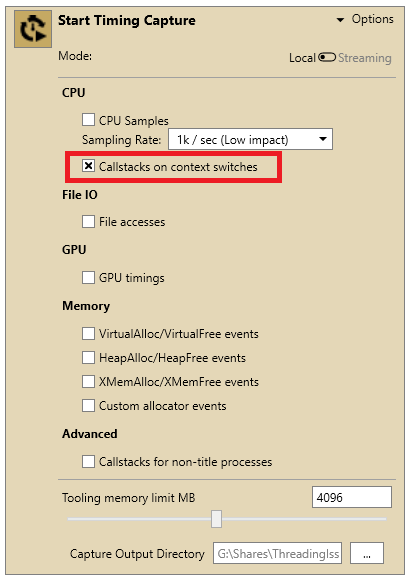
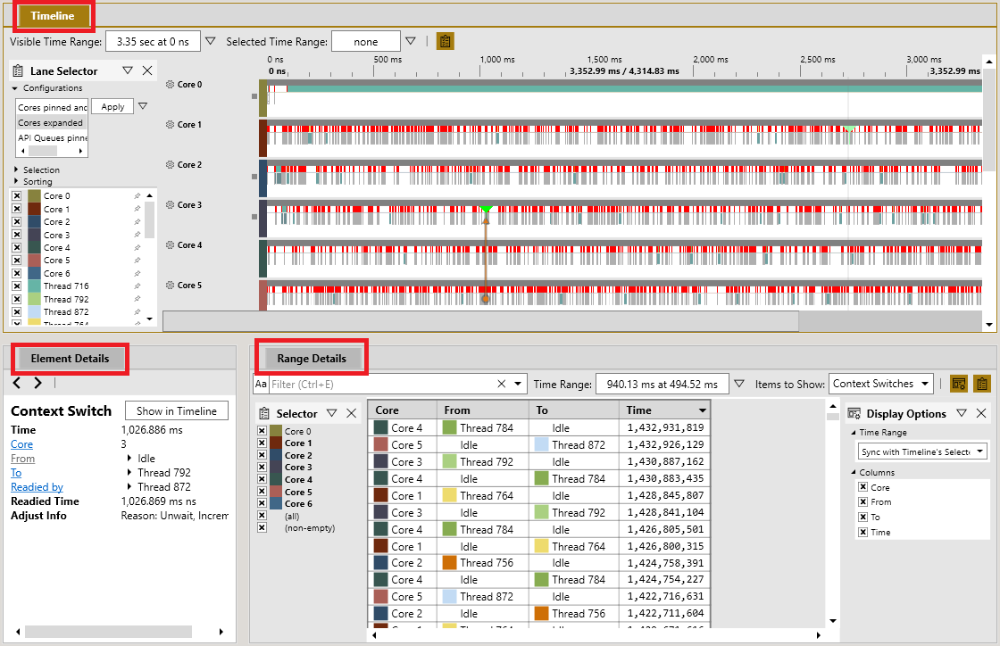

# Common steps for finding threading issues 

You can investigate threading issues by using either Performance Investigator for Xbox (PIX) or Windows Performance Analyzer (WPA). PIX provides a fine-tuned interface that’s directed towards game developers, and it organizes the information to keep the most useful data at the forefront. WPA, on the other hand, provides all the information with no filter. You must create your own filters, which can be a steep learning curve. However, it can provide a greater level of control and insight into the raw data of the system.

PIX is installed as part of the Microsoft Game Development Kit (GDK). WPA is a free download from the [Microsoft Store](https://www.microsoft.com/p/windows-performance-analyzer/9n0w1b2bxgnz). It’s also obtainable as part of the [Windows Assessment and Deployment Kit](/windows-hardware/get-started/adk-install).

## PIX

Analyzing threading behavior with PIX starts by taking a Timing Capture, which is used as the starting point for investigating every type of threading issue that’s discussed in this topic. For more information about Timing Captures and how each of the views function, see [PIX Timing Captures (NDA topic)](../../../tools-console/xbox-tools-and-apis/pix/new-timing-captures.md). Use the following steps to take a Timing Capture in PIX.
 
 1. Open PIX and connect to your console. For more information about setting up PIX, see [Setting up and getting started (NDA topic)](../../../tools-console/xbox-tools-and-apis/pix/setup-getting-started.md). Ensure that the game that you want to analyze is running on the connected console.
 
 1. After connecting to a console, the **Xbox Connection** tab appears with the IP address of the console. Expand the **Start Timing Capture** section by selecting **Options** as shown in figure 1.

    **Figure 1.   Shows the Start Timing Capture tab in PIX**

    

 1. Ensure that **Callstacks on context switches** is selected.

 1. Select the stopwatch icon to begin the Capture. In the **System Monitor** view, there’s a highlighted section of the graphs that represents the time frame that’s being Captured.

 1. When you have Captured enough data, select the stopwatch icon again to stop the Capture. A new tab will open with a timeline view of the Capture as shown in figure 2.

    **Figure 2.   Shows the default view of a Timing Capture in PIX**

    

    > [!NOTE]
    > There are three main views labeled **Timeline**, **Element Details**, and **Range Details**. You can move through the **Timeline** view to review the timelines for individual threads, by using the **wheel button** on the mouse to scroll up and down.

 1. Select and move a portion of the timeline to zoom into a region of interest. 
    * You can also select **Zoom to Selected Range** from this context menu that appears when right-clicking the timeline. 
    * You can also edit the **Visible Time Range** or **Selected Time Range** directly. You can zoom and navigate the timeline by holding a right-click on the mouse to pan, and selecting **Ctrl** and scrolling with the **wheel button** of your mouse.

## WPA

WPA is a tool that’s used for viewing event trace log (ETL) files. To use WPA, the first step is to create an ETL Capture. One way to do this, is by using *xperf.exe* running within the Game OS, which provides the most flexibility in choosing the data that’s collected. However, another option for gathering ETL data is by using [xbperf (NDA topic)](../../../tools-console/xbox-tools-and-apis/commandlinetools/xbperf.md) from a GDK command prompt. 

WPA profiles are in the GDK samples that are found under the folder **GDKSamples** > **Tools** > **WPAProfiles** after downloading the [software](https://www.microsoft.com/software-download/gdk). WPA profiles are configuration files that are created to set up the WPA interface in a consistent format. The ones that are provided in the samples are the same ones that are used in the figures in the [Finding threading issues](finding-threading-issues-toc.md) section.

Use the following steps to create an ETL Capture and manage WPA profiles.

 1. [Appendix A: Batch file to create ETL traces](finding-threading-issues-appendix.md#appendix-a) is a sample batch file that uses *xperf.exe* running within the Game OS to take an ETL Capture. We recommend using this batch file unless you are already familiar with taking ETL Captures. 
   * After the batch file is run from a GDK command prompt, it ensures that the Game OS is running, begins a Capture, and then continues capturing until the window receives input. 

> [!NOTE]
> These captures can become quite large, so start with a minute or so unless you know that you need more data. After the capture is stopped, it copies the ETL file to the current working directory, and then attempts to open it.
 
 1. Each **Finding Threading Issues** page notes which WPA profile has been loaded in the example images to organize its data. Load the same profile by selecting **Profiles** > **Apply...** > **Browse...**, and then open the .wpaProfile file. 
   * The WPA profiles automatically open views in a new tab. Each view contains a graph and a data table. All views that are in WPA are different combinations of columns and settings in the data table that show related subsets of data that’s gathered by ETL events. 
   * The graphs display the data differently, depending on the order of the columns that are in the table. The views can also be edited by right-clicking the column headers in the table, but the .wpaProfile files that are provided are a good starting point configuration for each type of issue.

    > [!NOTE]
    > You can always reset a view to its original settings by selecting its name in the view's top bar and selecting **reset**. If you find a setup you like, you can save it. Similarly, a group of views can be saved from the **Profiles** menu. WPA processes the .pdb files and stores a cache for faster lookup. This can be found by selecting **SymCache generation folder path** in the **SymCache** tab.   In some cases, WPA takes a long time to load the symbols because it must build a cache for each .pdb file. For larger .pdb files, this can take several minutes. However, it only needs to do this the first time a .pdb file is found.

 1. Zoom into sections of the graph by selecting and moving your mouse across a portion of the graph to highlight it, and then right-clicking and selecting **zoom**. You can also use **Select Time Range...** in the context menu to highlight a more precise time frame.