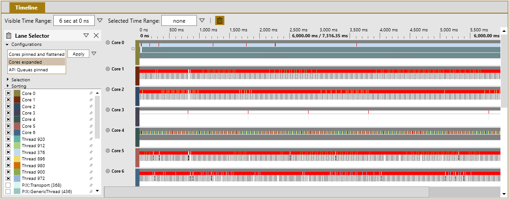
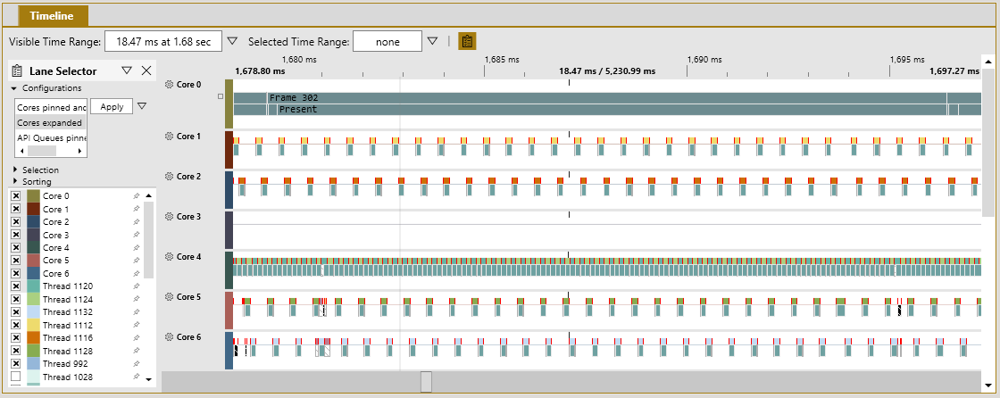
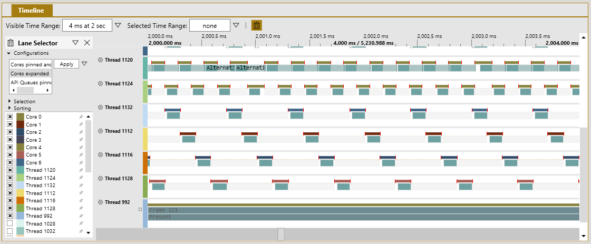
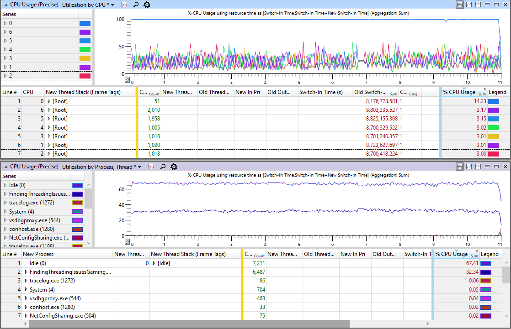
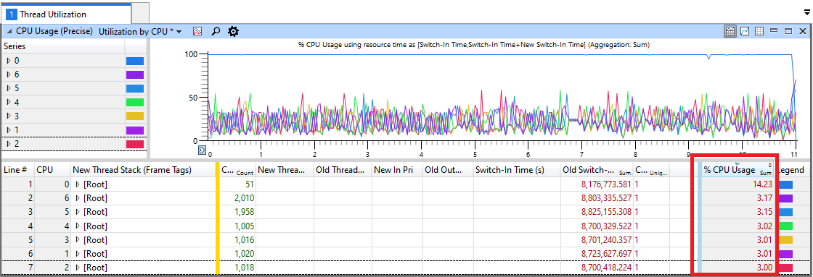
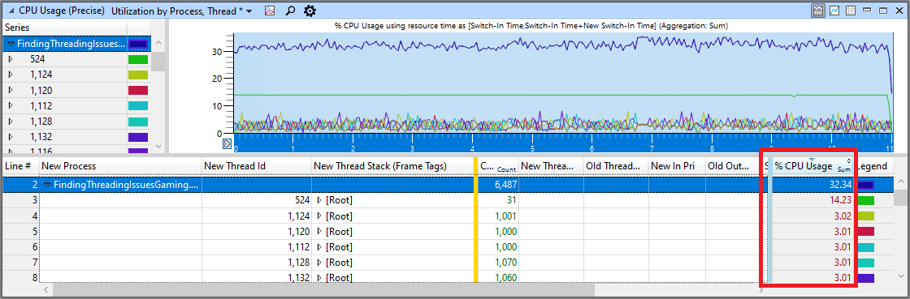

# Core utilization: idle time

Use this topic to identify underutilized CPU cores or threads. If all CPU cores aren’t performing useful work 100 percent of the time, there’s room for
improvement. If you can identify sections of idle time, fill them with work, and then ensure that independent tasks are running parallel, it can result in significant performance gains for your title. 
Luckily, it’s easy to find idle time on a core. Identifying these
locations helps determine if the title is needlessly blocking or has spare
cycles to handle other work.

## Performance Investigator for Xbox (PIX)

The timeline view in Performance Investigator for Xbox (PIX) shows how the CPU cores are being used, 
and the occupancy of individual threads on those cores. Use the following steps to investigate threads. 

 1. Follow the steps in the [Common steps](common-steps.md) topic to create a Timing Capture.
 1. Starting with a zoomed-out view, review sections where a CPU core timeline
  is mostly empty, indicating that it isn’t executing code. As shown in figure 1, core three isn’t performing any work.
   
    **Figure 1. Shows a PIX Timing Capture displaying the CPU timelines with CPU 3 idle**  
    
  
 1. Zoom in until you get to a frame that you want to investigate. Pix is zoomed into a single frame of an example that's running at 60 frames per second (FPS) as shown in figure 2.
  
    **Figure 2. Shows a PIX Timing Capture that’s zoomed to a single frame that shows an idle core and low-utilization cores**  
    
  
    > [!NOTE]
    > Double-clicking on an element in the PIX timeline automatically zooms the view to the duration of that element, such as the
    Frame 302 marker in figure 2.
  
 1. In figure 2, cores zero and four have their timelines filled, which means
  that they’re running close to 100 percent. Cores one, two, five, and six have
  empty spaces and are running at approximately 25 percent.

 1. Review individual thread behaviors in the thread timelines.
  You can focus on a thread that you think should be running close to 100 percent, as shown in figure 3.

    **Figure 3. Shows zooming into 4 ms of the thread timelines and the stalls that are on each thread, except 992**  
    

 1. The different colored bars on the top of each portion of thread execution
  represent the core that the thread is running on. The top two threads have the
  same dark gold bar which means they’re both running on the same core.
  Hover over the top bar to display the core number. Threads 1120 and 1124 are alternating on core four as shown in figure 2.

 1. At this point, you can use the steps that are described in
  the [Threads locking](threads-locking.md) topic to narrow down the lines of code that
  are causing the threads to stop executing. If the threads
  are simply waiting for new work, and the CPU core is idle, adjust
  the [thread affinities](/windows/win32/api/winbase/nf-winbase-setthreadaffinitymask)
  of other threads to schedule time on this core, or prepare
  additional work to process on this core.

## Windows Performance Analyzer (WPA)

Windows Performance Analyzer (WPA) has two main views for threads in a title that are called **CPU Usage (Precise) Utilization by CPU** and **CPU Usage (Precise) Utilization by Process**. 

**CPU Usage (Precise) Utilization by CPU** shows data that's relative to the core. This can quickly show where there's extra room for a thread to run. **CPU Usage (Precise) Utilization by Process, Thread** shows which threads are mostly idle or hogging the cores. Use the following steps to review 

 1. Follow the steps in the [Common steps](common-steps.md) topic to generate an Event Tracing Log (ETL) file. 

 1. Apply the *ThreadUtilization.wpaProfile* WPA profile as described in the
  topic [Common steps](common-steps.md). After applying the profile, the new analysis tab appears as shown in figure 5. 

    **Figure 5. Shows the default view of the ThreadUtilization profile in WPA**  
    

### Steps to focus on a CPU core that isn’t properly used

 1. In the **CPU Usage (Precise) Utilization by CPU** view, use the
  **% CPU Usage** column to find CPU cores that have a lower
  usage than expected as shown in figure 6. The percentage is based on 100 percent of the entire
  CPU, not per-core. Therefore, 14.28 percent, for a single core, represents that core
  running at 100 percent because there are seven CPU cores that are available
  (100% / 7 CPU cores = 14.28%).

    **Figure 6. Shows the utilization by CPU where only core zero is running at 100 percent**  
    

 1. Zoom in to areas on the graph where a CPU core is idle or very busy.

 1. Expand the **New Thread Stack (Frame Tags)** entries that are in the data table
  to show the locations where the title is gaining control of the CPU as shown in figure 7. The **% CPU Usage** column shows the overall percentage of time spent
    that's relative to 100 percent being the entire CPU, not per-core.

    **Figure 7. Shows a zoomed in block of time that covers the ramp-up to full CPU usage where `std::mutex` kept CPU utilization low**  
    

 1. Use the steps that are described in the topic
  [Threads locking](threads-locking.md) to narrow down the lines of code that
  are causing your threads to stop executing on these cores. If the threads
  are simply waiting for new work, and the CPU core is idle, adjust
  the [thread affinities](/windows/win32/api/winbase/nf-winbase-setthreadaffinitymask)
  of other threads to schedule time on this core, or prepare
  additional work to process on this core.

### Steps to focus on a thread that isn’t running as expected

 1. Use the **CPU Usage (precise) Utilization by Process, Thread** window to
  narrow down the issue by thread.

 1. Review threads that are running at a lower than expected percentage of CPU usage, found in the **% CPU Usage** column as shown in figure 8.
  For example, a thread that’s affinitized to a single core that you expect to run most of the time. The percentage is based on 100 percent of the entire
  CPU, not per-core.

    **Figure 8. Shows the Utilization by Process, Thread window to view CPU usage percentage for threads that are in the title**  
    

 1. Zoom in until you get to a section that you want to investigate. This limits the amount of data to sort
  through the data table.

 1. Expand the **New Thread Stack (Frame Tags)** entries that are in the data table
  to show the locations where the title is gaining control of the CPU as shown in figure 9. The **% CPU Usage** column shows the overall percentage of time spent that’s relative
    to 100 percent being the entire CPU, not per-core.

    **Figure 9. Shows the point in the thread where the usage ramps up where `std::mutex` kept thread utilization low**  
    

 1. Use the steps described in
  the topic [Threads locking](threads-locking.md) to narrow down the lines of code that
  are causing the threads to stop executing.