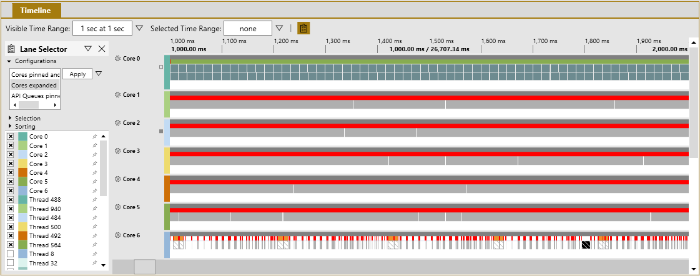
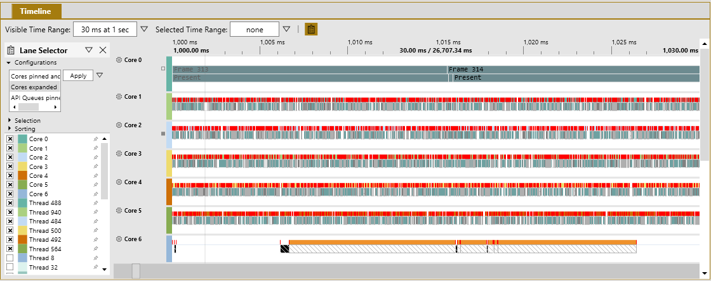
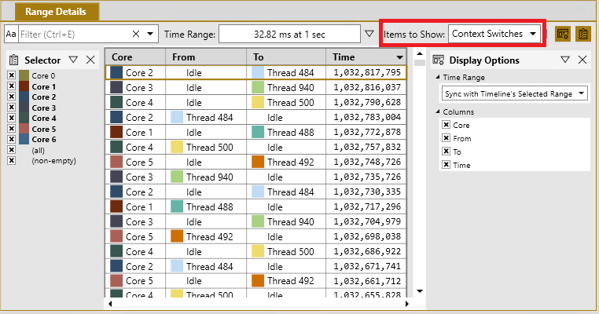
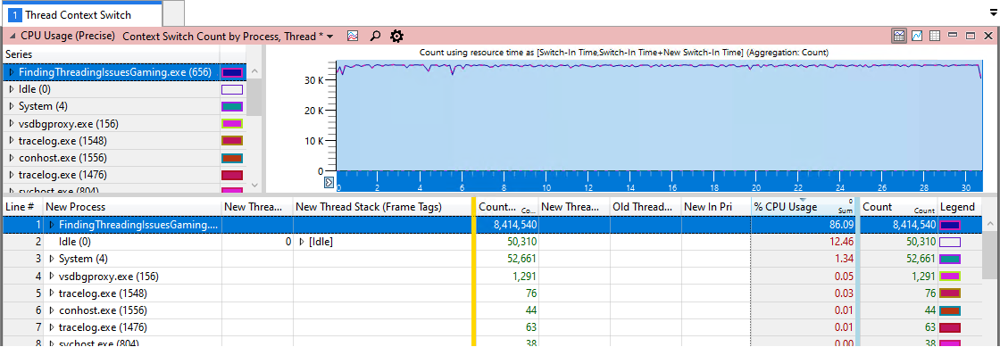
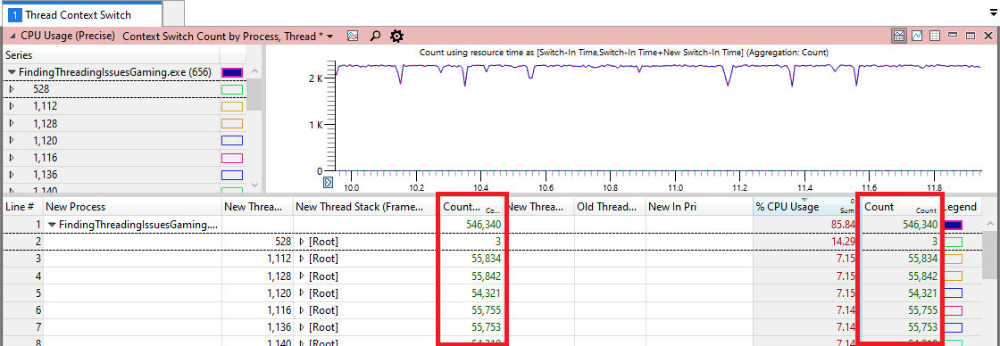
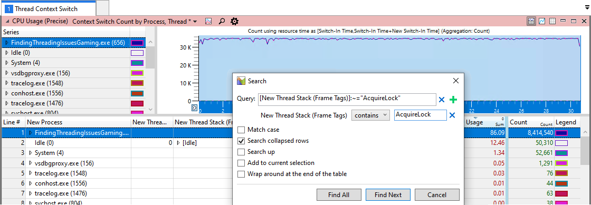

# High context switch rate

Use this topic to learn how to find threads that are frequently context switching&mdash;degrading your title's performance. Context switching is the process of storing the state of a thread so that it can be restored to resume execution at a later point in time. Rapid context switching between threads is expensive in terms of CPU utilization. Each context switch takes the kernel about 5 μs (on average) to process. However, the resulting [Cache misses](https://en.wikipedia.org/wiki/CPU_cache#Cache_miss) add additional execution time that is difficult to quantify. The more frequent the context switches, the more your CPU utilization degrades. Each title is different, but a reasonable goal is to have fewer than 1,000 context switches per second, per core.

## PIX

PIX can't provide you with the number of context switches per second that the title is performing, but it can give you a very good idea of when the context-switch rate is too high.

#### To determine when the context switch rate is too high

1. Generate a Timing Capture. For more information, see [Common steps](common-steps.md).

2. Focus your attention on the CPU cores in the **Timeline** view (see figure 1). The red tick lines represent context switches. In this case, cores 1 through 5 show a solid red line for an entire second of the capture. While this is an extreme example, areas with a high density of red are a good indication that there are too many context switches in your title.

    **Figure 1.   PIX Timing Capture that shows which CPU cores have a very high number of context switches.**

    

3. Zoom in to inspect one frame (see figure 2). This example spans just 30 ms. Most of the timeline looks completely red, which indicates many rapid context switches. Such a densely red timeline is a strong indicator that the context switch rate is too high.

    **Figure 2.   Zooming-in to a 30 ms section of a Timing Capture that shows a high number of context switches.**

    

4. On **Items to Show**, select **Context Switches**, and then look at the **Range Details** tab (see figure 3). Here you can see a list of the context switches that occurred in the selected time range. This view helps you select and investigate specific context switches in the Timing Capture.

    **Figure 3.   PIX Range Details tab that shows a list of context switches in a Timing Capture.**

    

    You can determine why these threads are context-switching by selecting context switches and then inspecting the **Element Details** panel.

## Windows Performance Analyzer (WPA)

The best window to use for evaluating the rate of context switches with WPA is the **CPU Usage (Precise) Context Switch Count by Process, Thread** (see figure 4). It's part of the `ThreadContextSwitch.wpaProfile` WPA profile. The graph in figure 4 shows you the rate of context switches based on the visible portion of the graph. The amount visible is important because zooming in changes the time range used to generate points on the graph. The best use of this graph is for identifying periods when the context switch count spikes. The table can help you see how many context switches occurred by focusing on what's happening during those time periods.

#### To use WPA to find high context switching threads

1. Generate an event trace log (ETL) file. For details, see [Common steps](common-steps.md).

2. Apply the `ThreadContextSwitch.wpaProfile` WPA profile as described in [Common steps](common-steps.md). Figure 4 shows you what the new analysis tab should look like.

    **Figure 4.   A WPA CPU Usage (Precise) Context Switch Count by Process Thread view , showing a high context switch count.**

    

    > [!NOTE]
    > You might notice that System in figure 4 also has a significant number of context switches using 1.34 percent of the CPU resources. This is because of the overhead of gathering ETL data. While ETL events are lightweight, the trace still gathers call stack data on every context switch. In this case, more than 8 million times in 30 seconds, which can have a small effect.

3. Zoom in to a one-second area that looks like it might have an instance of high context switching.

4. You can see which threads have the highest number of context switches by looking at the **Count** column in the data table in figure 5. There might be threads with similar counts, which could indicate that these threads are *toggling* between each other.

    **Figure 5.   A time interval that shows what it looks like when the context switch rate is high. Note that the scale is adjusted to fit the view.**

    

5. Find the relevant location in your code by expanding the call stacks that have the highest count.

6. Locate other threads that might be using the same primitive or function by selecting **Find In Column** in the right-click menu of the table (see figure 6).

    **Figure 6.   Use the Search feature to locate all calls to the AcquireLock function, which was found to causes frequent context switches.**

    

## Common causes of high context switch counts

The following table lists common causes for high rates of context switching.

| **Cause** | **Reason** |
|---|---|
| Contention on a threading primitive. For example, a [Critical section](/windows/win32/sync/critical-section-objects). | Too many title threads are using the same `CRITICAL_SECTION`. |
| [SwitchToThread](/windows/win32/api/processthreadsapi/nf-processthreadsapi-switchtothread) in a tight loop with other threads that are *ready to run *. | Whenever another thread is ready to run, it always results in a context switch. |
| Rapidly switching high priority threads to ready to run. | The OS automatically performs a context switch whenever a higher priority thread becomes unblocked. |