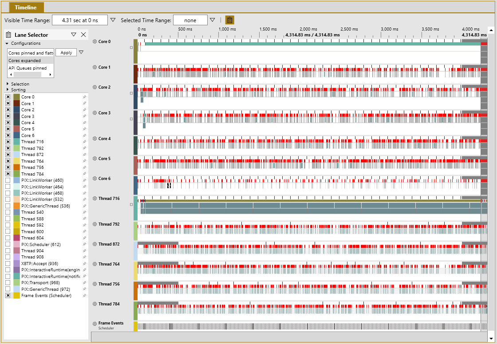
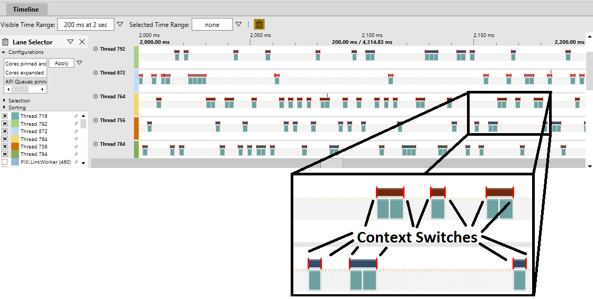
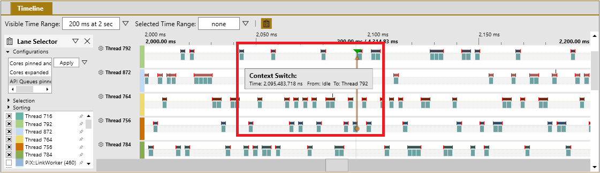
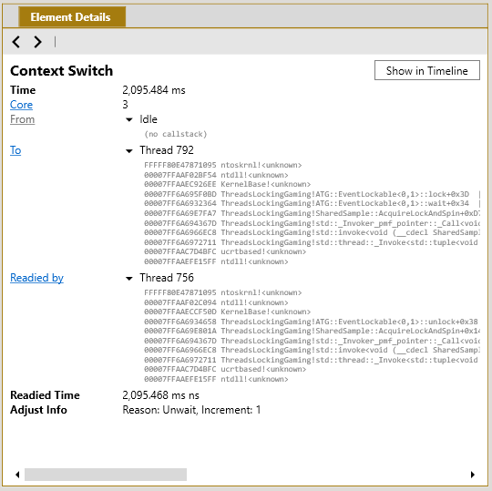
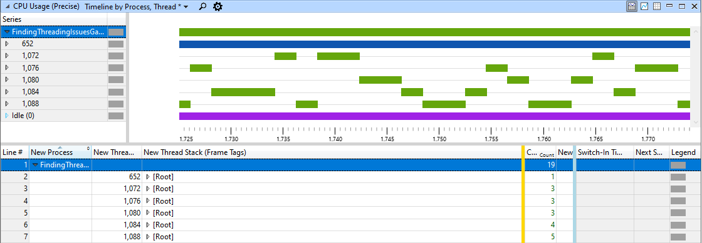
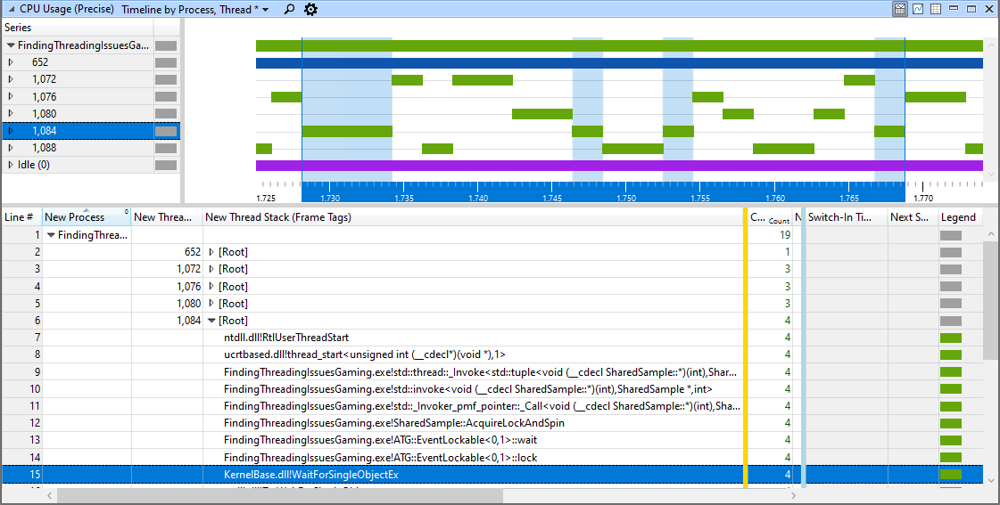
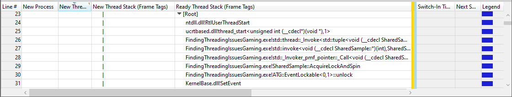

# Thread locking

Thread locking occurs when a thread stalls while waiting on a threading primitive, such as [critical section objects](/windows/win32/sync/critical-section-objects) being used to protect access to shared resources. If two threads try to access a shared resource at the same time, one of the threads is put into a suspended state. (For more information, see [Understanding thread states](finding-threading-issues-appendix.md#appendix-b).) The suspended thread is unable to continue running until the shared resource is available.

## PIX

In the Timeline pane in PIX, you can see where threads are locking by observing when threads are running, on which cores they're running, and why they were switched out.

#### To locate where your thread is locking in code

 1. Perform the [common steps](common-steps.md) to generate a Timing Capture.

    **Figure 1.   Timeline pane in PIX that shows a Timing Capture**

    

    Each of the red tick lines shown in figure 1 represents a context switch. Where the red portion is thicker, several context switches are close together.

 1. Zoom into a region of interest that contains several context switches.

    **Figure 2:   Expanded section of the Timeline pane in PIX**

    

    > [!NOTE]
    > You can select the gear icon to the left of each timeline label to show view options, such as enhancing context switches to make them easier to see.

    In Figure 2, notice the vertical bright-red lines on the ends of the upper bar of each thread timeline. Each line represents a context switch. 

 1. Hover over a context switch to show basic information about it. If the thread that begins running at the context switch was put into the ready state by a different thread, an arrow appears between the two thread timelines, as shown in figure 3.

    **Figure 3.   Timeline pane in PIX that shows context switch details**

    

 1. Click the line of a context switch to select it. Now look at the Element Details pane in the bottom left of the Timeline tab, as shown in figure 4. The pane shows the thread switching out (**From**), the thread switching in (**To**), and the **Readied by** thread if it's available. In this example, the context switch is from idle to thread 792 and readied by thread 756.

    **Figure 4.   Element Details pane in PIX Element Details for a context switch that shows call stacks**

    

    In the **To** call stack, you can see that thread 792 resumed from a call to `lock` on an `ATG::EventLockable` object, which is a wrapper for a Windows event object. The readying thread 756 called `unlock` on the same object. Both threads called the same `AcquireLockAndSpin` function. In this example, the context switch was readied by thread 756, which set the Windows event on which thread 792 was waiting.

    > [!NOTE]
    > Not all context switches have "readied by" data. For example, a thread waking from sleep doesn't have a "readied by" thread listed in the context switch.

## WPA

You can also use the Windows Performance Analyzer (WPA) to find where threads are locking. The two best views to use for discovering locking threads are **CPU Usage (Precise) Timeline by Process, Thread** and **CPU Usage (Precise) Timeline by CPU**, both of which are in the WPA profile named *ThreadLocking.wpaProfile*. These views are based on context switches and show exactly when a thread is being switched out and the call stack of the new thread.

 1. Perform the [common steps](common-steps.md) to generate an event trace log (ETL) file.

 1. Apply the *ThreadLocking.wpaProfile* WPA profile. The new analysis tab should look like figure 5.

    **Figure 5.   Default view of the Thread Locking profile in WPA**

    

    These two views are just different ways of looking at the same data. Depending on whether the issue seems to be related to a specific thread or to a CPU core, each view can have its advantages. For this example, we use only the **Process, Thread** view. However, the same steps can be used in the **CPU** view if the issue is more general or localized to a CPU core.

 1. Select a thread of interest. All time frames when that thread is running are highlighted in the graph.

 1. Zoom in to a section of the timeline. This helps remove the noise from other threads that might be running. A good starting point is a single frame.

 1. Look for a location in a thread that just started running after being switched out for a considerable amount of time or a thread that started and stopped a significant number of times. Zoom in to that location, as shown in figure 6.

    **Figure 6.   Zoomed in to a time frame where threads are being switched out from processing**

    

 1. Select a specific thread or a time frame within the graph to highlight the matching section in the table, as shown in figure 7. The **New Thread Stack (Frame Tags)** column shows the call stack in the code where the thread was previously switched out. The **Count** column shows the number of times a frame in that call stack was present in all context switches for the portion of the thread that is currently visible in the Timeline view.

    **Figure 7.   Thread timeline for thread 1084 showing that it was switched out four times because EventLockable::lock called WaitForSingleObjectEx**

    

 1. A thread can be switched out for a variety of reasons. Zooming into various locations and threads can provide a clearer picture of what's happening in the code. For example, each of the four context switches of thread 1084 are also listed individually farther down the data table at the end of the stack. By adjusting the width of the columns, we can see information in the **Ready Thread Stack** column (figure 8) that shows the readying thread for a specific context switch.

    **Figure 8.   WPA data table showing that one context switch for thread 1084 was readied by thread 1076 through ATG::EventLockable::unlock**

    

## Common causes of locking threads

Threads can get locked for a variety of reasons. Here are some of the most common reasons and what to do about them.

- A tight loop using [SwitchToThread](/windows/win32/api/processthreadsapi/nf-processthreadsapi-switchtothread) in a spin lock
  - High contention occurring on the spin lock.
  - Consider extending the spin count.
- Calls to [EnterCriticalSection](/windows/win32/api/synchapi/nf-synchapi-entercriticalsection)
  - High contention occurring on a critical section.
  - Consider extending the spin count.
- [WaitForSingleObject](/windows/win32/api/synchapi/nf-synchapi-waitforsingleobject)
  - Thread communication is too high.
    - Consider a different algorithm that doesn't need a primitive.
    - Batch messages to minimize communication.
  - Not enough work to perform.
    - Consider increasing job complexity.
  - Jobs finishing before a new job is ready.
    - Consider a spin on `WaitForSingleObject` before blocking.
- [Priority inversion](https://wikipedia.org/wiki/Priority_inversion)
  - A low-priority thread is holding a lock that a high-priority thread needs.