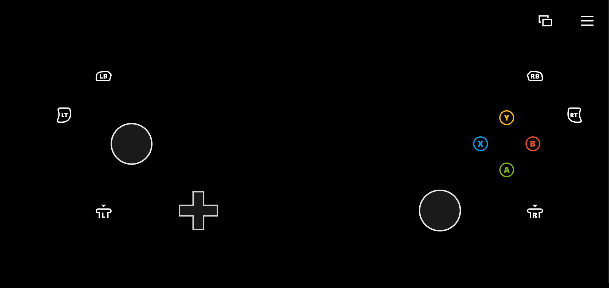

# Standard Xbox Controller Touch Control Layout

Layout that provides a mapping of all physical controller actions.

## Remarks

The standard controller layout provides a touch layout that is most similar to a physical controller.

This layout is meant to be an example of how all the physical actions can be exposed -- not as a recommended experience for any particular style of game.

> ![WARNING]
> This layout is NOT optimized for any game and players will likely have a poor experience playing for any extended period of time with this layout. Optimize this layout for your game.

## Availability

Part of the TAK [sample-layouts](https://github.com/microsoft/xbox-game-streaming-tools/tree/master/touch-adaptation-kit/samples/sample-layouts) sample.
