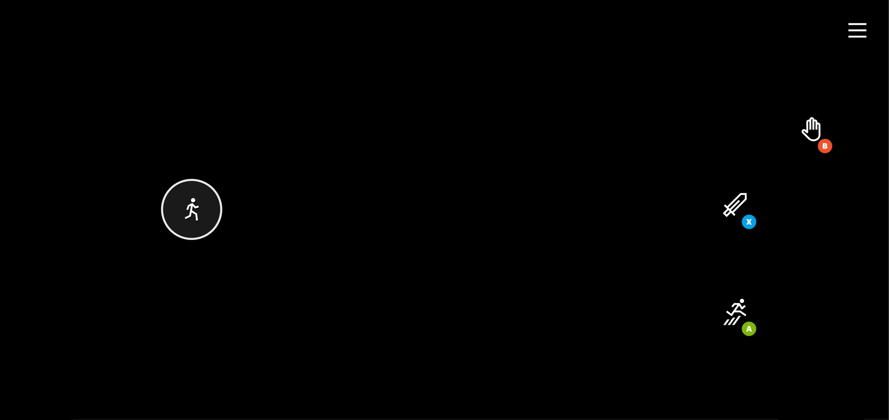
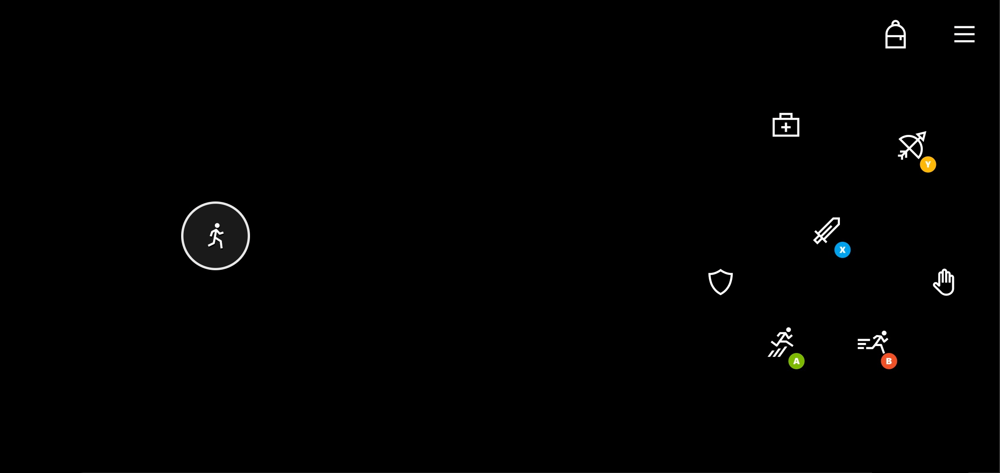

# 2D Platformer Touch Control Layout

Two sample touch control layouts for platformer games.

**Simple platformer layout**

**Platformer layout with more player actions**

## Remarks

The _simple platformer_ layout shows how a basic 2D platformer can provide a very streamlined touch experience.

Key elements include:

- Joystick for movement available for left hand. Can also consider a directional pad if the game is more optimized for that input.
- The three key actions (fire, jump, interact) placed in an arc on the right hand based on the expected priority of interaction by the player.

The _platformer_ layout builds on the base of the simple platform and showcases where to add additional controls for the player.

Key additional elements:

- Inventory management is placed in the upper right
- Optimized placement for key actions (sword, jump, bow), with the other, less frequently used actions placed around them.

## Availability

Part of the TAK [sample-layouts](https://github.com/microsoft/xbox-game-streaming-tools/tree/master/touch-adaptation-kit/samples/sample-layouts) sample.
