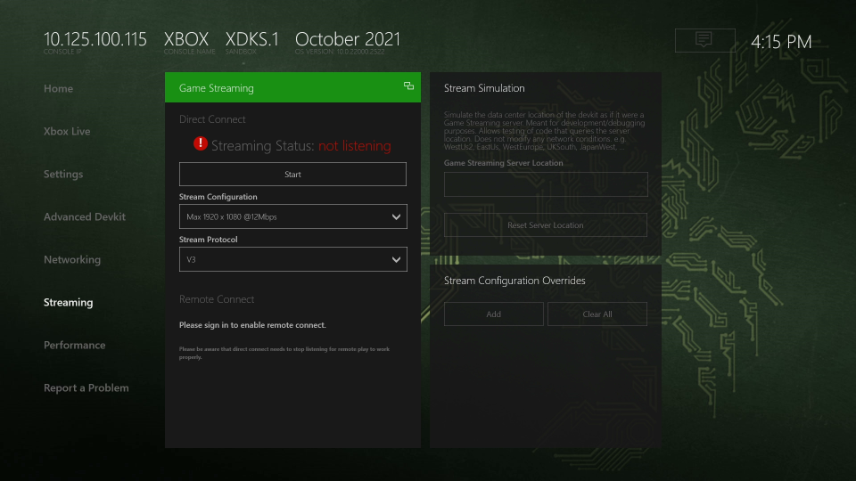
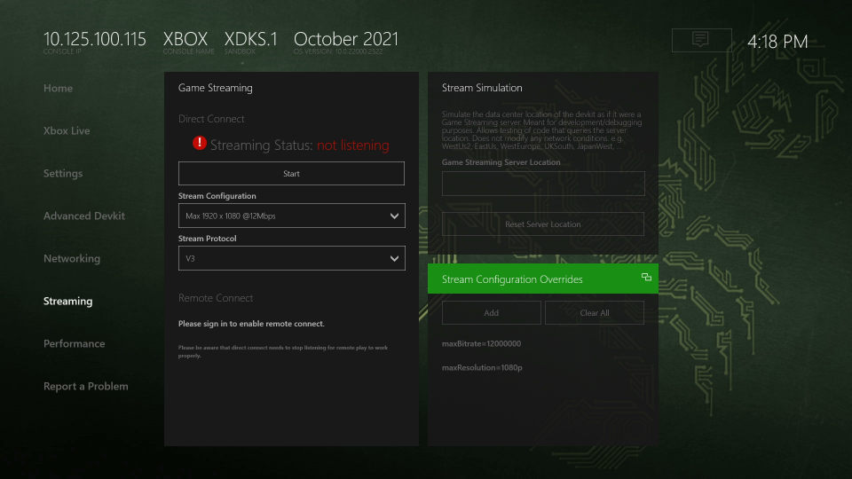
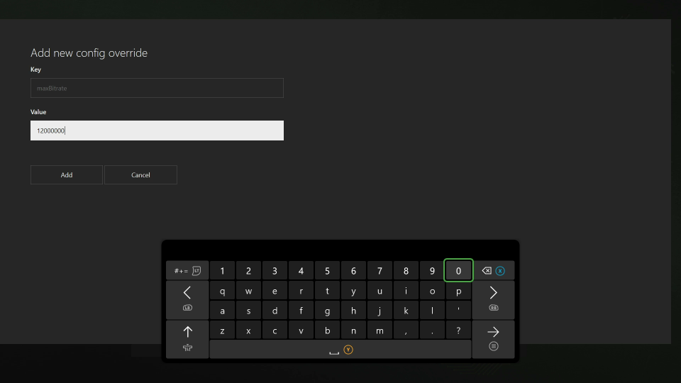
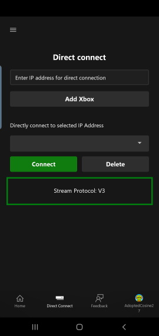

# Setting up your Xbox Development Kit for streaming

Use this topic to setup your Xbox Development Kit to create and validate titles while streaming.

With streaming, you can support direct local streaming to a special streaming client by using the [Android Content test application](game-streaming-android-content-test-application.md) or [Windows PC Content test application](game-streaming-windows-pc-content-test-application.md).

You can also use Cloud Aware development to support and validate your title by using [Cloud Aware APIs](../../../reference/system/xgamestreaming/xgamestreaming_members.md). These APIs behave on an Xbox Development Kit, with streaming support, similarly to a Xbox Game Streaming server.

## Prerequisites

To setup your dev kit for streaming, ensure that it's running an OS of November 2019 or later and connected to the network.

> [!NOTE]
> Xbox Game Streaming isn't available on Xbox One&nbsp;X dev kits. The Xbox One&nbsp;X hardware isn't equivalent to the hardware that's running the Xbox Game Streaming server, but it provides the best approximation for CPU performance when accessing Xbox Game Streaming servers. Likewise, Xbox Development Kits such as the Xbox One&nbsp;S dev kit, or Xbox One Dev Kit aren't supported.

### Enable Developer Mode

Enable **Developer Mode** on your Xbox Development Kit with the following steps.

1.  Open **Settings** and select **System** > **Console Info** > **Developer Settings**.
1.  Enable **Developer Mode**.
1.  Restart the Xbox Development Kit.

> [!NOTE]
> If **Developer Settings** isn't available, with your controller quickly select **LB** > **RB** > **LT** > **RT** to enable **Developer Settings** in the UI.

### Enable the streaming service

You can control the streaming service from the **Streaming** tab of Dev Home, or via the [xbgamestream (NDA topic)](../../../tools-console/xbox-tools-and-apis/commandlinetools/xbgamestream.md) command line tool.

> [!NOTE]
> When game streaming is enabled, you can't utilize the remote view capabilities of [Xbox Manager (NDA topic)](../../../tools-console/xbox-tools-and-apis/xbom/xbom.md).

By default, the streaming service isn't running. To start it, go to the **Streaming** tab. The service starts after a few seconds, and **Streaming Status** displays the message "listening for connections".

> [!NOTE]
> After each restart of the Xbox Development Kit, return to the **Streaming** tab of Dev Home to connect to the streaming service again as shown in the following screenshot.

After a short startup delay, the Cloud Streaming service runs with a status change that's visible in the **Streaming** tab of Dev Home as shown in the following screenshot.

You can perform a direct connect by using the Content test application (CTA) client and providing the main console IP address that's used to connect to the client.


> [!NOTE]
> It isn't necessary to stop and restart this service unless there are connectivity problems.

### Stream Configuration

The streaming configuration controls various aspects of the stream such as the resolution or bitrate. The streaming configuration for direct connect can be modified via the **Streaming Configuration** dropdown menu which contains a couple base configurations.

#### Overrides

In more advanced scenarios, you can override specific settings of the base stream configuration for both direct connect and remote connect.

> [!NOTE]
> Overrides do not perist between reboots so they must be reset if desired.

> [!NOTE]
> Overrides are only applied to direct connect when it restarts "listening for connections" and on new connections for remote connect.

Overrides can be viewed and configured in the **Streaming** tab using the **Stream Configuration Overrides** panel in the bottom right (or by the xbgamestream tool).

New overrides can be added with the **Add** button in the top left of the panel which will open up a window where the key and value can be specified. Existing overrides can be edited from the **Edit** option in the context menu which opens a similar window. Specific overrides can be deleted by the **Clear** option in the context menu and all overrides can be deleted by the **Clear All** button at the top of panel. The current set of configurable settings are as follows.

| Key                | Description                                                                                      |
| :----------------- | :----------------------------------------------------------------------------------------------- |
| allowDirectCapture | Boolean for enabling and disabling direct capture. Default value: <i>true</i>                    |
| maxBitrate         | Maximum bitrate of the video stream. Example value: <i>12000000</i>                              |
| minBitrate         | Minimum bitrate of the video stream. Example value: <i>5000000</i>                               |
| maxResolution      | The suggested maximum resolution of the video stream. Example values: <i>720p</i>, <i>1080p</i>. |
| minResolution      | The suggested minimum resolution of the video stream. Example values: <i>720p</i>, <i>1080p</i>. |

## Troubleshooting

Use the following sections to resolve issues you experience while setting up your Xbox Development Kit for Xbox Game Streaming.

### Network configuration to allow access to Xbox Development Kit streaming

To connect by using the CTA, enable UDP Port 9002 for communication and streaming between the CTA and the Xbox Development Kit.

### CTA can't connect to Xbox Development Kit

Use the following steps to resolve connectivity issues between the CTA and dev kit.

1.  Ensure that the IP address of the console that's used by the client is correct.
1.  Ensure that the streaming service is running by checking the **Streaming** tab of Dev Home.
1.  Stop and start the streaming service on the **Streaming** tab of Dev Home.
1.  Ensure that the streaming protocol version that's used by the client matches the selected streaming protocol version on the Xbox Development Kit.

### Managing different communication protocol versions

There are different communication protocol versions needed for streaming. Ensure that you have the right one to connect the client to your dev kit.

#### Manually configuring communication protocol versions

Some software updates to Xbox One Dev Kits occasionally come with an updated version of the streaming protocol.

To allow communication between a streaming dev kit and the CTA, the dev kit should be configured to use the version of the protocol that the client supports. This can be configured on the dev kit from the Dev Home **Streaming** tab.

Check the stream version of the CTA, and then match that version to the one that's listen on the Xbox Development Kit as shown in the following screenshot.

#### How to change the streaming protocol versions

If a change in the streaming version is required, perform the following steps in the **Streaming** tab of Dev Home.

1.  Stop the streaming service. It has stopped when the Cloud Streaming status reads as "not listening".
1.  Change the streaming version in the drop-down box.
1.  Start the streaming service again. It has started when the Cloud Streaming status read as "listening for connections".

> [!NOTE]
> In most cases, it isn't necessary to override the protocol versions.
