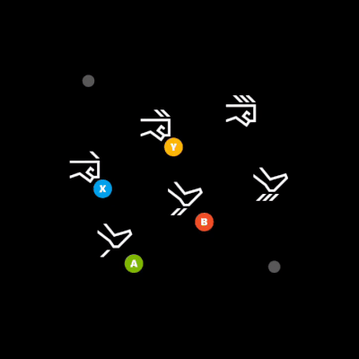
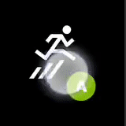
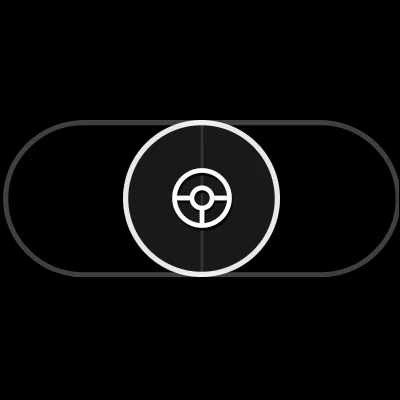
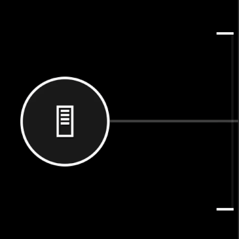

# Touch Adaptation Kit (TAK) Reference

## Bundle & Tools

| Topic                                                                        | Description                                                                                          |
| :--------------------------------------------------------------------------- | :--------------------------------------------------------------------------------------------------- |
| [Touch Adaptation Bundle (TAB)](game-streaming-touch-touch-adaptation-bundle.md)                  | A self-contained set of layouts, assets and configuration to enable playing the game with touch.     |
| [Touch Adaptation Kit Command Line Tool (tak.exe)](game-streaming-tak-command-line.md) | Create and validate touch control layouts. Enable streaming devices to acquire layouts from your PC. |

## Layout Configuration

The base layout components of a touch layout.

| Topic                                              | Description                                                                                             |
| :------------------------------------------------- | :------------------------------------------------------------------------------------------------------ |
| [Layout](../../../reference/system/touchadaptationkit/layout/game-streaming-touch-layout.md)                         | The representation of a full touch layout for a game.                                                   |
| [Control cluster](../../../reference/system/touchadaptationkit/layout/game-streaming-touch-control-cluster-outer.md) | An array of up to four controls that can be used to occupy two slots in the outer portion of the wheel. |
| [Inner wheel](../../../reference/system/touchadaptationkit/layout/game-streaming-touch-inner-wheel.md)               | An array of up to four controls that split the inner portion of a wheel.                                |
| [Layer](../../../reference/system/touchadaptationkit/layout/game-streaming-touch-layer.md)                           | An **_expiremental_** child touch layout that can be overlayed on top of the base touch layout.         |
| [Layer action](../../../reference/system/touchadaptationkit/layout/game-streaming-touch-layer-action.md)             | An **_expiremental_** action that a button can use to display a layer.                                  |
| [Layout orientation](../../../reference/system/touchadaptationkit/layout/game-streaming-touch-layout-orientation.md) | The orientation that the touch layout will be displayed.                                                |
| [Wheel](../../../reference/system/touchadaptationkit/layout/game-streaming-touch-wheel.md)                           | A set of touch controls arranged in an inner and outer circular area.                                   |

## Touch Controls

The set of visual controls that are available for your touch layouts.

| Control                                       | Description                                                                                               | Examples                                                                                                                                                                              |
| :-------------------------------------------- | :-------------------------------------------------------------------------------------------------------- | :------------------------------------------------------------------------------------------------------------------------------------------------------------------------------------ |
| [Arcade Buttons](../../../reference/system/touchadaptationkit/controls/game-streaming-touch-arcadebuttons.md)   | A collection of 6 or 8 buttons laid out in an arc, in the style of arcade cabinets.                       |                                                                                                   |
| [Blank](../../../reference/system/touchadaptationkit/controls/game-streaming-touch-blank.md)                    | An **_expiremental_** control used in a `layer` to hide the control that was being displayed in the slot. |                                                                                                                                                                                       |
| [Button](../../../reference/system/touchadaptationkit/controls/game-streaming-touch-button.md)                  | A basic control that can respond to player touch input.                                                   |                        |
| [Directional Pad](../../../reference/system/touchadaptationkit/controls/game-streaming-touch-directionalpad.md) | A directional pad control that always maps the gamepad directional pad.                                   |                                                                                                 |
| [Joystick](../../../reference/system/touchadaptationkit/controls/game-streaming-touch-joystick.md)              | An analog control that behaves like a joystick.                                                           |   |
| [Throttle](../../../reference/system/touchadaptationkit/controls/game-streaming-touch-throttle.md)              | A specialized version of a Y-axis only joystick that maps to triggers. Designed for driving games.        |                                                                                                   |
| [Touchpad](../../../reference/system/touchadaptationkit/controls/game-streaming-touch-touchpad.md)              | Analog control that enables the player to interact similar to a laptop touchpad.                          |                                                                                                               |

## Control Styling & Components

| Component                                                   | Description                                                                                   |
| :---------------------------------------------------------- | :-------------------------------------------------------------------------------------------- |
| [Action](../../../reference/system/touchadaptationkit/types/game-streaming-touch-action.md)                                   | Physical controller action(s) that can be referenced.                                         |
| [Asset](../../../reference/system/touchadaptationkit/types/game-streaming-touch-asset.md)                                     | Reference to a custom image that has been included in the touch adaptation package.           |
| [Axis](../../../reference/system/touchadaptationkit/types/game-streaming-touch-axis.md)                                       | Definition of the mapping of touch controls to the physical analog control equivalent.        |
| [Color](../../../reference/system/touchadaptationkit/types/game-streaming-touch-color.md)                                     | Reference to a color.                                                                         |
| [Deadzone](../../../reference/system/touchadaptationkit/types/game-streaming-touch-deadzone.md)                               | Definition for the amount of player interaction that should not be registered as input.       |
| [Hexcolor](../../../reference/system/touchadaptationkit/types/game-streaming-touch-hexcolor.md)                               | String containing hexadecimal representation of RGBA color value to be referenced.            |
| [Icon](../../../reference/system/touchadaptationkit/types/game-streaming-touch-icon.md)                                       | Reference to an icon.                                                                         |
| [Joystick outline and indicator](../../../reference/system/touchadaptationkit/types/game-streaming-touch-joystick-outline.md) | The styling attributes for the outer ring of a joystick controls.                             |
| [Knob](../../../reference/system/touchadaptationkit/types/game-streaming-touch-knob.md)                                       | The styling attributes for a button like component that can be interacted with by the player. |
| [Response curve](../../../reference/system/touchadaptationkit/types/game-streaming-touch-responsecurve.md)                    | Definition of the curve range for mapping input mapped to output.                             |
| [Stroke](../../../reference/system/touchadaptationkit/types/game-streaming-touch-stroke.md)                                   | The styling attributes for the outline of the object being referenced.                        |
| [Throttle axis](../../../reference/system/touchadaptationkit/types/game-streaming-touch-throttle-axis.md)                     | The styling attributes for an axes of a throttle control.                                     |

## Sensor Controls

Sensor controls allow mapping of physical sensors on the player's device to be mapped to a physical controller input.

| Control                                           | Description                                                                                                                             |
| :------------------------------------------------ | :-------------------------------------------------------------------------------------------------------------------------------------- |
| [Accelerometer](../../../reference/system/touchadaptationkit/sensor-controls/game-streaming-touch-accelerometer.md) | An **_experimental_** sensor control that maps the devices accelerometer of the client device (if available) to a specfied set of axes. |
| [Gyroscope](../../../reference/system/touchadaptationkit/sensor-controls/game-streaming-touch-gyroscope.md)         | A sensor control that maps the devices physical movement to a specified set of axes.                                                    |
