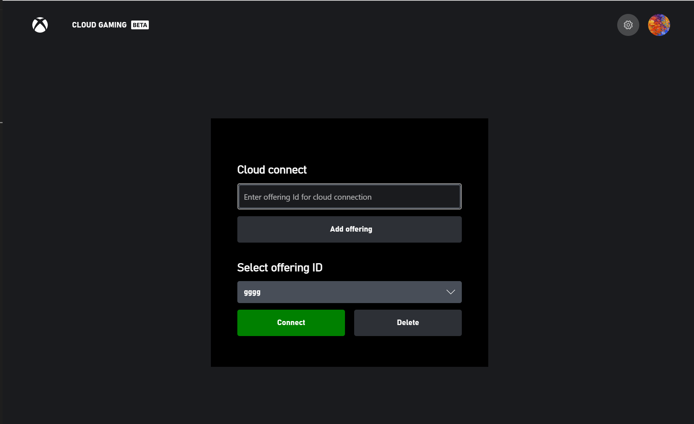
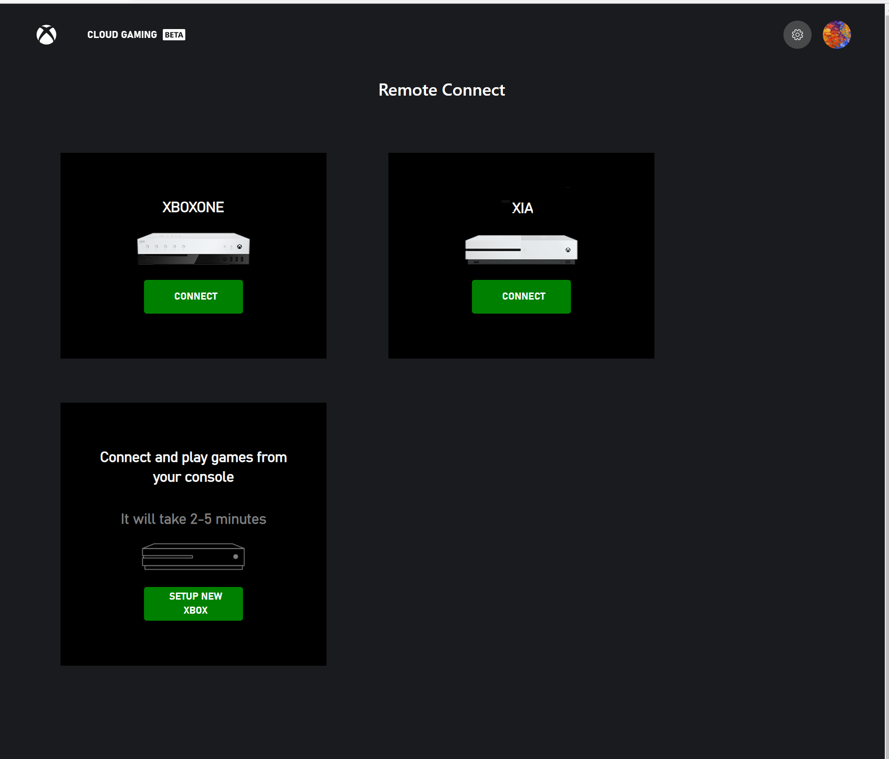
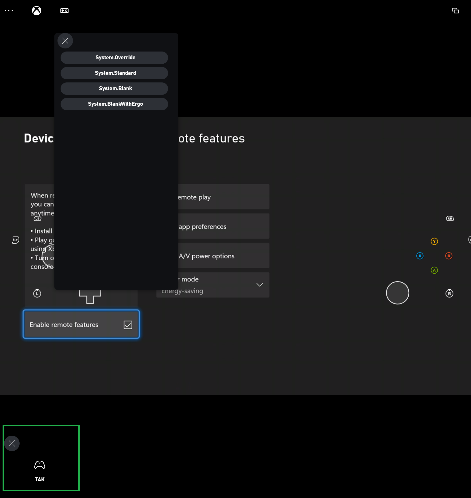

# Web Content Test Application (CTA) overview

This topic covers the list of developer tools which are available on [xbox.com/play](https://www.xbox.com/play). These tools have been designed for use with the Edge and Chrome browsers on Windows, and with Safari on Mac, iOS and iPadOS.

- [Offering selection](#offering-selection)
- [Remote connect](#remote-connect)
- [Dev settings menu](#dev-settings-menu)
- [Dev tools menu](#dev-tools-menu)

## Offering Selection

To use a specific offering, go to [xbox.com/play/dev-tools/select-offering](https://www.xbox.com/play/dev-tools/select-offering). On the offering selection page, the offerings you have access to will be pre-populated in the dropdown list. You can then select the offering, and click connect. If for some reason your desired offering is not in the dropdown list, you can manually enter it in the input box above, and click "Add offering".

After you click connect, you will be redirected back to xbox.com/play. There will be text on the page which indicates that you are now using a custom offering. If you are unable to access the offering, ensure you are signed in to an account which is authorized to use that specific offering.

On iOS or iPad OS, you can then save this page as a progressive web app (PWA) by clicking the share button and selecting "Add to Home Screen". This PWA will always remember your offering selection, and always load with that offering.

## Remote Connect

### Xbox Development Kit setup:

-  **Note**: you must do this part before attempting to log in to remote connect website – if you have not yet configured a Xbox Development Kit for remote use with your account, the remote connect page will redirect you back to the xbox.com/play landing page.
- Log in to the Xbox Development Kit with the account (including a sandbox account) that you will use from the website
- If you want, give the Xbox Development Kit a name so that you can easily identify it
- Go to Dev Home -> Settings -> Launch Settings -> Devices & Connections -> Remote Features -> Enable Remote Features to enable remote connect

### Getting Started on your remote device

Ensure you have completed the above step of setting up your Xbox Development Kit before proceeding. If you have not enabled remote features on your Xbox Development Kit, then instead of the remote connect page, you will get redirected back to the xbox.com/play page.

Make sure the client device you are connecting to your Xbox Development Kit from is on the same network as your Xbox Development Kit. Connections will also work over a VPN. Network traffic to the Xbox Development Kit will flow on UDP port 9002 so this port should also be unblocked by network configuration.

- For retail accounts, navigate to [xbox.com/play/dev-tools/direct-connect](https://www.xbox.com/play/dev-tools/direct-connect). When prompted for credentials, log in using the same account that is logged into your Xbox Development Kit.
- For sandbox accounts, append the sandbox ID for the account that is logged into the Xbox Development Kit to the following URL: xbox.com/play/dev-tools/direct-connect?sandboxId=. For example, if your sandbox ID is TestSandbox, your URL will be xbox.com/play/dev-tools/direct-connect?sandboxId=TestSandbox. Navigate to the connection string you have constructed, when prompted for credentials, log in with the sandbox account that is currently logged into the Xbox Development Kit which you are trying to connect to. If you are prompted to choose between a work and personal account, choose personal.

On iOS and iPadOS you will be able to save this page as a progressive web app (PWA) by clicking the share button and selecting "Add to Home Screen".  This PWA will remember your sandbox ID when launched.

Once you are on the direct connect page, you may select the Xbox Development Kit that you are interested in connecting to, and click "Connect" below its icon to initiate a streaming session.

## Dev Settings Menu

When using a custom offering or connecting to a remote Xbox Development Kit, you will find a set of developer settings accessible from the gear icon in the top right of the xbox.com/play page. These developer settings include:

- Enable [TAK sideload](game-streaming-tak-command-line.md)
- Sideload server address
- Enable automatic refresh: enable automatic refresh for TAK sideload
- Allow mouse interaction: allow mouse interaction on streaming with TAK

This dev settings menu is additionally always enabled on the [xbox.com/play/dev-tools/select-offering](https://www.xbox.com/play/dev-tools/select-offering) and [xbox.com/play/dev-tools/direct-connect](https://www.xbox.com/play/dev-tools/direct-connect) pages.

## Dev Tools Menu

When streaming from a custom offering or from a Xbox Development Kit, you will have access to the developer menu, which can be found in the bottom left corner of the stream. After you click on this menu, you will have the ability to switch the active TAK layout if you are using the [TAK CLI to sideload your layouts](game-streaming-tak-command-line.md).

