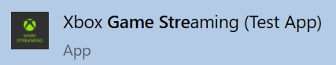
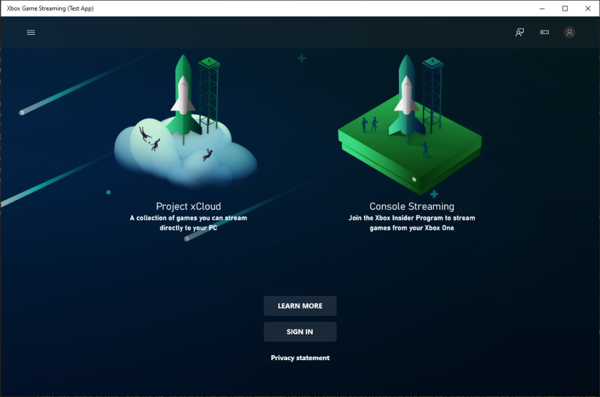
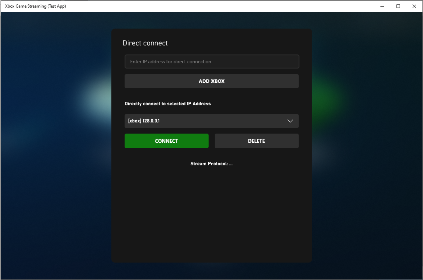
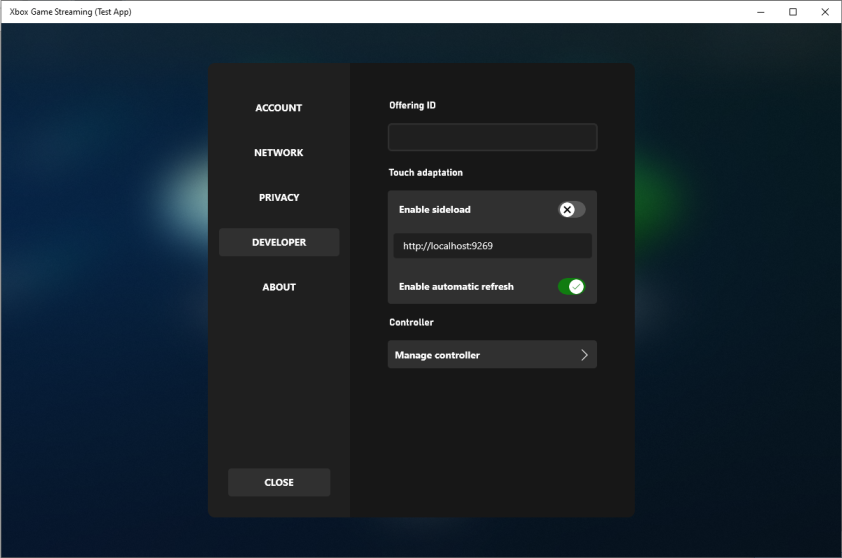

# Windows Content Test Application (CTA) overview

Use this topic to set up a Content Test Application (CTA) to simulate the user experience of streaming your game. 

Use the CTA to locally connect to your Xbox Development Kit and play your game locally.
Connect to a private offering on Xbox Game Streaming to stream your game from an Azure datacenter.

## Get the Windows CTA

To get the CTA from the Microsoft Store, you need a 5&#215;5 code. To get this code, contact your publisher or Microsoft account manager.

Use the 5&#215;5 code to get the [Xbox Game Streaming (Test App)](https://www.microsoft.com/store/apps/9NZBPVPNLDGM) from the Microsoft Store.

## Open the CTA

You can find the CTA on your Windows 10 PC as Xbox Game Streaming (Test App) as shown in the following screenshot.

  

When you open the CTA, you can sign in to the app and connect to Xbox Game Streaming, or you can connect to your development kit as shown in the following screenshot.

  

## Connect your dev kit

You *don't* need to be signed in to the CTA to connect to your dev kit for streaming.  

You can validate the locally installed version of your game in a streaming environment by connecting to your dev kit.
 
> [!NOTE]
> Ensure that your Windows 10 PC that's running the CTA, and your dev kit, are connected to the same network.

To configure the CTA to connect to your dev kit, select the **Direct connect** icon as shown in the following screenshot.

In the **Direct connect** pane, enter the IP address of your dev kit. You can find the IP address in Dev Home on your dev kit.  

Select **Add Xbox** to add the entered IP address to the **Directly connect to selected IP Address** drop-down menu as shown in the following screenshot.

After your IP address appears in the drop-down menu, select the address, and then select **Connect**. 

## Connect to a private offering on Xbox Game Streaming

You must be signed in when attempting to connect to a private offering for your game studio in Xbox Game Streaming.

> [!NOTE]
> You must sign in to the CTA by using a retail Xbox Live account. Sandbox [test accounts](../../../live/test-release/test-accounts/live-setup-testaccounts.md) *aren't* supported. 

If your studio made a set of games available via a private offering on Xbox Game Streaming for validation and testing, select your Xbox Live account avatar to go to Settings and connect to the offering.  

Enter the Offering ID that was provided by your Microsoft account manager as shown in the following screenshot.

  

After entering the ID, select **Enter** to browse the titles that are in the offering.  

If the app shows the setup process for Xbox Console Streaming, you can switch to Xbox Game Streaming in the menu at the top left of the panel.

Contact your Microsoft account manager to ensure that your games are available for your validation in a private offering.

## Troubleshooting
There are some common issues and solutions when setting up the CTA on your Windows 10 PC.

### I can't connect to my dev kit

Ensure that you've followed the steps in the [Setting up your Xbox Development Kit for Streaming](game-streaming-setup-xbox-developer-kit.md) topic. 

Use the following steps to set up network connectivity between the client device and dev kit.  

1. Ensure that the dev kit has public internet access (access to Xbox Live is required).
1. Check that the IP address that's used to connect from the client device is the main IP address of the dev kit that's displayed in Dev Home.
1. Test the connection between the dev kit and the Windows 10 PC by using Internet Control Message Protocol (ICMP) (ping) for a nearby router.  

> [!NOTE]
> The following network connection settings can affect your ability to successfully stream your game.
>
>- UDP Protocol connectivity is required (Port 9002).
>- NAT and network proxies are generally not an issue but can impact performance.
>- HTTP (TCP only) proxies aren't supported.

### I don't have access to the private offering

If you can't access your studio's private offering to validate your game directly from Xbox Game Streaming, ensure that you're signed in to the CTA with the Xbox Live account that's authorized.