# MicrosoftGame.config Editor

MicrosoftGame.config Editor is a stand-alone UI tool that allows for creating and editing your MicrosoftGame.config file. Please refer to the [MicrosoftGame.config overview](MicrosoftGameConfig-Overview.md) section for more information on creating and editing your MicrosoftGame.config file within Visual Studio.

The editor has the following features currently.
* **Platform Tabs**: Outside of the General tab, there are platform-specific tabs which allow for editing features unique to that platform. All features that are shared across all platforms live in the General tab.
* **Executable**: This section allows for specification of the executable associated with your title.
* **Target Device Family (Platform)**: This section allows for specification of the target device your title is intended to run on.
* **Store Information**: This section allows for associating your local MicrosoftGame.config with existing Store data in your Partner Center instance.
* **Tile Image**: This section allows for providing a source input tile image of your product which will then be generated into all other required images at their proper resolutions automatically.

## Launching the MicrosoftGame.config Editor

To launch the MicrosoftGame.config Editor, you can do the following:

* Navigate to the GDK bin folder (i.e. C:\Program Files (x86)\Microsoft GDK\bin) and double click the GameConfigEditor.exe.

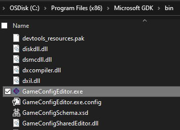

* In the Microsoft GDK folder in the Start Menu, select the MicrosoftGame.config Editor icon.

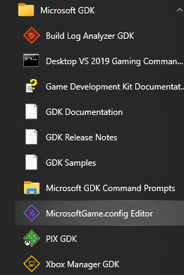

* In the Microsoft GDK folder in the Start Menu, open any Gaming Command Prompt and enter GameConfigEditor.exe.

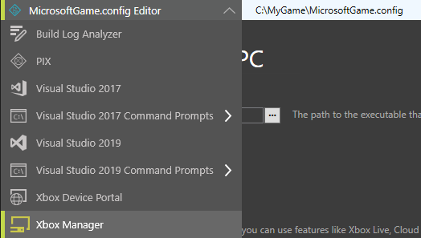

* In any GDK UX tool, expand the Tools dropdown and select MicrosoftGame.config Editor. The MicrosoftGame.config Editor also has the Tools dropdown integrated in it for quick navigation to other tools.

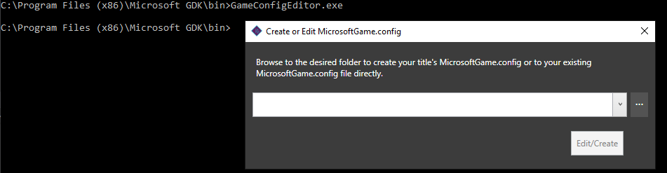

* In the Microsoft GDK folder in the Start Menu, open any Gaming Command Prompt and enter GameConfigEditor.exe with the path to an existing MicrosoftGame.config or intended folder to generate one as a parameter.

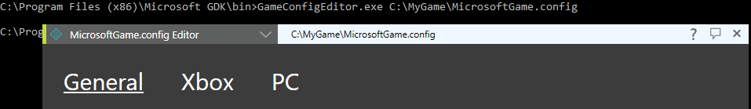

The Create or Edit MicrosoftGame.config window that appears upon launching the editor will prompt for an existing MicrosoftGame.config file or creating a new MicrosoftGame.config file that will then be opened in the editor.

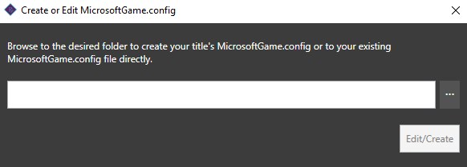

## Creating a new MicrosoftGame.config file

To create a new MicrosoftGame.config file, browse to the root folder of your title in the initial window and then select **Create** to generate the new file in that folder and open it in the editor.

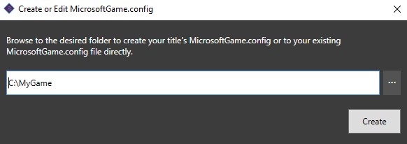

## Editing an existing MicrosoftGame.config file

If a MicrosoftGame.config file already exists, browse to the file in the initial window and then select **Edit** to open the existing file in the editor.

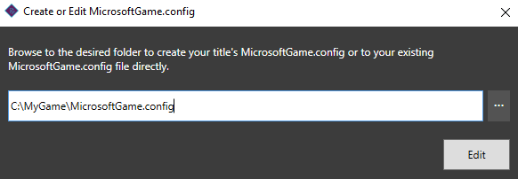

## Specifying your title executable and Target Device Family in the MicrosoftGame.config file

In the MicrosoftGame.config Editor window, the first input that is necessary is specifying where your title executable lives. This can be set by browsing to and selecting your title executable in the Executable section of the editor. In addition to specifying the title executable, it is important to specify which platform the executable is intended to run on. For more information on Target Device Family specifications, please refer to the [MicrosoftGame.config overview](MicrosoftGameConfig-Overview.md) section.

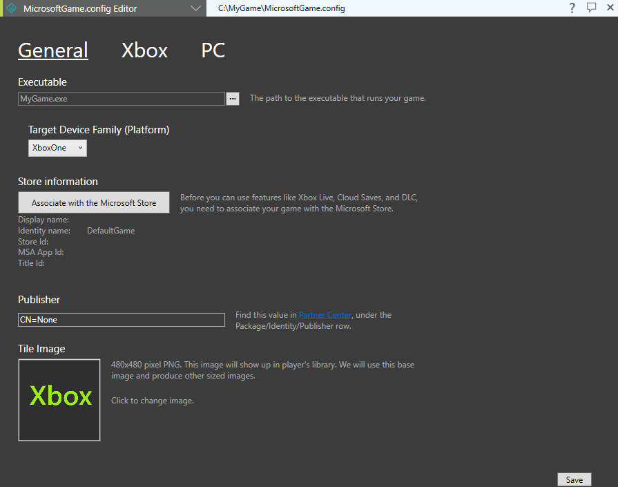

Without an executable being specified, the MicrosoftGame.config file can still be generated and edited but the editor will warn that the title can not be deployed or launched until the executable is set.

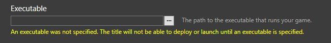

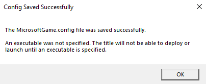

## Associating with the Microsoft Store

> [!NOTE]
> Your title must be configured with Xbox Live enabled in [Partner Center](https://partner.microsoft.com/dashboard) to utilize the Store Association Wizard.

Select the **Associate with the Microsoft Store** button to walk through the Store Association Wizard and pull down associated title information and save it to your local MicrosoftGame.config file.

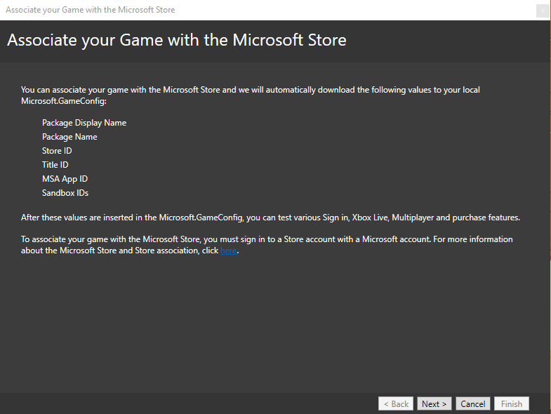

> [!NOTE]
> After completing the Store Association Wizard, select **Save** in the MicrosoftGame.config Editor to write the changes to your MicrosoftGame.config for your project.

## Generating Tile Images

To generate your titles images to be used by the Store, select the Tile image and then browse to and provide a 480x480 .PNG file to be used as the input. Upon selecting the file, all other images will be updated automatically with it as the source input and properly resized to match their required resolutions.

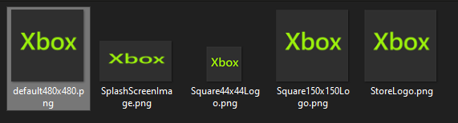

## Adding Platform-specific features

With the April 2021 GDK, the capability to add and remove platform-specific features is now present in the MicrosoftGame.config Editor, within the Xbox and PC tabs.

The Features menu allows for adding new features, removing existing features and selecting and configuring existing feature values.

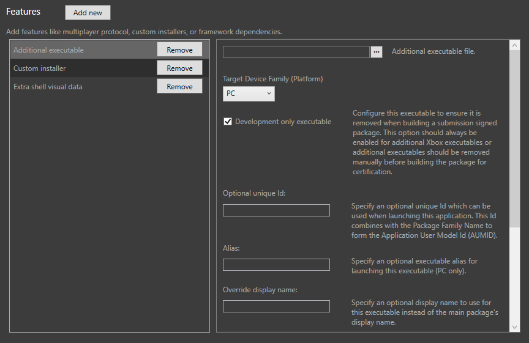

To add a feature, select the **Add new** button. A list of available features for that platform will be presented. Selecting the checkbox and selecting Add will add the feature(s) entry to the feature list for further property configuration.

Features that have already been added will be displayed at the bottom of the **Add new** list with yellow text indicating that the feature is already present and can only be specified once. For features that can be added multiple times, selecting the feature again from the **Add new** menu and selecting Add will add an additional feature entry of that type to the feature list.

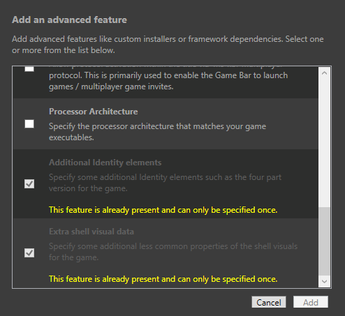

To remove a feature, navigate to the **Remove** button in the feature list and, when prompted, select Yes to confirm you intend to remove the feature from the feature list.

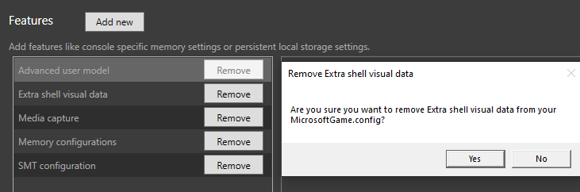

Most features need to have their properties configured ahead of saving them to the MicrosoftGame.config file. In some cases, a feature may be considered invalid due to missing information and will be removed upon save with details indicating what missing value caused the removal. Please re-add and reconfigure the feature properties appropriately to ensure it can be retained when saved in the MicrosoftGame.config Editor.

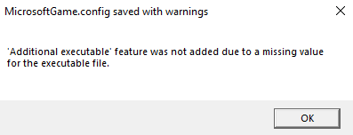

## Providing feedback

The MicrosoftGame.config Editor is available for use as of the February 2021 GDK. Please use the suggestion menu item to provide feedback on the existing features or request additional functionality.

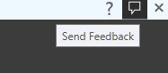

## Documentation Link

For more information on the MicrosoftGame.config Editor and associated elements, click on the Documentation link in the MicrosoftGame.config Editor.

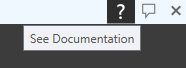

## See also

[MicrosoftGame.config](MicrosoftGameConfig-toc.md)  
[MicrosoftGame.config overview](MicrosoftGameConfig-Overview.md)  
[MicrosoftGame.config Reference (sample MicrosoftGame.config and schema)](../../../reference/system/microsoftgameconfig/microsoftgameconfig-schema.md)  
[Overview of packaging](../../../packaging/overviews/packaging.md)  